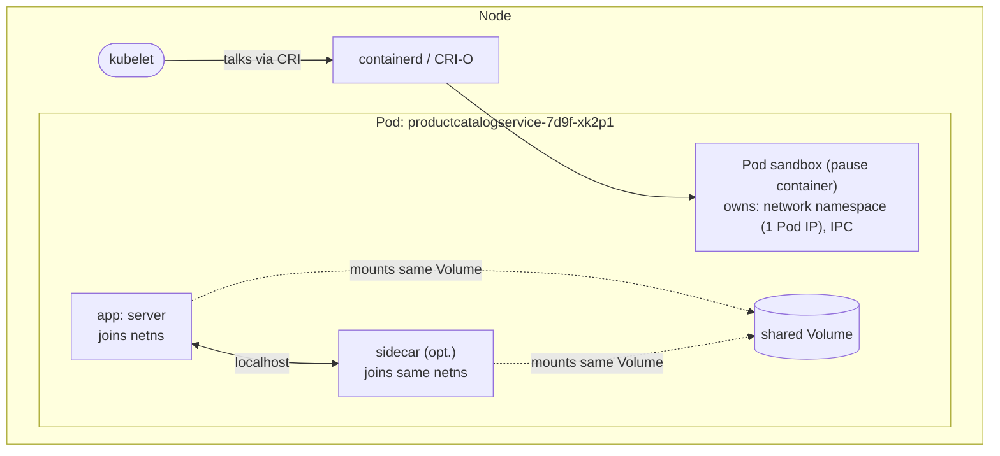
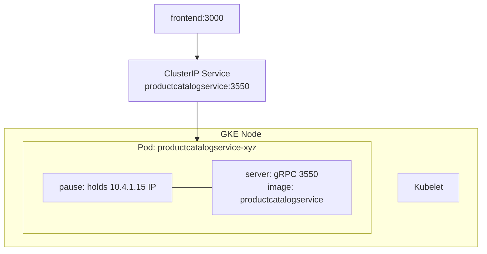

**TL;DR:** Kubernetes never runs one container alone. It runs a Pod — a box holding containers that share IP and die together.

> **In plain English (30 sec):** You already do `docker run app` + `docker run --network container:app shipper` on laptop. Both share localhost. Pod is same idea in Kubernetes.

**Real repo:** [`GoogleCloudPlatform/microservices-demo`](https://github.com/GoogleCloudPlatform/microservices-demo)

## 1. The Engineering Problem: containers that need to live together

You already do this on your laptop:

```bash
docker run -d --name app myapp:v1
docker run -d --network container:app --volumes-from app log-shipper:v1
# Both share same IP, talk over localhost:9000, share /logs folder
```

Works fine on one VM. Breaks in a cluster:

- **Same node?** No guarantee. Scheduler may put app on node-1, sidecar on node-2. localhost fails.
- **Same IP?** Two containers get two IPs. http://localhost:9000 no longer works.
- **Same lifecycle?** App crashes, sidecar keeps running. Who restarts what?

You need one box that holds both, scheduled once, killed once. That's a Pod.

---

## 2. The Technical Solution: the Pod

Pod = small box. Inside: 1+ containers sharing network namespace (one IP, localhost works) + optional volumes + one lifecycle.

Kubelet is the worker that keeps Pod alive. If container crashes, kubelet restarts it. If Pod dies, Deployment creates new Pod with new IP.

Here's what happens:



**In simple words:** Pause container holds IP open. App and sidecar join it. So localhost works inside Pod.

3 things to remember:
- **localhost inside Pod, Pod IP outside.** Containers talk over 127.0.0.1, outside world uses Pod IP.
- **Pod dies = new Pod.** No reschedule. Controller creates new Pod with new UID and IP.
- **Since K8s v1.24, no Docker.** Kubelet talks CRI to containerd/CRI-O directly.

---

## 3. Concept in Isolation (the mechanism, no prod wiring)

Simple version first, 15 lines:

```yaml
apiVersion: v1
kind: Pod
metadata:
  name: report-generator
spec:
  restartPolicy: Always
  terminationGracePeriodSeconds: 10
  volumes:
  - name: shared-output
    emptyDir: {} # both containers see same folder
  containers:
  - name: app
    image: mycompany/report-app:v1
    volumeMounts:
    - { name: shared-output, mountPath: /output }
  - name: shipper
    image: mycompany/log-shipper:v1
    volumeMounts:
    - { name: shared-output, mountPath: /output }
    env:
    - { name: UPSTREAM, value: "http://localhost:9000" } # same Pod, localhost works
```

**What this does:** app writes to /output, shipper reads it. Both share IP, so localhost:9000 works. Kill Pod, both die.

---

## 4. Real Production Incident

**Incident: Sidecar OOM kills whole Pod at 3am, product catalog down**

**T+0:** Deployment productcatalogservice rolls out. New version has sidecar istio-proxy with memory limit 128Mi, app with 128Mi. Pod total = 256Mi.

**T+10m:** Under load, app uses 100Mi, sidecar uses 120Mi. Total 220Mi, okay.

**T+30m:** Sidecar leaks 10Mi per 1000 requests. At peak, sidecar hits 128Mi, OOMKilled. Kubelet restarts sidecar, but Pod stays.

**T+45m:** Leak continues, sidecar OOM loop. Liveness probe fails because sidecar not ready. Pod marked Unready, removed from Service. Traffic drops.

**Impact:** 15% of product pages 503 for 20 minutes.

**Root cause:**
```yaml
resources:
  requests: { cpu: 100m, memory: 64Mi } # sum = 128Mi request, but node has 64Mi free
  limits: { cpu: 200m, memory: 128Mi }   # sidecar + app = 256Mi limit, but no limit on Pod level
# Missing: sidecar had no memory limit tuning, shared fate not considered
```

**Fix:**
```yaml
resources:
  requests: { cpu: 100m, memory: 100Mi }
  limits: { cpu: 200m, memory: 180Mi } # app gets more, sidecar limited to 50Mi
# + separate Pod for sidecar if it needs different lifecycle
```

**Prevention:** Always set resources.requests = sum(containers). Alert if container_memory_working_set_bytes > 80% limit for sidecar.

---

## 5. Production Design — Diagram with real services + real config

Real manifest from GoogleCloudPlatform/microservices-demo — productcatalogservice:



**Real config from prod:**

```yaml
serviceAccountName: productcatalogservice # ALL containers share this identity
terminationGracePeriodSeconds: 5 # not 30s default — measured shutdown, faster rollouts
securityContext:
  fsGroup: 1000 # Pod-level: volume ownership
  runAsUser: 1000
  runAsNonRoot: true
containers:
- name: server
  securityContext: # container-level
    allowPrivilegeEscalation: false
    capabilities: { drop: [ALL] }
    readOnlyRootFilesystem: true
  resources:
    requests: { cpu: 100m, memory: 64Mi }
    limits: { cpu: 200m, memory: 128Mi }
  readinessProbe: { grpc: { port: 3550 } }
```

**3 takeaways:**
- serviceAccountName is Pod-level — sidecar can't have different identity
- terminationGracePeriodSeconds: 5 — tuned, not default 30s
- Resources sum, not per-Pod — Pod needs 100m + sidecar CPU

---

## 6. Cloud Lens — How GCP/AWS actually implements this

**GKE (Google):**
- GKE Autopilot hides pause container completely. You never see node. Pod IP from VPC-native range.
- Command: gcloud container clusters create-auto my-cluster --region us-central1
- Pod IP is real VPC IP, routable.

**EKS (AWS):**
- EKS uses aws-vpc-cni — Pod IP is real ENI IP from VPC subnet. Limited IPs per node.
- If Pod fails "Insufficient IPs", need bigger node or prefix delegation.
- Command: kubectl get pods -o wide shows VPC IPs.

**Terraform for Pod with real config:**

```hcl
resource "kubernetes_pod" "report" {
  metadata { name = "report-generator" }
  spec {
    termination_grace_period_seconds = 10
    container {
      name  = "app"
      image = "mycompany/report-app:v1"
      resources { requests = { cpu = "100m", memory = "64Mi" } }
    }
    container {
      name  = "shipper"
      image = "mycompany/log-shipper:v1"
    }
  }
}
```

**Difference:** On GCP, Pod IP is free. On AWS, Pod IP costs ENI IP. That's why AWS has maxPodsPerNode limit.

---

## 7. Library Lens — Exact library + code you would use

**If you write Go (client-go) to create Pod today:**


```go
// go.mod: k8s.io/client-go v0.30.0
package main

import (
  v1 "k8s.io/api/core/v1"
  metav1 "k8s.io/apimachinery/pkg/apis/meta/v1"
)

pod := &v1.Pod{
  ObjectMeta: metav1.ObjectMeta{Name: "report-generator"},
  Spec: v1.PodSpec{
    TerminationGracePeriodSeconds: int64Ptr(10),
    Volumes: []v1.Volume{{Name: "shared-output", VolumeSource: v1.VolumeSource{EmptyDir: &v1.EmptyDirVolumeSource{}}}},
    Containers: []v1.Container{
      {
        Name:  "app",
        Image: "mycompany/report-app:v1",
        VolumeMounts: []v1.VolumeMount{{Name: "shared-output", MountPath: "/output"}},
      },
      {
        Name:  "shipper",
        Image: "mycompany/log-shipper:v1",
        Env: []v1.EnvVar{{Name: "UPSTREAM", Value: "http://localhost:9000"}},
        VolumeMounts: []v1.VolumeMount{{Name: "shared-output", MountPath: "/output"}},
      },
    },
  },
}
// kubectl apply -f pod.yaml does same
```


**If you use kubectl (most teams):**
```bash
kubectl run report-generator --image=mycompany/report-app:v1 --dry-run=client -o yaml > pod.yaml
kubectl apply -f pod.yaml
kubectl exec -it report-generator -c app -- /bin/sh
```

---

## 8. What Breaks & How to Troubleshoot

**Break 1: Pod stuck Pending, never runs**
- Symptom: kubectl get pods shows Pending 10m
- Why: No node with enough CPU/memory, sum of requests > node free
- Detect: kubectl describe pod report-generator -> "Insufficient cpu"
- Fix: Lower requests or add node

**Break 2: CrashLoopBackOff — sidecar OOMKilled**
- Symptom: shipper restarts every 30s
- Why: Memory leak, limit too low
- Detect: kubectl logs report-generator -c shipper --previous + kubectl top pod
- Fix: Raise limits.memory or fix leak

**Break 3: localhost not working**
- Symptom: app can't reach http://localhost:9000
- Why: Containers in different Pods, not same Pod
- Detect: kubectl exec -it pod -- curl localhost:9000 fails
- Fix: Put both containers in same Pod spec, not two Deployments

**Break 4: Volume not shared**
- Symptom: app writes /output/report.csv but shipper sees empty
- Why: Different volume names or mountPaths
- Detect: kubectl exec -it pod -c app -- ls /output vs -c shipper -- ls /output
- Fix: Same volumeMounts.name and same volumes.name

**Break 5: Pod IP conflict on EKS**
- Symptom: Pod stays Pending, "no IP available"
- Why: AWS ENI exhausted
- Detect: kubectl describe node -> "Insufficient free IPs"
- Fix: Enable prefix delegation or use bigger nodes

---

## Source

- **Concept:** Kubernetes Pod — the atomic scheduling and lifecycle unit
- **Domain:** kubernetes
- **Repo:** [GoogleCloudPlatform/microservices-demo](https://github.com/GoogleCloudPlatform/microservices-demo) → [`kubernetes-manifests/productcatalogservice.yaml`](https://github.com/GoogleCloudPlatform/microservices-demo/blob/main/kubernetes-manifests/productcatalogservice.yaml)

**Next:** [Deployments: Who recreates crashed Pods? →]({{ '/kubernetes/deployments-replicasets-and-the-rollout/' | relative_url }})
