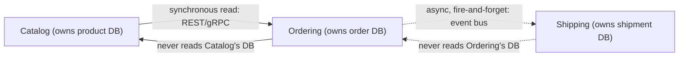

**TL;DR:** How do you split a monolith without building a distributed one? Decompose along bounded contexts — explicit boundaries where each context exclusively owns its data and talks to others only through explicit contracts (APIs or events), never a shared database.

**Real repo:** [`dotnet/eShop`](https://github.com/dotnet/eShop)

## 1. The Engineering Problem

A monolith usually starts as one codebase, one database, one deploy. It's
fast — until three teams are editing the same `Orders` table and every
release becomes a merge-conflict negotiation. The obvious fix looks like
"split it into services": pull `Orders`, `Products`, `Users` into their own
processes, keep the same schema, done.

That obvious fix is how you get a **distributed monolith** — the worst of
both worlds. The services still share one database (or worse, each service
reaches directly into another's tables), so every deploy still has to be
coordinated, every schema change still ripples everywhere, and now you've
added network latency and partial failure on top. Splitting by *table* or by
*technical layer* (a "database service", an "auth service") doesn't remove
coupling — it just moves the coupling onto the network, where it's harder to
see and slower to call.

The real question isn't "how many services should this be?" It's "where are
the seams in the *business*, and where does each concept genuinely mean
something different depending on who's using it?"

## 2. The Technical Solution: bounded contexts

A **bounded context** (from Domain-Driven Design) is an explicit boundary
around a model where a term has exactly one meaning. "Product" inside a
Catalog context means name, description, price, images. "Product" inside an
Ordering context might mean nothing more than a `productId` and the price
that was charged at purchase time — Ordering doesn't need Catalog's full
model, and trying to share one "Product" class between them is exactly the
coupling that breaks monoliths in the first place.

Once contexts are identified, three rules make the split real instead of
cosmetic:

1. **Each context owns its data, exclusively.** No other service reads or
   writes its tables directly — not even for a "quick join."
2. **Contexts talk only through an explicit contract** — an HTTP/gRPC API for
   synchronous questions, or an event on a shared bus for "something
   happened." Never a shared schema.
3. **Internal changes stay internal.** A context can refactor its own domain
   model freely as long as its published contract (API shape, event schema)
   doesn't change.



Core truths to hold:
- **A shared database is not a bounded context boundary — it's the absence
  of one.** If two services can `JOIN` across their tables, they're one
  context wearing two processes.
- **Events crossing a boundary are a translated, minimal contract** — not a
  dump of the internal domain model. Publishing your internal `Order`
  aggregate verbatim just moves the shared-schema problem onto the event
  bus.
- Decomposing by business capability (Catalog, Ordering, Shipping) survives
  reorganizations and refactors better than decomposing by technical layer
  (API layer, data layer) — the latter re-creates a monolith's coupling,
  just spread across more repos.

## 3. The clean example (concept in isolation)

Two bounded contexts, each with its own database, talking only through an
event on a shared bus — no shared table, no cross-context join.

```yaml
# docker-compose.yml
services:
  catalog-api:
    build: ./catalog          # owns full product data: name, price, description
    environment:
      DATABASE_URL: postgres://catalog-db/catalog
    depends_on: [catalog-db]

  catalog-db:
    image: postgres:16        # ONLY catalog-api ever connects to this database

  ordering-api:
    build: ./ordering         # owns order data: what was bought, by whom, at what price
    environment:
      DATABASE_URL: postgres://ordering-db/orders
      EVENT_BUS_URL: amqp://eventbus
    depends_on: [ordering-db, eventbus]

  ordering-db:
    image: postgres:16        # ONLY ordering-api ever connects to this database

  eventbus:
    image: rabbitmq:3-management   # the ONLY channel between the two contexts
```

```jsonc
// integration-events/order-placed.json — the entire contract Ordering
// exposes to the outside world. Not a dump of its internal Order aggregate:
// just enough for another context to react.
{
  "event": "OrderPlaced",
  "orderId": "ord_8f2a",
  "items": [
    { "productId": "prod_119", "quantity": 2, "unitPriceAtPurchase": 42.00 }
  ]
}
```

Notice what's *not* here: Ordering's `OrderItem` doesn't hold Catalog's
`Product` description, images, or current price — it holds a `productId` and
the price it captured at purchase time. Catalog can rename or reprice a
product tomorrow and no historical order changes, because Ordering never
depended on Catalog's live data, only on a fact it captured once.

## 4. Production reality (from the real repo)

[dotnet/eShop](https://github.com/dotnet/eShop) is Microsoft's reference
e-commerce architecture, orchestrated with .NET Aspire. Its `AppHost`
project is the single place that wires every bounded context together — and
reading it top to bottom shows the same rules from section 2 enforced in a
real system with 8+ services:

```csharp
// src/eShop.AppHost/Program.cs (trimmed to the decomposition-relevant parts)
var redis = builder.AddRedis("redis");
var rabbitMq = builder.AddRabbitMQ("eventbus")
    .WithLifetime(ContainerLifetime.Persistent);
var postgres = builder.AddPostgres("postgres")
    .WithImage("ankane/pgvector")
    .WithImageTag("latest")
    .WithLifetime(ContainerLifetime.Persistent);

// One Postgres LOGICAL DATABASE PER BOUNDED CONTEXT -- not one shared DB
var catalogDb = postgres.AddDatabase("catalogdb");
var identityDb = postgres.AddDatabase("identitydb");
var orderDb = postgres.AddDatabase("orderingdb");
var webhooksDb = postgres.AddDatabase("webhooksdb");

var identityApi = builder.AddProject<Projects.Identity_API>("identity-api", launchProfileName)
    .WithExternalHttpEndpoints()
    .WithReference(identityDb)
    .WithHttpHealthCheck("/health");

var identityEndpoint = identityApi.GetEndpoint(launchProfileName);

// Basket owns NO Postgres database at all -- it's cart state, so Redis is
// the right storage for its context. Bounded contexts don't have to agree
// on storage technology, only on not touching each other's storage.
var basketApi = builder.AddProject<Projects.Basket_API>("basket-api")
    .WithReference(redis)
    .WithReference(rabbitMq).WaitFor(rabbitMq)
    .WithEnvironment("Identity__Url", identityEndpoint);

var catalogApi = builder.AddProject<Projects.Catalog_API>("catalog-api")
    .WithReference(rabbitMq).WaitFor(rabbitMq)
    .WithReference(catalogDb);

var orderingApi = builder.AddProject<Projects.Ordering_API>("ordering-api")
    .WithReference(rabbitMq).WaitFor(rabbitMq)
    .WithReference(orderDb).WaitFor(orderDb)
    .WithHttpHealthCheck("/health")
    .WithEnvironment("Identity__Url", identityEndpoint);

// A background worker in Ordering's OWN context -- not a separate service
// reaching into orderingdb from outside.
builder.AddProject<Projects.OrderProcessor>("order-processor")
    .WithReference(rabbitMq).WaitFor(rabbitMq)
    .WithReference(orderDb)
    .WaitFor(orderingApi);

builder.AddProject<Projects.PaymentProcessor>("payment-processor")
    .WithReference(rabbitMq).WaitFor(rabbitMq);
```

What this teaches that a hello-world can't:

- **`AddDatabase("catalogdb")` / `AddDatabase("orderingdb")` / etc. are
  separate logical databases on the same Postgres server** — the boundary
  DDD cares about is "which service is allowed to open this connection
  string," not "which physical server it runs on." A bounded context
  boundary is an access-control boundary first, an infrastructure boundary
  second.
- **Basket has no relational database reference at all** — only Redis.
  Real bounded-context decomposition lets each context pick storage that
  fits its access pattern (cart state is ephemeral key-value; catalog/orders
  are relational), something a "one database, N schemas" split can't do.
- **`OrderProcessor` gets a reference to `orderDb` directly, but it's not a
  separate context** — it's a background worker *inside* Ordering's
  boundary (it `WaitFor(orderingApi)` because it depends on Ordering's own
  EF migrations). Not every process boundary is a context boundary; some
  processes just split *one* context's workload across a request-handler and
  a background worker.
- **Digging into `Ordering.Domain/AggregatesModel/` shows the DDD tactical
  pattern that backs this**: an `OrderAggregate/Order.cs` and a
  `BuyerAggregate/Buyer.cs`, each with its own repository interface. Inside
  `Ordering.API/Application/`, there are two clearly separate event
  folders — `DomainEventHandlers/` (events like
  `OrderStatusChangedToPaidDomainEventHandler` that never leave the
  Ordering process) versus `IntegrationEvents/` (events like
  `OrderStockConfirmedIntegrationEvent` published on `rabbitMq`, the only
  thing other contexts ever see). That split is bounded-context theory made
  literal in code: domain events are context-internal; integration events
  are the translated, minimal contract crossing the boundary — exactly the
  distinction section 2 makes, enforced by a folder structure instead of a
  comment.

A common misconception worth correcting here: decomposition is often taught
as "one service per database table" or "one service per REST resource."
eShop's own split shows that's wrong on both counts — `identity-api` fronts
one database, `basket-api` fronts none (Redis instead), and
`order-processor` shares `orderingdb` with `ordering-api` because they're
the *same* bounded context split across two processes for operational
reasons, not two contexts.

---

## Source

- **Concept:** Service decomposition & bounded contexts
- **Domain:** microservices
- **Repo:** [dotnet/eShop](https://github.com/dotnet/eShop) → [`src/eShop.AppHost/Program.cs`](https://github.com/dotnet/eShop/blob/main/src/eShop.AppHost/Program.cs) — .NET Aspire-orchestrated e-commerce reference architecture


