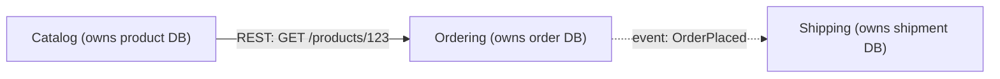
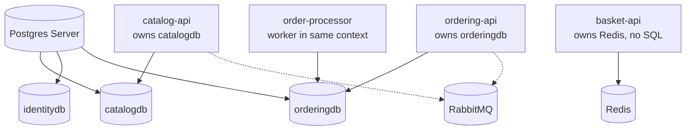

**TL;DR:** Don't split by table. Split by business boundary where each service owns its own DB and talks only via APIs or events.

> **In plain English (30 sec):** You already split code into modules like `catalog.js`, `orders.js`, each with own folder. Bounded context is same, but each module gets its own database and can only call other modules via API, never direct DB query.

## 1. The Engineering Problem

You have monolith with one DB, 3 teams editing same `Orders` table. Releases become merge hell.

Obvious fix: split into `orders-service`, `products-service`, keep same DB, done.

That creates distributed monolith — worst of both:

- Same DB, so deploys still coordinated
- Schema change ripples everywhere
- Now you added network latency + partial failure

Real question: Where does business meaning change? "Product" in Catalog = name, price, images. "Product" in Ordering = just productId + price at purchase time. Different meanings = different contexts.

## 2. The Technical Solution: bounded contexts

Bounded context = boundary where word means one thing. Inside Catalog, Product has full data. Inside Ordering, Product is just ID + price captured.

3 rules make split real:

1. **Each context owns its data, exclusively.** No other service reads its tables, not even for quick JOIN.
2. **Talk only via explicit contract** — REST/gRPC API or event on bus. Never shared DB.
3. **Internal refactor free** as long as contract doesn't break.



Simple: If two services can JOIN tables, they are one context in two processes.

## 3. Concept in Isolation

Two contexts, each own DB, only event bus connects:

```yaml
# docker-compose.yml — minimal
services:
  catalog-api:
    build: ./catalog
    environment: { DATABASE_URL: postgres://catalog-db/catalog }
  catalog-db:
    image: postgres:16 # ONLY catalog-api connects here

  ordering-api:
    build: ./ordering
    environment:
      DATABASE_URL: postgres://ordering-db/orders
      EVENT_BUS_URL: amqp://eventbus
  ordering-db:
    image: postgres:16 # ONLY ordering-api connects here

  eventbus:
    image: rabbitmq:3-management # ONLY channel between contexts
```

```json
// event: OrderPlaced — minimal contract, not full Order object
{
  "event": "OrderPlaced",
  "orderId": "ord_8f2a",
  "items": [{ "productId": "prod_119", "quantity": 2, "unitPriceAtPurchase": 42.00 }]
}
```

What it shows: Ordering doesn't store Catalog's Product description. It stores productId + price captured at purchase. Catalog can rename product tomorrow, orders stay correct.

## 4. Real Production Incident

**Incident: Shared DB causes 4-hour outage during sale**

T+0: Team A deploys Catalog, adds column `products.is_featured` boolean, migration runs ALTER TABLE.

T+5m: Team B's Ordering service still running old code that does `SELECT * FROM products`. New column breaks ORM mapping, throws 500.

T+10m: Checkout down. 100% failure on place order.

Impact: $50k lost sales, 2 teams blocked.

Root cause:
```sql
-- Both services using same DB, same table
SELECT * FROM products -- breaks when other team adds column
```

Fix:
```yaml
# Split to own DBs
catalogDb = postgres.AddDatabase("catalogdb") # only catalog-api
orderDb = postgres.AddDatabase("orderingdb")   # only ordering-api
# Talk via event, not JOIN
```

Prevention: Enforce `GRANT SELECT ON catalog.* TO catalog_api ONLY`, ban cross-DB queries in CI.

## 5. Production Design — Real repo dotnet/eShop

Real AppHost wiring 8+ services:



Real code from `src/eShop.AppHost/Program.cs`:

```csharp
var catalogDb = postgres.AddDatabase("catalogdb");
var orderDb = postgres.AddDatabase("orderingdb");
var identityDb = postgres.AddDatabase("identitydb");

var basketApi = builder.AddProject<Projects.Basket_API>("basket-api")
    .WithReference(redis) // no Postgres at all, Redis is right storage
    .WithReference(rabbitMq);

var catalogApi = builder.AddProject<Projects.Catalog_API>("catalog-api")
    .WithReference(rabbitMq).WithReference(catalogDb);

var orderingApi = builder.AddProject<Projects.Ordering_API>("ordering-api")
    .WithReference(rabbitMq).WithReference(orderDb);
```

Takeaways:
- Each `AddDatabase` = logical DB, access-control boundary
- Basket has no SQL, only Redis — context picks storage that fits
- OrderProcessor shares orderDb with ordering-api — same context, two processes

## 6. Cloud Lens — How GCP/AWS implements

**AWS:**
- Each bounded context = separate ECS service + RDS DB + own VPC subnet
- Use AWS EventBridge as event bus, not RabbitMQ
- Terraform: `aws_db_instance` per context, `aws_ecs_service` per API

**GCP:**
- Each context = Cloud Run service + Cloud SQL DB
- Pub/Sub as event bus
- `gcloud run deploy catalog-api --set-env-vars DATABASE_URL=...`

Cloud enforces boundary via IAM: catalog-api SA can only access catalog-db, not order-db.

## 7. Library Lens — Exact library + code

**Today you would use:**

```csharp
// .NET eShop uses .NET Aspire 8.0
// Program.cs
var builder = DistributedApplication.CreateBuilder(args);
var postgres = builder.AddPostgres("postgres").WithImage("ankane/pgvector");
var catalogDb = postgres.AddDatabase("catalogdb");
var rabbitMq = builder.AddRabbitMQ("eventbus");

// Publish event - Ordering -> Shipping
// Ordering.API/IntegrationEvents/OrderPlacedIntegrationEvent.cs
public record OrderPlacedIntegrationEvent(Guid OrderId, List<OrderItem> Items) : IntegrationEvent;

// Handler - Shipping listens
public class OrderPlacedIntegrationEventHandler : IIntegrationEventHandler<OrderPlacedIntegrationEvent>
{
  public Task Handle(OrderPlacedIntegrationEvent @event) {
    // create shipment, no DB JOIN, only event data
  }
}
```

**pom.xml equivalent for Java:**
```xml
<dependency>spring-cloud-starter-bus-amqp</dependency> <!-- event bus -->
```

## 8. What Breaks & How to Troubleshoot

- **Break: JOIN across services**
  - Symptom: Need product name in Order query, slow, fails when Catalog down
  - Detect: grep `FROM products` in ordering-api repo
  - Fix: Store productName snapshot at order creation time, or call Catalog API and cache

- **Break: Shared DB migration locks all**
  - Symptom: Deploy Catalog, Ordering down 2 min
  - Detect: `SELECT * FROM pg_stat_activity WHERE wait_event = 'Lock'`
  - Fix: Split DBs, use `AddDatabase` per context

- **Break: Event schema dump of internal model**
  - Symptom: Change Order aggregate breaks Shipping
  - Detect: Shipping fails after Ordering deploy
  - Fix: Publish minimal DTO, version events: `OrderPlaced_v2`

- **Break: Distributed transaction**
  - Symptom: Order created but Basket not cleared
  - Detect: Logs show event not delivered
  - Fix: Outbox pattern + retry, not 2-phase commit

- **Break: Wrong bounded context**
  - Symptom: Basket needs Postgres, not Redis
  - Detect: Basket needs JOINs, complex queries
  - Fix: Re-evaluate — maybe Basket is actually part of Ordering context

---
Source: dotnet/eShop AppHost Program.cs
