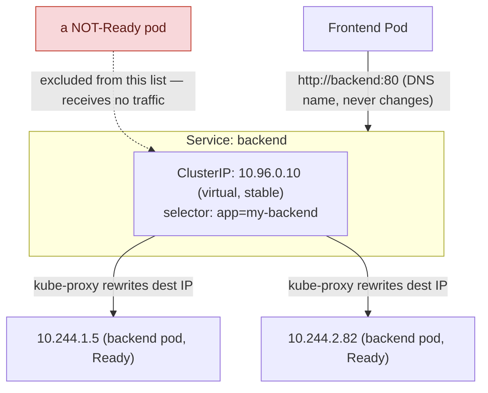
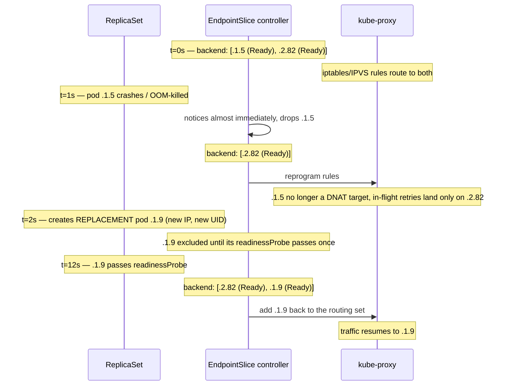
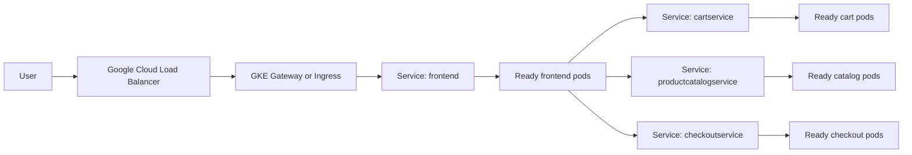

**TL;DR:** How do containers talk to each other without hardcoding IP addresses? Kubernetes inserts a **Service** — a permanent routing layer with a stable virtual IP and DNS name — in front of the volatile pods, tracking which pods are currently alive and Ready via a label selector so clients never need a pod's real IP.

> **In plain English (30 sec):** Code you already write — Map, function, API call, just bigger.

**Real repo:** [`GoogleCloudPlatform/microservices-demo`](https://github.com/GoogleCloudPlatform/microservices-demo)

## 1. The Engineering Problem: the volatile IP address

You have a **Frontend** web app that needs to call a **Backend** API over HTTP.

On a VM, you'd give the Backend a static IP (`192.168.1.50`) and paste it into the Frontend's config. Done.

In Kubernetes that approach is broken by design, because **pods are ephemeral**. If the Backend pod crashes, gets OOM-killed, or its node is drained for maintenance, Kubernetes deletes it and schedules a brand-new pod — with a **brand-new, random IP**. Any Frontend holding the old IP is now talking to nothing.

You cannot chase pod IPs by hand. You need a **stable address that never changes**, even as the pods behind it are destroyed and recreated a thousand times.

---

## 2. The Kubernetes Solution: the `Service` object

Kubernetes inserts a permanent routing layer *in front of* the volatile pods. That layer is a **Service**. It has a stable virtual IP (the ClusterIP) and a permanent DNS name. Clients talk to the Service; the Service tracks whichever pods are currently alive and healthy.

**Macro view — the routing layer in front of volatile pods:**



**Zoom in — the exact timeline this lesson opened with** (a backend pod
crashing mid-traffic; this is what Q1/Q7 below are actually describing):



The three things to hold onto:

1. The **ClusterIP is virtual** — it isn't bound to any network interface. It exists only as routing rules that `kube-proxy` programs on every node.
2. The Service finds its pods by **label selector**, not by IP.
3. Only **Ready** pods are in the routing set. Readiness is the on/off switch for traffic.

---

## 3. The clean YAML (the concept in isolation)

Pod stamped with a label:

```yaml
apiVersion: v1
kind: Pod
metadata:
  name: backend-pod
  labels:
    app: my-backend        # the identity tag the Service will look for
spec:
  containers:
  - name: api
    image: mycompany/api:v1
    ports:
    - containerPort: 8080
```

Service that selects it:

```yaml
apiVersion: v1
kind: Service
metadata:
  name: backend            # becomes the DNS name: backend.<namespace>.svc.cluster.local
spec:
  selector:
    app: my-backend        # matches any pod carrying this exact label
  ports:
  - protocol: TCP
    port: 80               # port clients hit ON THE SERVICE
    targetPort: 8080       # port the container actually listens on
```

Frontend code just calls `http://backend:80`. Kubernetes does the rest.

That's the mental model. Now here's what it looks like when it's carrying real traffic.

---

## 4. Production reality: the same pattern in a real repo

Here is the **actual** manifest for the `frontend` service of Google's Online Boutique — a real, 11-service microservice app. I've trimmed the license header; everything else is verbatim, annotated.

### 4a. The Deployment — notice how it finds the *other* services

```yaml
apiVersion: apps/v1
kind: Deployment
metadata:
  name: frontend
  labels:
    app: frontend
spec:
  selector:
    matchLabels:
      app: frontend          # Deployment owns pods with this label...
  template:
    metadata:
      labels:
        app: frontend        # ...and stamps the SAME label on the pods it creates.
    spec:
      containers:
        - name: server
          image: frontend
          ports:
          - containerPort: 8080
          readinessProbe:                # <-- THIS is what gates Service traffic
            initialDelaySeconds: 10
            httpGet:
              path: "/_healthz"
              port: 8080
          env:
          # Service discovery in the real world: NOT one backend, but NINE,
          # each addressed by its Service DNS name + port. Zero IP addresses.
          - name: PRODUCT_CATALOG_SERVICE_ADDR
            value: "productcatalogservice:3550"
          - name: CURRENCY_SERVICE_ADDR
            value: "currencyservice:7000"
          - name: CART_SERVICE_ADDR
            value: "cartservice:7070"
          - name: RECOMMENDATION_SERVICE_ADDR
            value: "recommendationservice:8080"
          - name: SHIPPING_SERVICE_ADDR
            value: "shippingservice:50051"
          - name: CHECKOUT_SERVICE_ADDR
            value: "checkoutservice:5050"
          - name: AD_SERVICE_ADDR
            value: "adservice:9555"
          resources:
            requests: { cpu: 100m, memory: 64Mi }
            limits:   { cpu: 200m, memory: 128Mi }
```

**What this teaches that a hello-world can't:**

- **Discovery is DNS, at scale.** The frontend reaches nine backends purely by name — `cartservice:7070`, `shippingservice:50051`, etc. Not a single IP is hardcoded anywhere in a real production app. Every one of those names resolves through the Service layer.
- **The readiness probe is the traffic gate.** `/_healthz` on port 8080 is not decoration. Until it passes, this pod's IP is kept *out* of the Service's routing set, so no user request is ever sent to a pod that isn't ready to serve. (Details in the question bank — this is the single most-missed production fact about Services.)
- **The label contract is explicit.** `selector.matchLabels.app: frontend` (what the Deployment owns) and the pod template's `labels.app: frontend` (what gets stamped) must agree, and the Service's selector will key off that same label. Three places, one label — break the agreement and traffic silently goes nowhere.

### 4b. Two Services, same pods, different jobs

```yaml
apiVersion: v1
kind: Service
metadata:
  name: frontend
spec:
  type: ClusterIP            # internal-only. The default. For east-west (in-cluster) traffic.
  selector:
    app: frontend
  ports:
  - name: http               # NAMED port — production habit; lets other objects refer to "http"
    port: 80
    targetPort: 8080
---
apiVersion: v1
kind: Service
metadata:
  name: frontend-external
spec:
  type: LoadBalancer         # asks the cloud for a real external IP / L4 load balancer
  selector:
    app: frontend            # SAME selector — both Services front the exact same pods
  ports:
  - name: http
    port: 80
    targetPort: 8080
```

**What this teaches:**

- **Service *type* is how you choose exposure.** `ClusterIP` (internal, the default), `NodePort` (opens a port on every node), `LoadBalancer` (provisions a cloud L4 balancer + external IP), and `ExternalName` (a DNS CNAME to something outside). Same object, four reach levels.
- **One set of pods can back multiple Services.** Here the identical `app: frontend` selector is fronted by an internal ClusterIP *and* an external LoadBalancer — internal callers use `frontend`, the internet comes in via `frontend-external`. You don't duplicate pods to expose them differently; you add a Service.
- **Named ports (`name: http`)** are standard in production because other objects (Ingress, NetworkPolicy, monitoring) can then reference the port by name instead of a brittle number.

---

## 5. Production Incident: 503s with Running pods and zero endpoints

A checkout frontend deploys successfully during a high-traffic window. `kubectl get pods` shows the new pods as `Running`, but users see a sudden spike in HTTP 503s from `frontend-external`.

The confusing part: the cloud LoadBalancer is healthy, the node pool is healthy, and the Deployment has the expected replica count. The failure sits one layer lower. The Service has no Ready endpoints, so every request that reaches the Service has nowhere valid to go.

Typical root causes:

- The Service selector says `app: frontend`, but the rendered pod template label changed to `app: front-end`.
- The pods are `Running` but not `Ready` because `/_healthz` fails or points to the wrong port.
- The Service `targetPort` no longer matches the container port after an app or Helm chart change.
- A NetworkPolicy allows ingress to pods by old labels, while the Service selector was updated separately.

The important production lesson is that `Running` is not enough. A Service routes only to pods selected by label and marked Ready in EndpointSlice.

---

## 6. Troubleshooting & Resolution: command sequence

Start with the Service, not the cloud load balancer. The Service is the contract between stable DNS and volatile pods.

```bash
# 1. Check the Service selector.
kubectl get svc frontend -o jsonpath='{.spec.selector}'
kubectl describe svc frontend

# 2. Check whether EndpointSlice has any ready backends.
kubectl get endpointslices \
  -l kubernetes.io/service-name=frontend \
  -o wide

kubectl get endpointslices \
  -l kubernetes.io/service-name=frontend \
  -o yaml | grep -E 'addresses:|ready:|targetRef:|port:'

# 3. Compare Service selector with actual pod labels.
kubectl get pods -l app=frontend --show-labels
kubectl get pods --show-labels | grep frontend

# 4. Check readiness, because Running pods may still be excluded.
kubectl get pods -l app=frontend
kubectl describe pod -l app=frontend | grep -A12 -E 'Readiness|Events'

# 5. Verify the app is listening where the Service points.
kubectl get svc frontend -o jsonpath='{.spec.ports[*].targetPort}'
kubectl get deploy frontend -o jsonpath='{.spec.template.spec.containers[*].ports[*].containerPort}'

# 6. Confirm DNS from a real client pod.
kubectl exec -it deploy/frontend -- cat /etc/resolv.conf
kubectl exec -it deploy/frontend -- nslookup productcatalogservice
kubectl exec -it deploy/frontend -- nslookup productcatalogservice.default.svc.cluster.local
```

If the selector drifted, fix the manifest rather than patching the live object by hand:

```yaml
apiVersion: v1
kind: Service
metadata:
  name: frontend
spec:
  selector:
    app: frontend
  ports:
  - name: http
    port: 80
    targetPort: http
---
apiVersion: apps/v1
kind: Deployment
metadata:
  name: frontend
spec:
  selector:
    matchLabels:
      app: frontend
  template:
    metadata:
      labels:
        app: frontend
    spec:
      containers:
      - name: server
        ports:
        - name: http
          containerPort: 8080
        readinessProbe:
          httpGet:
            path: /_healthz
            port: http
```

Resolution path:

1. Correct the rendered YAML in Git.
2. Apply through the normal deployment path.
3. Watch EndpointSlice readiness, not just pod status.
4. Confirm client traffic succeeds through the same DNS name the app uses.

```bash
kubectl rollout status deploy/frontend
kubectl get endpointslices -l kubernetes.io/service-name=frontend -w
kubectl exec -it deploy/frontend -- curl -fsS http://productcatalogservice:3550/healthz
```

---

## 7. Cloud Lens: GKE production design

On GKE, this pattern usually sits behind a cloud load balancer:



Use GKE Services for east-west traffic inside the cluster, and GKE Gateway or Ingress for north-south traffic from the internet. The cloud load balancer should not be your first suspect when only one internal dependency fails; first prove that the backing Service has Ready endpoints.

Production checks:

- `Service` and `Deployment` labels are rendered from one shared Helm value or Kustomize label.
- `targetPort` uses a named container port, such as `http`, instead of a duplicated number.
- Cloud Monitoring alerts when EndpointSlice has zero Ready addresses for a user-facing Service.
- CoreDNS latency and error rate are on the service dashboard.
- GKE Dataplane V2 or IPVS/eBPF behavior is documented, because kube-proxy mode changes the load-balancing mechanics.

---

## 8. Library and Tooling Lens

For Kubernetes manifests, the "library" is usually the delivery toolchain: Helm, Kustomize, policy-as-code, and cluster monitoring.

Helm should generate selector labels from one helper, so the Service and Deployment cannot drift:


```yaml
{{- define "frontend.selectorLabels" -}}
app.kubernetes.io/name: frontend
app.kubernetes.io/component: web
{{- end }}

apiVersion: v1
kind: Service
metadata:
  name: frontend
spec:
  selector:
    {{- include "frontend.selectorLabels" . | nindent 4 }}
  ports:
  - name: http
    port: 80
    targetPort: http
```


The Deployment should use the same helper:


```yaml
spec:
  selector:
    matchLabels:
      {{- include "frontend.selectorLabels" . | nindent 6 }}
  template:
    metadata:
      labels:
        {{- include "frontend.selectorLabels" . | nindent 8 }}
```


CI should render the final manifests, then lint the rendered output:

```bash
helm template frontend ./charts/frontend > rendered.yaml
kube-linter lint rendered.yaml
kubectl apply --dry-run=server -f rendered.yaml
```

For progressive delivery, Argo Rollouts or Flagger should gate traffic shifts on Service-level health, not just pod availability:

```yaml
analysis:
  templates:
  - templateName: frontend-success-rate
  args:
  - name: service
    value: frontend
```

---

## 9. Production Design Scenario: service discovery for checkout

Design a checkout frontend on GKE:

- 1000 RPS user traffic.
- The frontend calls nine backend Services.
- p99 latency target is below 150 ms.
- Deployments must be zero downtime.
- A single backend failure should degrade one feature, not break the whole page.

Baseline design:

- Use `ClusterIP` Services for normal backend discovery.
- Use short names like `cartservice:7070` only for same-namespace traffic.
- Use full names like `cartservice.checkout.svc.cluster.local:7070` across namespaces.
- Use readiness probes to remove cold or degraded pods from Service traffic.
- Use client timeouts, retries with budgets, and circuit breakers in application code.

Tradeoff table:

| Choice | Use When | Production Failure Mode |
|---|---|---|
| `ClusterIP` Service | Most stateless HTTP/gRPC services | Selector drift or readiness failure creates zero endpoints |
| Headless Service | Stateful clients need individual pod identities | Client must handle balancing and dead endpoints |
| Service mesh | Need mTLS, retries, traffic splitting, outlier detection | Sidecar config or control-plane outage can affect every hop |
| GKE Gateway/Ingress | Internet-facing HTTP routing | Backend Service or NEG health mismatch causes 502/503 at the edge |

At 1000 RPS, plain `ClusterIP` is still the default answer. You move to headless Service when the client needs endpoint identity, and you add service mesh when you need cross-cutting traffic policy that is too risky to duplicate in every app.

---

## 10. What breaks at scale

**DNS amplification from `ndots:5`:** External names like `api.stripe.com` may trigger several internal search-domain attempts first. Use FQDNs with a trailing dot for hot external dependencies where the client supports it, or tune DNS behavior deliberately.

**Too many Service rules per node:** Large clusters with many Services and endpoints can make kube-proxy rule updates expensive, especially in iptables mode. Consider IPVS, nftables mode, or GKE Dataplane V2/eBPF where appropriate.

**Readiness checks that lie:** A readiness endpoint that only returns "process is up" will keep routing traffic to a pod that cannot reach Redis, a database, or a required downstream. Readiness should represent whether the pod can serve its critical request path.

**Cross-zone latency:** A Service hides pod IPs, but it does not remove physics. If GKE schedules backend pods in a different zone from the frontend, p99 latency can jump under load. Use topology spread constraints and monitor latency by zone.

---

## 11. Prevention Checklist

- Service selector matches Deployment pod template labels.
- Deployment `spec.selector.matchLabels` matches `spec.template.metadata.labels`.
- Readiness probe exists and tests the real serving path.
- Service uses named `targetPort`, not a duplicated numeric port.
- CI runs `helm template`, `kube-linter`, and server-side dry-run.
- Alert fires when a production Service has zero Ready EndpointSlice addresses for more than 2 minutes.
- Dashboards show Service 5xx rate, EndpointSlice ready count, CoreDNS latency, and rollout revision.
- Runbook starts with `kubectl get endpointslices`, not with cloud load balancer guesses.

---

## 12. Question Bank (control-plane depth — the mental-model test)

**Q1. When a pod restarts and gets a new IP, how does the Service learn the new IP so fast?**
A control-plane controller *watches* the API for pod changes and republishes the Service's backing address list within milliseconds. Classically this was the **Endpoints** object (the `Endpoints` controller). **Modern Kubernetes (v1.19+) uses `EndpointSlices`** — the `EndpointSlice` controller writes the pod IPs, ports, and per-address `ready` conditions into sliced objects that scale far better than one giant Endpoints blob. `kube-proxy` and DNS consume those slices to reprogram routing. *(If an interviewer says "Endpoints object," the sharper answer is "EndpointSlices now — Endpoints is the legacy compatibility view.")*

**Q2. Does a pod receive Service traffic the instant it starts?**
No. A pod's IP is only added to the Service's routing set (as an endpoint with `ready: true`) **after its readiness probe passes**. That's the whole point of `readinessProbe` in the Online Boutique manifest above: a booting or unhealthy pod is deliberately excluded, so users never hit a pod that can't serve. Remove the readiness probe and you route traffic into cold/broken pods.

**Q3. If I scale the backend to 3 pods, do I need 3 Services?**
No — one Service. Its selector matches all 3 labelled pods, and it load-balances across the Ready ones. **But the distribution is not naive round-robin:** in `kube-proxy`'s default **iptables** mode, a request is sent to a **randomly chosen** endpoint using probability rules (statistically even, not strictly sequential). In **IPVS** mode you get real algorithms (`rr` round-robin, `lc` least-connection, etc.), which is why large clusters prefer IPVS. Newer clusters may also run the **nftables** proxy mode.

**Q4. The ClusterIP — where does that IP actually "live"?**
Nowhere physical. It's a **virtual IP** not assigned to any NIC. `kube-proxy` runs on every node and programs kernel rules (iptables/IPVS/nftables) so that any packet destined for `10.96.0.10:80` is **DNAT'd** to a real pod IP:port. There's no process listening on the ClusterIP — it's pure packet rewriting at the kernel level.

**Q5. What actually resolves `cartservice:7070` to an address?**
**CoreDNS** (the in-cluster DNS server). Every Service gets an A/AAAA record at `<service>.<namespace>.svc.cluster.local`. The short name `cartservice` works because `/etc/resolv.conf` in each pod has a `search` list (e.g. `default.svc.cluster.local svc.cluster.local cluster.local`) and `ndots:5`. **Production gotcha:** `ndots:5` means any name with fewer than 5 dots is tried against every search domain *first*, so an external lookup like `api.stripe.com` can fire several failed cluster queries before succeeding — a classic source of mysterious DNS latency.

**Q6. When would you set `clusterIP: None` (a headless Service)?**
For a **headless Service**, DNS returns the **individual pod IPs** instead of one virtual ClusterIP — no kube-proxy load balancing. You use it when clients need to address specific pods directly: **StatefulSets** (so `pod-0`, `pod-1` get stable per-pod DNS), databases with primary/replica awareness, or clients that do their own balancing (many gRPC setups).

**Q7. A client can't reach a Service even though pods are running. What are the first two things you check?**
(1) **Selector/label mismatch** — does the Service `selector` exactly match the pod labels? A typo means zero endpoints. Check with `kubectl get endpointslices` (or `kubectl describe svc`): if the endpoint list is empty, it's almost always labels or readiness. (2) **Readiness** — are the pods actually passing their readiness probe? Running ≠ Ready; a failing probe keeps the pod out of the endpoint set even though it shows as `Running`.

---

## Source

- **Concept:** Kubernetes `Service`, service discovery, and the networking control plane
- **Domain:** kubernetes
- **Repo:** [GoogleCloudPlatform/microservices-demo](https://github.com/GoogleCloudPlatform/microservices-demo) → [`kubernetes-manifests/frontend.yaml`](https://github.com/GoogleCloudPlatform/microservices-demo/blob/main/kubernetes-manifests/frontend.yaml) — Google's "Online Boutique," an 11-microservice reference app


