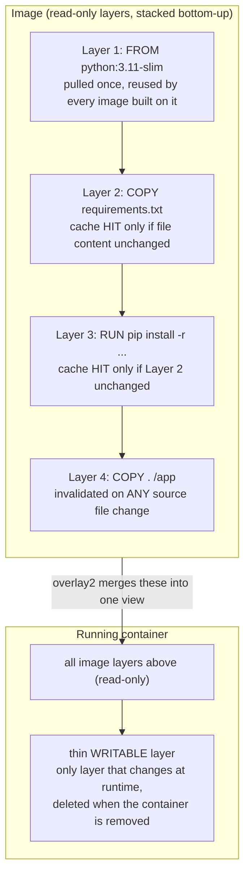
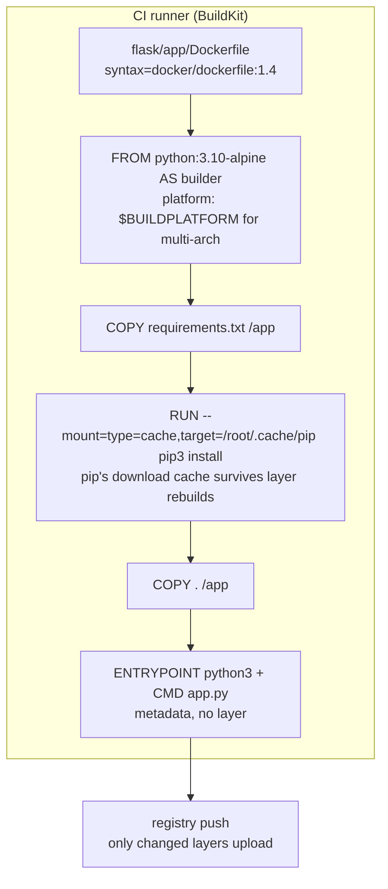

**TL;DR:** Every Dockerfile line makes a cached layer. Change one line, and every layer after it rebuilds. Instruction order decides fast builds vs slow ones.

> **In plain English (30 sec):** Layers are like git commits for a filesystem. Each instruction is one commit. Change an early commit and everything after it is rebuilt — so put slow stuff (`pip install`) early and changing stuff (your code) late.

**Real repo:** [`docker/awesome-compose`](https://github.com/docker/awesome-compose)

## 1. The Engineering Problem: rebuilding everything to change one line

You already do this on your laptop:

```bash
pip install -r requirements.txt   # once, 4 minutes
python app.py                     # edit app.py, rerun — instant, deps already there
```

A naive Dockerfile throws that away:

```dockerfile
FROM python:3.11-slim
COPY . .                                # any code edit lands here...
RUN pip install -r requirements.txt     # ...so THIS re-runs every single build
```

Works, but you pay for it everywhere:

- **Coffee-break builds.** One-line fix, full dependency reinstall. Every time.
- **CI pays it per commit.** 40 builds a day × 8 wasted minutes = your pipeline is the bottleneck.
- **Network pays it too.** Push/pull re-sends megabytes that didn't change.

You need a build that reuses what didn't change — on disk, and over the network.

---

## 2. The Technical Solution: image layers

An image is not one blob. It's a **stack of read-only layers**, merged into one filesystem view by a union filesystem (`overlay2` on Linux). Every instruction that touches the filesystem — `RUN`, `COPY`, `ADD` — adds exactly one layer: an immutable diff, addressed by its content hash. Metadata instructions (`ENV`, `CMD`, `LABEL`, `EXPOSE`) add no layer at all.

Here's what happens:



**In simple words:** Unchanged instruction + unchanged input = reuse the cached layer. One miss rebuilds everything below it.

Under the hood, `dockerd` doesn't manage layers itself — **containerd** owns the content store (the layer blobs, each a SHA-256 digest) and the snapshotter that mounts them as `overlay2`. At container start, containerd hands off to **runc**, which creates the namespaces/cgroups and execs your process. By then, layers are invisible — runc sees one merged root filesystem. Layers are purely a build-and-storage concern.

3 things to remember:

- **Layers are content-addressed and cached.** Same instruction, same inputs → skip the work, reuse the layer.
- **Invalidation cascades down.** One cache miss forces every later layer to rebuild, even if their own inputs are identical.
- **Layers are shared.** Two images on the same base store it once on disk, and skip re-uploading it on push if the registry already has the digest.

---

## 3. Concept in Isolation (the mechanism, no prod wiring)

Same app, ordered for cache: dependencies first, source code last. Edit `app.py` a hundred times — only the last layer rebuilds.

```dockerfile
FROM python:3.11-slim            # Layer 1: base OS + Python — pulled once, reused everywhere

WORKDIR /app                     # Layer 2: creates /app in the image filesystem

COPY requirements.txt .          # Layer 3: invalidated ONLY when requirements.txt content changes
RUN pip install -r requirements.txt   # Layer 4: the expensive step — cached while Layer 3 holds

COPY . .                         # Layer 5: invalidated on ANY source change — deliberately LAST

CMD ["python", "app.py"]         # metadata only — no filesystem layer, just image config
```

**What this does:** `pip install` reuses its cache on every code edit, because the layer before it (`COPY requirements.txt`) only breaks when dependencies actually change. Flip the order and every edit reinstalls everything.

---

## 4. Real Production Incident

**Incident: sev1 hotfix takes 24 minutes to deploy — every CI layer cache-missed**

**T+0:** Prod checkout bug. Hotfix branch ready, one line changed. Usual deploy time: 5 minutes.

**T+3m:** CI build starts. Last week's Dockerfile "cleanup" moved `COPY . .` above `RUN pip install`. Nobody noticed — app deploys were not urgent then.

**T+8m:** Build reinstalls all OS packages and all pip dependencies from scratch. No cache hits.

**T+19m:** Tests pass, image pushes — re-uploading layers the registry already had, because digests changed.

**T+24m:** Rollout completes. Incident closed.

**Impact:** MTTR 24 minutes instead of 5 — 19 extra minutes of checkout errors during a sev1.

**Root cause** — instruction order destroyed the cache:

```dockerfile
FROM python:3.10-alpine
COPY . .                             # any file edit busts cache HERE
RUN pip3 install -r requirements.txt # 6-minute reinstall on every single build
```

**Fix** — dependencies before code, plus a BuildKit cache mount:

```dockerfile
# syntax=docker/dockerfile:1.4
FROM python:3.10-alpine
COPY requirements.txt /app
RUN --mount=type=cache,target=/root/.cache/pip \
    pip3 install -r requirements.txt   # cache mount: even a rebuild skips re-downloads
COPY . /app                            # code edits bust only this cheap layer
```

**Prevention:** alert on build duration (a 2x jump means the cache broke), run `hadolint` in CI to catch `COPY . .` before dependency installs, and use registry-backed cache (`--cache-from`) so fresh CI runners still hit warm layers.

---

## 5. Production Design — docker/awesome-compose flask app

Real Dockerfile from `docker/awesome-compose` — Docker's own maintained flask stack, same pattern at production grade:



**Real config from prod** (verbatim, trimmed):

```dockerfile
# syntax=docker/dockerfile:1.4
FROM --platform=$BUILDPLATFORM python:3.10-alpine AS builder

WORKDIR /app

COPY requirements.txt /app
RUN --mount=type=cache,target=/root/.cache/pip \
    pip3 install -r requirements.txt

COPY . /app

ENTRYPOINT ["python3"]
CMD ["app.py"]
```

**3 takeaways:**

- **`# syntax=docker/dockerfile:1.4` makes `--mount` legal.** BuildKit-specific instructions need a frontend that understands them — this pin is it. (BuildKit is the default builder in current Docker Engine, not an opt-in `DOCKER_BUILDKIT=1` flag — older tutorials still teach it as opt-in.)
- **A cache mount is not layer caching.** Layer cache skips re-running the instruction. A `--mount=type=cache` lets the instruction re-run but reuses pip's download directory — so even a real `requirements.txt` change doesn't re-download every package.
- **`ENTRYPOINT` + `CMD` split is deliberate.** `python3` is fixed, `app.py` is the default argument — override the script at `docker run` without rebuilding.

---

## 6. Cloud Lens — How GCP/AWS actually implements this

Cloud builders have the same layer problem with one twist: **their runners are ephemeral**, so a local layer cache never survives to the next build. Both clouds solve it differently.

GCP Cloud Build runs kaniko, which stores its layer cache as an image in Artifact Registry — the cache survives because it lives next to your images, not on the runner:

```bash
gcloud builds submit --tag us-central1-docker.pkg.dev/myproj/apps/flask-app:v1.4.2
# kaniko flags under the hood: --cache=true --cache-ttl=168h
```

AWS CodeBuild offers a `LOCAL` cache (dies with the build host) or an S3 cache (files, not layers). Teams that want real layer reuse on AWS run `buildx` with a registry cache in ECR:

```bash
aws codebuild start-build --project-name flask-app
# buildspec runs: docker buildx build --cache-from type=registry,ref=...ecr.../flask-app:buildcache
```

Terraform — a Cloud Build trigger with kaniko's registry cache turned on:

```hcl
resource "google_cloudbuild_trigger" "flask" {
  name = "flask-app"
  build {
    step {
      name = "gcr.io/kaniko-project/executor:latest"
      args = [
        "--destination=us-central1-docker.pkg.dev/$${PROJECT_ID}/apps/flask-app:$${SHORT_SHA}",
        "--cache=true",
        "--cache-ttl=168h",
      ]
    }
  }
}
```

**Difference:** Cloud Build's kaniko cache lives in the registry and survives every ephemeral runner for free. CodeBuild's `LOCAL` layer cache dies with the host — on AWS, registry-backed buildx cache is the equivalent move, and you wire it yourself.

---

## 7. Library Lens — Exact library + code you would use

The builder you want today is **BuildKit**, driven through `docker buildx` (buildx v0.14 line, BuildKit v0.14) or the GitHub Actions wrapper `docker/build-push-action@v6`:

```yaml
# .github/workflows/build.yml — registry-backed layer cache for a fresh runner every time
- uses: docker/setup-buildx-action@v3
- uses: docker/build-push-action@v6
  with:
    context: .
    push: true
    tags: ghcr.io/myorg/flask-app:v1.4.2
    cache-from: type=registry,ref=ghcr.io/myorg/flask-app:buildcache
    cache-to: type=registry,ref=ghcr.io/myorg/flask-app:buildcache,mode=max
```

Bash equivalent — the same cache without Actions:

```bash
docker buildx build \
  --cache-from type=registry,ref=ghcr.io/myorg/flask-app:buildcache \
  --cache-to   type=registry,ref=ghcr.io/myorg/flask-app:buildcache,mode=max \
  -t ghcr.io/myorg/flask-app:v1.4.2 --push .

docker buildx du          # see what the builder cache is actually holding
docker system df          # local layer disk usage
```

---

## 8. What Breaks & How to Troubleshoot

**Break 1: Every build reinstalls all dependencies**
- Symptom: `pip install` / `npm install` runs on every build, even for a one-line code change
- Why: `COPY . .` sits above the install step — any file edit busts the cache early
- Detect: build log shows `[3/5] COPY . .` then no `CACHED` on the install step
- Fix: copy the dependency manifest first, install, then copy source (section 3 ordering)

**Break 2: Cache hits locally but never in CI**
- Symptom: `docker build` is instant on your machine, fully rebuilds in the pipeline
- Why: CI runners are fresh VMs — no local layer cache exists
- Detect: CI log shows zero `CACHED` lines while local builds are all `CACHED`
- Fix: `--cache-from type=registry,...` + `--cache-to ...,mode=max`, or kaniko `--cache=true`

**Break 3: "no space left on device" during build**
- Symptom: builds fail mid-`RUN` with disk errors on the builder
- Why: dangling layers and stopped-builder cache accumulate until the disk fills
- Detect: `docker system df` — build cache and dangling images in the tens of GB
- Fix: `docker system prune` for locals, `docker buildx prune` on builders; schedule it on CI runners

**Break 4: Huge build context, cache busts for no reason**
- Symptom: "transferring context: 480MB" before every build; `COPY . .` never hits cache
- Why: no `.dockerignore` — `.git`, `node_modules`, and log files go into the context and change every build
- Detect: the context size line at build start, or `docker build` spending minutes before step 1
- Fix: `.dockerignore` with `.git`, `node_modules`, `*.log`, `target/`, `__pycache__/`

**Break 5: Cache mount silently not working**
- Symptom: pip re-downloads every package even with `--mount=type=cache` in the Dockerfile
- Why: missing `# syntax=docker/dockerfile:1.4` pin, or building with the legacy builder that ignores mounts
- Detect: build log shows repeated `Downloading` lines for the same packages
- Fix: add the syntax line, use `docker buildx build` (BuildKit), verify `RUN --mount` appears in the build steps

---

## Source

- **Concept:** Docker image layers, the union filesystem (`overlay2`), and the `dockerd` → `containerd` → `runc` chain
- **Domain:** docker
- **Repo:** [docker/awesome-compose](https://github.com/docker/awesome-compose) → [`flask/app/Dockerfile`](https://github.com/docker/awesome-compose/blob/master/flask/app/Dockerfile) — Docker's official curated collection of real multi-service Compose stacks
