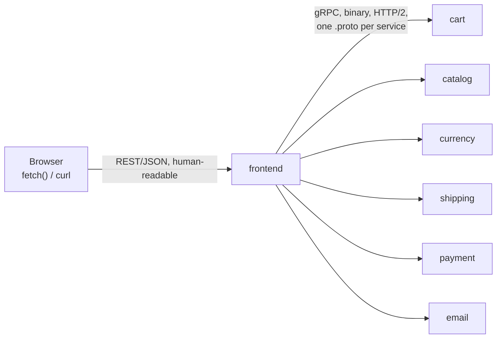

**TL;DR:** Why does the browser get REST while services talk gRPC to each other? REST/JSON stays at the edge because browsers and third parties need human-readable payloads without generated code, while gRPC handles internal service-to-service calls because both ends are code you control and a compiler-checked, binary, HTTP/2 contract is cheaper and safer.

**Real repo:** [`GoogleCloudPlatform/microservices-demo`](https://github.com/GoogleCloudPlatform/microservices-demo)

## 1. The Engineering Problem

Inside a monolith, calling another module is free: a function call, checked by
the compiler, sharing memory, taking nanoseconds. Split that monolith into
services and every one of those calls becomes a network call — serialized,
sent over a wire, deserialized, and capable of failing in ways a function
call never could.

The naive fix is to keep using what the team already knows: REST over
JSON, everywhere, including calls between services that only ever talk to
each other. That works for a single request/response between two teams'
services. It breaks down once one service has to **orchestrate** several
others to do its job. Picture a checkout flow: placing one order means
looking up the user's cart, fetching product prices, converting currency,
quoting shipping, charging a card, and sending a confirmation email — six
dependent network calls to fulfill one browser click. With hand-written
JSON on both ends:

- **The contract lives in nobody's compiler.** Each service's request/response
  shape is whatever the last person who edited it typed. A field renamed on
  one side and not the other fails at runtime, in production, not at build
  time.
- **Every one of those six calls pays full HTTP/1.1 overhead** — its own
  TCP handshake (or connection-pool contention), text-based headers, no
  multiplexing — when they're really six legs of one logical operation that
  could share a connection.
- **The team is polyglot.** A real system like this ends up with services in
  Go, Java, Python, C#, and Node — a JSON contract enforced only by
  documentation drifts differently in each language's client code.

The browser complicates the "just use one protocol" answer: it can't speak
gRPC natively over `fetch`/XHR the way it speaks HTTP/JSON. So the real
question isn't "REST or gRPC" — it's *where* each one earns its cost.

## 2. The Technical Solution: protocol-per-boundary

Systems that hit this at scale end up drawing the line at the network edge.
**REST/JSON stays at the edge**, where a browser, `curl`, or a third party
needs to read the payload without generated code. **gRPC takes over for
internal service-to-service calls**, where both ends are code you control
and you'd rather have a compiler catch a mismatched field than a customer.



Core truths to hold:

- **The `.proto` file is the contract, not the documentation.** Protobuf's
  IDL is compiled into typed client/server stubs in every language involved
  — a field rename becomes a compile error in every service that depends on
  it, not a runtime surprise.
- **gRPC rides HTTP/2**, which multiplexes many calls over one connection
  and carries binary, not text, payloads — the six-call fan-out in a
  checkout flow doesn't pay six separate connection setups.
- **This isn't "gRPC is better than REST."** REST/JSON's human-readability
  and browser-native support make it the right choice at the edge; gRPC's
  compile-time contract and transport efficiency make it the right choice
  where both ends are internal.

## 3. The clean example (concept in isolation)

A minimal service contract and the two sides that implement it — nothing
but the mechanism.

```protobuf
// greeter.proto — the single source of truth, compiled into every language
syntax = "proto3";
package greeter;

service Greeter {
  rpc SayHello (HelloRequest) returns (HelloReply) {}   // one unary RPC
}

message HelloRequest {
  string name = 1;    // field NUMBERS, not just names, are part of the wire format
}

message HelloReply {
  string message = 1;
}
```

```go
// server side — generated code handles serialization; you implement the interface
func (s *server) SayHello(ctx context.Context, req *pb.HelloRequest) (*pb.HelloReply, error) {
    return &pb.HelloReply{Message: "Hello, " + req.GetName()}, nil
}

// client side — calling another service looks like calling a local method
resp, err := pb.NewGreeterClient(conn).SayHello(ctx, &pb.HelloRequest{Name: "world"})
```

Notice what's absent compared to hand-written REST: no URL path to get
wrong, no JSON key to typo, no manual `json.Unmarshal` error handling — the
generated stub does all of it, from the same file both sides compiled
against.

## 4. Production reality (from the real repo)

[GoogleCloudPlatform/microservices-demo](https://github.com/GoogleCloudPlatform/microservices-demo)
is an 11-service polyglot e-commerce demo (Go, Java, Python, C#, Node) built
specifically to exercise this boundary. Its
[`protos/demo.proto`](https://github.com/GoogleCloudPlatform/microservices-demo/blob/main/protos/demo.proto)
is the single file every one of those languages compiles against:

```protobuf
// protos/demo.proto (trimmed to two of eight services — the real file
// defines Cart, Recommendation, ProductCatalog, Shipping, Currency,
// Payment, Email, Checkout, and Ad in one shared contract)

service CartService {
    rpc AddItem(AddItemRequest) returns (Empty) {}
    rpc GetCart(GetCartRequest) returns (Cart) {}
    rpc EmptyCart(EmptyCartRequest) returns (Empty) {}
}

message CartItem {
    string product_id = 1;
    int32  quantity = 2;
}

// ...

service CheckoutService {
    rpc PlaceOrder(PlaceOrderRequest) returns (PlaceOrderResponse) {}
}

// Money is its own message — never a bare float — so every language
// represents currency the SAME way instead of each inventing one.
message Money {
    string currency_code = 1;
    int64 units = 2;   // whole units, e.g. "1" for one US dollar
    int32 nanos = 3;   // fractional units, 10^-9, so $1.75 is units=1, nanos=750000000
}
```

`checkoutservice` (Go) is the orchestrator described in section 1 — it holds
six live gRPC connections and calls each one to fulfill `PlaceOrder`:

```go
// src/checkoutservice/main.go (trimmed to the communication-relevant parts)

type checkoutService struct {
    pb.UnimplementedCheckoutServiceServer

    productCatalogSvcAddr string
    productCatalogSvcConn *grpc.ClientConn
    cartSvcAddr string
    cartSvcConn *grpc.ClientConn
    currencySvcAddr string
    currencySvcConn *grpc.ClientConn
    shippingSvcAddr string
    shippingSvcConn *grpc.ClientConn
    emailSvcAddr string
    emailSvcConn *grpc.ClientConn
    paymentSvcAddr string
    paymentSvcConn *grpc.ClientConn
}

func main() {
    // ... env-driven addresses, one mustConnGRPC() call per dependency ...
    mustConnGRPC(ctx, &svc.shippingSvcConn, svc.shippingSvcAddr)
    mustConnGRPC(ctx, &svc.productCatalogSvcConn, svc.productCatalogSvcAddr)
    mustConnGRPC(ctx, &svc.cartSvcConn, svc.cartSvcAddr)
    mustConnGRPC(ctx, &svc.currencySvcConn, svc.currencySvcAddr)
    mustConnGRPC(ctx, &svc.emailSvcConn, svc.emailSvcAddr)
    mustConnGRPC(ctx, &svc.paymentSvcConn, svc.paymentSvcAddr)

    srv = grpc.NewServer(
        grpc.StatsHandler(otelgrpc.NewServerHandler()), // wire-level tracing hook, see below
    )
    pb.RegisterCheckoutServiceServer(srv, svc)

    healthcheck := health.NewServer()
    healthpb.RegisterHealthServer(srv, healthcheck) // gRPC's STANDARD health protocol, not a custom /health route
}

func mustConnGRPC(ctx context.Context, conn **grpc.ClientConn, addr string) {
    var err error
    _, cancel := context.WithTimeout(ctx, time.Second*3)
    defer cancel()
    *conn, err = grpc.NewClient(addr,
        grpc.WithTransportCredentials(insecure.NewCredentials()), // TLS deliberately off here — see note below
        grpc.WithStatsHandler(otelgrpc.NewClientHandler()))
    if err != nil {
        panic(errors.Wrapf(err, "grpc: failed to connect %s", addr))
    }
}

// PlaceOrder fans out to six other services to fulfill ONE checkout request
func (cs *checkoutService) PlaceOrder(ctx context.Context, req *pb.PlaceOrderRequest) (*pb.PlaceOrderResponse, error) {
    prep, err := cs.prepareOrderItemsAndShippingQuoteFromCart(ctx, req.UserId, req.UserCurrency, req.Address)
    // ...
    txID, err := cs.chargeCard(ctx, &total, req.CreditCard)
    // ...
    shippingTrackingID, err := cs.shipOrder(ctx, req.Address, prep.cartItems)
    // ...
    _ = cs.emptyUserCart(ctx, req.UserId)
    // ...
    if err := cs.sendOrderConfirmation(ctx, req.Email, orderResult); err != nil {
        log.Warnf("failed to send order confirmation to %q: %+v", req.Email, err)
    }
    // ...
}

// each dependency call is the generated client, invoked like a local method
func (cs *checkoutService) quoteShipping(ctx context.Context, address *pb.Address, items []*pb.CartItem) (*pb.Money, error) {
    shippingQuote, err := pb.NewShippingServiceClient(cs.shippingSvcConn).
        GetQuote(ctx, &pb.GetQuoteRequest{Address: address, Items: items})
    // ...
}
```

The `frontend` service is the actual REST/gRPC seam from section 2 — it
serves HTML/JSON to the browser and translates every page action into a
gRPC call on the backend:

```go
// src/frontend/rpc.go (trimmed)

func (fe *frontendServer) getProducts(ctx context.Context) ([]*pb.Product, error) {
    resp, err := pb.NewProductCatalogServiceClient(fe.productCatalogSvcConn).
        ListProducts(ctx, &pb.Empty{})
    return resp.GetProducts(), err
}

// a REAL production-only detail a hello-world never needs: a hard deadline
// on a non-critical dependency, so a slow ad service can't stall the page
func (fe *frontendServer) getAd(ctx context.Context, ctxKeys []string) ([]*pb.Ad, error) {
    ctx, cancel := context.WithTimeout(ctx, time.Millisecond*100)
    defer cancel()

    resp, err := pb.NewAdServiceClient(fe.adSvcConn).GetAds(ctx, &pb.AdRequest{
        ContextKeys: ctxKeys,
    })
    return resp.GetAds(), errors.Wrap(err, "failed to get ads")
}
```

What this teaches that a hello-world can't:

- **`healthpb.RegisterHealthServer` registers gRPC's own standard health
  protocol** (`grpc.health.v1`) on the same server as the business RPCs —
  unlike REST, where every framework invents its own `/health` shape, gRPC
  health checking is part of the wire protocol itself, so any gRPC-aware
  load balancer or orchestrator can query it the same way for any service.
- **`grpc.WithTransportCredentials(insecure.NewCredentials())` is not an
  oversight.** This demo deliberately skips TLS at the application layer
  because it's designed to run inside a service mesh (Istio manifests ship
  alongside it), where the sidecar proxy — not the app — handles mTLS
  between services. Encryption is an infrastructure concern here, not an
  app-code one.
- **`context.WithTimeout(ctx, time.Millisecond*100)` on `getAd`** is real
  deadline propagation: gRPC forwards a context's deadline to the callee
  automatically as wire metadata, so "give up after 100ms" doesn't require
  hand-rolled timeout headers the way it would over plain REST — and a
  slow, non-critical ad call can't block the page from rendering.
- **`grpc.StatsHandler(otelgrpc.NewServerHandler())` /
  `grpc.WithStatsHandler(otelgrpc.NewClientHandler())`** hook OpenTelemetry
  into every RPC automatically. Every one of `checkoutservice`'s six
  dependent calls in `PlaceOrder` is traced without a single line of
  tracing code inside `PlaceOrder` itself — the mechanism behind this is
  covered in depth once the pipeline reaches distributed tracing.
- **`Money` is a dedicated message with `units` + `nanos`, never a bare
  float.** Protobuf forces this decision to be made once, in the shared
  `.proto` file, instead of each of five languages independently deciding
  how to represent currency — the exact class of bug ("what's a dollar in
  this language's float type?") a hand-written JSON contract would let
  slide until it doesn't.

A common assumption worth correcting: teams often treat "gRPC vs REST" as
an either/or architectural decision made once for the whole system. This
repo shows it's a per-boundary decision made twice in the same request path
— REST/JSON from browser to `frontend`, gRPC from `frontend` through every
internal hop — and both choices are deliberate, not a compromise.

---

## Source

- **Concept:** Inter-service communication (REST/gRPC)
- **Domain:** microservices
- **Repo:** [GoogleCloudPlatform/microservices-demo](https://github.com/GoogleCloudPlatform/microservices-demo) → [`protos/demo.proto`](https://github.com/GoogleCloudPlatform/microservices-demo/blob/main/protos/demo.proto), [`src/checkoutservice/main.go`](https://github.com/GoogleCloudPlatform/microservices-demo/blob/main/src/checkoutservice/main.go), [`src/frontend/rpc.go`](https://github.com/GoogleCloudPlatform/microservices-demo/blob/main/src/frontend/rpc.go) — polyglot 11-service e-commerce demo (Go, Java, Python, C#, Node)
