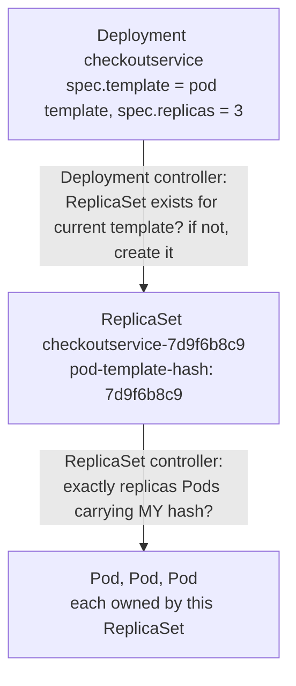
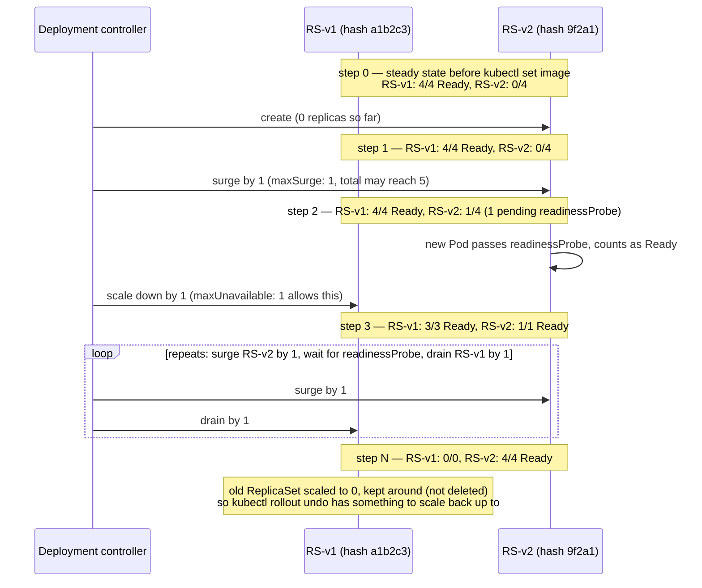
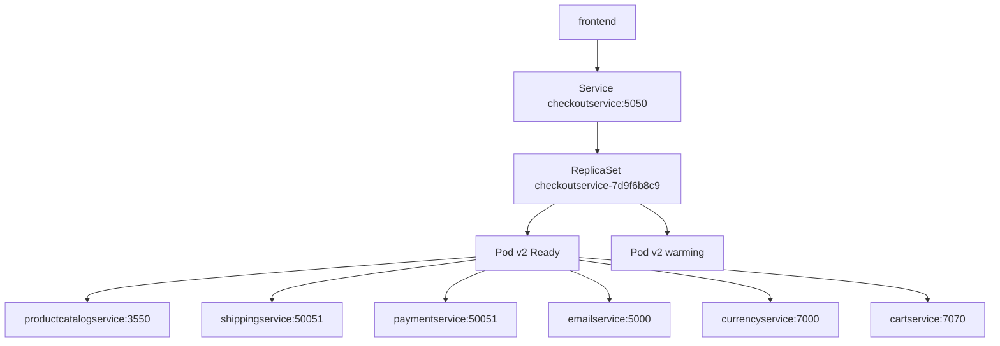

**TL;DR:** A ReplicaSet recreates crashed Pods. A Deployment swaps old Pods for new ones step by step, so capacity never hits zero.

> **In plain English (30 sec):** You already run 3 copies of your app and restart any copy that dies. ReplicaSet is that restart loop. Deployment is swapping copies one at a time with v2 — the rolling-restart script you never write.

**Real repo:** [`GoogleCloudPlatform/microservices-demo`](https://github.com/GoogleCloudPlatform/microservices-demo)

## 1. The Engineering Problem: Pods can't heal or update themselves

You already do this on your VM:

```bash
# run 3 copies, restart any that die — by hand
for i in 1 2 3; do node server.js --port 808$i & done
# 3am: one copy dies. You find out from the pager, SSH in, restart it.
```

Works until you sleep. Breaks in a cluster:

- **Nobody watches.** A Pod dies on a dead node. Nothing notices. Nothing recreates it.
- **Update = downtime.** Kill all v1 Pods, start v2 Pods. In between: zero copies serving.
- **Hand-rolling is risky.** Your replace-one-at-a-time script has one bug — now all capacity is gone.

You need one loop that keeps N copies alive, and a second loop that swaps the Pod template safely. That's ReplicaSet + Deployment.

---

## 2. The Technical Solution: two loops, stacked

A Deployment holds your Pod template and replica count. It creates one ReplicaSet per template version. The ReplicaSet counts Pods and recreates missing ones. The Deployment scales the new ReplicaSet up and the old one down, step by step.

Here's what happens:



**In simple words:** Deployment manages versions. ReplicaSet manages count. Pods just run.

The rollout, step by step — using this lesson's own `report-generator` numbers from section 3 (`replicas: 4`, `maxUnavailable: 1`, `maxSurge: 1`, so the loop keeps total Pods ≤ 5 and Ready Pods ≥ 3 at every step, never one jump from all-v1 to all-v2):



The pace of every step is gated by the readinessProbe on the *new* Pod — a slow-starting v2 container stalls the loop at whichever step it's on.

3 things to remember:

- **You never write a ReplicaSet by hand.** The Deployment creates it, names it with `pod-template-hash`, owns it. `kubectl get rs` is the fastest way to see the loop working.
- **The hash keeps generations apart.** Old ReplicaSet matches old-hash Pods only, new one matches new-hash only — that's how v1 and v2 Pods coexist mid-rollout without being claimed by the wrong controller.
- **Two knobs pace the rollout.** `maxUnavailable` and `maxSurge` both default to 25% when `strategy` is unset — an untuned Deployment can drop to 75% capacity during any routine update.

---

## 3. Concept in Isolation (the mechanism, no prod wiring)

4 replicas, swapping v1 to v2 with at most 1 extra Pod and 1 down at a time. The readinessProbe decides when a new Pod counts — it paces the whole rollout.

```yaml
apiVersion: apps/v1
kind: Deployment
metadata:
  name: report-generator
spec:
  replicas: 4
  selector:
    matchLabels:
      app: report-generator      # IMMUTABLE after create — API server rejects changes
  strategy:
    type: RollingUpdate
    rollingUpdate:
      maxUnavailable: 1          # never drop below 3 Ready Pods during a rollout
      maxSurge: 1                # never run more than 5 Pods at once
  template:
    metadata:
      labels:
        app: report-generator    # MUST match spec.selector above — ReplicaSet is built from this pair
    spec:
      containers:
      - name: app
        image: mycompany/report-app:v2
        readinessProbe:          # a NEW Pod counts as available only after this passes
          httpGet:
            path: /healthz
            port: 8080
```

**What this does:** 4 Pods run your app. Change the image, and Kubernetes adds 1 new Pod, waits for `/healthz`, removes 1 old Pod, repeats. Ready Pods never drop below 3.

---

## 4. Real Production Incident

**Incident: v2 rollout serves 40% 5xx for 18 minutes — readiness probe passed before the app was ready**

**T+0:** CI runs `kubectl set image deployment/checkoutservice server=checkoutservice:v2.14.0`. Rollout starts.

**T+2m:** New Pods start. The readinessProbe is a bare `tcpSocket` on 5050. The port opens in 2 seconds; the app needs 40 more seconds to warm its cache. The probe passes anyway.

**T+5m:** Deployment counts the new Pods Ready and scales the old ReplicaSet down. The Service now sends live traffic to cold Pods.

**T+8m:** Requests hitting warming Pods time out. 5xx rate climbs to 40%.

**T+20m:** `kubectl rollout undo` completes. Error rate back to zero.

**Impact:** 40% of checkout requests failed for ~18 minutes.

**Root cause** — the probe checked the port, not the app:

```yaml
readinessProbe:
  tcpSocket: { port: 5050 }   # port open ≠ app ready; warmup takes 40s
  periodSeconds: 5
```

**Fix** — probe what the app actually serves:

```yaml
readinessProbe:
  grpc: { port: 5050 }        # real health check, returns NOT_SERVING until warm
  periodSeconds: 5
minReadySeconds: 10             # extra buffer before a Pod counts toward the rollout
```

**Prevention:** fail the CI pipeline if `kubectl rollout status` stalls, and alert on 5xx rate while any rollout is active. Probe a real health endpoint, never a bare port.

---

## 5. Production Design — checkoutservice from microservices-demo

Real manifest from `GoogleCloudPlatform/microservices-demo` — checkoutservice, the fan-out hub of every checkout:



**Real config from prod** (verbatim, trimmed):

```yaml
apiVersion: apps/v1
kind: Deployment
metadata:
  name: checkoutservice
spec:
  # no replicas: field, no strategy: block — deliberately using defaults:
  # replicas: 1, RollingUpdate with maxUnavailable: 25%, maxSurge: 25%
  selector:
    matchLabels:
      app: checkoutservice        # frozen after create — ReplicaSet claims Pods by this
  template:
    metadata:
      labels:
        app: checkoutservice
    spec:
      containers:
        - name: server
          image: checkoutservice
          readinessProbe: { grpc: { port: 5050 } }  # gates rollout pace AND Service traffic
          livenessProbe:  { grpc: { port: 5050 } }
          env:                                   # six hardcoded dependency addresses
          - { name: PRODUCT_CATALOG_SERVICE_ADDR, value: "productcatalogservice:3550" }
          - { name: SHIPPING_SERVICE_ADDR,        value: "shippingservice:50051" }
          - { name: PAYMENT_SERVICE_ADDR,         value: "paymentservice:50051" }
          - { name: EMAIL_SERVICE_ADDR,           value: "emailservice:5000" }
          - { name: CURRENCY_SERVICE_ADDR,        value: "currencyservice:7000" }
          - { name: CART_SERVICE_ADDR,            value: "cartservice:7070" }
```

**3 takeaways:**

- **No `replicas:` means 1.** The one service that calls six others runs as a single point of failure — fine for a demo, the first thing you fix in a real fork (`replicas: 3` + a PodDisruptionBudget).
- **`spec.selector` is frozen.** Change it after create and the API server rejects the update — delete-and-recreate is the only way out, so selectors are chosen conservatively up front.
- **One probe, two jobs.** The same `grpc` readiness check paces the rollout *and* gates Service traffic — a slow Pod slows its own rollout automatically.

---

## 6. Cloud Lens — How GCP/AWS actually implements this

**GKE:**

```bash
# GKE — same kubectl, cluster credentials from gcloud
gcloud container clusters get-credentials my-cluster --region us-central1
kubectl rollout status deployment/checkoutservice --timeout=120s
```

**EKS:**

```bash
# EKS — identical flow
aws eks update-kubeconfig --name my-cluster --region us-east-1
kubectl rollout status deployment/checkoutservice --timeout=120s
```

**Terraform — the same Deployment with explicit knobs, plus a PDB so node upgrades can't stack with rollouts:**

```hcl
resource "kubernetes_deployment" "checkout" {
  metadata { name = "checkoutservice" }
  spec {
    replicas = 3
    selector { match_labels = { app = "checkoutservice" } }
    strategy {
      type = "RollingUpdate"
      rolling_update {
        max_surge       = 1
        max_unavailable = 0
      }
    }
    template {
      metadata { labels = { app = "checkoutservice" } }
      spec {
        container {
          name  = "server"
          image = "checkoutservice:v2.14.0"
        }
      }
    }
  }
}

resource "kubernetes_pod_disruption_budget_v1" "checkout" {
  metadata { name = "checkoutservice" }
  spec {
    min_available     = 2
    selector { match_labels = { app = "checkoutservice" } }
  }
}
```

**Difference:** On GCP, Pod IP is a free VPC IP; on AWS, Pod IP costs an ENI IP → "Insufficient free IPs."
```

**Difference:** a Deployment behaves identically on GKE and EKS. The node upgrade is the wildcard — pair every rollout with a PDB, or the cluster's upgrade and your rollout evict Pods at the same time.

---

## 7. Library Lens — Exact library + code you would use

Go with **client-go** (the same library kubectl is built on):

```go
// go.mod: k8s.io/client-go v0.30.0
import (
  appsv1 "k8s.io/api/apps/v1"
  corev1 "k8s.io/api/core/v1"
  metav1 "k8s.io/apimachinery/pkg/apis/meta/v1"
  "k8s.io/apimachinery/pkg/util/intstr"
)

one := intstr.FromInt32(1)
zero := intstr.FromInt32(0)
dep := &appsv1.Deployment{
  ObjectMeta: metav1.ObjectMeta{Name: "checkoutservice"},
  Spec: appsv1.DeploymentSpec{
    Replicas: ptr.To[int32](3),
    Selector: &metav1.LabelSelector{MatchLabels: map[string]string{"app": "checkoutservice"}},
    Strategy: appsv1.DeploymentStrategy{
      Type: appsv1.RollingUpdateDeploymentStrategyType,
      RollingUpdate: &appsv1.RollingUpdateDeployment{
        MaxSurge: &one, MaxUnavailable: &zero,
      },
    },
    Template: corev1.PodTemplateSpec{
      ObjectMeta: metav1.ObjectMeta{Labels: map[string]string{"app": "checkoutservice"}},
      // Spec: containers, probes — same fields as the YAML above
    },
  },
}
// clientset.AppsV1().Deployments("default").Create(ctx, dep, metav1.CreateOptions{})
```

Bash alternative — what most teams actually run:

```bash
kubectl set image deployment/checkoutservice server=checkoutservice:v2.14.0
kubectl rollout status deployment/checkoutservice    # blocks until done or fails
kubectl rollout history deployment/checkoutservice   # list revisions
kubectl rollout undo deployment/checkoutservice      # scale old ReplicaSet back up
```

---

## 8. What Breaks & How to Troubleshoot

**Break 1: New Pods stuck in ImagePullBackOff mid-rollout**
- Symptom: `rollout status` hangs; new ReplicaSet's Pods show `ImagePullBackOff`
- Why: bad image tag, or the node can't pull (missing registry credentials)
- Detect: `kubectl describe pod -l app=checkoutservice` → Events show `Failed to pull image`
- Fix: correct the tag, or `kubectl rollout undo` — old Pods kept serving because `maxUnavailable` protected them

**Break 2: ProgressDeadlineExceeded — the rollout gives up**
- Symptom: `kubectl rollout status` exits with `deadline exceeded`
- Why: new Pods never pass readiness (crash loop, bad config, starved CPU). Default deadline: 600s
- Detect: `kubectl describe deployment checkoutservice` → `Progressing=False`, reason `ProgressDeadlineExceeded`
- Fix: fix why Pods go unready, then re-apply or `kubectl rollout undo`

**Break 3: 5xx spike during every deploy**
- Symptom: error rate tracks every rollout window, then settles
- Why: no readinessProbe, or a probe that passes before the app warms up
- Detect: `kubectl get endpoints checkoutservice` — endpoints contain Pods that started seconds ago
- Fix: real readiness probe on the health endpoint + `minReadySeconds`

**Break 4: apply fails with "field is immutable"**
- Symptom: `kubectl apply` rejected: `spec.selector: Invalid value: field is immutable`
- Why: someone edited `matchLabels` on a live Deployment
- Detect: the apply error itself
- Fix: restore the original selector, or delete and recreate the Deployment (downtime — plan it)

**Break 5: Rollback "worked" but errors continue**
- Symptom: Pods run the old image again, requests still failing
- Why: `rollout undo` reverts only the Pod template — the bad ConfigMap or Secret change stays live
- Detect: `kubectl rollout history` shows the old revision running; `kubectl get configmap -o yaml` still shows the new values
- Fix: revert the ConfigMap/Secret separately — config is not versioned with the Deployment

---

## Source

- **Concept:** Kubernetes `Deployment` and `ReplicaSet` — declarative scaling and rolling updates
- **Domain:** kubernetes
- **Repo:** [GoogleCloudPlatform/microservices-demo](https://github.com/GoogleCloudPlatform/microservices-demo) → [`kubernetes-manifests/checkoutservice.yaml`](https://github.com/GoogleCloudPlatform/microservices-demo/blob/main/kubernetes-manifests/checkoutservice.yaml) — Google's "Online Boutique," an 11-microservice reference app
