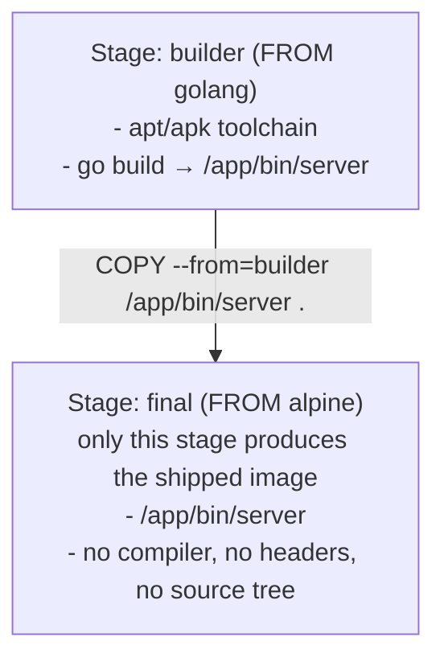
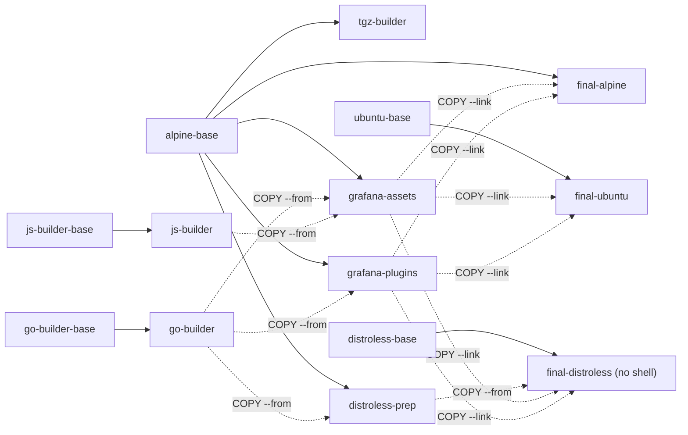

**TL;DR:** Why does your production image ship a full Go toolchain to run one binary? Multi-stage builds let a single Dockerfile declare multiple `FROM` stages, each with its own isolated filesystem, so only the final stage — typically just the compiled binary pulled in via `COPY --from=<stage>` — actually ships, leaving the compiler, headers, and source tree behind in an earlier, discarded stage.

> **In plain English (30 sec):** Code you already write — Map, function, API call, just bigger.

**Real repo:** [`grafana/grafana`](https://github.com/grafana/grafana)

## 1. The Engineering Problem: the build toolchain becomes part of the artifact

A single-stage Dockerfile that compiles code has to install everything the compiler needs: `gcc`, `make`, the Go or Node or JDK toolchain, header files, dev packages. All of that gets baked into the same layers as your application — because in a single `FROM ... RUN build ...` stage there's only one filesystem, and it accumulates everything you ever ran a command in.

Before multi-stage builds existed, teams worked around this with a "builder pattern" implemented by hand: build the artifact in one container, `docker cp` the binary out to the host, then `docker build` a *second*, separate Dockerfile that just `COPY`s that binary in. It worked, but it meant two Dockerfiles, a host-side script gluing them together, and a build that wasn't reproducible from `git clone` + one command anymore.

The cost isn't hypothetical: a compiler toolchain and dev headers routinely add hundreds of megabytes over the actual binary, and every one of those packages is attack surface and CVE exposure sitting in your production image for no runtime benefit.

---

## 2. The Technical Solution: multiple `FROM` instructions, one Dockerfile

Multi-stage builds let a single Dockerfile declare more than one `FROM`. Each `FROM` starts a brand-new build stage with its own base image and its own layer cache — nothing carries over from a previous stage automatically. The only way to pull something from an earlier stage into a later one is an explicit `COPY --from=<stage>`.



`docker build` with no `--target` builds every stage needed to produce the LAST one, and discards intermediate stages' layers from the final image — they stay cached on disk for reuse, but aren't part of the image you ship.

Three things to hold onto:

1. **Only the final stage ships.** Every earlier stage is a scratchpad — its filesystem exists only for `COPY --from` to reach into. Nothing from `builder` ends up in your image unless a later stage explicitly copies it.
2. **`--target` lets one Dockerfile produce multiple images.** `docker build --target=builder .` stops at that stage and ships *it* — handy for a debug image with the full toolchain still attached, built from the exact same file as your slim production image.
3. **BuildKit builds only what the requested target needs**, and runs independent stages in parallel when they don't depend on each other — a second reason (beyond image size) multi-stage builds are faster in practice than the old two-Dockerfile workaround, not slower.

---

## 3. The clean Dockerfile (the concept in isolation)

```dockerfile
# syntax=docker/dockerfile:1.7

FROM golang:1.22-alpine AS builder     # Stage 1: has the full Go toolchain -- never shipped
WORKDIR /src
COPY go.mod go.sum ./
RUN go mod download
COPY . .
RUN CGO_ENABLED=0 go build -o /out/server .   # static binary -- no libc dependency to carry forward

FROM alpine:3.20 AS final              # Stage 2: fresh base, toolchain NOT inherited
RUN adduser -D -u 10001 appuser        # non-root user, created directly in the slim final stage
COPY --from=builder /out/server /usr/local/bin/server   # only the compiled artifact crosses the stage boundary
USER appuser
ENTRYPOINT ["/usr/local/bin/server"]
```

`builder`'s 300+ MB of Go toolchain, module cache, and source tree never touch the final image — `alpine:3.20` plus one ~10 MB static binary does. Rerunning `docker build` after a source change reuses `go mod download`'s cached layer in `builder` (dependencies didn't change) and only reruns `go build` and the final `COPY` — the same layer-caching rules from the Dockerfile lesson apply *within* each stage independently.

---

## 4. Production reality: six images from one Dockerfile

Grafana's actual production `Dockerfile` takes this idea much further than a two-stage build: one file, ten named stages, shared and recombined, producing **three different final variants** (alpine, ubuntu, distroless) — selected at build time with `--target`. It's ~400 lines in full (linked below); here's the stage graph, then the specific lines the annotations below actually reference — trimmed per this domain's code-block discipline (real multi-stage Dockerfiles run long; keep what has operational consequences, elide the repeated boilerplate).

**Macro view — the ten-stage graph** (base images and JS/Go builders feed three shared "assets" stages, which every final variant copies from):



`--target=final-alpine|final-ubuntu|final-distroless` selects which one ships.

```dockerfile
# syntax=docker/dockerfile:1.7-labs
ARG GO_IMAGE=go-builder-base
ARG JS_IMAGE=js-builder-base
ARG GO_SRC=go-builder      # redirectable: CI can pass --build-arg GO_SRC=tgz-builder
ARG JS_SRC=js-builder      # to build final images from a release tarball instead

# Dependabot cannot update dependencies listed in ARGs — bare FROM lines exist
# purely so Dependabot has a literal `FROM <image>:<tag>` line to bump.
FROM alpine:3.24.1 AS alpine-base
FROM ubuntu:24.04 AS ubuntu-base
FROM golang:1.26.5-alpine AS go-builder-base
FROM gcr.io/distroless/static-debian13 AS distroless-base

# ... js-builder and go-builder stages elided: ordinary yarn/go build steps,
# already covered by the clean example's builder stage above ...

# helpers for COPY --from — redirected via the ARGs declared at the top
FROM ${GO_SRC} AS go-src
FROM ${JS_SRC} AS js-src

# Shared by ALL THREE final variants via COPY --link — kept SLIM-agnostic so
# this stage's layer hash is identical regardless of which target is built.
FROM alpine-base AS grafana-assets
COPY --from=go-src /tmp/grafana/bin/grafana* /tmp/grafana/bin/*/grafana* ./bin/
COPY --from=js-src /tmp/grafana/public ./public

# ... grafana-plugins stage elided: same COPY --from=go-src pattern, for
# bundled plugins instead of the binary/frontend ...

# Alpine has no shell — distroless-prep synthesizes /etc/passwd, /etc/group,
# and grafana's config here, to be COPIED into the distroless stage below.
FROM alpine-base AS distroless-prep
# ... directory/user setup elided ...
RUN printf 'root:x:0:0:root:/root:/sbin/nologin\n...grafana:x:%s:%s:...' \
      "$GF_UID" "$GF_GID" > /tmp/distroless-passwd

FROM alpine-base AS final-alpine
# ... apk install, glibc-compat shim, user setup elided (Alpine-specific) ...
COPY --link --from=grafana-assets /usr/share/grafana /usr/share/grafana
COPY --link --from=grafana-plugins /usr/share/grafana/data /usr/share/grafana/data
USER "$GF_UID"
ENTRYPOINT [ "/run.sh" ]

# use --target=final-ubuntu to select this variant
FROM ubuntu-base AS final-ubuntu
# ... apt-get install instead of apk; otherwise the same shape as final-alpine ...

# use --target=final-distroless to select this variant: no shell, no package
# manager — everything is COPY'd in pre-built rather than installed here.
FROM distroless-base AS final-distroless
COPY --from=distroless-prep /tmp/distroless-passwd /etc/passwd
COPY --from=distroless-prep /tmp/distroless-group /etc/group
COPY --link --from=grafana-assets /usr/share/grafana /usr/share/grafana
COPY --link --from=grafana-plugins /usr/share/grafana/data /usr/share/grafana/data
USER $GF_UID
ENTRYPOINT ["/usr/share/grafana/bin/grafana", "server", "--homepath=/usr/share/grafana", "--config=/etc/grafana/grafana.ini", "--packaging=docker"]
CMD ["cfg:default.log.mode=console"]

# Default stage — no AS, and no --target at build time, means Alpine ships.
FROM final-alpine
```

**What this teaches that a hello-world can't:**

- **`FROM alpine:3.24.1 AS alpine-base` / `FROM golang:1.26.5-alpine AS go-builder-base` etc. as bare, unused-looking `FROM` lines** exist purely so Dependabot has a `FROM <image>:<tag>` line to bump — a base image referenced only through `ARG GO_IMAGE=go-builder-base` can't be tracked by dependency bots that scan for literal `FROM` statements. This is a real-world workaround for tooling limitations, not something a toy example would ever surface.
- **`FROM ${GO_SRC} AS go-src`** where `GO_SRC` defaults to `go-builder` (the actual compile stage) shows stages can be *redirected* via build arg — CI can override `--build-arg GO_SRC=tgz-builder` to build the final images from a pre-built release tarball (`tgz-builder`) instead of compiling from source, from the *same* Dockerfile.
- **`grafana-assets` and `grafana-plugins` are shared stages**, each `COPY --from`'d by all three `final-*` stages. This is the payoff of naming stages: shared build work happens once and is reused across every variant, rather than every final stage repeating the same `COPY --from=go-src`/`js-src` logic and losing cache coherence.
- **`COPY --link`** decouples a copy from the layers below it in the build graph, letting BuildKit skip re-executing earlier instructions in that stage purely because a copied-from stage changed — a cache optimization on top of ordinary layer caching, most valuable exactly in a multi-stage graph this wide.
- **Three genuinely different final bases** (`alpine-base`, `ubuntu-base`, `distroless-base`) selected by `--target=final-alpine|final-ubuntu|final-distroless` are three real trade-offs: Alpine (smallest, musl libc, has a shell), Ubuntu (glibc compatibility, larger), distroless (no shell, no package manager — smallest attack surface, but the comment block explains real feature loss: no `GF_*__FILE` secret expansion, no AWS credential generation, because those depend on `run.sh`, and distroless has no shell to run `run.sh` in).
- **Non-root `USER "$GF_UID"`** is set in every final stage, using a numeric UID (`472`) rather than a username — deliberate, because the distroless stage has no `/etc/passwd` entry for `grafana` until `distroless-prep` synthesizes one and it's copied in (`COPY --from=distroless-prep /tmp/distroless-passwd /etc/passwd`); a numeric UID works even without a name resolving.
- **No `HEALTHCHECK` instruction appears anywhere in this file** — worth calling out explicitly since it's a reasonable assumption for a production image to make. Health signaling for Grafana in practice comes from the orchestrator (Kubernetes liveness/readiness probes hitting `/api/health`) rather than a baked-in `HEALTHCHECK`, which is itself a real, current design choice worth knowing: `HEALTHCHECK` and orchestrator-level probes are alternatives, not requirements that stack.
- **`FROM final-alpine`** with no `AS` at the very end is what makes Alpine the *default* image when you `docker build .` without `--target` — the last stage in the file wins when none is specified.

---

## Source

- **Concept:** Multi-stage Dockerfile builds — shared stages, `--target` variant selection, `COPY --from`
- **Domain:** docker
- **Repo:** [grafana/grafana](https://github.com/grafana/grafana) → [`Dockerfile`](https://github.com/grafana/grafana/blob/main/Dockerfile) — Grafana's production multi-variant (Alpine/Ubuntu/distroless) build definition


