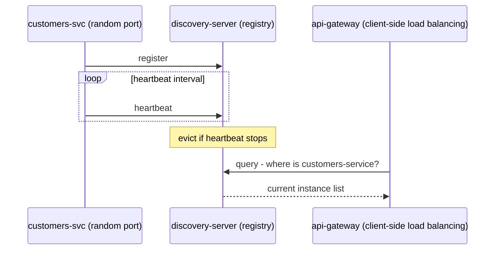
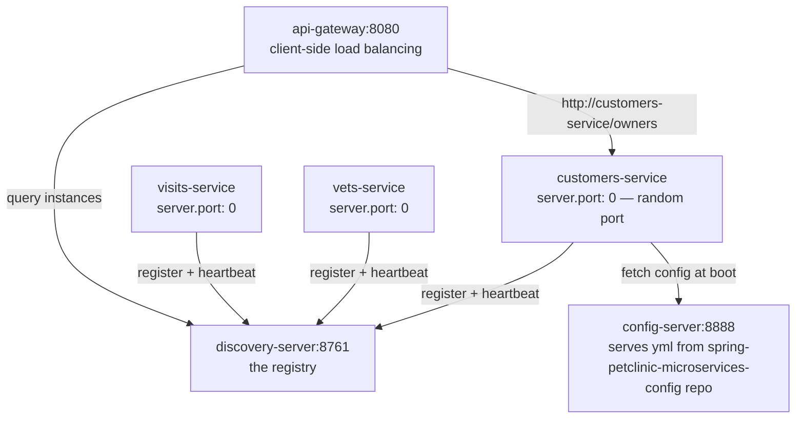

**TL;DR:** Instances get new IPs on every restart. A registry tracks who is alive right now, and callers ask it instead of reading a config file.

> **In plain English (30 sec):** Like a shared `Map<String, List<Address>>` that updates itself. Each service PUTs its own address on startup and refreshes it every 30s. Callers GET the list. Nothing hardcodes an IP.

**Real repo:** [`spring-petclinic/spring-petclinic-microservices`](https://github.com/spring-petclinic/spring-petclinic-microservices), [`spring-petclinic/spring-petclinic-microservices-config`](https://github.com/spring-petclinic/spring-petclinic-microservices-config)

## 1. The Engineering Problem

You already hardcode addresses on your laptop:

```yaml
# application.yml — works fine... today
customers-service: http://localhost:8081
```

Breaks the moment anything moves:

- **Restart = new address.** The instance comes back on a new IP or port. Your config file is now wrong.
- **Random port by design.** PetClinic sets `server.port: 0` — the OS picks a free port every boot. There is no fixed address to write down at all.
- **Three copies, which one?** Autoscaling adds two more instances. One hardcoded address can't spread load.

The real question: who tracks which instances are alive *right now*, and how does a caller ask at request time, not deploy time?

---

## 2. The Technical Solution: a live registry, not a static list

A **service registry** is a heartbeat protocol. Every instance registers on startup and re-announces "I'm still here" on an interval. Callers ask the registry for the current instance list. Stop heartbeating, and the registry evicts you.

Here's what happens:



**In simple words:** Services phone home every 30 seconds. Callers ask the registry, not a config file.

3 things to remember:

- **Registration is a lease, not a one-time event.** Miss enough heartbeats and you're evicted — discovery is a liveness protocol, not a lookup table someone edits.
- **Client-side vs platform-side is a fork.** Eureka puts the instance list inside the *caller's* process (client-side balancing). Kubernetes Services + DNS put it in the platform — the caller just resolves one stable name.
- **The registry can't discover itself.** It's the one component that needs a fixed, well-known address (`discovery-server:8761`) — everything else finds *it*.

**Stale fact worth correcting:** every tutorial reaches for Netflix Eureka, and it's still maintained — but on Kubernetes you usually don't run a registry at all. A `Service` plus CoreDNS gives you registration (kubelet reports readiness) and discovery (a stable DNS name) for free. Eureka earns its cost on bare VMs, or when you specifically want the balancing decision client-side.

---

## 3. Concept in Isolation (the mechanism, no prod wiring)

Two pieces: one app declares itself the registry, every other app points at it and announces its own name.

```yaml
# discovery-server application.yml — the registry itself, on Eureka's port
spring:
  application:
    name: discovery-server
server:
  port: 8761
```

```java
// DiscoveryServerApplication.java — one annotation turns a Boot app into a registry
@SpringBootApplication
@EnableEurekaServer
public class DiscoveryServerApplication {
    public static void main(String[] args) {
        SpringApplication.run(DiscoveryServerApplication.class, args);
    }
}
```

```yaml
# any-service application.yml — the client side: register with the registry above
spring:
  application:
    name: any-service
eureka:
  client:
    serviceUrl:
      defaultZone: http://discovery-server:8761/eureka/
```

**What this does:** `any-service` boots, POSTs its name + address to the registry, renews every 30s. Callers fetch `any-service`'s current address list from the same URL.

---

## 4. Real Production Incident

**Incident: gateway routes to dead instances for 12 minutes — 33% of requests 503**

**T+0:** A spot-node reclaim hard-kills 2 of 3 `customers-service` pods. No SIGTERM, no deregistration.

**T+2m:** Eureka still lists all 3 instances. Leases expire only after ~90s, and self-preservation mode (renewals dipped below threshold) has stopped evictions entirely.

**T+5m:** api-gateway's client-side balancer round-robins across the stale list. Every third request goes to a dead IP.

**T+12m:** Replacement pods register, gateway's cache refreshes, errors drain.

**Impact:** 33% of `/customers/**` requests returned 503 for ~12 minutes.

**Root cause** — defaults that assume graceful shutdowns:

```yaml
eureka:
  server:
    enableSelfPreservation: true      # stops ALL eviction when renewals dip — dead entries stay
  instance:
    leaseRenewalIntervalInSeconds: 30 # dead instance discoverable for up to ~90s
```

**Fix** — deregister on shutdown, expire faster, check real health:

```yaml
server:
  shutdown: graceful                  # SIGTERM now triggers a DELETE from the registry
eureka:
  instance:
    leaseRenewalIntervalInSeconds: 10
    health-check-url-path: /actuator/health
  client:
    healthcheck:
      enabled: true                   # registry reflects /actuator/health, not just process-alive
```

**Prevention:** alert when registry instance count ≠ actual pod count (`kubectl get pods -l app=customers-service` vs Eureka's list), and turn on gateway retries so one dead hop moves to the next instance instead of failing.

---

## 5. Production Design — spring-petclinic-microservices

Real wiring from `spring-petclinic/spring-petclinic-microservices` — every service boots through the config server, then registers:



**Real config from prod** (from the config repo, shared by every service):

```yaml
# spring-petclinic-microservices-config/application.yml — applies to ALL services
server:
  port: 0            # random free port — why a fixed address can't be hardcoded
  shutdown: graceful

eureka:
  instance:
    prefer-ip-address: true  # register IP, not hostname — hostname resolution breaks on Docker/Windows
```

```yaml
# customers-service.yml — docker profile
eureka:
  instance:
    instance-id: ${spring.application.name}:${random.uuid}  # unique ID per instance, so
  client:                                                   # N copies on random ports coexist
    serviceUrl:
      defaultZone: http://discovery-server:8761/eureka/
server:
  port: 8081         # fixed port only inside the docker profile
```

**3 takeaways:**

- **`@EnableEurekaServer` is almost the whole app.** The heartbeat map, eviction timers, and lease renewal all live inside the `spring-cloud-starter-netflix-eureka-server` dependency — PetClinic's own code is one annotation and a `main()`.
- **`server.port: 0` + `instance-id: ...:${random.uuid}` work as a pair.** Eureka needs unique instance IDs, not unique ports — that's how 3 copies of customers-service share a host on random ports and stay individually addressable.
- **Discovery config is itself externalized.** The registry URL lives in a separate git repo served by the config server — you can repoint every service to a new registry without rebuilding any of them.

---

## 6. Cloud Lens — How GCP/AWS actually implements this

On Kubernetes (GKE/EKS/AKS) you delete Eureka entirely. A `Service` object + cluster DNS is the registry: kubelet reports readiness (registration), CoreDNS resolves a stable name to healthy Pod IPs (discovery). The difference that matters: Eureka is **client-side** — the caller picks an instance. Kubernetes is **platform-side** — the caller dials one virtual IP and the platform picks the Pod.

```bash
# GKE — registration + discovery for free, no Eureka to run
gcloud container clusters get-credentials petclinic --zone us-central1-a
kubectl get svc customers-service        # one stable ClusterIP + DNS name
kubectl get endpoints customers-service  # the live instance list — Eureka's job, built in

# AWS without Kubernetes — Cloud Map is the managed registry
aws servicediscovery discover-instances --namespace-name internal --service-name customers-service
```

Terraform — Cloud Map as the registry for ECS services:

```hcl
resource "aws_service_discovery_private_dns_namespace" "internal" {
  name = "internal"
  vpc  = module.vpc.vpc_id
}

resource "aws_service_discovery_service" "customers" {
  name = "customers-service"
  dns_config {
    namespace_id = aws_service_discovery_private_dns_namespace.internal.id
    dns_records {
      ttl  = 10
      type = "A"
    }
    routing_policy = "MULTIVALUE"
  }
}
```

**Difference:** Eureka's 90-second stale-instance problem (section 4) mostly disappears on Kubernetes — a Pod is removed from endpoints the moment its readiness fails, not when a lease expires. You trade a registry you operate for a platform feature you configure.

---

## 7. Library Lens — Exact library + code you would use

Spring Cloud Eureka client, current release line:

```xml
<!-- pom.xml — Spring Cloud 2023.0.x -->
<dependency>
  <groupId>org.springframework.cloud</groupId>
  <artifactId>spring-cloud-starter-netflix-eureka-client</artifactId>
  <version>4.1.0</version>
</dependency>
```

```java
// Caller side — @LoadBalanced makes "http://customers-service" resolve through the registry
@Configuration
class RestConfig {
    @Bean
    @LoadBalanced
    RestTemplate restTemplate(RestTemplateBuilder builder) {
        return builder.build();
    }
}

@Service
class OwnerClient {
    private final RestTemplate rest;
    OwnerClient(RestTemplate rest) { this.rest = rest; }

    OwnerDto getOwner(long id) {
        // no IP, no port — the registry resolves the name, the balancer picks an instance
        return rest.getForObject("http://customers-service/owners/" + id, OwnerDto.class);
    }
}
```

Bash alternative — inspect the registry directly:

```bash
curl http://localhost:8761/eureka/apps/customers-service   # live instance list (XML)
curl -s http://discovery-server:8761/eureka/apps -H 'Accept: application/json' | jq
```

---

## 8. What Breaks & How to Troubleshoot

**Break 1: Service registers with a hostname nobody can resolve**
- Symptom: callers get `UnknownHostException` or connection timeouts to a Docker container name
- Why: Eureka's default registers the hostname; hostname resolution breaks in Docker/Windows setups
- Detect: `curl http://localhost:8761/eureka/apps/customers-service` → `hostName` is a container ID, `ipAddr` unused
- Fix: `eureka.instance.prefer-ip-address: true` — PetClinic carries this exact fix with a comment naming the failure

**Break 2: Dead instance keeps receiving traffic after a hard kill**
- Symptom: 503s for ~90s after a node dies or a pod is `kill -9`'d
- Why: the registry only evicts after missed lease renewals; hard kills skip deregistration
- Detect: registry lists the instance while `curl http://<ip>:<port>/actuator/health` fails
- Fix: `server.shutdown: graceful`, shorter `leaseRenewalIntervalInSeconds`, gateway retries

**Break 3: "Connection refused: discovery-server" at boot**
- Symptom: every service crashes on startup with connection refused to `discovery-server:8761`
- Why: services booted before the registry was up, or the Config Server (which holds `defaultZone`) is down
- Detect: service logs show `Cannot execute request on any known server`
- Fix: start config-server → discovery-server → everything else; add retry/backoff (`eureka.client.register-with-eureka` retries by default)

**Break 4: Two instances, one registry entry**
- Symptom: you run 2 copies of customers-service, the registry shows 1
- Why: identical `instance-id` — the second registration overwrites the first
- Detect: `kubectl get pods` says 2, `/eureka/apps/customers-service` says 1
- Fix: `instance-id: ${spring.application.name}:${random.uuid}` — PetClinic's exact pattern

**Break 5: Self-preservation freezes the whole registry**
- Symptom: dashboard warns `EMERGENCY! EUREKA MAY BE INCORRECTLY CLAIMING INSTANCES ARE UP WHEN THEY'RE NOT` — no instance is ever evicted
- Why: a network blip dropped renewals below 85%, so the server stopped evicting to protect possibly-alive instances
- Detect: the banner on `http://discovery-server:8761`, and instance counts that never shrink
- Fix: alert on registry-count vs pod-count drift; on small clusters consider `enableSelfPreservation: false` and shorter leases

---

## Source

- **Concept:** Service discovery
- **Domain:** microservices
- **Repo:** [spring-petclinic/spring-petclinic-microservices](https://github.com/spring-petclinic/spring-petclinic-microservices) → [`spring-petclinic-discovery-server/src/main/java/org/springframework/samples/petclinic/discovery/DiscoveryServerApplication.java`](https://github.com/spring-petclinic/spring-petclinic-microservices/blob/main/spring-petclinic-discovery-server/src/main/java/org/springframework/samples/petclinic/discovery/DiscoveryServerApplication.java) and [spring-petclinic/spring-petclinic-microservices-config](https://github.com/spring-petclinic/spring-petclinic-microservices-config) → [`application.yml`](https://github.com/spring-petclinic/spring-petclinic-microservices-config/blob/main/application.yml), [`customers-service.yml`](https://github.com/spring-petclinic/spring-petclinic-microservices-config/blob/main/customers-service.yml) — Spring Cloud reference microservices architecture
