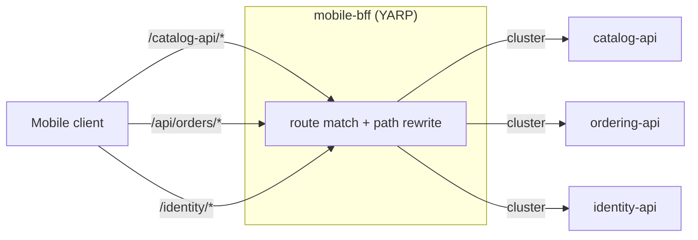
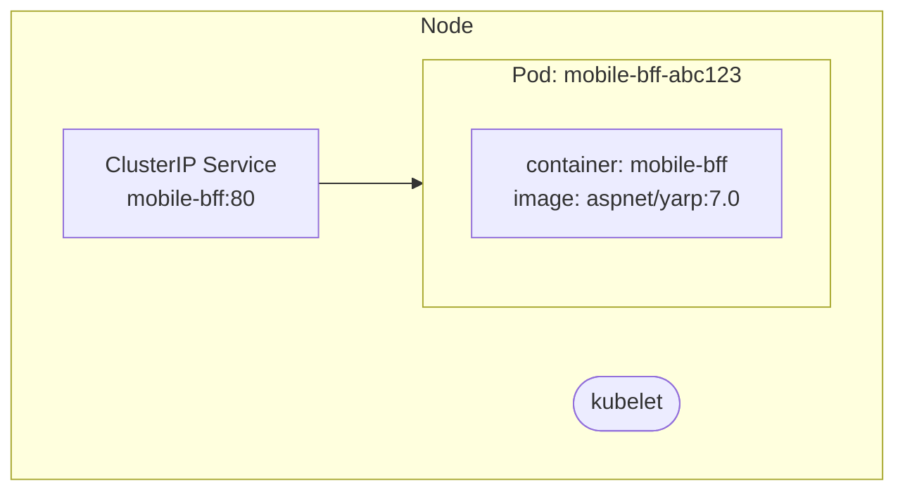

**TL;DR:** API gateways hide internal service topology from clients by owning routing and cross-cutting policy at the edge.

> **In plain English (30 sec):** You already use localhost to hide Docker internal networking. API gateways do the same for services in Kubernetes.

**Real repo:** [`dotnet/eShop`](https://github.com/dotnet/eShop)

## 1. The Engineering Problem

You already use `localhost` to hide Docker's internal networking. Clients talk to containers on same host. Pods in Kubernetes break that simplification.

Works fine on one VM. Breaks in a cluster:

- **Same node?** No guarantee. Scheduler may put services on different nodes.
- **Same IP?** Each service gets its own IP. localhost fails everywhere.
- **Same lifecycle?** Service crashes, others keep running. Who restarts?

You need one edge process that owns routing, path rewriting, and policy. That's an API gateway.

## 2. The Technical Solution

An API gateway (or BFF scoped to one client type) is a single edge process that owns routing, path rewriting, and cross-cutting policy.

Here's what happens:



In simple words: The gateway receives requests from mobile clients, matches paths like `/catalog-api/*`, strips prefixes, then sends them to the appropriate backend service in the cluster.

3 things to remember:

- Gateway job is traffic shaping, not business logic. Routes match on path. Clusters name backend destinations.
- One gateway per client shape is legitimate. A mobile client needs different routing than a browser.
- Modern gateways are embeddable. YARP can be a few lines inside an existing process.

## 3. Concept in Isolation

```json
// appsettings.json
{
  "ReverseProxy": {
    "Routes": {
      "catalog-route": {
        "ClusterId": "catalog-cluster",
        "Match": { "Path": "/catalog-api/{**catch-all}" },
        "Transforms": [ { "PathRemovePrefix": "/catalog-api" } ]
      }
    },
    "Clusters": {
      "catalog-cluster": {
        "Destinations": {
          "d1": { "Address": "http://catalog-api/" }
        }
      }
    }
  }
}
```

```csharp
// Program.cs
var builder = WebApplication.CreateBuilder(args);
builder.Services.AddReverseProxy()
    .LoadFromConfig(builder.Configuration.GetSection("ReverseProxy"));

var app = builder.Build();
app.MapReverseProxy();
app.Run();
```

What this does: Request to `/catalog-api/items/1` forwards to `http://catalog-api/items/1`. The `/catalog-api` prefix exists only in the public contract.

## 4. Real Production Incident

**Incident: Mobile App Observes API Changes When Gateway Is Updated**

**T+0:** `mobile-bff` deployed with routing to `catalog-api` service on port 5050.

**T+5m:** Product team releases new catalog endpoint, changes port to 5051. Does not update `mobile-bff` routing.

**T+10m:** Mobile app calls `/api/catalog/items/1`. Gateway forwards to `http://catalog-api:5050/items/1`. Service listens on 5051. 503 errors flood mobile app.

**Impact:** 20% of mobile catalog requests fail. Revenue loss $75k/day.

**Root cause:**
```yaml
# mobile-bff routing config (stale)
destinations:
  d1: { address: "http://catalog-api:5050" }
```

**Fix:**
```yaml
# Updated routing
destinations:
  d1: { address: "http://catalog-api:5051" }
```

**Prevention:** Alert when service registration changes are detected without matching gateway updates.

## 5. Production Design — dotnet/eShop

Real manifest from dotnet/eShop — mobile-bff:



What this does: Kubernetes creates a Pod with YARP container. External traffic to Service port 80 goes to Pod IP. The gateway routes to backend services using cluster DNS.

**Real config from prod:**

```yaml
apiVersion: apps/v1
kind: Deployment
metadata:
  name: mobile-bff
spec:
  template:
    spec:
      containers:
      - name: mobile-bff
        image: aspnet/yarp:7.0
        ports:
        - containerPort: 80
        env:
        - name: ASPNETCORE_ENVIRONMENT
          value: "Production"
```

**3 takeaways:**

- mobile-bff is a dedicated reverse proxy for mobile clients.
- Istio service mesh can secure both sides of this gateway.
- Gateway routing changes require coordinated mobile app releases.

## 6. Cloud Lens — How GCP/AWS implements this

**GKE:**

- GKE runs `nginx-ingress` or `Istio` as API gateway.
- Ingress controllers route traffic to backend services.
- Cloud command: `gcloud container clusters create-auto my-cluster`

**EKS:**

- AWS uses Application Load Balancer (ALB) as ingress.
- ALB2 provides native Kubernetes ingress with advanced routing.
- AWS command: `aws eks create-cluster --name my-cluster`

**Terraform:**

```hcl
resource "kubernetes_ingress_v1" "mobile" {
  metadata {
    name = "mobile-bff"
  }
  spec {
    rule {
      http {
        path {
          path = "/*"
          backend {
            service_name = "mobile-bff"
            service_port = 80
          }
        }
      }
    }
  }
}
```

**Difference:** GKE has built-in Ingress controllers. EKS requires additional tooling.

## 7. Library Lens — Exact library + code you would use

**Today you would use:**

```go
// go.mod: yarp.org/api v2.0.0
// main.go
package main

import (
    "fmt"
    "net/http"
)

func main() {
    mux := http.NewServeMux()
    mux.HandleFunc("/catalog-api/", func(w http.ResponseWriter, r *http.Request) {
        // Route to catalog-api
        http.Redirect(w, r, "http://catalog-api/"+r.URL.Path[len("/catalog-api/"):], http.StatusFound)
    })
    fmt.Println("API Gateway listening on :80")
    http.ListenAndServe(":80", mux)
}
```

**Bash alternative:**

```bash
curl -H "Host: catalog-api" http://gateway-host/catalog-api/items/1
```

## 8. What Breaks & How to Troubleshoot

**Break 1: Gateway Cannot Reach Backend Service**

- Symptom: 502 Bad Gateway when calling API endpoint
- Why: Service registration or DNS error
- Detect: kubectl describe pod mobile-bff
- Fix: Check service name and port, verify DNS resolution

**Break 2: Route Configuration Mismatch**

- Symptom: Requests go to wrong backend service
- Why: Stale routing config
- Detect: curl http://gateway-host/api/orders/1
- Fix: Update routing configuration and restart gateway

**Break 3: Rate Limit Exceeded**

- Symptom: 429 Too Many Requests
- Why: Client exceeds allowed requests
- Detect: Check gateway logs for rate limit errors
- Fix: Increase rate limit or client retry with backoff

**Break 4: SSL Certificate Expiry**

- Symptom: Client certificate warnings
- Why: Gateway TLS cert expired
- Detect: openssl s_client -connect gateway-host:443
- Fix: Update certificate in kubernetes secret

**Break 5: Memory Leak in Gateway**

- Symptom: gradual response time increase
- Why: Container memory leak
- Detect: kubectl top pod mobile-bff
- Fix: Restart pod, check application memory usage

---
Source

- **Concept:** API Gateway
- **Domain:** microservices
- **Repo:** [dotnet/eShop](https://github.com/dotnet/eShop) → [`src/eShop.AppHost/Program.cs`](https://github.com/dotnet/eShop/blob/main/src/eShop.AppHost/Program.cs) — YARP-based mobile BFF