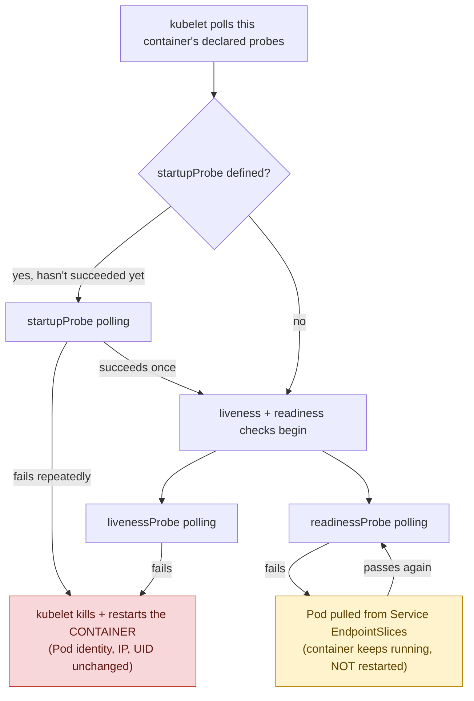
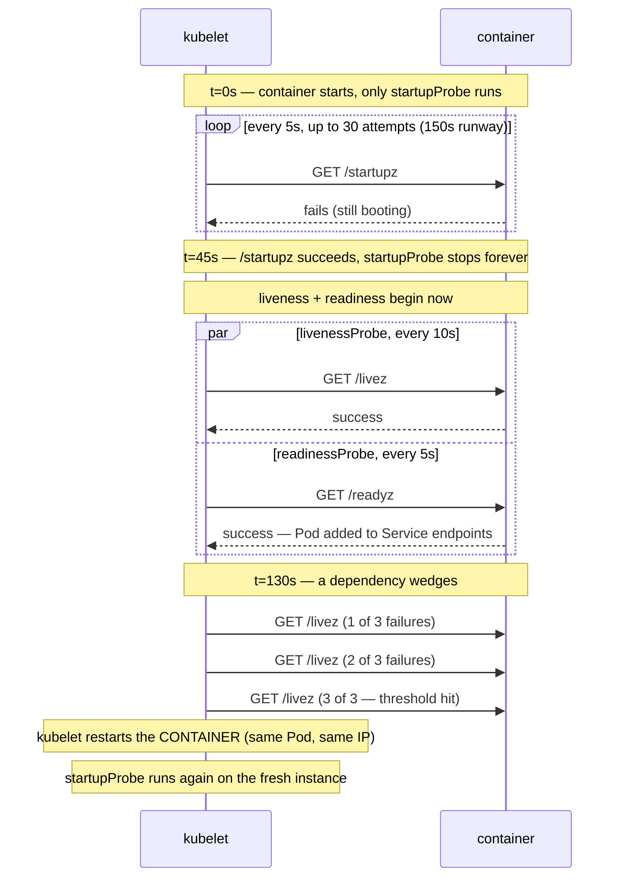
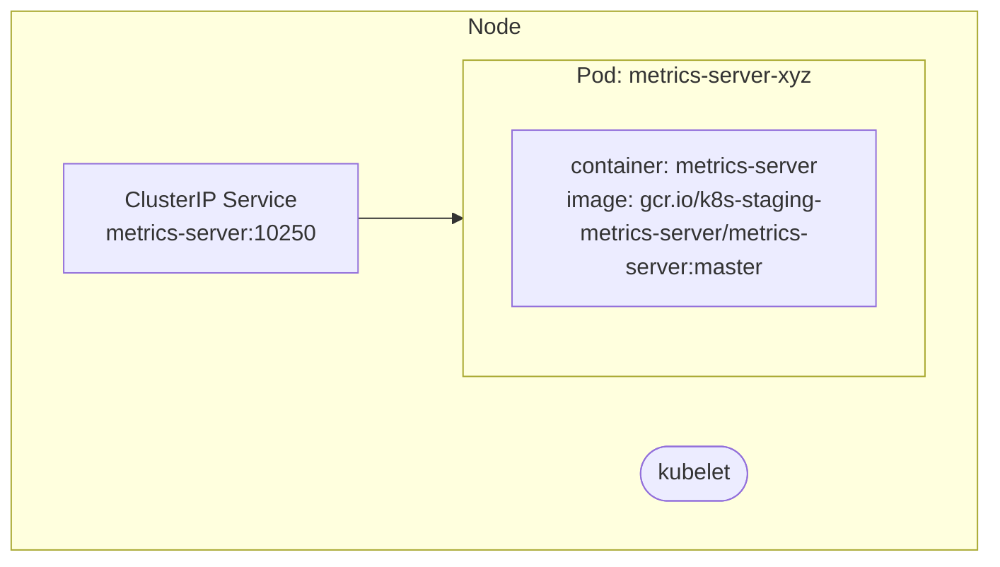

**TL;DR:** Kubernetes uses three separate probes to know if a container is working — startupProbe waits during slow boot, livenessProbe restarts stuck containers, readinessProbe gates traffic to healthy ones.

> **In plain English (30 sec):** You use `docker run app` to start a container. If you add `docker run --network container:app healthcheck`, Docker will check if it responds. Kubernetes does the same but with three different checks for different purposes.

**Real repo:** [`kubernetes-sigs/metrics-server`](https://github.com/kubernetes-sigs/metrics-server)

## 1. The Engineering Problem: "running" is not the same as "working"

Kubernetes only checks process exit code by default. Container can be alive but broken — deadlocked loop, exhausted connections, thread stuck on lock. Process never exits, so nothing restarts it.

Container can be alive but not ready yet — loading large cache, running DB migrations, waiting on downstream dependency. Traffic fails against service that hasn't finished initializing.

Fix of adding one generic healthcheck creates third problem: single check tuned for slow startup will also tolerate genuinely wedged container.

You need Kubernetes to ask three separate questions — "finished starting?", "are you alive?", "are you ready for traffic?" — because they have different answers at different times and demand different responses.

---

## 2. The Technical Solution

Probes are run by kubelet directly on each node, polling each container on schedule you configure. No API server or controller involved.

Macro view of kubelet's decision tree:



Zoom in — container's first few minutes with numbers:



3 things to hold onto:
- Kubelet is the executor, full stop. No control-plane component is involved in running a probe — it's a local polling loop on the node where the Pod lives.
- Liveness and readiness failures cause completely different actions. A failed liveness probe makes kubelet restart that container in place — same Pod, same UID, same IP. A failed readiness probe does not restart anything — container keeps running, but Pod is pulled out of Service traffic.
- startupProbe exists specifically to stop liveness/readiness from firing during slow boot. Verified against Kubernetes release history: alpha v1.16, beta v1.18, GA v1.20.

## 3. Concept in Isolation

```yaml
apiVersion: v1
kind: Pod
metadata:
  name: cache-warmer-app
spec:
  containers:
  - name: app
    image: mycompany/app:v1
    ports:
    - containerPort: 8080

    startupProbe:
      httpGet:
        path: /startupz
        port: 8080
      periodSeconds: 5
      failureThreshold: 30

    livenessProbe:
      httpGet:
        path: /livez
        port: 8080
      periodSeconds: 10
      failureThreshold: 3

    readinessProbe:
      httpGet:
        path: /readyz
        port: 8080
      periodSeconds: 5
      failureThreshold: 2
```

Container with this spec can boot up to 150 seconds without being killed, restarted within 30 seconds of deadlock, pulled from traffic within 10 seconds of dependency loss. Three different tolerances for three different failure modes.

## 4. Real Production Incident

**Incident: Liveness Probe Caused Unexpected Container Restarts**

**T+0:** Metrics server Deployment deployed with livenessProbe configured: /livez endpoint with period 10s, failureThreshold 3.

**T+5m:** Container starts loading large metrics cache. StartupProbe not used (standard choice for fast-booting Go binary).

**T+20s:** LivenessProbe runs HTTP GET /livez. Container succeeds but slow to respond (last 5s).

**T+30m:** Another liveness check at t=40s. Container hangs while processing request from HPA. Does not respond to /livez within 10s timeout.

**T+50m:** Third consecutive liveness failure. Kubelet restarts container (new Pod with new restart count, same IP, same identity).

**Impact:** Rate of metric collection dropped 25%. HPA poor response to load changes.

**Root cause:**
```yaml
# Liveness probe too aggressive for slow cache loading
livenessProbe:
  httpGet:
    path: /livez
    port: 10250
  periodSeconds: 10
  failureThreshold: 3
```

**Fix:**
```yaml
# Add initialDelaySeconds and increase failureThreshold
livenessProbe:
  httpGet:
    path: /livez
    port: 10250
  periodSeconds: 10
  failureThreshold: 5
  initialDelaySeconds: 30
```

**Prevention:** Alert when liveness checks exceed threshold within short time window.

## 5. Production Design — metrics-server

Real manifest from metrics-server:



**Real config from prod:**

```yaml
apiVersion: apps/v1
kind: Deployment
metadata:
  name: metrics-server
  namespace: kube-system
spec:
  strategy:
    rollingUpdate:
      maxUnavailable: 0
  template:
    spec:
      containers:
      - name: metrics-server
        image: gcr.io/k8s-staging-metrics-server/metrics-server:master
        ports:
        - name: https
          containerPort: 10250
        readinessProbe:
          httpGet:
            path: /readyz
            port: https
            scheme: HTTPS
          periodSeconds: 10
          failureThreshold: 3
          initialDelaySeconds: 20
        livenessProbe:
          httpGet:
            path: /livez
            port: https
            scheme: HTTPS
          periodSeconds: 10
          failureThreshold: 3
```

3 takeaways:
- readinessProbe has initialDelaySeconds to allow cache warm-up.
- livenessProbe has no initialDelaySeconds to catch genuine problems.
- Port referenced by name (https), not number.

## 6. Cloud Lens — How GCP/AWS implements this

**GKE:**
- GKE runs kubelet on each node to manage probes.
- kubelet communicates with container runtime via CRI.
- gcloud command: `gcloud container clusters create-auto my-cluster`

**EKS:**
- EKS uses kubelet on each node for probe execution.
- kubelet managed by Amazon Kubernetes Service.
- aws command: `aws eks create-cluster --name my-cluster`

**Terraform for metrics-server:**
```hcl
resource "kubernetes_deployment_v1" "metrics_server" {
  metadata {
    name = "metrics-server"
    namespace = "kube-system"
  }
  spec {
    replicas = 1
    selector {
      match_labels = {
        app = "metrics-server"
      }
    }
    template {
      metadata {
        labels = {
          app = "metrics-server"
        }
      }
      spec {
        container {
          name = "metrics-server"
          image = "gcr.io/k8s-staging-metrics-server/metrics-server:master"
          port {
            container_port = 10250
          }
        }
      }
    }
  }
}
```

**Difference:** GKE integrates native probe support, EKS adds additional node-level management.

## 7. Library Lens — Exact library + code you would use

**Today you would use:**


```go
// go.mod: k8s.io/client-go v0.30.0
// main.go
package main

import (
    "context"
    v1 "k8s.io/api/core/v1"
    metav1 "k8s.io/apimachinery/pkg/apis/meta/v1"
    clientgo "k8s.io/client-go/kubernetes"
    corev1 "k8s.io/client-go/kubernetes/typed/core/v1"
)

func main() {
    config, _ := clientgo.InClusterConfig()
    clientset, _ := clientgo.NewForConfig(config)
    
    // Create pod with probes
    pod := &v1.Pod{
        ObjectMeta: metav1.ObjectMeta{Name: "metrics-server"},
        Spec: v1.PodSpec{
            Containers: []v1.Container{
                {
                    Name: "metrics-server",
                    Image: "gcr.io/k8s-staging-metrics-server/metrics-server:master",
                    Ports: []v1.ContainerPort{{ContainerPort: 10250}},
                    ReadinessProbe: &v1.Probe{
                        Handler: v1.Handler{HTTPGet: &v1.HTTPGetAction{Path: "/readyz", Port: intstr.FromInt(10250)}},
                        PeriodSeconds: 10,
                        FailureThreshold: 3,
                        InitialDelaySeconds: 20,
                    },
                    LivenessProbe: &v1.Probe{
                        Handler: v1.Handler{HTTPGet: &v1.HTTPGetAction{Path: "/livez", Port: intstr.FromInt(10250)}},
                        PeriodSeconds: 10,
                        FailureThreshold: 3,
                    },
                },
            },
        },
    }
    
    // Create pod
    corev1.NewPod("default").Create(context.TODO(), pod, metav1.CreateOptions{})
}
```


**Bash alternative:**
```bash
kubectl run metrics-server --image=gcr.io/k8s-staging-metrics-server/metrics-server:master --dry-run=client -o yaml > probe-pod.yaml
kubectl apply -f probe-pod.yaml
kubectl describe pod metrics-server
```

## 8. What Breaks & How to Troubleshoot

**Break 1: Liveness Probe Restarts Healthy Container**
- Symptom: Container restarts repeatedly but pod appears healthy
- Why: Liveness check configured too aggressively (small threshold)
- Detect: kubectl describe pod metrics-server
- Fix: Increase failureThreshold, add initialDelaySeconds if needed

**Break 2: Readiness Probe Prevents Traffic When Container Is Ready**
- Symptom: Service.EndpointSlices empty even though container reports ready
- Why: Readiness endpoint misconfigured (wrong path, port)
- Detect: kubectl logs metrics-server
- Fix: Check readinessProbe configuration matches actual endpoint

**Break 3: Startup Probe Delays Deployment Too Long**
- Symptom: Deployment takes hours to complete rollout
- Why: FailureThreshold too high for fast-booting container
- Detect: kubectl describe deployment metrics-server
- Fix: Lower failureThreshold, remove startupProbe if unnecessary

**Break 4: Probe HTTP Error**
- Symptom: probe endpoints return 5xx errors
- Why: Application bug (database connection, missing config)
- Detect: curl http://metrics-server-service:10250/readyz
- Fix: Fix application bug, restart pod to retest

**Break 5: Kubelet Memory Issues**
- Symptom: probe checks stop working intermittently
- Why: Kubelet process out of memory
- Detect: kubectl describe node | grep kubelet
- Fix: Add memory limits for kubelet if on node-level

---
Source

- **Concept:** Kubernetes liveness, readiness, and startup **probes** — container health signaling
- **Domain:** kubernetes
- **Repo:** [kubernetes-sigs/metrics-server](https://github.com/kubernetes-sigs/metrics-server) → [`manifests/base/deployment.yaml`](https://github.com/kubernetes-sigs/metrics-server/blob/master/manifests/base/deployment.yaml) — the cluster add-on that powers `kubectl top` and the Horizontal Pod Autoscaler