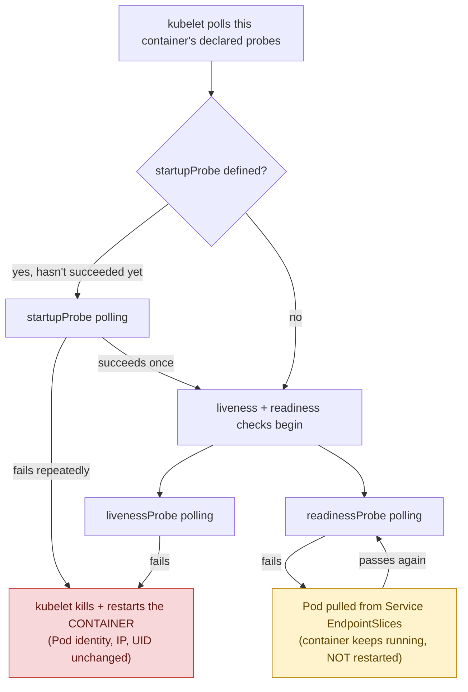
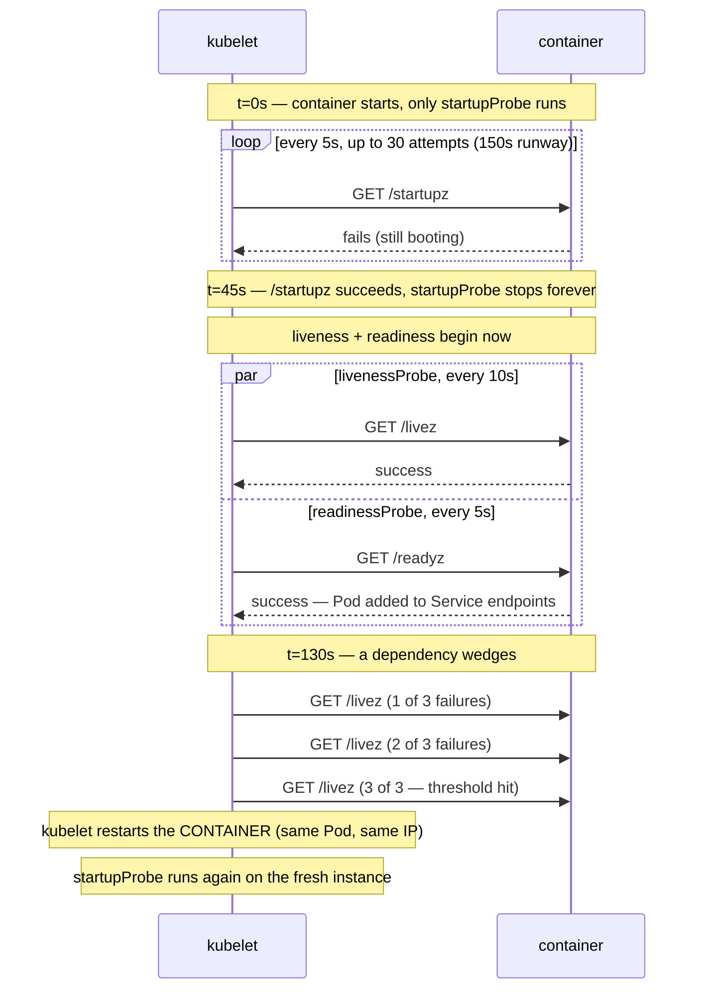

**TL;DR:** How does Kubernetes know a running container is actually broken? The kubelet runs liveness, readiness, and startup probes directly on each node — a failed liveness probe restarts the container in place, a failed readiness probe pulls the Pod from Service traffic without restarting it, and a startupProbe holds both off until a slow-booting app finishes starting.

**Real repo:** [`kubernetes-sigs/metrics-server`](https://github.com/kubernetes-sigs/metrics-server)

## 1. The Engineering Problem: "running" is not the same as "working"

Out of the box, Kubernetes' only signal for container health is the **process exit code**. As long as PID 1 inside the container keeps running, the kubelet considers the container fine — and that's dangerously coarse:

- A container can be **alive but wedged**: a deadlocked event loop, an exhausted database connection pool, a thread stuck on a lock. The process never exits, so nothing restarts it, and it keeps eating every request routed to it — forever, or until someone notices.
- A container can be **alive but not ready yet**: it's still loading a large in-memory cache, running DB migrations, or waiting on a slow downstream dependency at boot. If something starts sending it traffic the moment the process spawns, early requests fail against a service that just hasn't finished initializing.
- And the fix people reach for first — "just add a healthcheck with a big timeout" — creates a *third* problem: a single generic check tuned to tolerate slow startup will also tolerate a genuinely wedged container for just as long in steady state.

You need Kubernetes to ask the *application* three separate questions — "have you finished starting?", "are you alive?", "are you ready for traffic?" — because they have different answers at different times and demand different responses.

---

## 2. The Technical Solution: three probe types, executed by the kubelet

Probes aren't run by the API server or a controller — they're run by the **kubelet**, directly, on each node, polling each container on a schedule you configure.

**Macro view — the kubelet's decision tree**, running as one local polling loop on the node:



**Zoom in — the same container's first few minutes**, using this lesson's
own `cache-warmer-app` numbers (`startupProbe`: `periodSeconds: 5` ×
`failureThreshold: 30`; `livenessProbe`: `periodSeconds: 10` ×
`failureThreshold: 3`):



Three things to hold onto:

1. **The kubelet is the executor, full stop.** No control-plane component is involved in running a probe — it's a local polling loop on the node where the Pod lives, using whichever mechanism you configure (`httpGet`, `tcpSocket`, `exec`, or `grpc`).
2. **Liveness and readiness failures cause completely different actions.** A failed **liveness** probe makes the kubelet restart *that container in place* — same Pod, same UID, same IP, just a fresh container instance and an incremented restart count. A failed **readiness** probe does *not* restart anything — the container keeps running (so you can `kubectl exec` in and debug it), but the Pod is pulled out of Service traffic until it passes again.
3. **`startupProbe`** exists specifically to stop liveness/readiness from firing during a slow boot. Verified against Kubernetes' release history: it landed alpha in **v1.16**, went beta (enabled by default) in **v1.18**, and reached **GA in v1.20** — it's been standard, not experimental, for a long time now. While a `startupProbe` is defined and hasn't yet succeeded once, liveness and readiness are held off entirely; only after it passes do the other two probes start their normal schedule.

---

## 3. The clean example (the concept in isolation)

```yaml
apiVersion: v1
kind: Pod
metadata:
  name: cache-warmer-app
spec:
  containers:
  - name: app
    image: mycompany/app:v1
    ports:
    - containerPort: 8080

    startupProbe:                # gates liveness/readiness until this passes ONCE
      httpGet:
        path: /startupz
        port: 8080
      periodSeconds: 5
      failureThreshold: 30        # up to 5s × 30 = 150s to finish booting

    livenessProbe:                # only evaluated AFTER startupProbe succeeds
      httpGet:
        path: /livez
        port: 8080
      periodSeconds: 10
      failureThreshold: 3         # 3 misses in a row → kubelet restarts the container

    readinessProbe:               # independent check — no restart, just traffic gating
      httpGet:
        path: /readyz
        port: 8080
      periodSeconds: 5
      failureThreshold: 2
```

A container with this spec can take up to 150 seconds to boot without being killed even once, while still being restarted within ~30 seconds of a genuine post-boot deadlock, and pulled from traffic within ~10 seconds of losing a dependency — three different tolerances for three different failure modes.

---

## 4. Production reality (from the real repo)

`kubernetes-sigs/metrics-server`'s own Deployment — the add-on that powers `kubectl top` and the Horizontal Pod Autoscaler. No license header in the source file; verbatim below.

```yaml
apiVersion: apps/v1
kind: Deployment
metadata:
  name: metrics-server
  namespace: kube-system
spec:
  strategy:
    rollingUpdate:
      maxUnavailable: 0            # never drop below full capacity during a rollout —
                                    # metrics-server feeds the HPA; a gap here can stall
                                    # autoscaling cluster-wide.
  template:
    spec:
      # ... serviceAccountName, volumes, priorityClassName elided ...
      containers:
      - name: metrics-server
        image: gcr.io/k8s-staging-metrics-server/metrics-server:master
        # ... args, resources elided ...
        ports:
        - name: https                 # named port — probes below reference
          containerPort: 10250          # it by NAME, not the number 10250
        readinessProbe:
          httpGet:
            path: /readyz          # <-- distinct endpoint from liveness, deliberately
            port: https            # referenced by NAME, not number 10250
            scheme: HTTPS
          periodSeconds: 10
          failureThreshold: 3
          initialDelaySeconds: 20  # give the metrics cache time to fill before
                                    # advertising readiness
        livenessProbe:
          httpGet:
            path: /livez           # <-- separate handler: "is the process alive,"
            port: https            # not "has the cache warmed up"
            scheme: HTTPS
          periodSeconds: 10
          failureThreshold: 3      # no initialDelaySeconds — evaluated almost
                                    # immediately, but see below for why that's safe
        # ... securityContext, volumeMounts elided ...
```

**What this teaches that a hello-world can't:**

- **`/readyz` and `/livez` are two different handlers, on purpose.** metrics-server exposes distinct endpoints because "can I serve requests right now" (readiness — depends on whether it's finished its first metrics collection pass) and "is my process healthy" (liveness — should basically never legitimately fail once running) are different questions. A single shared `/health` endpoint would conflate them and risk restart loops triggered by conditions that only affect readiness.
- **No `startupProbe` here — and that's a deliberate, defensible choice, not an oversight.** The liveness probe has no `initialDelaySeconds`, but `periodSeconds: 10` × `failureThreshold: 3` still gives ~30 seconds of runway before a first restart is even possible. For a small, fast-booting Go binary like metrics-server, that's already enough slack — a `startupProbe` earns its complexity on genuinely slow-booting apps (large JVMs, big cache warms), not every Deployment by default.
- **Probes reference the port by name (`https`), not the number.** This is the exact same discipline as named Service ports — it keeps the probe definition correct even if the underlying `containerPort` number ever changes, since only the `ports:` block needs updating.
- **`maxUnavailable: 0`** on the rollout strategy is a decision made *because* of what this Deployment feeds: the HPA and `kubectl top` depend on it, so this add-on accepts a slower rollout (no Pod ever goes down before its replacement is ready) in exchange for zero gaps in cluster-wide metrics availability.

---

## Source

- **Concept:** Kubernetes liveness, readiness, and startup **probes** — container health signaling
- **Domain:** kubernetes
- **Repo:** [kubernetes-sigs/metrics-server](https://github.com/kubernetes-sigs/metrics-server) → [`manifests/base/deployment.yaml`](https://github.com/kubernetes-sigs/metrics-server/blob/master/manifests/base/deployment.yaml) — the cluster add-on that powers `kubectl top` and the Horizontal Pod Autoscaler


