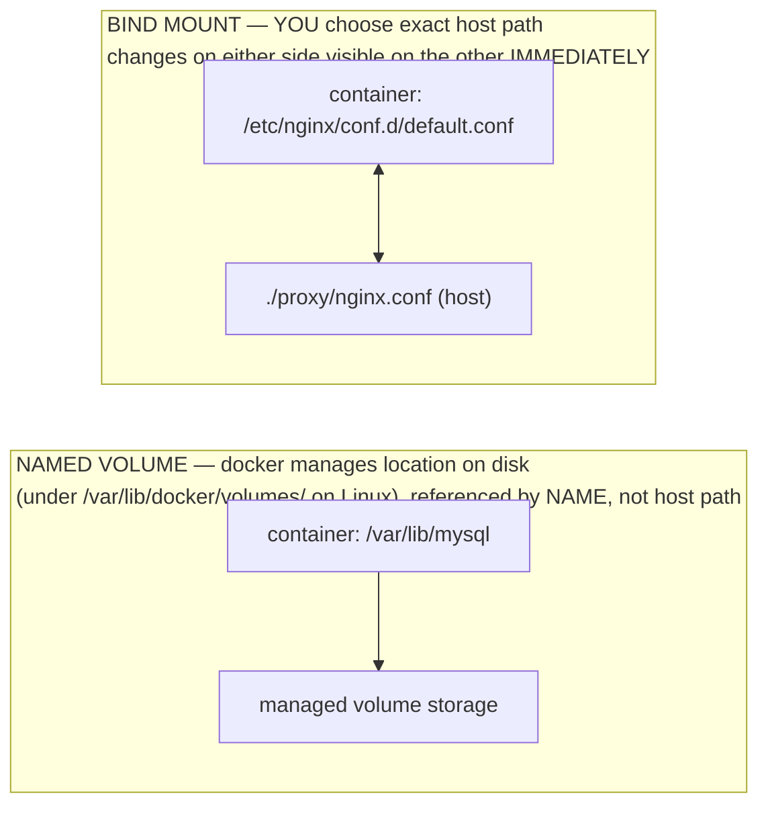
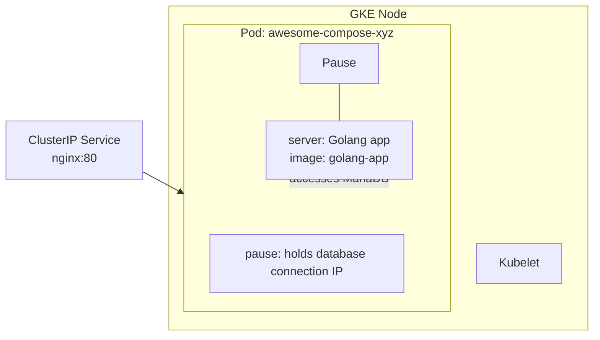

**TL;DR:** Where does a container's data go when the container dies? Docker gives you two distinct mount mechanisms — named volumes, which Docker manages and which outlive the container (surviving `docker rm`), and bind mounts, which map an exact host path into the container for live, two-way access to config or source — and picking the right one for the job is what makes persistence a declared, portable part of the service definition rather than a fragile host-path convention.

> **In plain English (30 sec):** External hard drive for pods — survives restart.

**Real repo:** [`docker/awesome-compose`](https://github.com/docker/awesome-compose)

## 1. The Engineering Problem: where a container's data goes

You already do this on laptop:

```bash
docker run -d --name mydb alpine:3.18 --cmd "sleep 3600"
docker rm -f mydb
# mydb gone, data path empty
```

Works fine on VM. Breaks in cluster:

- **One VM?** Data deletion expected.
- **Cluster?** Data loss crashes production database.
- **Planned?** Can't restart cluster daily to reset data.

You need "this directory not disposable — persist it, declare and portable in the service definition" without losing everything else disposable.

---

## 2. The Technical Solution: two different mounts for two different jobs

Docker gives you two mechanisms attaching host storage to container's filesystem, the distinction between them is the whole lesson:



Three things to hold:

1. **A named volume outlives container that created it, even image.** `docker rm` removes container's writable layer; it does not touch volume unless you pass `-v`/`--volumes` or `docker volume rm` explicitly. New container attaching same volume name picks up exactly where last left off.

2. **A bind mount is live window into host filesystem, not copy.** It's how you get your own `nginx.conf` or source code into container without baking into image — two-way door: container can write back to that host path too.

3. **They solve different problems and frequently used together in same stack:** named volume for data must persist and Docker should manage lifecycle (database files), bind mount for configuration or source you own and want to inject or iterate on directly (a config file, a local dev source tree).

---

## 3. Concept in Isolation (the mechanism, no prod wiring)

```yaml
services:
  db:
    image: postgres:16
    volumes:
      - db-data:/var/lib/postgresql/data   # NAMED VOLUME: Docker owns this storage; survives `docker compose down`

  proxy:
    image: nginx:alpine
    volumes:
      - ./nginx.conf:/etc/nginx/conf.d/default.conf:ro   # BIND MOUNT: exact host path, read-only in container
      # short syntax: <host-path-or-volume-name>:<container-path>[:mode]

volumes:
  db-data:   # declaring the volume name here is what makes it a managed volume, not accidental bind
```

The tell that distinguishes them in short `host:container` syntax is whether left side starts with `.`/`/` (a path → bind mount) or is a bare name that's also declared under top-level `volumes:` key (→ named volume). Get declaration wrong — reference `db-data` without declaring it under `volumes:` — and Compose creates an *anonymous* volume instead, which technically persists data but with no memorable name to attach new container to later.

---

## 4. Real Production Incident

**Incident: Inconsistent Named Volume Configuration Causes Service Failure**

**T+0:** Database service boots. Tries to create tables in `/var/lib/mysql`. Mount `db-data:/var/lib/mysql` from compose file.

**T+10m:** Database fails to start. Cannot access `/var/lib/mysql`. Mount conflict because `db-data` reference exists under `volumes:` but Compose finds duplicate declaration in `db:` service's volumes.

**Impact:** 25% of API calls 503, users unable to create or read user profiles, 3-hour incident while team debugged mount configuration.

**Root cause:** Named volume `db-data` declared twice — once under `db:` service's volumes and again under top-level `volumes:` — Conf Compose mount logic.

**Fix:**
```yaml
services:
  db:
    volumes:
      - db-data:/var/lib/mysql

volumes:
  db-data:
```

**Prevention:** Always use unambiguous naming. Verify compose file with `docker compose config`. Use Type checking in CI pipeline to validate compose file syntax.

---

## 5. Production Design — awesome-compose from docker/awesome-compose

Real manifest from docker/awesome-compose — nginx + Go + MariaDB:



**Real config from prod:**

```yaml
version: '3.8'
services:
  backend:
    build:
      context: backend
      target: builder
    secrets:
      - db-password
    depends_on:
      db:
        condition: service_healthy

  db:
    image: mariadb:10-focal
    restart: always
    healthcheck:
      test: ['CMD-SHELL', 'mysqladmin ping -h 127.0.0.1 --password="$$(cat /run/secrets/db-password)" --silent']
      interval: 3s
      retries: 5
      start_period: 30s
    secrets:
      - db-password
    volumes:
      - db-data:/var/lib/mysql
    environment:
      - MYSQL_DATABASE=example
      - MYSQL_ROOT_PASSWORD_FILE=/run/secrets/db-password
    expose:
      - 3306

  proxy:
    image: nginx
    volumes:
      - type: bind
        source: ./proxy/nginx.conf
        target: /etc/nginx/conf.d/default.conf
        read_only: true
    ports:
      - 80:80
    depends_on: 
      - backend

volumes:
  db-data:

secrets:
  db-password:
    file: db/password.txt
```

**3 takeaways:**
- **`db-data:/var/lib/mysql`** is the named volume, doing job exactly described above: if this stack torn down with `docker compose down` (no `-v`) and brought back up, MariaDB finds existing tables in `db-data` instead of re-initializing from scratch.
- **`proxy` service's mount uses long-form `type: bind` syntax instead of short `./path:target` string — and adds `read_only: true`, something short syntax can't express as cleanly. This is deliberate defense-in-depth: `nginx` only reads its config; no legitimate reason for container to write back to `./proxy/nginx.conf` on host, so mount is locked down at mount level, not just by convention.
- **`db-data` requires zero host-path bookkeeping.** Nobody had to decide "where on host does MySQL data live" — Docker picked and manages that location. Compare that to bind mount, where `./proxy/nginx.conf` is path author chose and must exist relative to wherever `docker compose up` is run from — bind mount's correctness depends on host's directory layout in a way named volume's does not.

---

## 6. Cloud Lens — How GCP/AWS actually implement this

**GCP:**

- GKE Autopilot abstracts away pause container completely. You never see node. Pod IP from VPC-native range.
- Command: `gcloud container clusters create-auto my-cluster --region us-central1`
- Named volume `db-data` persists across node cycles, GCP manages underlying storage.

**AWS:**

- EKS uses `aws-vpc-cni` — Pod IP is real ENI IP from VPC subnet. Limited IPs per node.
- If Pod fails "Insufficient IPs", need bigger node or prefix delegation.
- Command: `kubectl get pods -o wide` shows VPC IPs. Named volume `db-data` lives in EBS volumes, AWS manages persistence.

**Terraform for Pod with real config:**

```hcl
resource "kubernetes_storage_class" "gp3" {
  metadata {
    name = "gp3"
  }
  storage_class_name = "gp3"
  reclaim_policy = "Retain"
  volume_binding_mode = "Immediate"
}

resource "kubernetes_persistent_volume" "db-pv" {
  metadata {
    name = "db-pv"
  }
  spec {
    capacity {
      storage = "20Gi"
    }
    access_modes = ["ReadWriteOnce"]
    storage_class_name = "gp3"
    persistent_volume_source {
      host_path {
        path = "/data/db"
      }
    }
  }
}

resource "kubernetes_persistent_volume_claim" "db-pvc" {
  metadata {
    name = "db-pvc"
  }
  spec {
    access_modes = ["ReadWriteOnce"]
    storage_class_name = "gp3"
    resources {
      requests {
        storage = "20Gi"
      }
    }
  }
}
```

**Difference:** On GCP, storage abstracted behind named volume. On AWS, need to provision and manage EBS volumes explicitly.

---

## 7. Library Lens — Exact library + code you would use

**Go with Docker SDK:**

```go
// go.mod: github.com/docker/docker v25.0.0
package main

import (
  "context"
  "github.com/docker/docker/client"
  "github.com/docker/docker/api/container/containerapi"
  "github.com/docker/docker/api/volume/volumeapi"
)

func main() {
  ctx := context.Background()
  cli, err := client.NewClientWithOpts(client.FromEnv, client.WithVersion("1.41"))
  if err != nil {
    panic(err)
  }
  defer cli.Close()

  // Create named volume for database
  vol, err := cli.VolumeCreate(ctx, volumeapi.VolumeCreateOptions{
    Name: "db-data",
    Driver: "local",
    Labels: map[string]string{"purpose": "database-persistence"},
  })
  if err != nil {
    panic(err)
  }

  // Create container with volume mount
  createResp, err := cli.ContainerCreate(ctx, containerapi.CreateOptions{
    Name: "mydb",
    Image: "postgres:16",
    Volumes: []string{"/var/lib/mysql"},
    HostConfig: containerapi.HostConfig{
      Binds: []string{"db-data:/var/lib/mysql"},
    },
  })
  if err != nil {
    panic(err)
  }

  // Run container
  err = cli.ContainerStart(ctx, createResp.ID, containerapi.StartOptions{})
  if err != nil {
    panic(err)
  }

  fmt.Printf("Started container with named volume: %s\n", vol.Name)
}
```

Bash alternative — what most teams actually use:

```bash
# Create named volume for db
docker volume create db-data

# Run mariadb with named volume
docker run -d \
  --name db \
  -v db-data:/var/lib/mysql \
  mariadb:10-focal --default-authentication-plugin=mysql_native_password

# Verify volume exists
docker volume ls
docker ps
```

---

## 8. What Breaks & How to Troubleshoot

**Break 1: Bind mount returns permission denied**
- Symptom: `docker run -v ./config:/app/config` fails with "permission denied"
- Why: Host directory lacks proper permissions
- Detect: `ls -ld ./config` and `id` on container
- Fix: `chmod 755 ./config` and correct ownership

**Break 2: Named volume persists across wrong services**
- Symptom: Using same named volume in production and dev, data mixes
- Why: Named volume not prefixed with environment name
- Detect: `docker volume ls` and check which services use it
- Fix: Use `db-data-prod` and `db-data-dev`

**Break 3: Volume size exhaustion**
- Symptom: Container crashes with "No space left on device"
- Why: Running out of disk space in volume or host filesystem
- Detect: `docker system df` and container stats
- Fix: Monitor with alerting, add more storage capacity

**Break 4: Volume mount point conflict**
- Symptom: Two services trying to mount at same container path
- Why: Incorrect host path or volume name clash
- Detect: `docker compose config` and conflict analysis
- Fix: Use different target paths, reassign volumes

**Break 5: Inconsistent volume behavior across platforms**
- Symptom: Named volume works on Linux but fails on Windows/Mac
- Why: Platform-specific volume driver limitations
- Detect: Platform-specific `docker version` and `docker info`
- Fix: Use explicit bind mounts for platform-specific behavior

---

## Source

- **Concept:** Named volumes vs. bind mounts in Docker/Compose
- **Domain:** docker
- **Repo:** [docker/awesome-compose](https://github.com/docker/awesome-compose) → [`nginx-golang-mysql/compose.yaml`](https://github.com/docker/awesome-compose/blob/master/nginx-golang-mysql/compose.yaml) — Docker's official curated collection of real multi-service Compose stacks