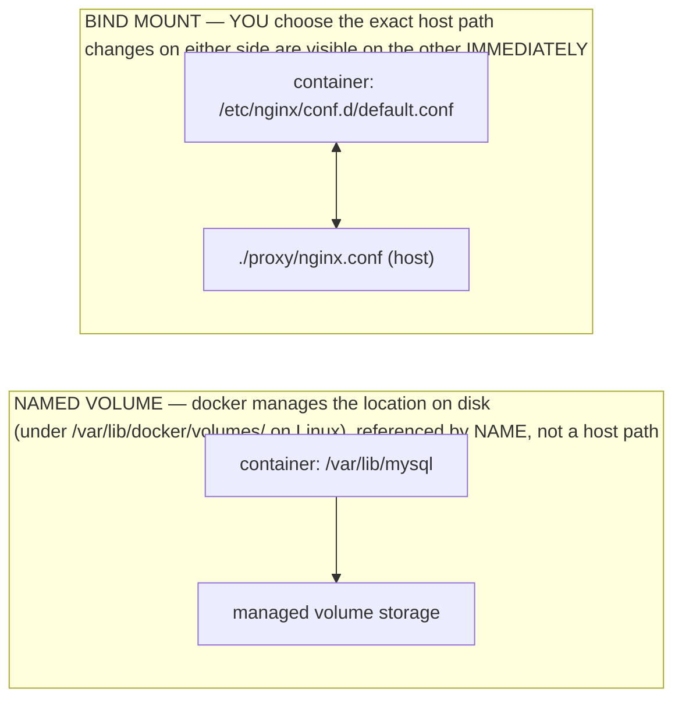

## 1. The Engineering Problem: a container's filesystem is disposable by design

`docker rm` deletes a container's writable layer along with it — and that's not a bug, it's the entire point of the image/container split covered in the layers lesson: every container starts from the same immutable image and gets a thin, throwaway layer on top. Restart a database container after a crash and by design you'd get a blank data directory, because "restart from a clean slate" is exactly what containers are built to do well.

That's fine for a stateless web process. It's catastrophic for a database, a message queue's log, or anything that has to survive the container that produced it. Before named volumes existed as a first-class Docker concept, people worked around this by writing data directly to *some* path on the host and hoping every host had that path prepared identically — fragile, undocumented, and impossible to reason about from the Dockerfile or compose file alone.

You need a way to say "this specific directory inside the container is not disposable — persist it, and make that persistence a declared, portable part of the service definition," without giving up the disposability of everything else in the container.

---

## 2. The Technical Solution: two different kinds of mount, chosen for two different jobs

Docker gives you two mechanisms that both attach host storage into a container's filesystem, and the distinction between them is the whole lesson:



Three things to hold onto:

1. **A named volume outlives the container that created it, and even the image.** `docker rm` removes the container's writable layer; it does not touch a volume unless you pass `-v`/`--volumes` or `docker volume rm` explicitly. A new container attaching the same volume name picks up exactly where the last one left off.
2. **A bind mount is a live window into the host filesystem, not a copy.** It's how you get your own `nginx.conf` or source code into a container without baking it into the image — and it's a two-way door: the container can write back to that host path too.
3. **They solve different problems and are frequently used together in the same stack**: a named volume for data that must persist and that Docker should manage the lifecycle of (database files), a bind mount for configuration or source you own and want to inject or iterate on directly (a config file, a local dev source tree).

---

## 3. The clean Compose file (the concept in isolation)

```yaml
services:
  db:
    image: postgres:16
    volumes:
      - db-data:/var/lib/postgresql/data   # NAMED VOLUME: Docker owns this storage; survives `docker compose down`

  proxy:
    image: nginx:alpine
    volumes:
      - ./nginx.conf:/etc/nginx/conf.d/default.conf:ro   # BIND MOUNT: exact host path, read-only in the container
      # short syntax: <host-path-or-volume-name>:<container-path>[:mode]

volumes:
  db-data:   # declaring the volume name here is what makes it a managed volume, not an accidental bind
```

The tell that distinguishes them in the short `host:container` syntax is whether the left side starts with `.`/`/` (a path → bind mount) or is a bare name that's also declared under the top-level `volumes:` key (→ named volume). Get the declaration wrong — reference `db-data` without declaring it under `volumes:` — and Compose creates an *anonymous* volume instead, which technically persists data but with no memorable name to attach a new container to later.

---

## 4. Production reality: both mechanisms in one real stack

Docker's own `awesome-compose` reference stack for nginx + Go + MySQL uses a named volume for the database and a bind mount for the reverse-proxy config, in the same file. Verbatim, annotated.

```yaml
services:
  backend:
    build:
      context: backend
      target: builder
    secrets:
      - db-password
    depends_on:
      db:
        condition: service_healthy

  db:
    # We use a mariadb image which supports both amd64 & arm64 architecture
    image: mariadb:10-focal
    # If you really want to use MySQL, uncomment the following line
    #image: mysql:8
    command: '--default-authentication-plugin=mysql_native_password'
    restart: always
    healthcheck:
      test: ['CMD-SHELL', 'mysqladmin ping -h 127.0.0.1 --password="$$(cat /run/secrets/db-password)" --silent']
      interval: 3s
      retries: 5
      start_period: 30s
    secrets:
      - db-password
    volumes:
      - db-data:/var/lib/mysql
    environment:
      - MYSQL_DATABASE=example
      - MYSQL_ROOT_PASSWORD_FILE=/run/secrets/db-password
    expose:
      - 3306

  proxy:
    image: nginx
    volumes:
      - type: bind
        source: ./proxy/nginx.conf
        target: /etc/nginx/conf.d/default.conf
        read_only: true
    ports:
      - 80:80
    depends_on: 
      - backend

volumes:
  db-data:

secrets:
  db-password:
    file: db/password.txt
```

**What this teaches that a hello-world can't:**

- **`db-data:/var/lib/mysql`** is the named volume, short syntax, doing exactly the job described above: if this stack is torn down with `docker compose down` (no `-v`) and brought back up, MariaDB finds its existing tables in `db-data` instead of re-initializing from scratch.
- **The `proxy` service's mount uses the long-form `type: bind` syntax instead of the short `./path:target` string** — and adds `read_only: true`, something the short syntax can't express as cleanly. This is deliberate defense-in-depth: `nginx` only *reads* its config; there's no legitimate reason for the container to be able to write back to `./proxy/nginx.conf` on the host, so the mount is locked down at the mount level, not just by convention.
- **`db-data` requires zero host-path bookkeeping.** Nobody had to decide "where on the host does MySQL data live" — Docker picked and manages that location. Compare that to the bind mount, where `./proxy/nginx.conf` is a path the *author* chose and must exist relative to wherever `docker compose up` is run from — a bind mount's correctness depends on the host's directory layout in a way a named volume's does not.
- **`healthcheck:` and `MYSQL_ROOT_PASSWORD_FILE` reading from `/run/secrets/db-password`** are both worth noticing but are their own lessons (healthchecks/restart policies, and Compose secrets) — included here unedited because that's what the real file actually contains; production compose files rarely isolate one concern as cleanly as a teaching example does.
- **Stale-fact check:** nothing here relies on the legacy `docker-compose` standalone binary or `--link`-style container linking — `depends_on` plus the default network Compose creates for this project (each service reachable by its service name, `db`/`backend`/`proxy`) is the current mechanism, and volumes/bind mounts are unrelated to networking entirely — don't conflate "the container can reach `db`" (DNS, a later lesson) with "the container's data survives" (volumes, this lesson).

---

## Source

- **Concept:** Named volumes vs. bind mounts in Docker/Compose
- **Domain:** docker
- **Repo:** [docker/awesome-compose](https://github.com/docker/awesome-compose) → [`nginx-golang-mysql/compose.yaml`](https://github.com/docker/awesome-compose/blob/master/nginx-golang-mysql/compose.yaml) — Docker's official curated collection of real multi-service Compose stacks
