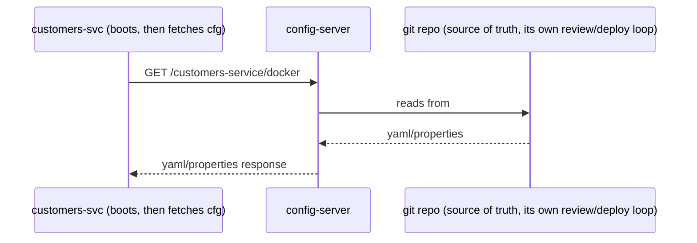

## 1. The Engineering Problem

The obvious place to put configuration is next to the code: an
`application.properties` baked into the build, one copy per environment
(`application-dev.yml`, `application-prod.yml`), committed alongside the
source. It's simple until it isn't:

- **Changing a value means a rebuild.** Flipping a feature flag or bumping
  a timeout shouldn't require a new artifact, a new image, and a new
  deploy — but if the config is compiled into the jar, that's exactly what
  it requires.
- **Secrets end up in source control**, or duplicated per-service in ways
  that drift the moment one service's copy gets updated and another
  doesn't.
- **Shared settings multiply.** In a system with eight services, logging
  levels, actuator exposure, tracing sample rates — genuinely identical
  settings — either get copy-pasted into eight separate config files (and
  drift) or live nowhere central at all.

The deeper problem: configuration and code have different lifecycles.
Code changes on a release cadence, reviewed and tested. Configuration often
needs to change *faster* than that — a timeout tuned during an incident, a
flag flipped mid-day — without waiting on a full build pipeline.

## 2. The Technical Solution: a config server clients pull from at boot

**Externalized configuration** moves settings out of the artifact entirely.
A dedicated config server serves configuration — from git, a filesystem, or
a secret store — keyed by application name and active profile; every other
service fetches its config over the network at startup instead of shipping
it inside the build.



Core truths to hold:

- **Config has its own repo and its own release cadence**, decoupled from
  the application build entirely — changing a flag is a config-repo commit,
  not an application redeploy.
- **A shared file layers underneath per-service files.** Settings that are
  genuinely identical across every service live once, in a file matched to
  "all applications"; service-specific files only override what's actually
  different for that one service.
- **Profiles select environment, not separate artifacts.** `docker`,
  `mysql`, `native` — one config repo can describe every deployment target
  for every service, chosen at boot via an active profile, not baked in at
  build time.

## 3. The clean example (concept in isolation)

The two pieces stripped down: a config server, and a client that imports
from it instead of shipping its own settings.

```java
// ConfigServerApplication.java — a config server is mostly one annotation
@EnableConfigServer
@SpringBootApplication
public class ConfigServerApplication {
    public static void main(String[] args) {
        SpringApplication.run(ConfigServerApplication.class, args);
    }
}
```

```yaml
# config-server application.yml — where the actual config values live
server.port: 8888
spring:
  cloud:
    config:
      server:
        git:
          uri: https://example.com/my-org/my-config-repo
          default-label: main
```

```yaml
# any-service application.yml — imports config instead of defining it locally
spring:
  application:
    name: any-service
  config:
    import: optional:configserver:http://localhost:8888/
```

The service's own `application.yml` no longer holds the settings — it just
points at where to fetch them.

## 4. Production reality (from the real repo)

[spring-petclinic-microservices](https://github.com/spring-petclinic/spring-petclinic-microservices)'s
config server is, like the discovery server in the previous lesson, almost
entirely framework code:

```java
// spring-petclinic-config-server/src/main/java/.../ConfigServerApplication.java
@EnableConfigServer
@SpringBootApplication
public class ConfigServerApplication {

	public static void main(String[] args) {
		SpringApplication.run(ConfigServerApplication.class, args);
	}
}
```

```yaml
# spring-petclinic-config-server/src/main/resources/application.yml
server.port: 8888
spring:
  cloud:
    config:
      server:
        git:
          uri: https://github.com/spring-petclinic/spring-petclinic-microservices-config
          default-label: main
        # Use the File System Backend to avoid git pulling. Enable "native" profile in the Config Server.
        native:
          searchLocations: file:///${GIT_REPO}
```

The values it serves live in a genuinely separate repository,
[spring-petclinic-microservices-config](https://github.com/spring-petclinic/spring-petclinic-microservices-config)
— not a folder inside the application's own repo:

```yaml
# spring-petclinic-microservices-config/application.yml — settings shared by EVERY service
server:
  # start services on random port by default
  port: 0
  shutdown: graceful

spring:
  cloud:
    config:
      # Allow the microservices to override the remote properties with their own System properties or config file
      allow-override: true
      # Override configuration with any local property source
      override-none: true
  jpa:
    open-in-view: false

management:
  endpoints:
    web:
      exposure:
        include: '*'
  tracing:
    sampling:
      probability: 1

eureka:
  instance:
    prefer-ip-address: true
```

```yaml
# spring-petclinic-microservices-config/customers-service.yml — overrides ONLY what differs
spring:
  config:
    activate:
      on-profile: default
eureka:
  instance:
    instance-id: ${spring.application.name}:${random.uuid}

---
spring:
  config:
    activate:
      on-profile: docker
server:
  port: 8081
eureka:
  client:
    serviceUrl:
      defaultZone: http://discovery-server:8761/eureka/
```

What this teaches that a hello-world can't:

- **`git.uri` points at a separate GitHub repository, not a local
  folder.** Externalized configuration means externalized from the
  application's *repository*, not just from its compiled artifact — the
  config has its own commit history, its own review process, and can be
  changed without touching application source at all.
- **`native.searchLocations: file:///${GIT_REPO}`, guarded by a comment
  ("Use the File System Backend to avoid git pulling"), shows the backend
  itself is pluggable.** The same config server can serve from git or from
  a local filesystem depending on which profile is active — externalized
  config doesn't mandate git specifically, only that config isn't compiled
  into the artifact.
- **`spring.cloud.config.allow-override: true` / `override-none: true` are
  an explicit, documented precedence rule.** Without stating this
  somewhere, "does a local property or the remote config win" is exactly
  the kind of ambiguity that turns into a debugging session the first time
  someone sets a System property to test something locally.
- **The shared `application.yml` carries settings with real operational
  weight** — `management.tracing.sampling.probability: 1`,
  `eureka.instance.prefer-ip-address: true`, actuator exposure — that are
  genuinely identical across all eight services. Centralizing them here
  means a tracing sample rate change is one file edit, not eight.
- **`customers-service.yml` holds both a `default` profile block and a
  `docker` profile block in the same file**, selected by which profile is
  active at boot. One externalized file describes a laptop run (random
  instance ID, no fixed registry URL) and a container run (fixed port
  8081, a container-network registry hostname) — the same artifact, two
  different runtime shapes, chosen entirely by configuration.

---

## Source

- **Concept:** Externalized configuration
- **Domain:** microservices
- **Repo:** [spring-petclinic/spring-petclinic-microservices](https://github.com/spring-petclinic/spring-petclinic-microservices) → [`spring-petclinic-config-server/src/main/java/org/springframework/samples/petclinic/config/ConfigServerApplication.java`](https://github.com/spring-petclinic/spring-petclinic-microservices/blob/main/spring-petclinic-config-server/src/main/java/org/springframework/samples/petclinic/config/ConfigServerApplication.java), [`spring-petclinic-config-server/src/main/resources/application.yml`](https://github.com/spring-petclinic/spring-petclinic-microservices/blob/main/spring-petclinic-config-server/src/main/resources/application.yml) and [spring-petclinic/spring-petclinic-microservices-config](https://github.com/spring-petclinic/spring-petclinic-microservices-config) → [`application.yml`](https://github.com/spring-petclinic/spring-petclinic-microservices-config/blob/main/application.yml), [`customers-service.yml`](https://github.com/spring-petclinic/spring-petclinic-microservices-config/blob/main/customers-service.yml) — Spring Cloud Config server and its git-backed config repo
