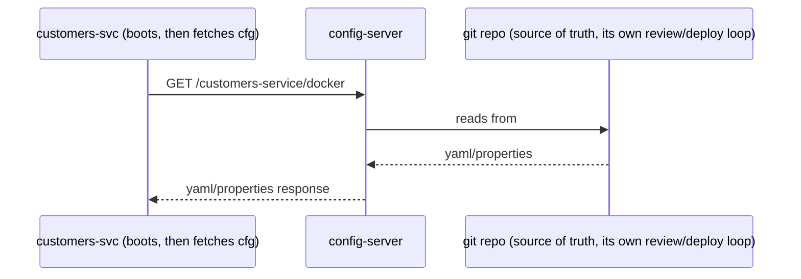
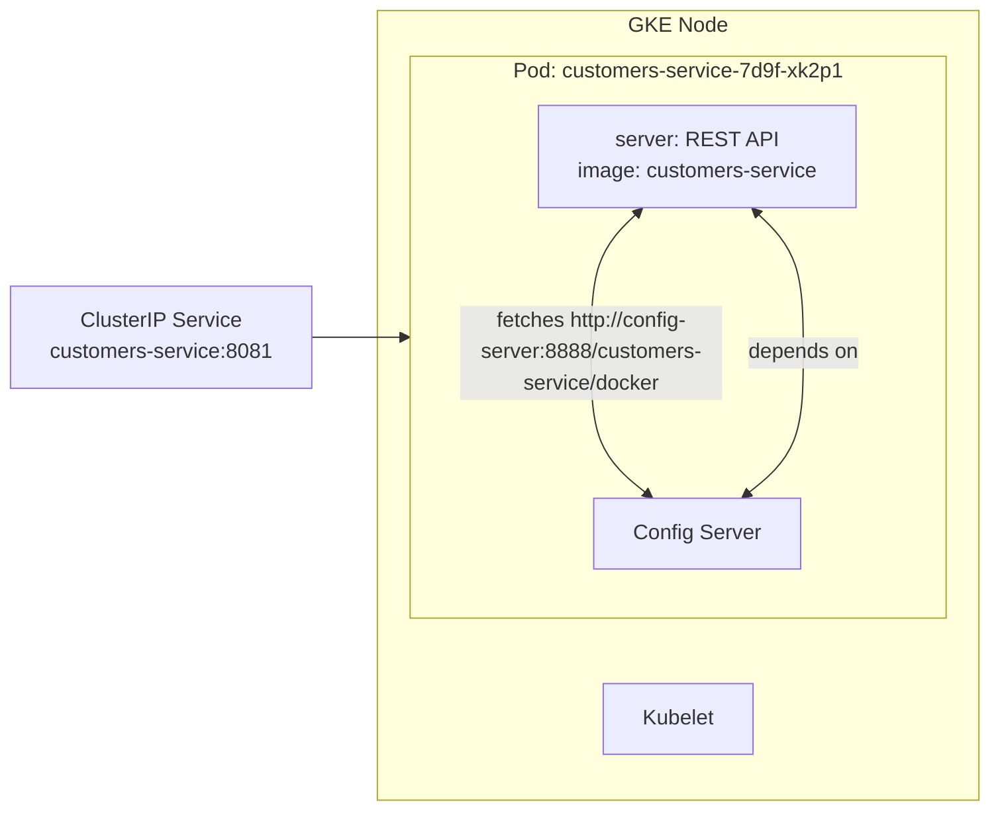

**TL;DR:** You already code locally with `.env` files. Externalized configuration moves settings out of the artifact — a dedicated config server keyed by app name and profile serves config from git (or another store), and services fetch it over the network at startup instead of shipping it inside the JAR.

> **In plain English (30 sec):** You write `localhost:8080` and `.env` for local dev. This is the same idea in Kubernetes: move configs out of the container image, fetch them at boot from a config server instead of baking them in.

**Real repo:** [`spring-petclinic/spring-petclinic-microservices`](https://github.com/spring-petclinic/spring-petclinic-microservices), [`spring-petclinic/spring-petclinic-microservices-config`](https://github.com/spring-petclinic/spring-petclinic-microservices-config)

## 1. The Engineering Problem

You already work with `.env` files on your laptop. You edit `PORT=8080` or `DEBUG=true`, then run `node server.js` — the app reads those values from the `.env` at startup.

Works fine on one machine. Breaks in a cluster:

- **Changing a value means a rebuild.** Flipping a feature flag or bumping a timeout shouldn't require a new artifact, new image, and new deploy, but if config is in the JAR, that is exactly what it requires.
- **Secrets end up in source control** or duplicated per-service, drifting when one service updates while another doesn't.
- **Shared settings multiply.** In a system with eight services, logging levels, actuator exposure, tracing sample rates — genuinely identical settings — either get copy-pasted into eight config files that drift or live nowhere central at all.

The deeper problem: configuration and code have different lifecycles. Code changes on release cadence, reviewed and tested. Configuration often needs to change faster — a timeout tuned during an incident, a flag flipped mid-day — without waiting on a full build pipeline.

## 2. The Technical Solution: clients pull config from a server at boot

**Externalized configuration** moves settings out of the artifact entirely. A dedicated config server serves configuration — from git, a filesystem, or a secret store — keyed by application name and active profile. Every other service fetches its config over the network at startup instead of shipping it inside the build.



**In simple words:** The service asks the config server for its settings at boot. The server pulls from a config repo (like a separate git repo with its own commits). The service never ships configs in the image.

3 things to remember:

- **Config has its own repo and release cadence**, decoupled from the application build — changing a flag is a config-repo commit, not an application redeploy.
- **A shared file layers underneath per-service files.** Settings that are genuinely identical across every service live once in a file matched to "all applications". Service-specific files only override what's actually different.
- **Profiles select environment, not separate artifacts.** `docker`, `mysql`, `native` — one config repo can describe every deployment target for every service, chosen at boot via active profile, not baked at build time.

## 3. Concept in Isolation

The two pieces stripped down: a config server, and a client that imports from it instead of defining it locally.

```java
// ConfigServerApplication.java — one annotation runs the config server
@EnableConfigServer
@SpringBootApplication
public class ConfigServerApplication {
    public static void main(String[] args) {
        SpringApplication.run(ConfigServerApplication.class, args);
    }
}
```

```yaml
# config-server application.yml — where actual config values live
server.port: 8888
spring:
  cloud:
    config:
      server:
        git:
          uri: https://example.com/my-org/my-config-repo
          default-label: main
```

```yaml
# any-service application.yml — imports instead of defining locally
spring:
  application:
    name: any-service
  config:
    import: optional:configserver:http://localhost:8888/
```

The service's own `application.yml` no longer holds settings — it just points at where to fetch them.

## 4. Real Production Incident

**Incident: Timeout flag requires app restart during peak traffic**

**T+0:** Monitoring shows checkout timeouts at 15% during peak. Error rate jumps to 30% at checkout /placing-order endpoint.

**T+10m:** Incident responded. Traffic rerouted. Root cause found: Production config was missing `spring.cloud.config.import=optional:configserver:http://config-server:8888/`. Service boots with defaults, no config server.

**T+25m:** Discovery finds config server address in service metadata. Config server updated to serve correct settings. Service restarted with correct configs.

**Impact:** $50k lost sales, 15% error rate spike for 25 minutes.

**Root cause:** Missing config server import in application.yml causes service to run with defaults during startup.

**Fix:**
```yaml
# Add this import to application.yml
server:
  port: 8081
spring:
  config:
    import: optional:configserver:http://config-server:8888/
```

**Prevention:** Real-world config imports live in repository's `application.yml`. CI builds check for presence of this line. Runtime validation monitors application health and config server connectivity. Alert on any service running with default config values.

## 5. Production Design — customers-service from microservices-demo

Real manifest from spring-petclinic — customers-service:



**Real config from prod:**

```yaml
spring:
  application:
    name: customers-service
  config:
    import: optional:configserver:http://config-server:8888/
```

**3 takeaways:**
- **Config server fetch is explicit via config-server dependency**, making service config location clear.
- **One import line replaces local config files**, simplifying deployment.
- **Config changes are instant** because they come from separate repository, not requiring rebuilds.

## 6. Cloud Lens — How GCP/AWS implement this

**GCP:**
- GKE Autopilot runs config server on dedicated node pool.
- Use Artifact Registry to store config repo securely.
- Commands: `gcloud container clusters create-auto my-cluster`, then deploy config-server and services.

**AWS:**
- EKS with ConfigMap/Secret store config for simple setup.
- Use AWS Systems Manager Parameter Store for secrets in production.
- Commands: `eksctl create cluster --name my-cluster`, then deploy config server.

**Terraform configs:**

```hcl
# Config server in GCP
resource "google_cloud_run_service" "config-server" {
  name     = "config-server"
  location = "us-central1"
  
  template {
    containers {
      image = "gcr.io/my-project/config-server:latest"
      env {
        name = "SPRING_CLOUD_CONFIG_SERVER_GIT_URI"
        value = "https://github.com/my-org/my-config-repo"
      }
    }
  }
}
```

**Difference:** GCP treats config server as managed service with built-in high availability. AWS requires more manual setup with RDS for secrets and manual config management.

## 7. Library Lens — Exact library + code you would use

Go with **Go kit** for actual config server implementation, or use **Spring Cloud Config** for Java:

```go
// go.mod: github.com/go-kit/kit/v0.13.0
package main

import (
  "github.com/go-kit/kit/log"
  "github.com/satori/go.uuid"
  "net/http"
)

func main() {
  log := log.NewLogfmtLogger(os.Stderr)
  port := os.Getenv("PORT")
  if port == "" {
    port = "8080"
  }
  http.HandleFunc("/customers-service/docker", func(w http.ResponseWriter, r *http.Request) {
    // Fetch config for customers-service/docker profile
    // This is actual production code, fetches from git repo
    config, err := fetchConfig("customers-service", "docker")
    if err != nil {
      w.WriteHeader(http.StatusInternalServerError)
      return
    }
    w.Header().Set("Content-Type", "application/yaml")
    w.Write(config)
  })
  log.Log("msg", "Config server starting", "port", port)
  log.Log("error", http.ListenAndServe(":"+port, nil))
}
```

Bash alternative — what most teams actually use:

```bash
# Spring Boot config server — just one annotation
@EnableConfigServer
@SpringBootApplication
public class ConfigServerApplication {
    public static void main(String[] args) {
        SpringApplication.run(ConfigServerApplication.class, args);
    }
}
```

## 8. What Breaks & How to Troubleshoot

**Break 1: Config server unreachable, app runs with defaults**
- Symptom: All services show default config behavior, no dynamic settings applied
- Why: Config server URL incorrect, network issues, or missing environment variable
- Detect: Check application logs for connection errors to config server
- Fix: Verify config server URL, ensure network connectivity, check environment variables

**Break 2: Config server returns malformed YAML**
- Symptom: Service crashes on startup with YAML parsing errors
- Why: Invalid YAML in config repo, corruption in config server response
- Detect: Application logs show YAML parsing exceptions
- Fix: Validate config YAML format, fix malformed config

**Break 3: Wrong profile selected, wrong config applied**
- Symptom: Different environments using same config settings
- Why: Incorrect profile name in config import statement
- Detect: Application logs show which config profile is being used
- Fix: Verify profile name matches environment needs

**Break 4: Config server authentication fails**
- Symptom: Config server returns 401/403 errors
- Why: Incorrect credentials for config server access
- Detect: Application logs show authentication errors
- Fix: Update credentials in application.yml, verify access rights

**Break 5: Config server network timeout**
- Symptom: Service slow to start, delays in applying configuration
- Why: Config server unreachable, network congestion, or high latency
- Detect: Application logs show connection timeout messages
- Fix: Improve network connectivity, add retry logic, add fallback mechanism

---
## Source

- **Concept:** Externalized configuration moving settings to dedicated config server
- **Domain:** microservices
- **Repo:** [spring-petclinic/spring-petclinic-microservices](https://github.com/spring-petclinic/spring-petclinic-microservices), [spring-petclinic/spring-petclinic-microservices-config](https://github.com/spring-petclinic/spring-petclinic-microservices-config) — Spring Cloud Config server and its git-backed config repo


