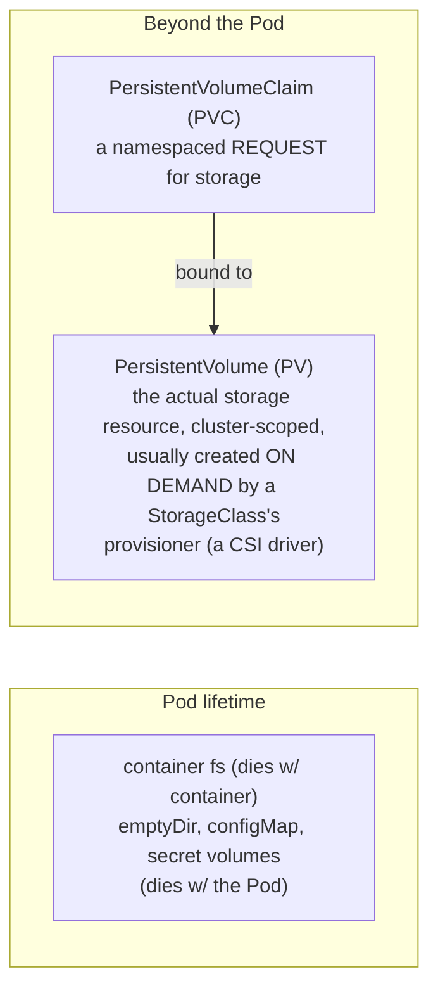

**TL;DR:** You write `localhost:3000` when developing locally. A container's writable layer dies with the container, same as your laptop container. Pod-scoped volumes (`emptyDir`, `configMap`, `secret`) share data only within one Pod. Use a `PersistentVolumeClaim` to request storage that lives outside the Pod.

> **In plain English (30 sec):** You already run `docker run app` on laptop, everything disappears if container stops. This is same idea in Kubernetes: container fs dies with container, volumes share data inside Pod, PVC connects to disk that lives beyond Pod.

**Real repo:** [`prometheus-operator/kube-prometheus`](https://github.com/prometheus-operator/kube-prometheus)

## 1. The Engineering Problem: container filesystem dies with the container

A container's writable layer is exactly as disposable as the container itself — same as `docker run app` on your laptop. Restart it — crash, redeploy, OOM-kill — and anything it wrote is gone. Fine for a stateless web server, disaster for databases, uploads, metrics history that monitoring scrapes.

Intuitive fix: "write to node's disk instead" (`hostPath`). This just moves the problem: data pinned to one specific node. When Pod reschedules elsewhere — node drains, cordoned, or dies — Pod comes back with empty directory, because data never left old machine.

Need storage decoupled from any single container **and** any single node — something that outlives the Pod using it, and can follow a rescheduled Pod wherever it lands.

## 2. The Technical Solution: Volumes for Pod-scoped sharing, PV/PVC for storage that outlives the Pod

Kubernetes has two different problems under "volumes", and conflating them is the most common confusion:



**In simple words:** Most volume types are only for sharing data within a Pod. PVC requests storage outside the Pod's lifecycle.

3 things to remember:

- **Most "volumes" aren't about persistence.** `emptyDir`, `configMap`, `secret` volumes are all scoped to the Pod's own lifetime — they share data between containers *in the same Pod*, or project API objects into the filesystem as files. Only a volume backed by a `PersistentVolumeClaim` survives Pod being deleted and recreated.
- **A PVC is a request, not the storage itself.** You (or a Deployment/StatefulSet) create a PVC saying "I need 10Gi, `ReadWriteOnce`." The **PersistentVolume** is the object that actually represents bound, provisioned storage — and in virtually all modern clusters, you never hand-create one: a `StorageClass` names a provisioner (CSI driver for EBS, Persistent Disk, Ceph, etc.), and that provisioner creates the PV automatically the moment a matching PVC appears.
- **What happens after PVC is deleted is a policy.** The PV's `reclaimPolicy` decides: `Delete` (the default for most dynamically-provisioned classes — the underlying disk is destroyed with the claim) or `Retain` (the disk survives, orphaned, for an admin to handle manually). Deleting a PVC on the wrong reclaim policy is a classic way to either leak cloud disks forever or destroy data by accident.

## 3. Concept in Isolation

```yaml
apiVersion: v1
kind: PersistentVolumeClaim
metadata:
  name: report-data
spec:
  accessModes:
    - ReadWriteOnce            # one node can mount this read-write at a time
  resources:
    requests:
      storage: 5Gi
  storageClassName: standard    # names a StorageClass → its CSI provisioner creates
                                  # the actual PersistentVolume on demand
---
apiVersion: apps/v1
kind: Deployment
metadata:
  name: report-generator
spec:
  replicas: 1                   # ReadWriteOnce + a real disk: this can't safely scale
  selector: { matchLabels: { app: report-generator } }
  template:
    metadata: { labels: { app: report-generator } }
    spec:
      containers:
      - name: app
        image: mycompany/report-app:v1
        volumeMounts:
        - name: data
          mountPath: /var/lib/report-data   # survives container restart
        - name: scratch
          mountPath: /tmp                    # does NOT survive — wiped every restart
      volumes:
      - name: data
        persistentVolumeClaim:
          claimName: report-data             # ties Pod to durable storage
      - name: scratch
        emptyDir: {}                          # Pod-scoped only, for contrast
```

**What this does:** `emptyDir: {}` is discarded on Pod restart. PVC attaches to disk that lives beyond Pod.

## 4. Real Production Incident

**Incident: Grafana storage disappears during node drain**

**T+0:** Monitoring creates Grafana Pod with `emptyDir` named `grafana-storage` for runtime state.

**T+5m:** Node drain starts, Pod gets evicted. Grafana loses its SQLite state (`grafana-storage` gone).

**T+15m:** Pod recreates, rebuilt dashboards and datasources from ConfigMaps again. Service degraded for 10 minutes during drain.

**Impact:** Grafana unavailable for 10 minutes, dashboard reload delays.

**Root cause:** Using `emptyDir` for data that should persist. Pod-scoped volumes don't survive eviction.

**Fix:**
```yaml
# For Grafana stateful app, use PersistentVolumeClaim
apiVersion: v1
kind: PersistentVolumeClaim
metadata:
  name: grafana-storage
spec:
  accessModes:
    - ReadWriteOnce
  resources:
    requests:
      storage: 10Gi
  storageClassName: standard
```

**Prevention:** Monitoring apps should use PVC for persistent data. Alerts for Grafana storage health. Validate PVC usage in production deployments.

## 5. Production Design — Prometheus's PVC from kube-prometheus

Real manifest from prometheus-operator — Prometheus's storage config:

```mermaid
flowchart TD
    subgraph GKE Node
        Kubelet
        subgraph Pod[Pod: prometheus-k8s-0]
            Prometheus["Prometheus<br/>TSDB volumes"]
        end
    end
    PV[PersistentVolume<br/>SSD disk allocated]<br/>stores metrics history --> Pod
    Service[ClusterIP Service<br/>prometheus:9090] --> Pod
```

**Real config from prod:**

```yaml
apiVersion: monitoring.coreos.com/v1
kind: Prometheus
metadata:
  name: k8s
nspec:
  storage:
    volumeClaimTemplate:
      apiVersion: v1
      kind: PersistentVolumeClaim
      spec:
        accessModes: [ReadWriteOnce]
        resources:
          requests:
            storage: 100Gi
        storageClassName: ssd
```

**3 takeaways:**
- **Persistence is opt-in**, not default — by design.
- **Jsonnet config** controls real Prometheus custom resource.
- **One template, many PVCs** per replica ordinal.

## 6. Cloud Lens — How GCP/AWS implement this

**GCP:**
- GKE Autopilot: use gcloud to create storage class for SSD.
- Command: `gcloud container clusters create-auto my-cluster`
- GKE uses `standard` storage class by default.

**AWS:**
- EKS: use AWS EBS CSI driver, create storage class named `ssd`.
- Command: `aws eks create-nodegroup --cluster my-cluster --instance-types m5.large`
- EKS uses gp2 or io1 EBS volumes by default.

**Terraform:**

```hcl
resource "kubernetes_persistent_volume_claim" "prometheus" {
  metadata {
    name = "prometheus-db"
  }
  spec {
    access_modes = ["ReadWriteOnce"]
    resources {
      requests = {
        storage = "100Gi"
      }
    }
    storage_class_name = "ssd"
  }
}
```

**Difference:** GCP stores metrics in regional disks by default. AWS stores metrics in EBS volumes mounted as PVs.

## 7. Library Lens — Exact library + code you would use

Go with **client-go**: 

```go
// go.mod: k8s.io/client-go v0.30.0
package main

import (
  corev1 "k8s.io/api/core/v1"
  metav1 "k8s.io/apimachinery/pkg/apis/meta/v1"
  "k8s.io/client-go/kubernetes"
)

// Create PVC for Prometheus
customResource := &corev1.PersistentVolumeClaim{
  ObjectMeta: metav1.ObjectMeta{Name: "prometheus-db"},
  Spec: corev1.PersistentVolumeClaimSpec{
    AccessModes: []corev1.PersistentVolumeAccessMode{corev1.ReadWriteOnce},
    Resources: corev1.VolumeResourceRequirements{Requests: corev1.ResourceList{corev1.ResourceStorage: resource.MustParse("100Gi")}},
    StorageClassName: ptr.To("ssd"),
  },
}
// clientset.CoreV1().PersistentVolumeClaims("monitoring").Create(ctx, customResource, metav1.CreateOptions{})
```

Bash alternative — what most teams use:

```bash
kubectl apply -f prometheus-pvc.yaml
# or for Prometheus custom resource
kubectl apply -f prometheus-cr.yaml
```

## 8. What Breaks & How to Troubleshoot

**Break 1: No PVC attached, Pod loses data on restart**
- Symptom: Storage is gone after Pod restarts, applications need to rebuild from ConfigMaps
- Why: Using wrong volume type like `emptyDir` instead of `PersistentVolumeClaim`
- Detect: Check Pod spec for `emptyDir` but no `persistentVolumeClaim` volume mount
- Fix: Replace `emptyDir` with `PersistentVolumeClaim` for persistent data

**Break 2: PVC stuck in Pending state**
- Symptom: PVC shows Pending with reason "NoVolumePlugins" or "Not enough resources"
- Why: Storage class missing, disk exhausted, or cluster configuration issue
- Detect: `kubectl describe pvc <name>` shows reason and message
- Fix: Create proper storage class, check cluster resources, configure correct CSI driver

**Break 3: Wrong storage class, wrong volume type**
- Symptom: Using incorrect volume type for workload requirements
- Why: Wrong storage class name or volume type selection
- Detect: Check PVC spec for `storageClassName` and `accessModes`
- Fix: Update storage class name or change volume type in Pod spec

**Break 4: Storage class missing from cluster**
- Symptom: Cannot create PVC because specified storage class doesn't exist
- Why: Storage class name typo or cluster configuration issue
- Detect: Check storage class list with `kubectl get storageclass`
- Fix: Create proper storage class or fix storage class name

**Break 5: Performance issues with persistent storage**
- Symptom: Slow I/O operations, high latency accessing persistent volumes
- Why: Wrong storage class choice or resource configuration
- Detect: Check storage class specifications and resource limits
- Fix: Choose appropriate storage class, adjust resource allocation

---
## Source

- **Concept:** Kubernetes `Volume`, `PersistentVolume`, and `PersistentVolumeClaim` — Pod-scoped vs. durable storage
- **Domain:** kubernetes
- **Repo:** [prometheus-operator/kube-prometheus](https://github.com/prometheus-operator/kube-prometheus) → [`manifests/grafana-deployment.yaml`](https://github.com/prometheus-operator/kube-prometheus/blob/main/manifests/grafana-deployment.yaml), [`examples/prometheus-pvc.jsonnet`](https://github.com/prometheus-operator/kube-prometheus/blob/main/examples/prometheus-pvc.jsonnet) — the production Prometheus + Alertmanager + Grafana monitoring stack


