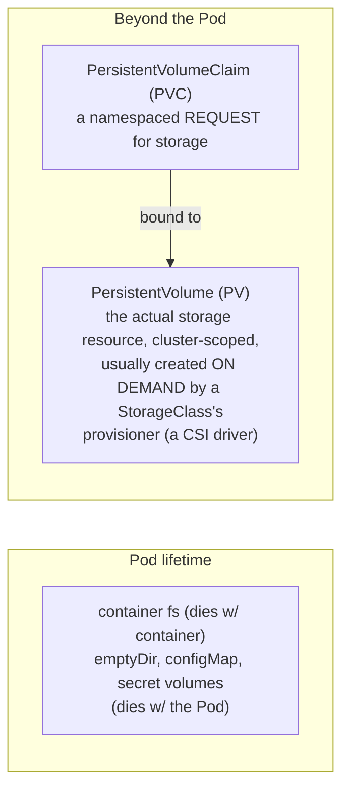

**TL;DR:** If a Pod is disposable, how does its data ever survive a restart? `emptyDir`, `configMap`, and `secret` volumes are Pod-scoped and die with the Pod, but a volume backed by a `PersistentVolumeClaim` survives — the PVC is just a request, bound to a cluster-scoped `PersistentVolume` that a StorageClass's provisioner creates independently of any one Pod or node.

> **In plain English (30 sec):** Think of a Pod like a small VM holding containers sharing same IP — like containers on localhost.

**Real repo:** [`prometheus-operator/kube-prometheus`](https://github.com/prometheus-operator/kube-prometheus)

## 1. The Engineering Problem: a container's filesystem dies with the container

A container's own writable layer is exactly as disposable as the container itself. Restart it — crash, redeploy, OOM-kill — and anything it wrote is gone. That's fine for a stateless web server, and a disaster for anything that needs to remember something: a database's data files, an in-progress upload, metrics history a monitoring stack has already scraped.

The instinctive fix, "write to a path on the node's disk instead" (`hostPath`), just moves the problem: that data is now pinned to *one specific node*. The moment the scheduler reschedules the Pod anywhere else — the original node drains, gets cordoned, or simply dies — the Pod comes back with an empty directory, because the data never left the old machine.

You need storage that is decoupled from any single container **and** any single node — something that outlives the Pod that's currently using it, and can follow a rescheduled Pod to wherever it lands next.

---

## 2. The Technical Solution: Volumes for Pod-scoped sharing, PV/PVC for storage that outlives the Pod

Kubernetes actually has two different problems bundled under "volumes," and conflating them is the single most common source of confusion:



Three things to hold onto:

1. **Most "volumes" aren't about persistence at all.** `emptyDir`, `configMap`, and `secret` volumes are all scoped to the Pod's own lifetime — they're there to share data between containers *in the same Pod*, or to project API objects (config, credentials) into the filesystem as files. Only a volume backed by a `PersistentVolumeClaim` survives the Pod being deleted and recreated.
2. **A PVC is a request, not the storage itself.** You (or an app's Deployment/StatefulSet) create a PVC saying "I need 10Gi, `ReadWriteOnce`." The **PersistentVolume** is the object that actually represents bound, provisioned storage — and in virtually all modern clusters, you never hand-create one: a `StorageClass` names a provisioner (a CSI driver for EBS, Persistent Disk, Ceph, etc.), and that provisioner creates the PV automatically the moment a matching PVC appears.
3. **What happens after you delete the PVC is a policy, not a given.** The PV's `reclaimPolicy` decides: `Delete` (the default for most dynamically-provisioned classes — the underlying disk is destroyed with the claim) or `Retain` (the disk survives, orphaned, for an admin to handle manually). Deleting a PVC on the wrong reclaim policy is a classic way to either leak cloud disks forever or destroy data by accident.

---

## 3. The clean example (the concept in isolation)

```yaml
apiVersion: v1
kind: PersistentVolumeClaim
metadata:
  name: report-data
spec:
  accessModes:
    - ReadWriteOnce            # one node can mount this read-write at a time
  resources:
    requests:
      storage: 5Gi
  storageClassName: standard    # names a StorageClass → its CSI provisioner creates
                                 # the actual PersistentVolume on demand
---
apiVersion: apps/v1
kind: Deployment
metadata:
  name: report-generator
spec:
  replicas: 1                   # ReadWriteOnce + a real disk: this can't safely scale
  selector: { matchLabels: { app: report-generator } }
  template:
    metadata: { labels: { app: report-generator } }
    spec:
      containers:
      - name: app
        image: mycompany/report-app:v1
        volumeMounts:
        - name: data
          mountPath: /var/lib/report-data   # survives this container restarting
        - name: scratch
          mountPath: /tmp                    # does NOT survive — wiped every restart
      volumes:
      - name: data
        persistentVolumeClaim:
          claimName: report-data             # ties this Pod to durable storage
      - name: scratch
        emptyDir: {}                          # Pod-scoped only, for contrast
```

Now here's what real volume usage in a production monitoring stack actually looks like — and it's mostly *not* the PVC pattern above.

---

## 4. Production reality (from the real repo)

### 4a. Grafana's Deployment — many volumes, almost none of them persistent

From `prometheus-operator/kube-prometheus`, `manifests/grafana-deployment.yaml` (dashboard mounts trimmed from ~30 down to a representative few; no license header in source):

```yaml
      volumes:
      - emptyDir: {}
        name: grafana-storage        # Pod-scoped scratch space for Grafana's own
                                      # runtime state — NOT where dashboards persist
      - name: grafana-datasources
        secret:
          secretName: grafana-datasources    # datasource config, projected as a file
      - configMap:
          name: grafana-dashboards
        name: grafana-dashboards
      - emptyDir:
          medium: Memory              # tmpfs — an in-RAM emptyDir, for plugin scratch
        name: tmp-plugins
      - configMap:
          name: grafana-dashboard-k8s-resources-pod
        name: grafana-dashboard-k8s-resources-pod
      # ...~25 more configMap volumes, one per bundled dashboard JSON
      - name: grafana-config
        secret:
          secretName: grafana-config
```

**What this teaches:**

- **A Pod can mount dozens of volumes, of several different types, none of them a PVC.** Every dashboard JSON file ships as its *own* ConfigMap, mounted as its own volume, at its own path (`/grafana-dashboard-definitions/0/<name>`) — Kubernetes has no problem with a Pod that looks like this in production; it isn't a special case.
- **`emptyDir: {}` here is genuinely disposable, and that's fine.** `grafana-storage` holds Grafana's local SQLite state — if this Pod is rescheduled, that's lost. In this repo's default config, Grafana's *durable* truth (dashboards, datasources) is re-provisioned from ConfigMaps/Secrets on every start, so losing the emptyDir costs nothing.
- **`medium: Memory`** turns an `emptyDir` into a tmpfs mount — RAM-backed, faster, and counted against the Pod's memory limit. A detail that never comes up until you're debugging why a Pod's memory usage looks higher than its process' own footprint suggests.

### 4b. Where the actual PVC lives — Prometheus's storage config

Prometheus and Alertmanager in this repo are Kubernetes *custom resources* (`kind: Prometheus`, `kind: Alertmanager`) — the `prometheus-operator` reads them and creates the real underlying StatefulSet and its volumes at runtime, so there's no plain `PersistentVolumeClaim` YAML checked into the repo's `manifests/` directory to show. What *is* checked in is the jsonnet config that controls it, `examples/prometheus-pvc.jsonnet`:

```jsonnet
prometheus+:: {
  prometheus+: {
    spec+: {
      // By default (if 'storage.volumeClaimTemplate' isn't set), Prometheus runs
      // with an EmptyDir for its TSDB volume — meaning by default, THIS MONITORING
      // STACK'S OWN METRICS HISTORY DOES NOT SURVIVE A POD RESCHEDULE.
      retention: '30d',

      storage: {
        volumeClaimTemplate: {
          apiVersion: 'v1',
          kind: 'PersistentVolumeClaim',
          spec: {
            accessModes: ['ReadWriteOnce'],
            resources: { requests: { storage: '100Gi' } },
            // A StorageClass of this name must already exist in the cluster —
            // dynamic provisioning creates ONE PersistentVolume per Prometheus
            // Pod ordinal via this template, not one shared PV.
            storageClassName: 'ssd',
            // selector is ONLY for manual/static provisioning — AWS explicitly
            // rejects it for dynamic provisioning (claim gets stuck Pending).
            // selector: { matchLabels: {} },
          },
        },
      },
    },
  },
},
```

**What this teaches that a hello-world can't:**

- **Persistence for a monitoring stack is opt-in, not assumed.** The comment in the *repo's own example file* states it plainly: no `storage.volumeClaimTemplate`, no durability — Prometheus defaults to `emptyDir` for its time-series database. "Prometheus obviously persists its data" is exactly the kind of assumption that costs someone their metrics history during a routine node drain.
- **This isn't a plain YAML manifest — and that's real, not a simplification.** `kube-prometheus` is jsonnet-templated; this file *is* the production source of truth the maintainers ship, compiled down to the raw `Prometheus` custom resource's `spec.storage` field. Real infra config isn't always YAML-in-a-file; knowing how to read the config language a project actually chose is part of the job.
- **One `volumeClaimTemplate`, many PVCs.** Because Prometheus runs as a StatefulSet under the hood (next lesson's topic), this single template is stamped out **once per replica ordinal** — `prometheus-k8s-db-prometheus-k8s-0`, `...-1`, etc. — each bound to its own PV, not shared.

---

## Source

- **Concept:** Kubernetes `Volume`, `PersistentVolume`, and `PersistentVolumeClaim` — Pod-scoped vs. durable storage
- **Domain:** kubernetes
- **Repo:** [prometheus-operator/kube-prometheus](https://github.com/prometheus-operator/kube-prometheus) → [`manifests/grafana-deployment.yaml`](https://github.com/prometheus-operator/kube-prometheus/blob/main/manifests/grafana-deployment.yaml), [`examples/prometheus-pvc.jsonnet`](https://github.com/prometheus-operator/kube-prometheus/blob/main/examples/prometheus-pvc.jsonnet) — the production Prometheus + Alertmanager + Grafana monitoring stack


