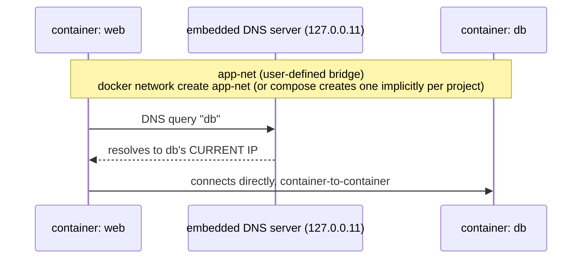

**TL;DR:** How does one container find another when IPs change on every restart? Every user-defined bridge network runs an embedded DNS server that resolves each container's name to its current IP on every lookup, so containers address each other by a stable service name instead of a hardcoded IP that goes stale the instant a container restarts.

> **In plain English (30 sec):** Code you already write — Map, function, API call, just bigger.

**Real repo:** [`traefik/traefik`](https://github.com/traefik/traefik)

## 1. The Engineering Problem: the address book is out of date the moment you write it

Every time a container restarts, it's a *new* container as far as networking is concerned — Docker assigns it a fresh IP from its network's address pool. Hardcode `172.17.0.4` into your app's config as "the database" and it's correct until the database container restarts, at which point it silently isn't, and nothing tells you.

Docker's old answer to this was `--link`, a flag that wired a static `/etc/hosts` entry from one container to another at `docker run` time. It solved name resolution for exactly the containers you linked, in exactly the order you started them, and broke the moment you needed a container to discover a *new* peer without being restarted — `--link` entries are baked in at container creation, not updated live.

You need containers to find each other by a stable **name**, resolved fresh every time, regardless of which IP that name currently happens to point to.

---

## 2. The Technical Solution: user-defined networks with embedded DNS

Every Docker network of type `bridge` gets a private, isolated Layer-2-ish segment on the host, and — critically — every **user-defined** bridge network (as opposed to the single default `bridge` network every host has out of the box) comes with Docker's built-in DNS server wired in automatically.



Single host → bridge network (what's above). Multiple hosts (Swarm) → overlay network: same DNS-by-name model, but traffic is encapsulated (VXLAN) and routed between the Docker daemons on each host.

Three things to hold onto:

1. **The *default* `bridge` network (the one every Docker host has without you creating anything) does NOT do this.** Containers on it can only reach each other by IP — no automatic name resolution. This is a frequent source of "why can't my containers see each other by name" confusion: the fix is a user-defined network, not a `--link`, and not the default bridge.
2. **Every user-defined bridge network runs an embedded DNS server at `127.0.0.11`** inside each container attached to it. A container's name (and any network aliases) resolves to its current IP, re-resolved on every lookup — so a restarted container with a new IP is found correctly on the very next query, with nothing to update by hand.
3. **Overlay networks extend the same name-based model across multiple Docker hosts** (Swarm mode), encapsulating container traffic between daemons so containers on different physical machines can still resolve and reach each other by service name — the mechanism scales up without the application changing how it looks anything up.

---

## 3. The clean Compose file (the concept in isolation)

```yaml
services:
  web:
    image: myapp:latest
    environment:
      - DB_HOST=db          # a NAME, never an IP -- resolved fresh via embedded DNS on every connection
    networks:
      - app-net

  db:
    image: postgres:16
    networks:
      - app-net

networks:
  app-net:                  # declaring this explicitly makes it a user-defined bridge network,
    driver: bridge           # with embedded DNS -- NOT the isolated, name-resolution-less default bridge
```

Even without `networks:` declared at all, `docker compose up` creates one project-scoped user-defined network automatically and attaches every service to it — which is why `DB_HOST=db` resolving by name "just works" in most Compose files without anyone writing a `networks:` block. Declaring it explicitly (as above) is only necessary when you need more than one network, custom aliases, or a non-default driver.

---

## 4. Production reality: dynamic discovery driven entirely by labels

Traefik doesn't get told which containers to route to in a static config file — it watches the Docker API and discovers them from labels on containers already attached to the same network. Here's Traefik's own basic reverse-proxy example, verbatim.

```yaml
services:

  traefik:
    image: "traefik:v3.7"
    container_name: "traefik"
    command:
      #- "--log.level=DEBUG"
      - "--api.insecure=true"
      - "--providers.docker=true"
      - "--providers.docker.exposedbydefault=false"
      - "--entryPoints.web.address=:80"
    ports:
      - "80:80"
      - "8080:8080"
    volumes:
      - "/var/run/docker.sock:/var/run/docker.sock:ro"

  whoami:
    image: "traefik/whoami"
    container_name: "simple-service"
    labels:
      - "traefik.enable=true"
      - "traefik.http.routers.whoami.rule=Host(`whoami.localhost`)"
      - "traefik.http.routers.whoami.entrypoints=web"
```

**What this teaches that a hello-world can't:**

- **`/var/run/docker.sock:/var/run/docker.sock:ro`** is the actual mechanism behind "dynamic" discovery: Traefik isn't polling DNS, it's talking directly to the Docker API (over the mounted socket) to watch container start/stop events and read their labels in real time. This is a bind mount used for daemon control, not data persistence — a different use of the mechanism from the volumes lesson.
- **`--providers.docker.exposedbydefault=false`** means a container needs `traefik.enable=true` explicitly, or Traefik ignores it even though it's on the same Docker network and technically reachable. Without this flag, *every* container with an exposed port becomes routable — a real security-relevant default most tutorials skip.
- **`traefik.http.routers.whoami.rule=Host(\`whoami.localhost\`)`** is metadata read from Docker's label API, not a config file Traefik was restarted to pick up — add a new container with the right labels and Traefik starts routing to it on its next event poll, no redeploy of Traefik itself required. This is what "dynamic service discovery via labels" means concretely.
- **Once Traefik decides to route to `whoami`, the actual proxied connection still goes over the network both containers share** — this compose file relies on Compose's implicit default network (no `networks:` block at all), which is only possible because both services are declared in the same compose file/project. In a larger stack spanning multiple compose files, you'd need an explicit shared user-defined network — the mechanism this lesson opened with.
- **Stale-fact check:** this pattern (label-driven dynamic discovery over a user-defined bridge) is what superseded manually maintained `--link` chains and static upstream lists in reverse-proxy configs — the reverse proxy discovers backends the same way any other container does: by asking Docker, not by a human editing an IP into a config file.

---

## Source

- **Concept:** User-defined bridge networks, embedded DNS-based service discovery, and Docker-label-driven dynamic routing
- **Domain:** docker
- **Repo:** [traefik/traefik](https://github.com/traefik/traefik) → [`docs/content/user-guides/docker-compose/basic-example/docker-compose.yml`](https://github.com/traefik/traefik/blob/master/docs/content/user-guides/docker-compose/basic-example/docker-compose.yml) — Traefik's own documented minimal Docker-provider example


