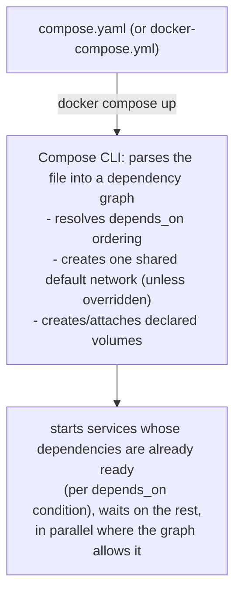

**TL;DR:** How do you start twenty dependent containers in the right order, reliably? `docker compose` reads a declarative YAML spec, resolves each service's `depends_on` graph, and — when a `condition: service_healthy` is declared — waits for a dependency's healthcheck to actually pass, not merely for its process to start, before bringing up whatever depends on it.
> **In plain English (30 sec):** Think of this like concepts you already use, but in a production system at scale.


**Real repo:** [`getsentry/self-hosted`](https://github.com/getsentry/self-hosted)

## 1. The Engineering Problem: one service is easy, a system of services is not

A single `docker run` command is fine for one container. A real application is never one container — it's a web process, a database, a cache, a message broker, maybe a search index and a reverse proxy, each with its own image, environment variables, ports, and volumes. Starting that by hand means remembering (or scripting) a long, ordered sequence of `docker run` invocations, getting the shared network right, and re-deriving the whole thing from memory every time someone new joins the project or CI needs to spin the stack up.

Shell scripts wrapping `docker run` calls are the naive fix, and they rot fast: no declarative source of truth, no dependency ordering beyond whatever order the lines happen to be in, and no shared vocabulary for "is the database actually ready yet" versus "did the database container merely start."

You need one file that declares the whole system — every service, how they depend on each other, and what "ready" means for each — and a tool that reads it and does the right thing.

---

## 2. The Technical Solution: a declarative multi-service spec, executed by the `docker compose` CLI plugin

**Stale-fact correction up front:** `docker-compose` (the standalone Python binary, V1) is legacy. The current implementation is `docker compose` (no hyphen) — a CLI plugin built into Docker Engine/Desktop, implementing the [Compose Specification](https://docs.docker.com/reference/compose-file/). It's a different binary with different performance characteristics, not just a renamed alias — tutorials still teaching `docker-compose up` are teaching the legacy tool.



Three things to hold onto:

1. **`depends_on` controls ordering, and — with a `condition:` — controls *readiness*, not just start order.** `condition: service_started` just waits for the process to launch; `condition: service_healthy` waits for that service's `healthcheck` to pass first. Getting this distinction wrong is the single most common cause of "my app container crash-loops because the database wasn't ready yet."
2. **YAML anchors (`&name` / `*name` / `<<:` merge) are how real Compose files stay maintainable at scale.** A stack with dozens of services that all need the same restart policy or the same healthcheck timing doesn't repeat that block dozens of times — it defines it once and merges it in everywhere.
3. **One compose project gets one default network automatically.** Every service in the file can reach every other by service name without anyone declaring a `networks:` block — the networking lesson's embedded-DNS mechanism, applied automatically at the project level.

---

## 3. The clean Compose file (the concept in isolation)

```yaml
services:
  api:
    build: ./api
    depends_on:
      db:
        condition: service_healthy   # wait for db's healthcheck, not just "db started"
      cache:
        condition: service_started    # cache has no healthcheck defined -- just wait for the process

  db:
    image: postgres:16
    healthcheck:
      test: ["CMD-SHELL", "pg_isready -U postgres"]
      interval: 5s
      timeout: 3s
      retries: 5

  cache:
    image: redis:7-alpine
```

`api` won't even attempt to start until `db`'s healthcheck reports healthy — not merely running. Without `condition: service_healthy`, Compose would start `api` the instant the `postgres` process launches, which is well before Postgres is actually accepting connections; that gap is exactly where "works on my machine, crash-loops in CI" bugs come from.

---

## 4. Production reality: a stack with dozens of interdependent services

Sentry's self-hosted deployment (`getsentry/self-hosted` — the actual real-world `docker-compose.yml` behind the curated repo list; `getsentry/sentry` itself doesn't ship one) defines around 70 services. The full file is 837 lines; below is the part the annotations actually reference — the anchors, plus enough of `sentry_defaults`/`pgbouncer` to show them in use. Verbatim where kept, elided where noted.

```yaml
x-restart-policy: &restart_policy
  restart: unless-stopped
x-pull-policy: &pull_policy
  pull_policy: never
x-depends_on-healthy: &depends_on-healthy
  condition: service_healthy
x-depends_on-default: &depends_on-default
  condition: service_started
x-healthcheck-defaults: &healthcheck_defaults
  interval: "$HEALTHCHECK_INTERVAL"     # operator-tunable via .env / shell env,
  timeout: "$HEALTHCHECK_TIMEOUT"       # substituted into the compose file itself
  retries: $HEALTHCHECK_RETRIES         # BEFORE Compose even parses it as YAML
  start_period: "$HEALTHCHECK_START_PERIOD"

x-sentry-defaults: &sentry_defaults
  <<: [*restart_policy, *pull_policy]
  depends_on:
    redis:       { <<: *depends_on-healthy }   # must be genuinely HEALTHY first —
    kafka:       { <<: *depends_on-healthy }   # a broken connection to any of
    pgbouncer:   { <<: *depends_on-healthy }   # these three crashes startup
    memcached:   { <<: *depends_on-default }   # these five only need to have
    smtp:        { <<: *depends_on-default }   # STARTED — a real, deliberate,
    seaweedfs:   { <<: *depends_on-default }   # per-dependency distinction,
    snuba-api:   { <<: *depends_on-default }   # not blanket for the whole service
    symbolicator: { <<: *depends_on-default }

services:
  redis:
    healthcheck:
      <<: *healthcheck_defaults
      test: redis-cli ping | grep PONG    # protocol-aware, not a generic template

  pgbouncer:
    healthcheck:
      <<: *healthcheck_defaults
      test: ["CMD-SHELL", "psql -U postgres -p 5432 -h 127.0.0.1 -tA -c \"select 1;\" -d postgres >/dev/null"]
    depends_on:
      postgres: { <<: *depends_on-healthy }   # a REAL query, not a fake port check

  # ... postgres and ~65 more services elided — same anchor-merge pattern,
  # one idiomatic healthcheck test per service ...

volumes:
  # pre-existing, managed OUTSIDE this file (created once by the install
  # script) — Compose refuses to start rather than silently creating fresh
  # empty ones, which would silently wipe apparent "persistence"
  sentry-data: { external: true }
  sentry-postgres: { external: true }
  sentry-redis: { external: true }

# ... (1 lines omitted)
```

**What this teaches that a hello-world can't:**

- **`x-sentry-defaults: &sentry_defaults` merged with `<<: [*restart_policy, *pull_policy]`** shows Compose's `x-` top-level keys convention: any key prefixed `x-` is ignored by Compose as a *service* but is fully valid YAML, so it's used purely as a place to define reusable anchors. Every service that needs "the standard restart policy" merges `*restart_policy` in with `<<:` instead of retyping `restart: unless-stopped` ~40 times across the file — this is what makes a 70-service file maintainable at all.
- **`sentry_defaults`' `depends_on` block mixes `*depends_on-healthy` and `*depends_on-default` on different dependencies of the *same* service** — Sentry's web process needs Redis, Kafka, and pgbouncer to be genuinely *healthy* before it starts (a broken connection to any of those crashes startup), but only needs `memcached`, `smtp`, and a few others to have merely *started* — a real, deliberate distinction between "must be ready" and "must exist," made per-dependency, not blanket for the whole service.
- **`pgbouncer` depends on `postgres` with `condition: service_healthy`, and its own healthcheck is a real `psql -tA -c "select 1;"` connectivity probe** — not a fake TCP port check, an actual query. `redis`'s healthcheck (`redis-cli ping | grep PONG`) and `postgres`'s (`pg_isready`) are each idiomatic for that specific service, not a generic template — proof that meaningful healthchecks are protocol-aware, not one-size-fits-all (the next lesson in this series goes deeper on this).
- **`$HEALTHCHECK_INTERVAL`, `$HEALTHCHECK_TIMEOUT`, etc. are environment-variable interpolation into the compose file itself**, not container environment variables — Compose substitutes these from a `.env` file or the shell environment *before* the YAML is even parsed as a service definition, which is how this project lets operators tune healthcheck aggressiveness globally without editing the compose file.
- **No `networks:` block appears anywhere in the full 837-line file.** Every one of these ~70 services reaches every other purely through Compose's implicit default project network and DNS-by-service-name (`DB_HOST: postgres`, `REDIS_HOST: redis` elsewhere in the file) — at this scale, that default is doing a lot of invisible work.
- **`external: true` on `sentry-data`, `sentry-postgres`, `sentry-redis`** marks those named volumes as pre-existing and managed *outside* this compose file (created once by the project's install script) — Compose will refuse to start if they don't already exist, rather than silently creating fresh empty ones, which would silently wipe apparent "persistence" on a botched deploy.

---

## Source

- **Concept:** Docker Compose multi-service orchestration — `depends_on` conditions, YAML anchors, the implicit default network
- **Domain:** docker
- **Repo:** [getsentry/self-hosted](https://github.com/getsentry/self-hosted) → [`docker-compose.yml`](https://github.com/getsentry/self-hosted/blob/master/docker-compose.yml) — Sentry's real self-hosted deployment stack (~70 services); used in place of `getsentry/sentry`, which does not itself ship a `docker-compose.yml`


