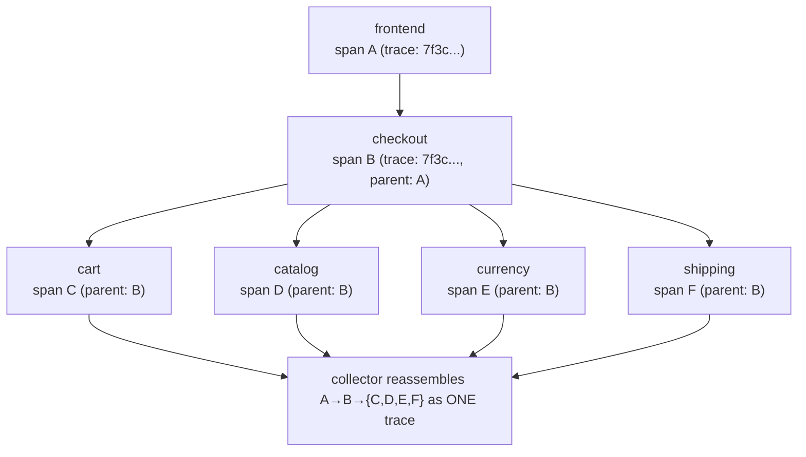
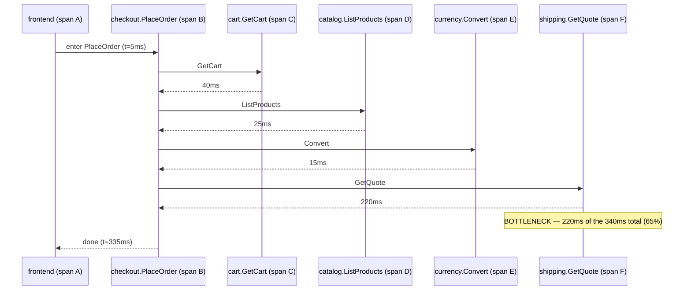

**TL;DR:** If checkout is slow, which of six downstream calls is actually to blame? Distributed tracing assigns a trace ID at the edge and propagates it through every hop so a collector can reassemble all the spans into one call graph with per-span timing, showing exactly which downstream call is the bottleneck.

> **In plain English (30 sec):** Code you already write — Map, function, API call, just bigger.

**Real repo:** [`GoogleCloudPlatform/microservices-demo`](https://github.com/GoogleCloudPlatform/microservices-demo), [`istio/istio`](https://github.com/istio/istio)

## 1. The Engineering Problem

A single "place order" click can fan out into calls to a cart service, a
catalog service, a currency converter, a shipping quoter, a payment
processor, and an email sender — six network hops behind one button.
When that request is slow, or fails, each of those six services logs its
own view of events, on its own timeline, with no shared identifier tying
them together. Reconstructing "what happened to this one request" means
grepping six separate log streams and lining them up by approximate
timestamp — which stops working the moment two requests overlap, or a
clock drifts, or a log line gets buffered.

The missing piece isn't more logging. It's a way for every hop in that
fan-out to know it's part of the *same* logical request, so the pieces can
be reassembled after the fact into one picture: which call was slow,
which one failed, and in what order they happened.

## 2. The Technical Solution: a trace ID that travels with the request

**Distributed tracing** assigns a trace ID at the edge and propagates it —
along with a per-hop span ID — through every subsequent call, in-band, as
part of the request itself (an HTTP header, gRPC metadata). A collector
later reassembles every span sharing a trace ID into one call graph, with
parent/child relationships intact.

**Macro view — the span tree a collector reassembles:**



**Zoom in — the same trace, with the numbers that actually matter.** Span
nesting alone doesn't tell you which of the six calls was the slow one; a
real trace does, because every span carries a start time and duration:



`shipping.GetQuote` being 220ms of a 340ms request is exactly the fact a
span-tree diagram with no numbers can't surface — it's why this specific
downstream call, not the other five, is where an on-call engineer should
look first.

There are two places this propagation can live, and both show up in real
systems:

- **Application-level**: an OpenTelemetry SDK reads/writes trace context
  into the headers or metadata of every outbound call the app makes — the
  app has to be instrumented, but it works regardless of what's in front
  of it.
- **Infrastructure-level**: a service mesh's sidecar proxy reads/writes
  trace headers on every call automatically, and a mesh-wide config tells
  every sidecar where to export spans — no application code involved, but
  it only covers traffic that actually passes through the mesh.

Core truths to hold:

- **Propagation is what makes a trace "distributed" at all.** The IDs
  travel *with* the request, in-band — that's why they live in
  headers/metadata, not in a side database correlated after the fact.
- **Sampling is an operational decision, not a footnote.** Tracing every
  request at scale has real infrastructure cost; production systems
  usually sample a percentage, and that percentage is itself a config
  value someone chose deliberately.
- **Where propagation lives changes its reach.** App-level instrumentation
  requires every service — even ones you didn't write — to cooperate;
  mesh-level propagation covers every workload inside the mesh uniformly,
  but stops at the mesh's edge.

## 3. The clean example (concept in isolation)

The same mechanism at both layers, minimal.

```go
// application-level: the SDK decides which header format to read/write,
// and every gRPC call automatically carries it once this is set
otel.SetTextMapPropagator(
    propagation.NewCompositeTextMapPropagator(
        propagation.TraceContext{}, propagation.Baggage{}))

srv := grpc.NewServer(grpc.StatsHandler(otelgrpc.NewServerHandler()))
```

```yaml
# infra-level: a mesh-wide Telemetry resource — no application code at all
apiVersion: telemetry.istio.io/v1
kind: Telemetry
metadata:
  name: mesh-tracing
spec:
  tracing:
  - providers:
    - name: otel-tracing
    randomSamplingPercentage: 10   # sample 10% of requests
```

Both do the same conceptual job — decide the propagation format, decide
the sample rate — at very different altitudes.

## 4. Production reality (from the real repo)

The application-level mechanism is already visible in `checkoutservice`
from [GoogleCloudPlatform/microservices-demo](https://github.com/GoogleCloudPlatform/microservices-demo)
— the same orchestrator this series used for inter-service communication,
now read for its tracing wiring specifically:

```go
// src/checkoutservice/main.go (trimmed to the tracing-relevant parts)

func main() {
    if os.Getenv("ENABLE_TRACING") == "1" {
        initTracing()
    }

    // Propagate trace context always
    otel.SetTextMapPropagator(
        propagation.NewCompositeTextMapPropagator(
            propagation.TraceContext{}, propagation.Baggage{}))

    srv = grpc.NewServer(
        grpc.StatsHandler(otelgrpc.NewServerHandler()),   // server-side propagation hook
    )
    pb.RegisterCheckoutServiceServer(srv, svc)
}

func initTracing() {
    var (
        collectorAddr string
        collectorConn *grpc.ClientConn
    )
    ctx := context.Background()
    ctx, cancel := context.WithTimeout(ctx, time.Second*3)
    defer cancel()

    mustMapEnv(&collectorAddr, "COLLECTOR_SERVICE_ADDR")
    mustConnGRPC(ctx, &collectorConn, collectorAddr)   // the exporter is JUST another gRPC client

    exporter, err := otlptracegrpc.New(
        ctx,
        otlptracegrpc.WithGRPCConn(collectorConn))
    if err != nil {
        log.Warnf("warn: Failed to create trace exporter: %v", err)
    }
    tp := sdktrace.NewTracerProvider(
        sdktrace.WithBatcher(exporter),
        sdktrace.WithSampler(sdktrace.AlwaysSample()))
    otel.SetTracerProvider(tp)
}

func mustConnGRPC(ctx context.Context, conn **grpc.ClientConn, addr string) {
    var err error
    _, cancel := context.WithTimeout(ctx, time.Second*3)
    defer cancel()
    *conn, err = grpc.NewClient(addr,
        grpc.WithTransportCredentials(insecure.NewCredentials()),
        grpc.WithStatsHandler(otelgrpc.NewClientHandler()))   // client-side propagation hook
    if err != nil {
        panic(errors.Wrapf(err, "grpc: failed to connect %s", addr))
    }
}
```

The infrastructure-level mechanism comes from
[istio/istio](https://github.com/istio/istio)'s own OpenTelemetry sample,
a real manifest applied on top of the mesh — no service code involved:

```yaml
# samples/open-telemetry/tracing/telemetry.yaml
apiVersion: telemetry.istio.io/v1
kind: Telemetry
metadata:
  name: otel-demo
spec:
  tracing:
  - providers:
    - name: otel-tracing
    randomSamplingPercentage: 0
```

That `Telemetry` resource only works because the mesh itself was told
about the `otel-tracing` provider first — a separate, mesh-wide
registration step documented alongside the manifest:

```yaml
# mesh config (from samples/open-telemetry/tracing/README.md) —
# registers WHERE the provider sends spans, mesh-wide
mesh: |-
  extensionProviders:
  - name: otel-tracing
    opentelemetry:
      port: 4317
      service: opentelemetry-collector.observability.svc.cluster.local
```

What this teaches that a hello-world can't:

- **`initTracing()` dials the trace collector with the exact same
  `mustConnGRPC` helper `checkoutservice` uses for its business calls to
  cart, catalog, and payment.** Tracing infrastructure isn't special-cased
  in this app — the exporter is just one more gRPC client sharing the same
  connection-setup code path as everything else.
- **`otel.SetTextMapPropagator(...TraceContext{}, Baggage{})` is the
  actual propagation contract.** This line decides which header format
  gets written on every outgoing call and read on every incoming one. If
  one service in the mesh sets this differently — or not at all — its
  spans silently stop linking to the rest of the trace; there's no error,
  just a broken trace graph.
- **`grpc.StatsHandler(otelgrpc.NewServerHandler())` and
  `grpc.WithStatsHandler(otelgrpc.NewClientHandler())` are stats-handler
  hooks the gRPC library itself calls on every RPC** — not manual
  header-copying in application logic. That's the actual mechanism behind
  why `PlaceOrder`'s six downstream calls all show up as children of one
  trace without a single line of propagation code inside `PlaceOrder`
  itself.
- **Istio's own sample ships `randomSamplingPercentage: 0` by default** —
  tracing stays off until someone explicitly opts in by raising that
  number. Combined with the separate `extensionProviders` mesh-config step,
  activating mesh tracing is a deliberate two-step process (register the
  provider mesh-wide, then opt a `Telemetry` resource into it) — not
  something that turns on by accident and surprises a team with a tracing
  bill.
- **The two files solve the identical depth-target problem — context
  propagation — at completely different altitudes.** `checkoutservice`
  needs roughly twenty lines of Go SDK wiring, present in every service
  that wants to participate. Istio's mesh needs six lines of YAML, applied
  once, covering every workload the mesh already intercepts. Neither
  approach is strictly better: the app-level one works even outside a
  mesh; the mesh-level one requires zero application code but only reaches
  as far as the mesh does.

---

## Source

- **Concept:** Distributed tracing & observability
- **Domain:** microservices
- **Repo:** [GoogleCloudPlatform/microservices-demo](https://github.com/GoogleCloudPlatform/microservices-demo) → [`src/checkoutservice/main.go`](https://github.com/GoogleCloudPlatform/microservices-demo/blob/main/src/checkoutservice/main.go) (application-level OpenTelemetry instrumentation) and [istio/istio](https://github.com/istio/istio) → [`samples/open-telemetry/tracing/telemetry.yaml`](https://github.com/istio/istio/blob/master/samples/open-telemetry/tracing/telemetry.yaml), [`samples/open-telemetry/tracing/README.md`](https://github.com/istio/istio/blob/master/samples/open-telemetry/tracing/README.md) (mesh-level trace propagation via the Telemetry API)


