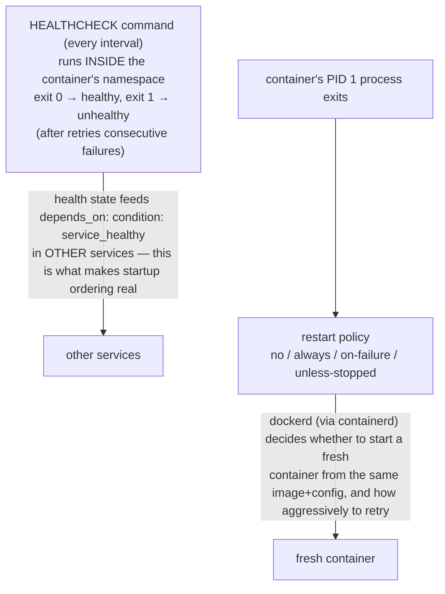
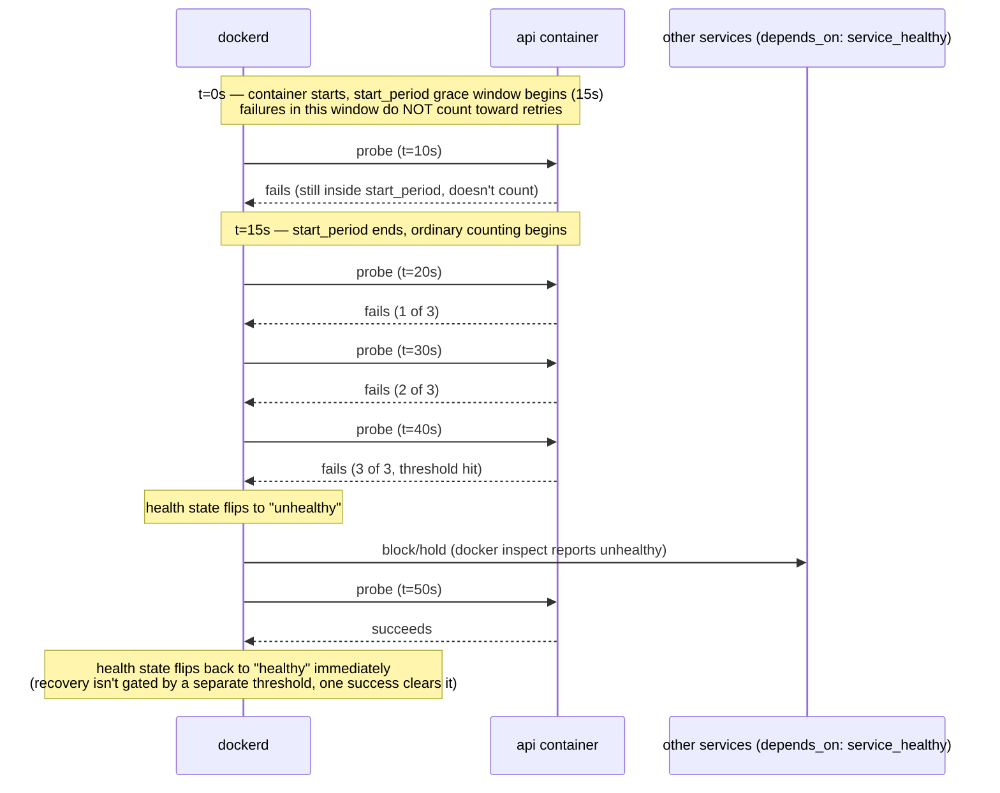

## 1. The Engineering Problem: "running" and "working" are not the same fact

`docker ps` reports a container's status based on one thing: whether its PID 1 process is still alive. That's it. A web server deadlocked on a stuck connection pool, a consumer that stopped reading from its queue hours ago, a process spinning in an infinite loop instead of serving requests — all of them show up as `Up 3 hours` next to a green light, because the process technically hasn't exited.

Before container-native health signaling, the honest answer to "is this actually working" required an external monitor polling the app's HTTP endpoint or tailing its logs, wired up separately from the container itself and easy to forget when a new service gets added. Worse, without a *restart policy*, a container that legitimately crashes just... stays dead, silently, until a human notices and runs `docker start`.

You need the container runtime itself to know the difference between "process alive" and "actually serving," and to act on both crashes and stuck-but-alive states without a human in the loop.

---

## 2. The Technical Solution: a probe the runtime runs for you, plus a policy for what happens on failure

`HEALTHCHECK` (in a Dockerfile or a compose file's `healthcheck:` key) declares a command Docker runs *inside* the container on an interval — its exit code, not the main process's liveness, decides the container's health state. A **restart policy** separately declares what the daemon does when the container's main process actually exits.

**Macro view — the two independent mechanisms:**



**Zoom in — the timeline of `api` flipping unhealthy**, using this lesson's
own `interval: 10s` / `retries: 3` / `start_period: 15s` (the `api` service
in section 3):



Three things to hold onto:

1. **A healthcheck's `test:` command runs inside the container's own PID/network/mount namespace**, so it sees exactly what the app sees — `curl http://localhost` inside the container tells you nothing about whether the *host* can reach the app, only whether the app answers on its own loopback. That's a feature, not a limitation: it isolates "is the app itself broken" from "is the network/proxy in front of it broken."
2. **Health state and restart policy are independent mechanisms that compose together.** An `unhealthy` container is not automatically restarted by Docker itself — health state is primarily an *input signal* (to orchestrators, to `depends_on: condition: service_healthy`, to your own tooling watching `docker inspect`). Only an actual process exit triggers a restart policy.
3. **Restart policies have real, different semantics**: `no` (default — never restart), `always` (restart no matter the exit code, even `docker stop`'d containers get restarted on daemon reboot), `on-failure[:max-retries]` (only on non-zero exit, with an optional cap), and `unless-stopped` (like `always`, but respects an explicit `docker stop` and won't restart until you `docker start` it again). Picking `always` for something you intend to manually stop for maintenance is a common, confusing mistake.

---

## 3. The clean Compose file (the concept in isolation)

```yaml
services:
  api:
    image: myapp:latest
    restart: unless-stopped        # crash → restart; explicit `docker stop` is respected
    healthcheck:
      test: ["CMD", "curl", "-f", "http://localhost:8080/healthz"]
      interval: 10s                 # how often to run the probe
      timeout: 3s                   # probe must finish within this or it counts as a failure
      retries: 3                    # this many CONSECUTIVE failures before state flips to "unhealthy"
      start_period: 15s             # grace window at startup where failures don't count against `retries`

  worker:
    image: myworker:latest
    restart: on-failure:5           # only restart on non-zero exit, and give up after 5 attempts
    depends_on:
      api:
        condition: service_healthy  # waits for api's healthcheck, not just its process starting
```

`start_period` is the detail most hand-written healthchecks get wrong: without it, a slow-starting app that takes 20 seconds to bind its port racks up failed probes immediately and can be marked unhealthy before it ever had a chance to come up — `start_period` gives it a startup grace window where failures don't count toward `retries`.

---

## 4. Production reality: healthchecks tuned per-protocol, and a restart-triggering dependency

Sentry's self-hosted stack applies a *shared* healthcheck timing default across services via a YAML anchor, but the actual `test:` command is different for every service — because "healthy" means something different for Redis than for Kafka than for an Nginx reverse proxy. It also uses a newer Compose Spec feature — `restart: true` on a `depends_on` entry — that restart policies alone can't express. Verbatim excerpts from the real file, annotated.

```yaml
x-healthcheck-defaults: &healthcheck_defaults
  # Avoid setting the interval too small — docker uses more CPU than expected (moby#39102)
  interval: "$HEALTHCHECK_INTERVAL"
  timeout: "$HEALTHCHECK_TIMEOUT"
  retries: $HEALTHCHECK_RETRIES
  start_period: "$HEALTHCHECK_START_PERIOD"
x-file-healthcheck: &file_healthcheck_defaults
  # Inline python so this anchor works across snuba, sentry, taskworker,
  # and launchpad images (python3 is on PATH in all of them; a mounted
  # script would have to be wired into every image base separately).
  # The try/except keeps the missing-file case to a single readable line
  # in `docker inspect` output instead of a multi-line traceback.
  test:
    - "CMD"
    - "python3"
    - "-c"
    - |
      import os, sys
      try:
          os.remove('/tmp/health.txt')
      except FileNotFoundError:
          print('consumer heartbeat file missing: /tmp/health.txt', file=sys.stderr)
          sys.exit(1)
  interval: "$HEALTHCHECK_FILE_INTERVAL"
  timeout: "$HEALTHCHECK_FILE_TIMEOUT"
  retries: $HEALTHCHECK_FILE_RETRIES
  start_period: "$HEALTHCHECK_FILE_START_PERIOD"

services:
  memcached:
    restart: unless-stopped
    image: "memcached:1.6.45-alpine"
    healthcheck:
      <<: *healthcheck_defaults
      # From: https://stackoverflow.com/a/31877626/5155484
      test: echo stats | nc 127.0.0.1 11211

  kafka:
    restart: unless-stopped
    image: "confluentinc/cp-kafka:7.6.6"
    healthcheck:
      <<: *healthcheck_defaults
      test: ["CMD-SHELL", "nc -z localhost 9092"]
      interval: 10s
      timeout: 10s
      retries: 30

  nginx:
    restart: unless-stopped
    ports:
      - "$SENTRY_BIND:80/tcp"
    image: "nginx:1.31.2-alpine"
    healthcheck:
      <<: *healthcheck_defaults
      test:
        - "CMD"
        - "/usr/bin/curl"
        - http://localhost
    depends_on:
      web:
        condition: service_healthy
        restart: true
      relay:
        condition: service_started
        restart: true
```

**What this teaches that a hello-world can't:**

- **Four completely different probe strategies for four services**: `memcached` speaks its own text protocol, so the healthcheck literally speaks it (`echo stats | nc`); `kafka`'s check is just "is the broker port accepting TCP connections" (`nc -z`) rather than a full protocol handshake, because a cheap liveness signal was judged sufficient there; `nginx` does a real HTTP request with `curl`. None of these are copy-pasted from a template — each is the cheapest check that's still a meaningful proxy for "this specific service is usable."
- **`kafka` overrides `interval`, `timeout`, and `retries` from the shared anchor** (`10s`/`10s`/`30` instead of the `$HEALTHCHECK_*` defaults) — YAML anchors merge, they don't lock; Kafka is slow enough to start that the project's authors decided it needed a longer, more patient probe schedule than the rest of the stack, and the anchor system lets that be a one-service exception instead of a global change.
- **`x-file-healthcheck` is a genuinely different *kind* of healthcheck** — not "can I reach a port," but "did this consumer process update its own heartbeat file recently." It's an inline Python one-liner (not a mounted script) specifically so the same anchor works across four different images without wiring a script into every one of their bases — a real engineering trade-off between "reusable" and "simple," documented in the file's own comments.
- **`restart: true` inside `nginx`'s `depends_on` entries** is a distinct mechanism from the top-level `restart:` policy on a service — it means "if `web` (or `relay`) itself gets restarted, restart `nginx` too," propagating a dependency's restart forward instead of just gating nginx's *initial* startup on it. This is a Compose Spec feature layered on top of, not a replacement for, the container-level restart policy each service also declares.
- **Mixing `condition: service_healthy` (for `web`) and `condition: service_started` (for `relay`) in the same `depends_on` block** is the same "must be ready vs. must merely exist" distinction from the Compose lesson, now paired with `restart: true` on both — nginx cares about both dependencies' initial readiness *and* wants to react if either restarts later, but doesn't require the same strength of initial guarantee from each.

---

## Source

- **Concept:** Docker/Compose `HEALTHCHECK` probes, restart policies, and dependency-triggered restarts (`depends_on: restart: true`)
- **Domain:** docker
- **Repo:** [getsentry/self-hosted](https://github.com/getsentry/self-hosted) → [`docker-compose.yml`](https://github.com/getsentry/self-hosted/blob/master/docker-compose.yml) — Sentry's real self-hosted deployment stack; used in place of `getsentry/sentry`, which does not itself ship a `docker-compose.yml`
