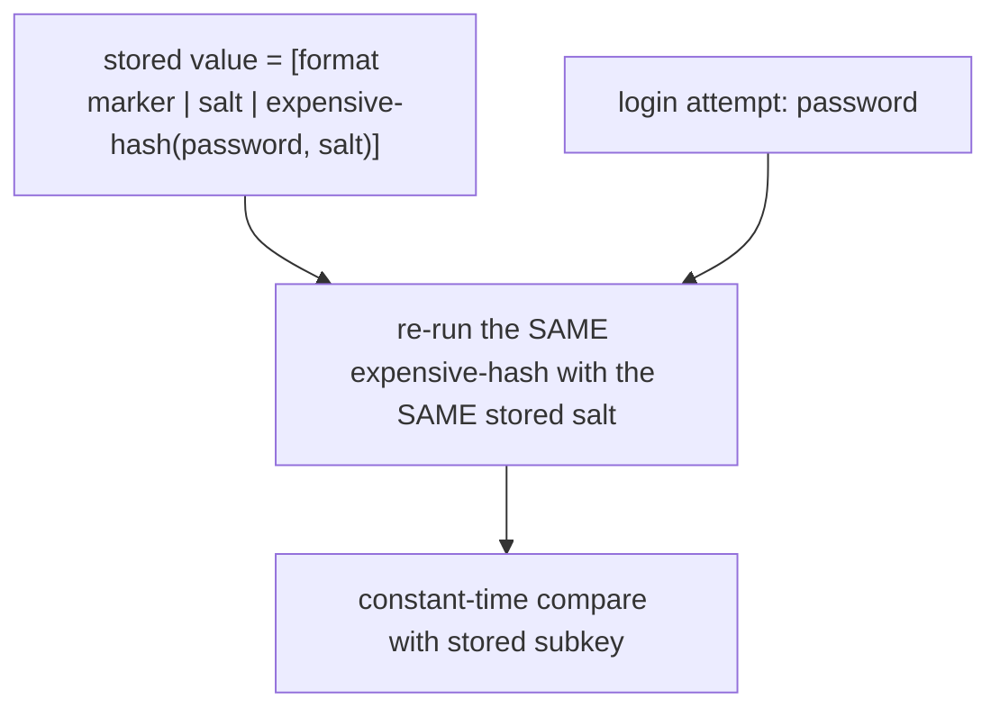

## 1. The Engineering Problem: a database breach shouldn't be a password breach

Sooner or later, someone gets read access to your `Users` table — a leaked backup, a
misconfigured replica, a SQL injection bug. The question that actually matters isn't
"can we prevent every breach forever" (we can't), it's: **when it happens, does the
attacker walk away with usable passwords, or with garbage?**

Storing plaintext is obviously wrong. The less obvious trap is storing a single fast
hash of the password (`MD5(password)`, `SHA256(password)`) and calling it done. Fast
cryptographic hashes are *designed* to be fast — which is exactly the wrong property
here. A modern GPU can compute billions of SHA-256 hashes per second, so an attacker
with the hash list just brute-forces every password in a common wordlist offline,
no rate limiting, no lockouts, no logging — the app never even sees the attempt.

And even a single unsalted hash has a second problem: two users with the same password
produce the *identical* stored hash, so an attacker who cracks one common password
(via a precomputed "rainbow table") instantly identifies every account using it.

## 2. The Technical Solution: make each guess expensive, and make precomputation useless

The fix has two independent parts:

- **A unique random salt per password**, mixed into the hash input. Same password,
  different salt, completely different output — rainbow tables become useless because
  there's no single table that covers every possible salt.
- **A deliberately slow, tunable hash** (a key derivation function like PBKDF2, or a
  memory-hard one like Argon2/bcrypt/scrypt) applied thousands of times in a loop. This
  "iteration count" is a dial: turn it up, and every single guess — including the
  attacker's — gets proportionally more expensive, while the legitimate login (which
  only pays that cost once) stays imperceptible to the user.



Three truths to hold:

1. The salt doesn't need to be secret — it's stored right alongside the hash. Its job
   is uniqueness, not secrecy.
2. The iteration count is a knob you're expected to keep turning up over time as
   hardware gets faster — which means whatever format you store has to encode *which*
   settings were used for *that* hash, so a 2019 hash and a 2026 hash can both still be
   verified.
3. Comparing the computed hash to the stored one must be constant-time — a naive
   byte-by-byte `==` that returns early on the first mismatch leaks timing information
   an attacker can use to guess the hash byte-by-byte.

## 3. The clean example (concept in isolation)

```csharp
// Minimal illustration — NOT the real ASP.NET Core implementation (see below for that).
// Strips out format versioning/migration to isolate just salt + iterated hashing.

byte[] salt = RandomNumberGenerator.GetBytes(16); // 128-bit random salt, unique per password

// PBKDF2: repeatedly apply HMAC-SHA512 to (password, salt) — the iteration count
// is the "expensive" part an attacker pays for on every single guess.
byte[] subkey = Rfc2898DeriveBytes.Pbkdf2(
    password: password,
    salt: salt,
    iterations: 100_000,
    hashAlgorithm: HashAlgorithmName.SHA512,
    outputLength: 32); // 256-bit derived key

// What you actually store is salt + subkey together — the salt is not secret.
byte[] stored = [.. salt, .. subkey];

// To verify: re-derive with the SAME stored salt and SAME iteration count,
// then compare in constant time (not shown) rather than a plain ==.
```

## 4. Production reality (from ASP.NET Core Identity)

This is the actual `PasswordHasher<TUser>` class from `dotnet/aspnetcore` — the code
that runs every time an ASP.NET Core app calls `UserManager.CreateAsync` or
`CheckPasswordAsync`. License header omitted; nothing else changed.

```csharp
namespace Microsoft.AspNetCore.Identity;

public class PasswordHasher<TUser> : IPasswordHasher<TUser> where TUser : class
{
    /* =======================
     * HASHED PASSWORD FORMATS
     * =======================
     *
     * Version 2:
     * PBKDF2 with HMAC-SHA1, 128-bit salt, 256-bit subkey, 1000 iterations.
     * Format: { 0x00, salt, subkey }
     *
     * Version 3:
     * PBKDF2 with HMAC-SHA512, 128-bit salt, 256-bit subkey, 100000 iterations.
     * Format: { 0x01, prf (UInt32), iter count (UInt32), salt length (UInt32), salt, subkey }
     * (All UInt32s are stored big-endian.)
     */

    private readonly int _iterCount;

    // ... HashPassword(), the constructor, and the two-argument overload of
    // HashPasswordV3 are elided here — they just route to the method below
    // with this instance's configured PRF/iteration count/salt size ...

    private static byte[] HashPasswordV3(string password, RandomNumberGenerator rng, KeyDerivationPrf prf, int iterCount, int saltSize, int numBytesRequested)
    {
        byte[] salt = new byte[saltSize];
        rng.GetBytes(salt);
        byte[] subkey = KeyDerivation.Pbkdf2(password, salt, prf, iterCount, numBytesRequested);

        var outputBytes = new byte[13 + salt.Length + subkey.Length];
        outputBytes[0] = 0x01; // format marker
        WriteNetworkByteOrder(outputBytes, 1, (uint)prf);
        WriteNetworkByteOrder(outputBytes, 5, (uint)iterCount);
        WriteNetworkByteOrder(outputBytes, 9, (uint)saltSize);
        Buffer.BlockCopy(salt, 0, outputBytes, 13, salt.Length);
        Buffer.BlockCopy(subkey, 0, outputBytes, 13 + saltSize, subkey.Length);
        return outputBytes;
    }

    public virtual PasswordVerificationResult VerifyHashedPassword(TUser user, string hashedPassword, string providedPassword)
    {
        byte[] decodedHashedPassword = Convert.FromBase64String(hashedPassword);

        if (decodedHashedPassword.Length == 0)
        {
            return PasswordVerificationResult.Failed;
        }
        switch (decodedHashedPassword[0])
        {
            case 0x01:
                if (VerifyHashedPasswordV3(decodedHashedPassword, providedPassword, out int embeddedIterCount, out KeyDerivationPrf prf))
                {
                    // If this hasher was configured with a higher iteration count, change the entry now.
                    if (embeddedIterCount < _iterCount)
                    {
                        return PasswordVerificationResult.SuccessRehashNeeded;
                    }

                    // V3 now requires SHA512. If the old PRF is SHA1 or SHA256, upgrade to SHA512 and rehash.
                    if (prf == KeyDerivationPrf.HMACSHA1 || prf == KeyDerivationPrf.HMACSHA256)
                    {
                        return PasswordVerificationResult.SuccessRehashNeeded;
                    }

                    return PasswordVerificationResult.Success;
                }
                else
                {
                    return PasswordVerificationResult.Failed;
                }

            default:
                return PasswordVerificationResult.Failed; // unknown format marker
        }
    }

    private static bool VerifyHashedPasswordV3(byte[] hashedPassword, string password, out int iterCount, out KeyDerivationPrf prf)
    {
        // ... reads prf, iterCount, saltLength, salt, subkey back out of the byte layout ...
        byte[] actualSubkey = KeyDerivation.Pbkdf2(password, salt, prf, iterCount, subkeyLength);
        return CryptographicOperations.FixedTimeEquals(actualSubkey, expectedSubkey);
    }
}
```

What this teaches that a hello-world "just call bcrypt" example can't:

- **The format is versioned on purpose.** Byte `0x00` means the old V2 format
  (HMAC-SHA1, 1,000 iterations); `0x01` means V3 (HMAC-SHA512, 100,000 iterations by
  default). Every stored hash carries its own recipe, so the same `PasswordHasher` can
  verify a password hashed five years ago *and* one hashed today.
- **`SuccessRehashNeeded` is a real return value, not just Success/Failed.** If a
  verified password was hashed with an older, weaker iteration count or a downgraded
  PRF, the hasher tells the caller to silently re-hash it with current settings on
  this successful login — the only point in the password's lifecycle where you have
  the plaintext available to upgrade it without forcing a reset.
- **`CryptographicOperations.FixedTimeEquals`**, not `==`, does the final comparison —
  a constant-time comparison specifically to deny an attacker a timing side-channel.
- **The iteration count is a live, mutable option** (`PasswordHasherOptions.IterationCount`,
  currently defaulting to 100,000 in this codebase) precisely so an operator can raise
  it as hardware gets faster, without changing a line of application code.

One stale fact worth correcting here: PBKDF2 is a real, still-safe KDF when tuned
correctly, but it's no longer OWASP's top recommendation — that's now Argon2id, a
*memory-hard* function that resists GPU/ASIC parallelization in a way PBKDF2 (which
only costs CPU time, not memory) doesn't. ASP.NET Core Identity's built-in hasher uses
PBKDF2 because it predates Argon2id's standardization and ships with zero external
dependencies via .NET's own cryptography APIs — a real, deliberate engineering
tradeoff, not an oversight. If you're building new auth from scratch today, reach for
an Argon2id library first; if you're maintaining a system already on
`PasswordHasher<TUser>`, the versioned envelope above is exactly what would let you
migrate to a new algorithm later without a forced password reset.

---

## Source

- **Concept:** Password hashing & credential storage
- **Domain:** security
- **Repo:** [dotnet/aspnetcore](https://github.com/dotnet/aspnetcore) → [`src/Identity/Extensions.Core/src/PasswordHasher.cs`](https://github.com/dotnet/aspnetcore/blob/main/src/Identity/Extensions.Core/src/PasswordHasher.cs) — the real password hasher used by ASP.NET Core Identity
