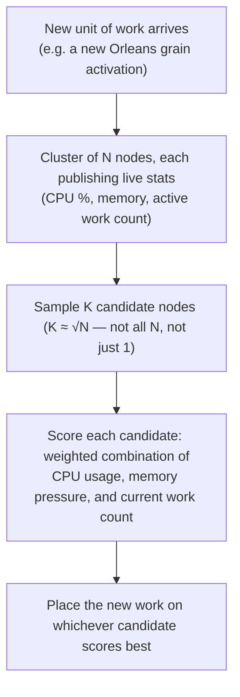

**TL;DR:** Does adding a tenth server actually help, or does it just move the bottleneck? Only if placement is load-aware — sampling a subset of nodes and scoring them on real-time CPU, memory, and active work count (as Orleans' `ResourceOptimizedPlacementDirector` does) — otherwise naive round-robin placement can leave the new server idle while others still fall over.

**Real repo:** [`dotnet/orleans`](https://github.com/dotnet/orleans)

## 1. The Engineering Problem: bigger box vs. more boxes

When a service starts choking under load, there are exactly two levers: make the box
it runs on bigger (**vertical scaling** — more CPU, more RAM, on the same node), or run
more copies of it (**horizontal scaling** — more nodes sharing the work).

Vertical scaling is simple to reason about but hits a wall fast: the biggest instance
type your cloud provider sells still has a ceiling, cost stops scaling linearly well
before you hit it, and a single box is still a single point of failure no matter how
large it is.

Horizontal scaling avoids that ceiling — but it introduces a problem vertical scaling
never had: **when a new unit of work arrives, which of your N nodes actually handles
it?** Get this decision wrong and you can add a tenth server and watch nine of them sit
idle while the tenth (or worse, one of the original nine) still falls over — because
whatever's deciding "where does this go" is ignoring the fact that load isn't evenly
spread to begin with.

## 2. The Technical Solution: placement has to look at real, current load

The naive answer — round-robin, or "just pick the next node in the list" — assumes
every node is in the same state. In practice, nodes are running different mixes of
work at any given moment: one might be mid-way through a burst of expensive requests
while its neighbor is nearly idle. Round-robin sends the next unit of work to whichever
node is *next*, not whichever node has *room*.

The fix used by real distributed runtimes (Microsoft Orleans is one) is **load-aware
placement**: score a handful of candidate nodes on their actual current resource usage,
and place the new unit of work on the best-scoring one.



Three truths to hold:

1. Vertical scaling has a hard physical (and pricing) ceiling; horizontal scaling's
   ceiling is a placement/coordination problem instead — a *different* kind of limit,
   not a free pass.
2. Checking literally every node's load before every placement decision doesn't scale
   either — that's its own bottleneck once N is in the hundreds. Sampling a small,
   randomized subset (√N is a common choice) and picking the best of *that* subset gets
   nearly the same quality of decision at a fraction of the coordination cost.
3. "More servers" only helps if the thing deciding where work goes actually looks at
   load. Round-robin distributes *requests* evenly; it does not distribute *load*
   evenly when work isn't uniform — which real workloads never are.

## 3. The clean example (concept in isolation)

```csharp
// Minimal illustration of load-aware placement — isolates the scoring idea
// from Orleans' full candidate-sampling and stack-allocation machinery.

record NodeStats(float CpuUsagePercent, float MemoryUsagePercent, int ActiveWorkItems);

float Score(NodeStats stats, int maxActiveWorkItems) =>
    0.5f * (stats.CpuUsagePercent / 100f) +
    0.3f * (stats.MemoryUsagePercent / 100f) +
    0.2f * (stats.ActiveWorkItems / (float)maxActiveWorkItems);
    // Lower score = more spare capacity = better placement target.

NodeStats Pick(NodeStats[] candidates, int maxActiveWorkItems) =>
    candidates.MinBy(c => Score(c, maxActiveWorkItems))!;

// Sample only √N candidates out of the full cluster before picking the best —
// this is what makes the decision cheap even as N grows into the hundreds.
```

## 4. Production reality (from Microsoft Orleans)

This is the real load-based placement director from `dotnet/orleans` — it decides
which silo (node) in a running cluster hosts each new grain activation. License header
omitted; nothing else changed.

```csharp
namespace Orleans.Runtime.Placement;

// See: https://www.ledjonbehluli.com/posts/orleans_resource_placement_kalman/
internal sealed class ResourceOptimizedPlacementDirector : IPlacementDirector, ISiloStatisticsChangeListener
{
    public Task<SiloAddress> OnAddActivation(PlacementStrategy strategy, PlacementTarget target, IPlacementContext context)
    {
        var compatibleSilos = context.GetCompatibleSilos(target);

        // ... trivial-case guards elided: a single compatible silo, or no stats
        // collected yet for this cluster, both short-circuit to a direct/random pick ...

        (int Index, float Score, float? LocalSiloScore) pick;
        pick = MakePick(/* ...stack-allocated span of candidate stats... */);

        // ... local-silo preference margin check omitted ...
        return Task.FromResult(compatibleSilos[pick.Index]);

        (int PickIndex, float PickScore, float? LocalSiloScore) MakePick(scoped Span<(int, ResourceStatistics)> relevantSilos)
        {
            // Only consider silos that aren't already overloaded.
            int relevantSilosCount = /* filtered count of non-overloaded compatible silos */ 0;

            // Pick K silos from the list of compatible silos, where K is equal to the square root of the number of silos.
            // Eg, from 10 silos, we choose from 4.
            int candidateCount = (int)Math.Ceiling(Math.Sqrt(relevantSilosCount));
            ShufflePrefix(relevantSilos, candidateCount);
            var candidates = relevantSilos[0..candidateCount];

            (int Index, float Score) pick = (0, 1f);
            foreach (var (index, statistics) in candidates)
            {
                float score = CalculateScore(in statistics, /* maxMaxAvailableMemory */ 0, /* maxActivationCount */ 0);
                float scoreJitter = Random.Shared.NextSingle() / 100_000f; // avoid always picking the first tie
                if (score + scoreJitter < pick.Score)
                {
                    pick = (index, score);
                }
            }
            return (pick.Index, pick.Score, null);
        }
    }

    private float CalculateScore(ref readonly ResourceStatistics stats, float maxMaxAvailableMemory, int maxActivationCount)
    {
        float score = _weights.CpuUsageWeight * (stats.CpuUsage / 100f);

        if (stats.MaxAvailableMemory > 0)
        {
            score += _weights.MemoryUsageWeight * stats.NormalizedMemoryUsage +
                     _weights.AvailableMemoryWeight * (1 - stats.NormalizedAvailableMemory) +
                     _weights.MaxAvailableMemoryWeight * (1 - stats.MaxAvailableMemory / maxMaxAvailableMemory);
        }

        score += _weights.ActivationCountWeight * (stats.ActivationCount / (float)maxActivationCount);
        return score; // lower is better: more spare capacity
    }
}
```

What this teaches that a "just add more replicas" diagram can't:

- **It's a real "power of K choices" algorithm, not textbook pseudocode.** Sampling
  `√(compatible silo count)` candidates instead of all of them is a deliberate,
  measured tradeoff between decision quality and coordination cost — the same idea
  behind why many production load balancers don't do exhaustive least-connections
  across a huge fleet either.
- **The score is a weighted blend of four real signals** (CPU usage, memory usage,
  available memory headroom, current activation/work count) — not a single metric.
  Different production clusters can weight these differently (`ResourceOptimizedPlacementOptions`)
  depending on whether they're more CPU-bound or memory-bound.
- **Jitter (`scoreJitter`) is deliberately added to break ties** — without it, every
  concurrent placement decision that sees the same snapshot of stats would pick the
  *same* "best" node, instantly creating a new hotspot out of the node that looked best
  a moment ago.
- **A local-silo preference margin exists** so a node doesn't ship work off-box to
  another node for a marginally-better score when handling it locally would avoid a
  network hop entirely — scaling out shouldn't mean throwing away cheap local wins.

---

## Source

- **Concept:** Scalability fundamentals (vertical vs horizontal scaling)
- **Domain:** system-design
- **Repo:** [dotnet/orleans](https://github.com/dotnet/orleans) → [`src/Orleans.Runtime/Placement/ResourceOptimizedPlacementDirector.cs`](https://github.com/dotnet/orleans/blob/main/src/Orleans.Runtime/Placement/ResourceOptimizedPlacementDirector.cs) — Microsoft's actor-framework runtime, distributing grain activations across a live cluster
