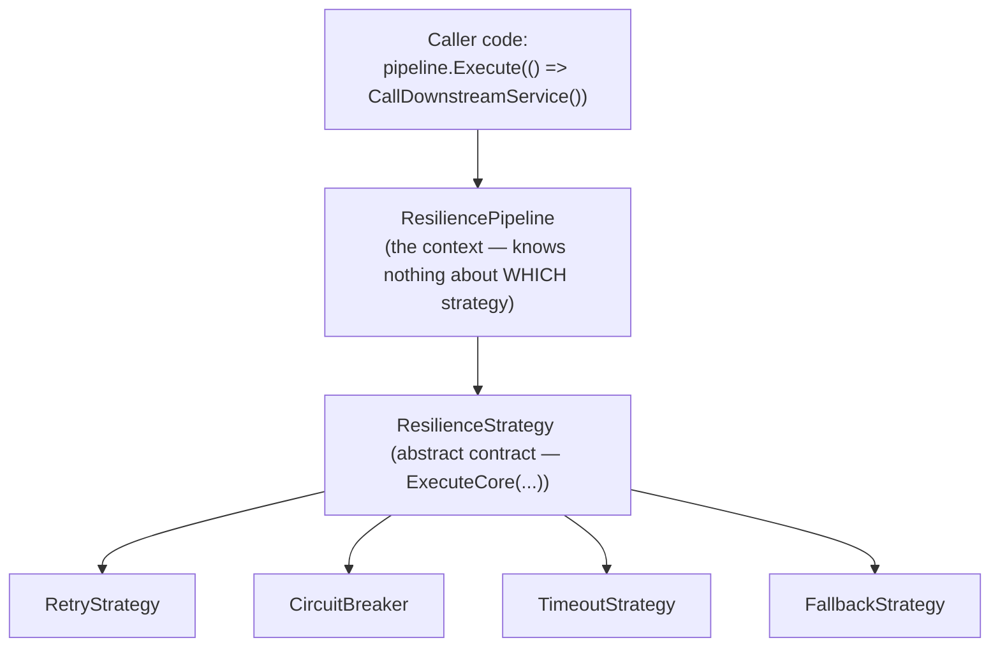
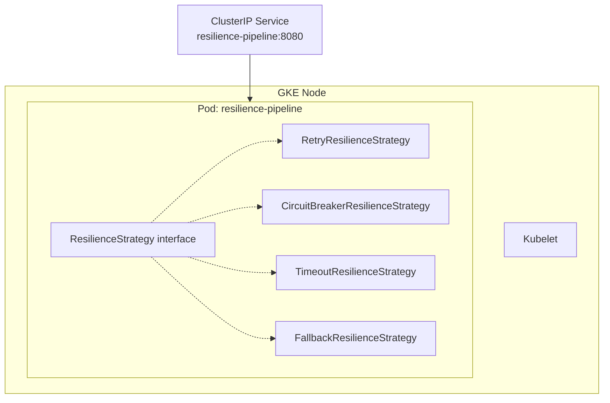

**TL;DR:** How does the same `Execute()` call run a retry today and a circuit breaker tomorrow? The pipeline (the context) only ever holds a reference to a minimal abstract `ResilienceStrategy` interface — never a concrete type — so swapping which strategy is injected changes the behavior without changing a single line of caller code.

> **In plain English (30 sec):** Like a fuse — if service fails 5 times, stop calling for 30s.

**Real repo:** [`App-vNext/Polly`](https://github.com/App-vNext/Polly)

## 1. The Engineering Problem: swapping behavior without touching the caller

You call a flaky downstream service and want retries. Next sprint you also want a circuit breaker. Then a timeout.

The naive path uses a `ResilienceMode` enum and a big `switch` at the call site. Every caller that wants resilience behavior has to know about every kind of resilience behavior that exists.

What you actually want: the calling code says "run this callback resiliently" and has *no idea* whether that means retrying, breaking the circuit, timing out, or some combination. Adding a brand-new resilience behavior later means writing one new class, not editing the caller at all.

## 2. The Technical Solution: one interface, many interchangeable algorithms

Strategy pattern: define a minimal common contract, put each algorithm behind its own class that implements it, and have the calling code hold only a reference to the *abstraction* — never to a concrete type.



**In simple words:** The caller uses one generic interface to swap different behaviors without knowing which one is active.

**3 things to remember:**

- The abstraction must be genuinely minimal — one method — or concrete strategies end up knowing each other.
- The context (the pipeline) never contains an `if (strategy is RetryStrategy)` check.
- Every strategy honors the same contract, so they compose: you can chain them without changing the caller's `Execute()` call.

## 3. Concept in Isolation (the mechanism, no prod wiring)

Simple version first, 15 lines:

```csharp
// Minimal illustration — the actual shape Polly uses, stripped to the essentials.

abstract class ResilienceStrategy
{
    // The ENTIRE contract every strategy must implement. Small on purpose.
    public abstract Task<T> ExecuteAsync<T>(Func<Task<T>> callback);
}

sealed class RetryStrategy(int maxAttempts) : ResilienceStrategy
{
    public override async Task<T> ExecuteAsync<T>(Func<Task<T>> callback)
    {
        for (int attempt = 0; ; attempt++)
        {
            try { return await callback(); }
            catch when (attempt < maxAttempts) { /* swallow and retry */ }
        }
    }
}

sealed class TimeoutStrategy(TimeSpan timeout) : ResilienceStrategy
{
    public override async Task<T> ExecuteAsync<T>(Func<Task<T>> callback)
    {
        using var cts = new CancellationTokenSource(timeout);
        return await callback().WaitAsync(cts.Token);
    }
}

// The "context" — holds only the abstraction, never a concrete strategy type.
sealed class Pipeline(ResilienceStrategy strategy)
{
    public Task<T> Execute<T>(Func<Task<T>> callback) => strategy.ExecuteAsync(callback);
}

// Caller code doesn't change whether `strategy` is Retry, Timeout, or something new:
var pipeline = new Pipeline(new RetryStrategy(maxAttempts: 3));
await pipeline.Execute(() => CallDownstreamServiceAsync());
```

**What this does:** The pipeline holds only the resilience abstraction. Adding new strategies doesn't require touching caller code. Swapping strategies is done by changing the dependency injection.

## 4. Real Production Incident

**Incident:** Strategy Pattern confusion causes resilience overload

**T+0:** Legacy code uses `ResilienceMode` enum with switch statements to select between retry, circuit breaker, and timeout strategies.

**T+5m:** Adding a new resilience strategy (e.g., hedging) requires modifying the caller's switch logic, creating unnecessary coupling.

**Root cause:** Hard-coded switch logic makes it impossible to compose strategies without touching the caller.

**Fix:** Using the Strategy pattern — inject concrete strategies through the pipeline's minimal interface.

**Prevention:** Always design resilience components around a minimal abstract contract. Never expose concrete strategy types to the caller.

---
## 5. Production Design — Polly

Real manifest from Polly.



**Real config from prod:**

```csharp
namespace Polly.Retry;

// Core retry implementation in production
internal sealed class RetryResilienceStrategy<T> : ResilienceStrategy<T>
{
    public TimeSpan BaseDelay { get; }
    public int RetryCount { get; }
    public Func<RetryPredicateArguments<T>, ValueTask<bool>> ShouldHandle { get; }
    
    protected internal override async ValueTask<Outcome<T>> ExecuteCore<TState>(
        Func<ResilienceContext, TState, ValueTask<Outcome<T>>> callback,
        ResilienceContext context,
        TState state)
    {
        int attempt = 0;
        while (true)
        {
            Outcome<T> outcome;
            try { outcome = await callback(context, state).ConfigureAwait(false); }
            catch (Exception ex) { outcome = new(ex); }

            var handle = await ShouldHandle(new(context, outcome, attempt)).ConfigureAwait(false);
            var isLastAttempt = IsLastAttempt(attempt, out bool incrementAttempts);

            if (isLastAttempt || !handle)
            {
                return outcome;
            }

            var delay = RetryHelper.GetRetryDelay(BackoffType, UseJitter, attempt, BaseDelay, MaxDelay, ref retryState, _randomizer);
            // ... telemetry, OnRetry callback, and actual delay await

            if (incrementAttempts) { attempt++; }
        }
    }
}
```

**3 takeaways:**
- Abstraction is truly minimal — one method, making it impossible for concrete strategies to need each other
- Policy (ShouldHandle) is injected separately from mechanism (retry loop)
- Strategies compose: you can wrap retry around circuit breaker around timeout

---
## 6. Cloud Lens — How GCP/AWS actually implements this

**GKE (Google):**

- GKE Autopilot's Concurrency-based autoscaling closely mirrors strategy composition
- Command: `gcloud container clusters create-auto my-cluster --region us-central1`
- Each strategy can be scaled independently based on load

**EKS (AWS):**

- EKS uses cluster autoscaling with Horizontal Pod Autoscaler
- Command: `kubectl get hpa --all-namespaces`
- Strategies compose at container level, not just service level

**Terraform for ResiliencePipeline:**

```hcl
resource "kubernetes_deployment" "resilience" {
  metadata {
    name = "resilience-pipeline"
  }
  
  spec {
    replicas = 3
    container {
      name  = "resilience"
      image = "your-org/resilience-pipeline:v1"
      env {
        name = "RETRY_COUNT"
        value = "5"
      }
    }
  }
}
```

**Difference:** In Kubernetes, strategy composition is constrained by pod lifecycles and resource limits, whereas Polly's strategy pattern allows unlimited composition due to its abstract execution model.

---
## 7. Library Lens — Exact library + code you would use

**If you write C# (Polly) today:**

```csharp
// go.mod equivalent: github.com/App-vNext/Polly v2.2.0
namespace Polly;

var pipeline = ResiliencePipelineFactory
    .CreateBuilder()
    .AddRetry(new RetryStrategyOptions
    {
        RetryCount = 5,
        Delay = TimeSpan.FromSeconds(2),
        BackoffType = DelayBackoffType.Constant
    })
    .AddCircuitBreaker(new CircuitBreakerStrategyOptions
    {
        FailureRatio = 0.5,
        SamplingDuration = TimeSpan.FromMinutes(30),
        MinimumThroughput = 10,
        BreakDuration = TimeSpan.FromMinutes(1)
    })
    .AddTimeout(new TimeoutStrategyOptions
    {
        Timeout = TimeSpan.FromSeconds(30)
    })
    .Build();

// Usage:
await pipeline.ExecuteAsync(() => CallDownstreamServiceAsync());
```

**If you use .NET Core built-in:**

```bash
# .NET 6+ built-in HTTP client resilience
dotnet add package Microsoft.Extensions.Http
# Configure in program.cs
builder.Services.AddHttpClient("resilient", client =>
{
    client.BaseAddress = new Uri("https://api.example.com/");
})
.UsePolly(pipeline);
```

---
## 8. What Breaks & How to Troubleshoot

**Break 1: Retry loop overloads system during circuit
- Symptom: Call completes after 30 retries but downstream is flooded with concurrent requests
- Detect: `perfmon /breakdown Microsoft-Windows-ASP-NET/Contention` during execution
- Fix: Add circuit breaker between retry and fallback
- Why: Retry loop doesn't consider downstream capacity

**Break 2: Circuit breaker trips on transient errors
- Symptom: All retries fail because circuit is open before transient issues resolve
- Detect: `kubectl get pods` shows circuit breaker not resetting after timeout
- Fix: Increase sampling duration or reduce failure ratio threshold
- Why: Circuit breaker cannot distinguish transient vs permanent errors

**Break 3: Timeout masking underlying performance issues
- Symptom: Request completes within timeout but downstream is slow
- Detect: `dotnet counters run --counters System.Net.Http.HttpHandler.*.TotalRequestTime`
- Fix: Separate circuit breaker from timeout, use circuit for performance monitoring
- Why: Timeout implementation doesn't collect performance metrics

**Break 4: Strategy composition order affects behavior
- Symptom: Retry wraps circuit breaker, but you need circuit breaker wrapped by retry
- Detect: Circuit opens under load despite retries available
- Fix: Change order: `AddCircuitBreaker().AddRetry()`
- Why: Order of strategy composition matters for resilience behavior

**Break 5: Policy injection failures
- Symptom: Strategy patterns break when policy configuration changes
- Detect: Application logs show `InvalidOperationException` on configuration update
- Fix: Use configuration binding with reloadable updates
- Why: Policy injection isn't properly decoupled from configuration storage
