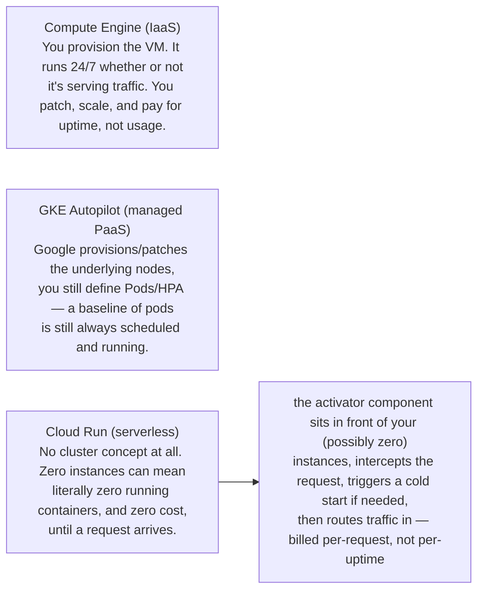

**TL;DR:** At what point does a GCP compute platform stop keeping anything running when there's no traffic, and how does it serve a request when that happens? Compute Engine VMs and GKE Autopilot's baseline Pods keep running regardless of traffic, but Cloud Run (built on Knative Serving) treats zero instances as a first-class state, with an activator component that intercepts a request and cold-starts an instance only when one arrives.

**Real repo:** [`GoogleCloudPlatform/microservices-demo`](https://github.com/GoogleCloudPlatform/microservices-demo), [`knative/serving`](https://github.com/knative/serving)

## 1. The Engineering Problem: every layer of "managed" trades control for automation

Run your app on a Compute Engine VM and you own everything: OS patching, capacity
planning, and — critically — the bill keeps running at 3am with zero traffic, because
the VM doesn't know your traffic is zero. It just exists.

GCP sells several "less ownership" layers above that, and they get taught as a vague
ladder — "IaaS, then PaaS, then serverless" — without ever showing the actual mechanism
that makes the top of that ladder different from the bottom. The real question a
solution architect needs answered isn't "which one is more managed," it's: **at what
point does the platform stop keeping anything running for you at all when there's no
traffic, and how does it get a cold request served when it does that?**

## 2. The Technical Solution: where the "always something running" assumption actually breaks



Three truths to hold:

1. Compute Engine's "scaling" is capacity you pre-provisioned; nothing about it knows
   your current traffic is zero.
2. A managed Kubernetes control plane (GKE Autopilot) removes node/OS management, but
   the cluster — and typically your baseline Pod replicas — is still a *running thing*
   even at zero traffic, unless you separately configure scale-to-zero.
3. True serverless (Cloud Run, built on the open-source Knative Serving project) makes
   "zero instances" a first-class, explicitly-modeled state, with a specific component
   (the activator) whose job is routing a request into a cluster that currently has
   nothing running for that service at all.

## 3. The clean example (concept in isolation)

```yaml
# Minimal illustration of what makes a serverless container service different:
# explicit annotations that model "how much traffic before we need another
# instance" and "how do we behave with zero instances running."
apiVersion: serving.knative.dev/v1
kind: Service
metadata:
  name: hello
spec:
  template:
    metadata:
      annotations:
        autoscaling.knative.dev/minScale: "0"    # zero is a real, supported state
        autoscaling.knative.dev/target: "50"      # target concurrent requests per instance
    spec:
      containerConcurrency: 50
      containers:
        - image: gcr.io/my-project/hello
# Compare: a Compute Engine VM or a baseline GKE Deployment has no equivalent of
# minScale: 0 — "the smallest number of running instances" is implicitly 1 or more.
```

## 4. Production reality (from a real GKE deployment and the real engine behind Cloud Run)

**GKE Autopilot** — the real Terraform from `GoogleCloudPlatform/microservices-demo`
provisioning the managed middle layer. License header omitted:

```hcl
# Create GKE cluster
resource "google_container_cluster" "my_cluster" {
  name     = var.name
  location = var.region

  # Enable autopilot for this cluster
  enable_autopilot = true

  # Set an empty ip_allocation_policy to allow autopilot cluster to spin up correctly
  ip_allocation_policy {
  }

  depends_on = [
    module.enable_google_apis
  ]
}
```

**Cloud Run's actual engine** — Cloud Run is Google's managed Knative Serving. This is
a real Knative Service manifest from `knative/serving`'s own load-test suite,
demonstrating the exact annotation that controls the activator's behavior at zero
instances. License header omitted:

```yaml
apiVersion: serving.knative.dev/v1
kind: Service
metadata:
  name: load-test-zero
  namespace: default
spec:
  template:
    metadata:
      annotations:
        # Only hook the activator in at zero
        autoscaling.knative.dev/targetBurstCapacity: "0"
    spec:
      containers:
      - image: ko://knative.dev/serving/test/test_images/autoscale
      containerConcurrency: 0 # Explicitly set the default, since it might be overridden in CM.
```

What this teaches that a "here's the pricing page" comparison can't:

- **`enable_autopilot = true` is one line, but it's the entire IaaS-vs-managed-PaaS
  boundary in this file.** Everything else in the Terraform — cluster name, region,
  API enablement — would be identical for a manually-managed GKE Standard cluster. The
  autopilot flag alone hands node provisioning and patching to Google while you keep
  thinking in Pods and Deployments.
- **`targetBurstCapacity` is a real, named knob controlling whether the activator stays
  in the request path.** Setting it to `"0"` means the activator only gets involved
  when there are exactly zero warm instances — i.e., it's specifically the scale-to-zero
  cold-start path, not a general-purpose traffic router.
- **`containerConcurrency` is what makes "how many instances do I need" a function of
  concurrent in-flight requests per instance, not a static replica count** — the
  mechanism that lets Cloud Run scale from zero to N based on actual load, in a way a
  fixed Compute Engine VM count structurally cannot.

---

## Source

- **Concept:** Compute Engine vs App Engine vs Cloud Run (IaaS → PaaS → serverless containers)
- **Domain:** gcp
- **Repo:** [GoogleCloudPlatform/microservices-demo](https://github.com/GoogleCloudPlatform/microservices-demo) → [`terraform/main.tf`](https://github.com/GoogleCloudPlatform/microservices-demo/blob/main/terraform/main.tf); [knative/serving](https://github.com/knative/serving) → [`test/performance/benchmarks/load-test/load-test-setup.yaml`](https://github.com/knative/serving/blob/main/test/performance/benchmarks/load-test/load-test-setup.yaml) — the open-source engine Cloud Run runs as a managed service
