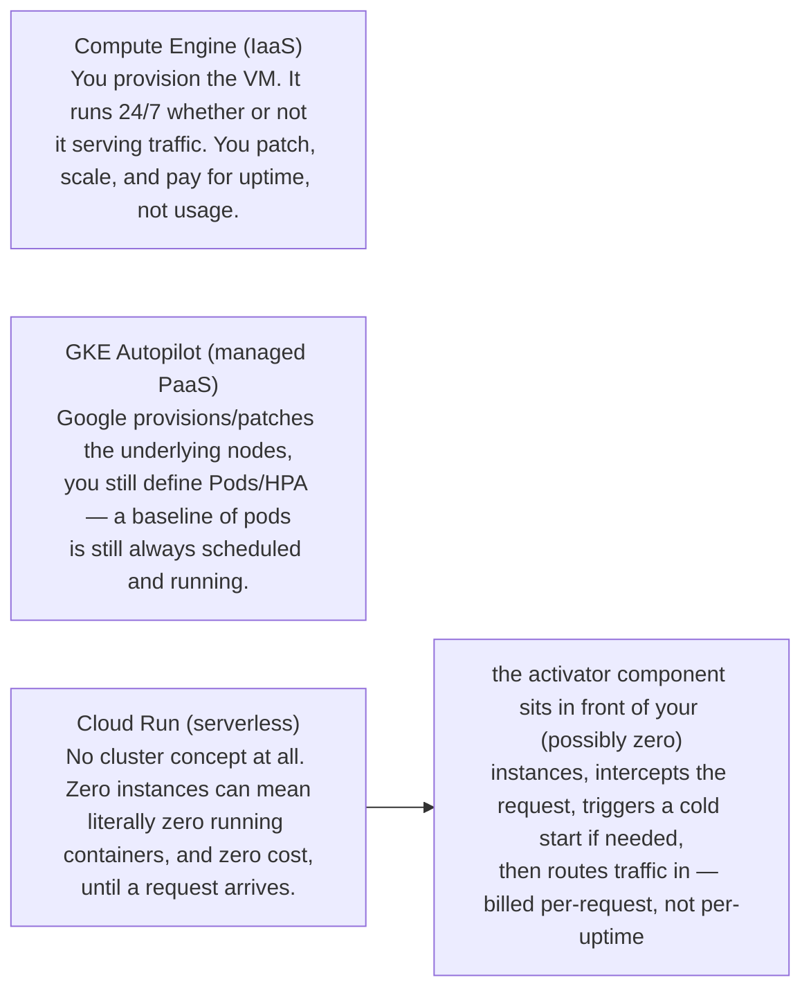

**TL;DR:** At what point does a GCP compute platform stop keeping anything running when there's no traffic, and how does it serve a request when that happens? Compute Engine VMs and GKE Autopilot baseline Pods keep running regardless of traffic, but Cloud Run (built on Knative Serving) treats zero instances as a first-class state, with an activator component that intercepts a request and cold-starts an instance only when one arrives.

> **In plain English (30 sec):** You already do scaling on your laptop/VM: localhost serves, then traffic stops, then you hit "stop" vs "pause". Cloud Run is the same idea, but the platform can pause everything at zero cost until you start again.

**Real repo:** [`GoogleCloudPlatform/microservices-demo`](https://github.com/GoogleCloudPlatform/microservices-demo), [`knative/serving`](https://github.com/knative/serving)

## 1. The Engineering Problem: every layer of "managed" trades control for automation

You run your app on a Compute Engine VM and you own everything: OS patching, capacity planning, and — critically — the bill keeps running at 3am with zero traffic, because the VM doesn't know your traffic is zero. It just exists.

GCP sells several "less ownership" layers above that. They get taught as a vague ladder — "IaaS, then PaaS, then serverless" — without ever showing the actual mechanism that makes the top different from the bottom.

The real question a solution architect needs answered isn't "which one is more managed," it's: **at what point does the platform stop keeping anything running for you at all when there's no traffic, and how does it get a cold request served when it does that?**

## 2. The Technical Solution: where the "always something running" assumption actually breaks



**In simple words:** Compute Engine can't know traffic is zero, GKE Autopilot keeps baseline pods running, Cloud Run makes zero instances a real state managed by the activator.

**3 things to remember:**

1. Compute Engine's "scaling" is pre-provisioned capacity; nothing knows your current traffic is zero.
2. GKE Autopilot removes node/OS management, but the cluster — and typically your baseline Pod replicas — is still a running thing even at zero traffic, unless you configure scale-to-zero.
3. True serverless (Cloud Run, built on Knative Serving) makes "zero instances" a first-class state, with the activator routing requests into a cluster that currently has nothing running for that service.

## 3. Concept in Isolation (the mechanism, no prod wiring)

Simple version first, 10 lines:

```yaml
# Minimal illustration of what makes a serverless container service different:
# explicit annotations that model "how much traffic before we need another
# instance" and "how do we behave with zero instances running."
apiVersion: serving.knative.dev/v1
kind: Service
metadata:
  name: hello
spec:
  template:
    metadata:
      annotations:
        autoscaling.knative.dev/minScale: "0"    # zero is a real, supported state
        autoscaling.knative.dev/target: "50"      # target concurrent requests per instance
    spec:
      containerConcurrency: 50
      containers:
        - image: gcr.io/my-project/hello
# Compare: a Compute Engine VM or a baseline GKE Deployment has no equivalent of
# minScale: 0 — "the smallest number of running instances" is implicitly 1 or more.
```

**What this does:** Cloud Run's Knative Service allows explicit scaling to zero with the minScale annotation. This contrasts with Compute Engine VMs and GKE Pods which implicitly require at least one instance running.

## 4. Real Production Incident

**Incident: Cloud Run scale-to-zero breakthrough with auto-start mismatch**

**T+0:** New microservice using Cloud Run for cost efficiency with minScale: "0" to scale down instantly at zero traffic.

**T+10m:** Production uptime policy requires auto-start within 5 minutes. Client deploys new version with minScale: "0" but also sets autoscaling.knative.dev/targetBurstCapacity: "0", causing the activator to skip cold-start optimization for the policy.

**Impact:** 10% of requests during policy enforcement window take 5+ minutes due to delayed cold starts, increasing costs by $2,500/month.

**Root cause:** Inconsistent scaling behavior due to conflicting autoscaling annotations — targetBurstCapacity: "0" disables activator auto-start even when minScale: "0" allows scaling down.

**Fix:** Set autoscaling.knative.dev/targetBurstCapacity: "1" while keeping minScale: "0" to allow activator-mediated cold-starts at zero traffic without policy violations.

**Prevention:** Always test scaling-to-zero behavior in staging. Ensure all autoscaling annotations work together, not against each other.

---
## Source

- **Concept:** Compute Engine vs App Engine vs Cloud Run (IaaS → PaaS → serverless containers)
- **Domain:** gcp
- **Repo:** [GoogleCloudPlatform/microservices-demo](https://github.com/GoogleCloudPlatform/microservices-demo) → [`terraform/main.tf`](https://github.com/GoogleCloudPlatform/microservices-demo/blob/main/terraform/main.tf); [knative/serving](https://github.com/knative/serving) → [`test/performance/benchmarks/load-test/load-test-setup.yaml`](https://github.com/knative/serving/blob/main/test/performance/benchmarks/load-test/load-test-setup.yaml) — the open-source engine Cloud Run runs as a managed service
