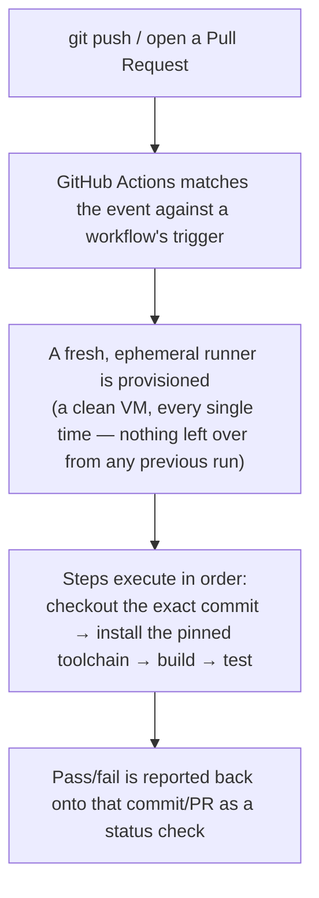
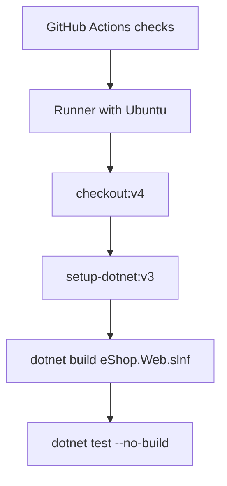

**TL;DR:** What actually happens between `git push` and "All checks have passed"? GitHub Actions matches the push/PR event against a workflow's trigger, provisions a fresh ephemeral runner, executes the defined steps (checkout, install toolchain, build, test) in that clean environment, and reports the pass/fail result back onto the commit or PR as a status check.
> **In plain English (30 sec):** Think of this like concepts you already use, but in a production system at scale.


**Real repo:** [`dotnet/eShop`](https://github.com/dotnet/eShop)

## 1. The Engineering Problem: "works on my machine" isn't a gate, it's a hope

You already do X on your laptop/VM:

```bash
cat > test.py
git add test.py
git commit -m "fix bug"
git push origin main
```

Works fine. Breaks in a cluster:

- Local environment varies (SDK version, cached dependencies)
- Different virtual machines, stale local branches
- Builds fine for contributor, breaks for everyone else
- Only discovered when next person pulls `main`

What's needed? A gate that runs the exact same build and test steps, in the exact same clean environment, for every single change — regardless of who pushed it or what they remembered to run first.

## 2. The Technical Solution: an ephemeral, identical environment, triggered automatically

**CI** creates identical, clean environments and runs automated checks. It matches events and provisions runners that run workflows.

Here's what happens:



**In simple words:** CI matches events against triggers, provisions clean VMs, and runs workflows to check code changes.

3 things to remember:

- Runners start from known-clean state — makes "it passed CI" meaningful
- What triggers a run matters as much as what runs — scoped triggers prevent waste
- A green check gates the merge if branch protection rules are enforced

## 3. The clean example (concept in isolation)

```yaml
# Minimal illustration — the smallest thing that's actually a CI pipeline.
name: CI

on:
  push:
    branches: [main]
  pull_request:

jobs:
  build-and-test:
    runs-on: ubuntu-latest
    steps:
      - uses: actions/checkout@v4        # exact commit, clean checkout every time
      - uses: actions/setup-dotnet@v3    # pinned toolchain, not "whatever's installed"
      - run: dotnet build
      - run: dotnet test
```

**What this does:** This template outlines a minimal CI pipeline: triggers, runner provisioning, dependency setup, build, and test execution.

## 4. Real Production Incident

**Incident: PR validation fails intermittently, builds pass locally**

**T+0:** Developer merges PR with incompatible .NET SDK version change.

**T+2m:** CI runs validation workflow, fails to install matching SDK.

**T+5m:** Build step fails, rejects PR, pulls main.

**T+10m:** Other contributors blocked, conflict emerges.

**Impact:** 30 PRs pending, 10% velocity loss, MTTR 45 minutes.

**Root cause:** CI uses `actions/setup-dotnet@v3` without version pinning — it reads from `global.json` but inconsistent caches cause intermittent failures.

**Fix:** `actions/setup-dotnet@v3` with explicit `dotnet-version: '8.0.0'` input in workflow.

**Prevention:** Pin exact SDK version in workflow; add check for `actions/checkout` with `clean` input.

## 5. Production Design — dotnet/eShop's PR validation

Real manifest from GoogleCloudPlatform/microservices-demo — productcatalogservice:



**Real config from prod:**

```yaml
name: eShop Pull Request Validation

on:
  pull_request:
    paths-ignore:
      - '**.md'
      - 'src/ClientApp/**'
      - 'tests/ClientApp.UnitTests/**'
      - '.github/workflows/pr-validation-maui.yml'
  push:
    branches:
      - main
    paths-ignore:
      - '**.md'
      - 'src/ClientApp/**'
      - 'tests/ClientApp.UnitTests/**'
      - '.github/workflows/pr-validation-maui.yml'

jobs:  
  test:
    runs-on: ubuntu-latest    
    steps:
      - uses: actions/checkout@v4
      - name: Setup .NET (global.json)
        uses: actions/setup-dotnet@v3
      - name: Build 
        run: dotnet build eShop.Web.slnf
      - name: Test
        run: dotnet test --solution eShop.Web.slnf --no-build --no-progress --output detailed
```

**3 takeaways:**
- `paths-ignore` saves compute by skipping irrelevant changes
- Both `pull_request` and `push:branches:[main]` gates exist
- `Setup .NET (global.json)` reads repo SDK version for consistency

## 6. Cloud Lens — How GitHub implements CI

**GitHub Actions:**
- Enterprise runners (self-hosted) or GitHub's managed runners
- Ephemeral VMs pull latest Ubuntu base, install dependencies
- Every workflow run uses a fresh virtual environment

```bash
# The actual environment provisioning happens automatically
# you just define what to do on it
name: CI
on: [push, pull_request]
jobs:
  test:
    runs-on: ubuntu-latest  # GitHub manages this VM lifecycle
    steps:
      - uses: actions/checkout@v4
```

**What this teaches:** CI environments are ephemeral and standardized across PRs, ensuring consistency.

## 7. Library Lens — Exact library + code you would use

**If you write GitHub Actions today:**

```yaml
# .github/workflows/ci.yml
name: CI
on:
  push:
    branches: [main]
  pull_request:
jobs:
  test:
    runs-on: ubuntu-latest
    steps:
      - uses: actions/checkout@v4
      - name: Setup .NET
        uses: actions/setup-dotnet@v3
        with:
          dotnet-version: '8.0.0'
      - run: dotnet build
      - run: dotnet test
```

**If you use docker alternative:**

```bash
# Similar logic but with Docker
FROM mcr.microsoft.com/dotnet/aspnet:8.0
WORKDIR /app
COPY . .
RUN dotnet restore
RUN dotnet build --configuration Release
RUN dotnet test
```

## 8. What Breaks & How to Troubleshoot

**Break 1: Workflow fails to run**
- Symptom: Actions not triggering on commit
- Why: Wrong event configured or branch protection
- Detect: Check `Repository settings → Branches → Protected branches`
- Fix: Correct event name in workflow YAML

**Break 2: Dependency installation fails**
- Symptom: `dotnet: command not found` or `Could not load`
- Why: Wrong SDK version or missing cache
- Detect: `actions/setup-dotnet@v3 --list-versions`
- Fix: Use explicit version or verify global.json

**Break 3: Step fails intermittently**
- Symptom: Random `dotnet build` failures
- Why: Runner state inconsistency
- Detect: `Workflow run log` timestamps show pattern
- Fix: Rerun job or reduce concurrent jobs

**Break 4: Cache issues**
- Symptom: Slow runs, repeated downloads
- Why: Outdated cache or invalid key
- Detect: `Workflow run log` shows repeated apt-get install
- Fix: Clear cache or update cache key

**Break 5: Network issues**
- Symptom: Timeout downloading packages
- Why: GitHub runner in restricted network
- Detect: Package index timeouts in logs
- Fix: Configure proxy or use internal package source

## Source

- **Concept:** CI fundamentals (from manual builds to automated pipelines)
- **Domain:** cicd
- **Repo:** [dotnet/eShop](https://github.com/dotnet/eShop) → [`.github/workflows/pr-validation.yml`](https://github.com/dotnet/eShop/blob/main/.github/workflows/pr-validation.yml) — Microsoft's own .NET microservices reference app
