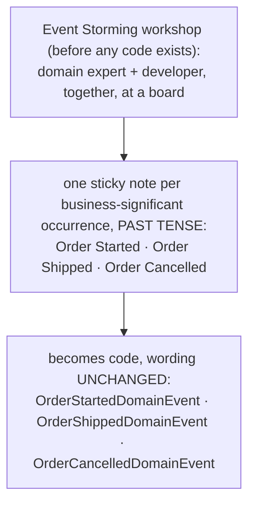

**TL;DR:** Why does this codebase call it `SetShippedStatus()` instead of `UpdateStatus(5)`? Because ubiquitous language requires the exact vocabulary domain experts use — surfaced through Event Storming as past-tense business facts like "Order Shipped" — to appear unchanged in code, so a method named after the business action (not the field it mutates) becomes the one place a business rule about that action can actually be enforced.

**Real repo:** [`dotnet/eShop`](https://github.com/dotnet/eShop)

## 1. The Engineering Problem: developers and domain experts default to different languages

Ask a developer how an order moves through the system and you'll often hear "we update
the status field." Ask the person who actually runs the warehouse and they'll say "the
order shipped." Those are two different vocabularies describing the same real event —
and every time code gets built from the developer's vocabulary alone, there's a gap
where a business rule the domain expert cares about ("you can't ship before it's
paid") quietly fails to get enforced, because the code was never modeling "shipping"
as a concept — just a field mutation.

The gap doesn't announce itself. It shows up months later as a support ticket for an
order that shipped without payment clearing, and nobody can point to the one place in
the code that was supposed to prevent it — because there wasn't one.

## 2. The Technical Solution: one vocabulary, used identically everywhere

**Ubiquitous language** is DDD's answer: the exact words domain experts use in
conversation must be the exact words that appear in code — class names, method names,
event names — with zero translation step in between. **Event Storming** is the
workshop technique most teams use to surface that vocabulary before any code exists:
developers and domain experts stand at a board and name every business-significant
occurrence as a sticky note, written in **past tense**, because that's how a domain
expert actually narrates a process ("the order *shipped*," not "we *ship* the order").



Three truths to hold:

1. The language has to be *identical* in meetings and in code, not translated by a
   developer afterward — the moment it's translated, the two groups can silently drift
   toward discussing different models without noticing.
2. Domain events are named as facts that already happened, in past tense — never as a
   technical CRUD verb like "Update" or "Save," because that's not how the business
   actually experiences the process.
3. A method named after the business action (not the field it happens to mutate) is
   the one place a business rule about that action can actually live and be enforced.

## 3. The clean example (concept in isolation)

```csharp
// Naive: technically correct, says nothing about business meaning,
// and enforces no rule about WHEN this is allowed to happen.
order.Status = 5;
db.SaveChanges();

// Ubiquitous-language version: reads exactly like the domain expert would say it,
// and the business rule lives at the one place named after the concept it protects.
public void SetShippedStatus()
{
    if (OrderStatus != OrderStatus.Paid)
        throw new OrderingDomainException("Can't ship an order that hasn't been paid.");

    OrderStatus = OrderStatus.Shipped;
    AddDomainEvent(new OrderShippedDomainEvent(this)); // "Order Shipped" — the sticky note, now code
}
```

## 4. Production reality (from dotnet/eShop's Ordering domain)

The three artifacts below live in two different folders of the same project — the
vocabulary staying identical across that folder boundary is part of the evidence:

```
src/Ordering.Domain/
├── AggregatesModel/OrderAggregate/
│   ├── Order.cs                        ← OrderStatus enum + Set*Status() methods
│   └── OrderStatus.cs
└── Events/
    ├── OrderStartedDomainEvent.cs       ← same words as the enum/methods, past tense
    ├── OrderShippedDomainEvent.cs
    └── OrderCancelledDomainEvent.cs
```

This is the real `Order` aggregate from `dotnet/eShop`. Three separate artifacts —
written at different points, by different methods on this class — use the *identical*
vocabulary, which is the actual evidence the ubiquitous language held across the
codebase. License headers omitted; logic unchanged.

The state names, as an enum:

```csharp
public enum OrderStatus
{
    Submitted = 1,
    AwaitingValidation = 2,
    StockConfirmed = 3,
    Paid = 4,
    Shipped = 5,
    Cancelled = 6
}
```

The transitions, named as business actions rather than field assignments:

```csharp
public void SetPaidStatus()
{
    if (OrderStatus == OrderStatus.StockConfirmed)
    {
        AddDomainEvent(new OrderStatusChangedToPaidDomainEvent(Id, OrderItems));
        OrderStatus = OrderStatus.Paid;
        Description = "The payment was performed at a simulated \"American Bank checking bank account ending on XX35071\"";
    }
}

public void SetShippedStatus()
{
    if (OrderStatus != OrderStatus.Paid)
    {
        StatusChangeException(OrderStatus.Shipped);
    }

    OrderStatus = OrderStatus.Shipped;
    Description = "The order was shipped.";
    AddDomainEvent(new OrderShippedDomainEvent(this));
}

public void SetCancelledStatus()
{
    if (OrderStatus == OrderStatus.Paid ||
        OrderStatus == OrderStatus.Shipped)
    {
        StatusChangeException(OrderStatus.Cancelled);
    }

    OrderStatus = OrderStatus.Cancelled;
    Description = "The order was cancelled.";
    AddDomainEvent(new OrderCancelledDomainEvent(this));
}
```

And the events themselves — named as completed business facts, not technical actions:

```csharp
public class OrderShippedDomainEvent : INotification
{
    public Order Order { get; }
    public OrderShippedDomainEvent(Order order) => Order = order;
}

public record class OrderStartedDomainEvent(
    Order Order,
    string UserId,
    string UserName,
    int CardTypeId,
    string CardNumber,
    string CardSecurityNumber,
    string CardHolderName,
    DateTime CardExpiration) : INotification;
```

What this teaches that a glossary document can't:

- **"Shipped," "Paid," and "Cancelled" appear identically in the enum, the method
  names, and the event class names** — three artifacts, written for three different
  purposes, using the exact same words. That repetition *is* the ubiquitous language;
  it's not a stylistic accident.
- **`SetShippedStatus()` refuses to run if `OrderStatus != OrderStatus.Paid`.** The
  business rule a domain expert would state as "you can't ship an unpaid order" isn't
  documented somewhere separate from the code — it's the first line of the method
  named after the exact action it's guarding.
- **The events are past-tense facts (`OrderShippedDomainEvent`), not commands
  (`ShipOrderCommand` would be a different, earlier point in the same flow).** Naming
  them this way is what lets other parts of the system react to "this already
  happened" without being coupled to *why* it happened or *what* triggered it.

---

## Source

- **Concept:** Ubiquitous language & event storming
- **Domain:** ddd
- **Repo:** [dotnet/eShop](https://github.com/dotnet/eShop) → [`src/Ordering.Domain/AggregatesModel/OrderAggregate/Order.cs`](https://github.com/dotnet/eShop/blob/main/src/Ordering.Domain/AggregatesModel/OrderAggregate/Order.cs) and [`src/Ordering.Domain/Events/`](https://github.com/dotnet/eShop/tree/main/src/Ordering.Domain/Events) — Microsoft's own .NET microservices reference app
