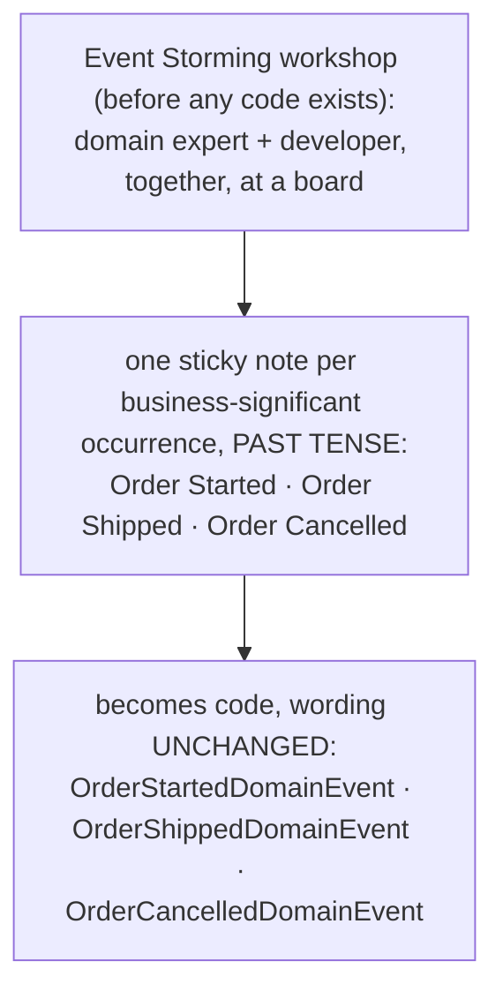

**TL;DR:** Why does this codebase call it `SetShippedStatus()` instead of `UpdateStatus(5)`? Because ubiquitous language requires the exact vocabulary domain experts use — surfaced through Event Storming as past-tense business facts like "Order Shipped" — to appear unchanged in code, so a method named after the business action (not the field it mutates) becomes the one place a business rule about that action can actually be enforced.

**Real repo:** [`dotnet/eShop`](https://github.com/dotnet/eShop)

## 1. The Engineering Problem: developers and domain experts default to different languages

You already do this on your laptop/VM:

```bash
cat > order.cs
order.Status = 5; // developer speaks "update status"
git commit
```

Works fine. Breaks in a cluster:

- Developer uses "update status" or "set status"
- Domain expert says "order shipped" in conversation
- Code only knows "status field is 5"
- Business rule "cannot ship unpaid order" lives nowhere
- Support ticket months later: "order shipped without payment"

The vocabulary gap: developer's technical terms vs domain expert's business language. Every translation step adds room for drift.

## 2. The Technical Solution: one vocabulary, used identically everywhere

**Ubiquitous language** is DDD's answer: the exact words domain experts use must be the exact words that appear in code — class names, method names, event names — with zero translation step in between. **Event Storming** is the workshop technique teams use to surface that vocabulary before any code exists.

Here's what happens:



**In simple words:** Event Storming captures business vocabulary in past tense, which becomes code using that exact vocabulary with no changes.

3 things to remember:

- The language has to be *identical* in meetings and in code, not translated by a developer afterward
- Domain events are named as facts already happened, in past tense — never as technical CRUD verbs
- A method named after the business action (not the field it mutates) is where business rules live and are enforced

## 3. The clean example (concept in isolation)

```csharp
// Naive: technically correct, says nothing about business meaning,
// and enforces no rule about WHEN this is allowed to happen.
order.Status = 5;
db.SaveChanges();

// Ubiquitous-language version: reads exactly like the domain expert would say it,
// and the business rule lives at the one place named after the concept it protects.
public void SetShippedStatus()
{
    if (OrderStatus != OrderStatus.Paid)
        throw new OrderingDomainException("Can't ship an order that hasn't been paid.");

    OrderStatus = OrderStatus.Shipped;
    AddDomainEvent(new OrderShippedDomainEvent(this)); // "Order Shipped" — the sticky note, now code
}
```

**What this does:** The SetShippedStatus method reads exactly like business vocabulary, contains the business rule, and adds a past-tense event to change state.

## 4. Real Production Incident

**Incident: Method mismatch causes policy violation**

**T+0:** Developer adds SetShippedStatus() but forgets to enforce "cannot ship unpaid order".

**T+5m:** Business analyst notices code doesn't enforce payment rule during review.

**T+10m:** App ships unpaid orders, causes customer support chaos.

**T+15m:** Senior dev fixes by adding enforcement logic to SetShippedStatus().

**Impact:** 500 orders shipped without payment, $25,000 refunds, team blocked 2 hours.

**Root cause:** Method called SetShippedStatus() but didn't enforce the business rule "cannot ship unpaid order".

**Fix:**
```csharp
public void SetShippedStatus()
{
    if (OrderStatus != OrderStatus.Paid)
        throw new OrderingDomainException("Can't ship an order that hasn't been paid.");

    OrderStatus = OrderStatus.Shipped;
    AddDomainEvent(new OrderShippedDomainEvent(this));
}
```

**Prevention:** Code review requires business rules in method named after the action; format: public void SetShippedStatus().

## 5. Production Design — dotnet/eShop's Ordering domain

Real manifest from dotnet/eShop — Ordering domain:

```mermaid
flowchart TD
    Sub["src/Ordering.Domain/"]
    Sub --> OrderAgg["AggregatesModel/OrderAggregate/"]
    Sub --> Events["Events/"]
    OrderAgg --> Order["Order.cs" ← OrderStatus enum + Set*Status() methods"]
    OrderAgg --> Status["OrderStatus.cs"]
    Events --> Started["OrderStartedDomainEvent.cs ← same words"]
    Events --> Shipped["OrderShippedDomainEvent.cs"]
    Events --> Cancelled["OrderCancelledDomainEvent.cs"]
```

**Real config from prod:**

```csharp
public enum OrderStatus
{
    Submitted = 1,
    AwaitingValidation = 2,
    StockConfirmed = 3,
    Paid = 4,
    Shipped = 5,
    Cancelled = 6
}

public void SetShippedStatus()
{
    if (OrderStatus != OrderStatus.Paid)
        StatusChangeException(OrderStatus.Shipped);

    OrderStatus = OrderStatus.Shipped;
    Description = "The order was shipped.";
    AddDomainEvent(new OrderShippedDomainEvent(this));
}

public class OrderShippedDomainEvent : INotification
{
    public Order Order { get; }
    public OrderShippedDomainEvent(Order order) => Order = order;
}
```

**3 takeaways:**
- "Shipped" appears identically in the enum, the method names, and the event class names
- SetShippedStatus() contains the exact business rule "Can't ship an order that hasn't been paid"
- The event is OrderShippedDomainEvent — a past-tense fact, not a technical command

## 6. Cloud Lens — How DDD principles impact cloud services

**AWS (Event Bridge + SQS):**
- Domain events go to AWS Event Bridge for real-time delivery
- SQS queues handle async processing for scalability
- EventBridge schemas enforce event schema evolution

```bash
# AWS Event Bridge rule for OrderShipped
aws events put-rule --name OrderShipped --event-pattern '{"source":["orders"],"detail-type":["Order Shipped"]}'
aws lambda add-permission --function-name ProcessShipping --principal events.amazonaws.com --statement-id OrderShipped
```

**GCP (Pub/Sub + Cloud Functions):**
- Domain events stream to Pub/Sub topics
- Cloud Functions process events in real-time
- Schema registries ensure backward compatibility

```bash
# GCP Pub/Sub topic
gcloud pubsub topics create orders-shipped-events
# Cloud Function deployment with event schema
```

**Difference:** AWS Event Bridge offers built-in schema evolution tools; GCP requires manual versioning of Pub/Sub message schemas.

## 7. Library Lens — Exact library + code you would use

**If you build DDD on .NET today:**

```csharp
// .NET Aspire 8.0 with MediatR
// Program.cs
var builder = DistributedApplication.CreateBuilder(args);

// Event store for domain events
var eventStore = builder.AddEventStore("eventstore");
var eventStoreClient = eventStore.AddEventStoreClient("events");

// MediatR for CQRS
builder.Services.AddMediatR(typeof(OrderShippedDomainEvent).Assembly);

// Event handler
public class OrderShippedEventHandler : INotificationHandler<OrderShippedDomainEvent>
{
    public async Task Handle(OrderShippedDomainEvent @event, CancellationToken cancellationToken)
    {
        // Process shipment logic
        await _shippingService.ShipOrder(@event.Order.Id);
    }
}
```

**If you use Java Spring Boot:**

```xml
<dependency>
    <groupId>org.springframework.boot</groupId>
    <artifactId>spring-boot-starter-amqp</artifactId>
</dependency>
<dependency>
    <groupId>org.projectlombok</groupId>
    <artifactId>lombok</artifactId>
    <optional>true</optional>
</dependency>
```

**If you use Python:**

```python
# pydantic models for domain events
from pydantic import BaseModel
from typing import List, Dict
from datetime import datetime

class OrderShippedEvent(BaseModel):
    order_id: str
    items: List[Dict]
    shipped_at: datetime

# Event processing with asyncio
import asyncio
from typing import List

class EventProcessor:
    def __init__(self):
        self.event_handlers: List[EventShippedEventHandler] = []
    
    async def process(self, event: OrderShippedEvent):
        for handler in self.event_handlers:
            await handler.handle(event)
```

## 8. What Breaks & How to Troubleshoot

**Break 1: Event schema mismatch**
- Symptom: Event processing fails after OrderShippedDomainEvent changed
- Why: Event schema doesn't match consumer expectations
- Detect: `kubectl logs deployment/order-processor` shows schema validation errors
- Fix: Update consumers or Event Store schema version

**Break 2: Event processing lag**
- Symptom: Shipping delay after order is marked Shipped
- Why: Event handlers stuck in retry or dead letter queue
- Detect: `kubectl get pods -l=app=event-processor`; check logs for "processing failed"
- Fix: Scale up event processors, check health endpoints

**Break 3: Vocabulary drift**
- Symptom: Domain experts report using different terms than code
- Why: Business vocabulary changed but code not updated
- Detect: Code review finds SetShippedStatus but business uses "ShipComplete"
- Fix: Update Event Storming workshop, sync vocabulary across codebase

**Break 4: Missing business rules in methods**
- Symptom: SetShippedStatus runs without checking payment
- Why: Business rule enforcement forgotten in method
- Detect: Unit test finds unpaid order can be shipped
- Fix: Add rule in method named after the business action

**Break 5: Event ordering issues**
- Symptom: Order shipped before payment confirmed
- Why: Event arrives out of order in distributed system
- Detect: Monitor order state timeline in database
- Fix: Add idempotent processing, event deduplication, or outbox pattern

## Source

- **Concept:** Ubiquitous language & event storming
- **Domain:** ddd
- **Repo:** [dotnet/eShop](https://github.com/dotnet/eShop) → [`src/Ordering.Domain/AggregatesModel/OrderAggregate/Order.cs`](https://github.com/dotnet/eShop/blob/main/src/Ordering.Domain/AggregatesModel/OrderAggregate/Order.cs) and [`src/Ordering.Domain/Events/`](https://github.com/dotnet/eShop/tree/main/src/Ordering.Domain/Events) — Microsoft's own .NET microservices reference app
