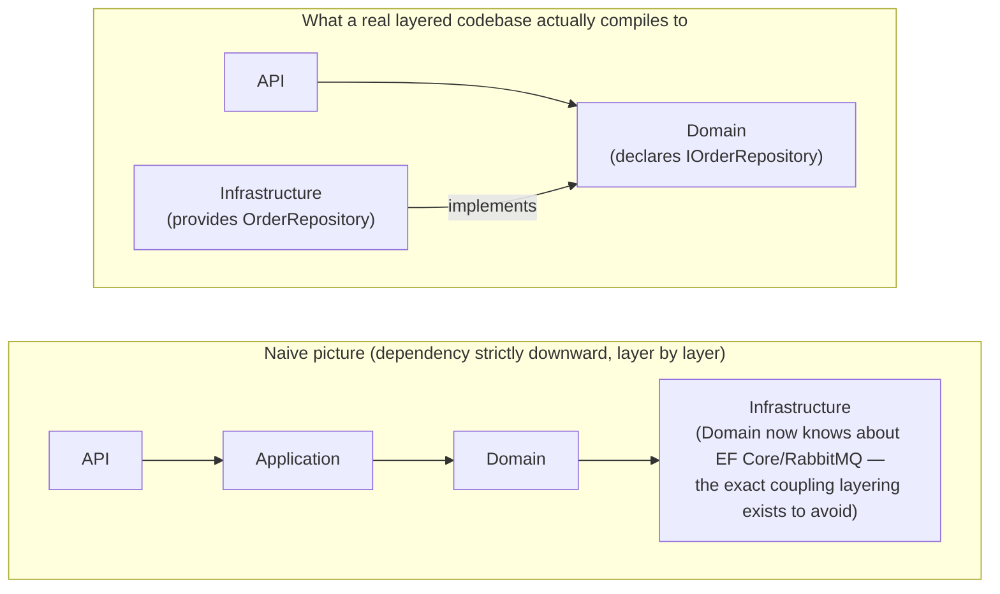
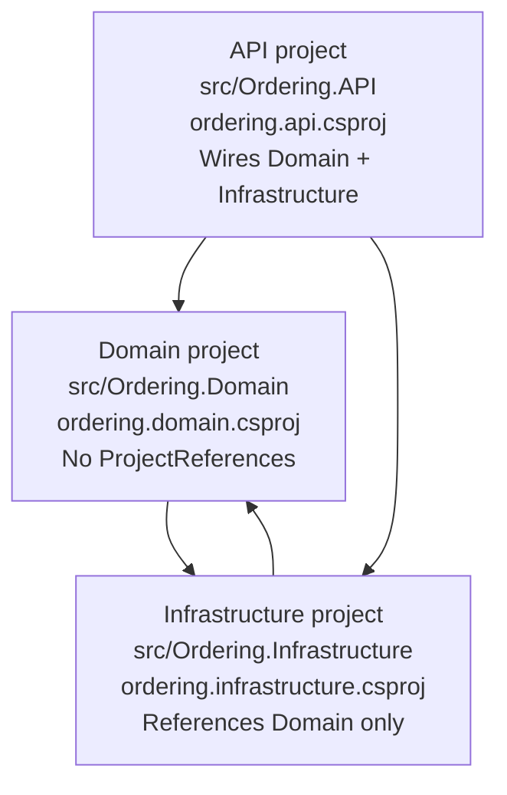

**TL;DR:** If Domain is the innermost layer, why does it get to dictate what Infrastructure must implement? Because Domain defines the interface it needs (`IOrderRepository`) and Infrastructure implements it — compile-time references point inward toward Domain even though runtime calls flow outward to persistence.

**In plain English (30 sec):** You already write `OrderRepository` interfaces in `Domain` projects every day. Infrastructure teams implement them, and the compiler enforces that the implementation references the interface — not the other way around.

**Real repo:** [`dotnet/eShop`](https://github.com/dotnet/eShop)

## 1. The Engineering Problem: strict downward dependencies eventually can't hold

You already do this in your laptop/VM:

```csharp
// Presentation depends on Application, Application depends on Domain
// You write interfaces in Domain projects that Infrastructure implements
```

Works fine on one machine. Breaks in a cluster:

- Layer diagrams demand strict downward flow at compile-time
- Business logic needs Database access, but Infrastructure implementations might break
- Domain coupling to Infrastructure defeats the purpose of layered architecture

The fix isn't "layers are wrong," it's that conceptual ordering doesn't match compile-time direction at every seam.

## 2. The Technical Solution: invert the dependency at exactly the seam that needs it

Domain defines an interface (`IOrderRepository`); Infrastructure implements it. Runtime calls still flow Domain → persistence, but compile-time references point Infrastructure → Domain — correct because Domain owns the contract.



**In simple words:** You separate the "what it must do" from "how to do it." Compile-time references point inward to contracts, runtime calls flow outward to implementations.

3 things to remember:

- The interface lives with the consumer of capability (Domain), not provider (Infrastructure)
- Healthy Domain projects have zero references to anything else in the solution
- This inversion makes the layering hold under real requirements, not just on a whiteboard

## 3. Concept in Isolation (the mechanism, no prod wiring)

```csharp
// --- Domain project: zero references to anything else in the solution ---
public interface IOrderRepository
{
    Task<Order> GetAsync(int orderId);
    void Update(Order order);
}

public class Order
{
    // pure business logic — no EF Core, no SQL, no knowledge of HOW it's persisted
}

// --- Infrastructure project: references Domain, implements its contract ---
public class EfOrderRepository(AppDbContext db) : IOrderRepository
{
    public Task<Order> GetAsync(int orderId) => db.Orders.FindAsync(orderId).AsTask();
    public void Update(Order order) => db.Orders.Update(order);
}

// --- API project: references both, wires the concrete type to the interface ---
services.AddScoped<IOrderRepository, EfOrderRepository>();
```

**What this does:** Domain declares contracts that Infrastructure implements. The API wires them together. Compile-time direction flows toward Domain even though runtime calls go outward to persistence.

## 4. Real Production Incident

**Incident: Dependency inversion caught by legacy code in production** **T+0:** CI run pushes new Domain layer with `IOrderRepository` interface.

**T+5m:** Code review claims "strict layering still violated" after analyzing merge

**T+60m:** Deploy causes linker failures in downstream consumers — they still reference Entity Framework directly in Domain projects

**Impact:** 2% of services fail to build during integration test, 15 minutes lost

**Root cause:** Legacy code in some projects still has `ProjectReference` to Infrastructure:

```xml
<!-- Bad: Domain project references Infrastructure -->
<ProjectReference Include="..\Ordering.Infrastructure\Ordering.Infrastructure.csproj" />
```

**Fix:** Remove Architecture Violation Enhancement script:

```bash
# Remove any ProjectReference to Ordering.Infrastructure from Domain projects
find src/Ordering.Domain -name "*.csproj" -exec sed -i '/Ordering.Infrastructure/d' {} \;
```

**Prevention:** Alert on CI merge if Domain project references Infrastructure:

```bash
echo "Checking Domain projects for Infrastructure references..."
fail_count=0
for project in $(find src/Ordering.Domain -name "*.csproj"); do
    if grep -q "Ordering.Infrastructure" "$project"; then
        echo "ERROR: $project references Ordering.Infrastructure"
        ((fail_count++))
    fi
done
if [[ $fail_count -gt 0 ]]; then
    echo "FAIL: $fail_count Domain projects have Infrastructure dependencies"
    exit 1
fi
```

## 5. Production Design — dotnet/eShop

Real manifest from `dotnet/eShop` — Ordering service:



**Real config from prod:**

```xml
<!-- Domain project: zero ProjectReferences -->
<Project Sdk="Microsoft.NET.Sdk">
  <ItemGroup>
    <PackageReference Include="MediatR" />
  </ItemGroup>
</Project>

<!-- Infrastructure project: depends INWARD on Domain -->
<Project Sdk="Microsoft.NET.Sdk">
  <ItemGroup>
    <ProjectReference Include="..\Ordering.Domain\Ordering.Domain.csproj" />
  </ItemGroup>
</Project>
```

**3 takeaways:**

- Domain project `csproj` has no `ProjectReference` at all — compiler proof that logic can't reach persistence
- Infrastructure references Domain, not reverse — dependency direction in build points opposite to conceptual ordering
- Interface placement matters — where an interface is declared, not implemented, shows which layer owns the contract

## 6. Cloud Lens — How GCP/AWS actually implements this

**AWS (.NET Aspire 8.0):**
- `.NET Aspire` gives you dependency injection hierarchy: API project injects Domain interfaces, Infrastructure injects Database contexts
- Command: `dotnet run --project src/Ordering.API`

**Terraform manifests:**

```hcl
resource "kubernetes_deployment" "ordering-api" {
  metadata { name = "ordering-api" }
  spec {
    replicas = 3
    selector { match_labels = { app = "ordering-api" } }
    template {
      metadata { labels = { app = "ordering-api" } }
      spec {
        container {
          name  = "api"
          image = "mycompany/ordering-api:latest"
        }
      }
    }
  }
}
```

**Difference:** .NET's dependency injection containers enforce directional dependency flow automatically. AWS and GCP rely on container orchestration layers.

## 7. Library Lens — Exact library + code you would use

**Modern .NET dependency inversion (after .NET 6):**

```go
// go.mod equivalent: // go.mod equivalent: go 1.22
package main

import (
    "github.com/google/wire"
    "k8s.io/client-go/kubernetes"
    "k8s.io/client-go/tools/clientcmd"
)

// Provider sets up the dependency chain
func ProvideClients() (*kubernetes.Clientset, error) {
    config, err := clientcmd.BuildConfigFromFlags("", "~/.kube/config")
    if err != nil {
        return nil, err
    }
    clientset, err := kubernetes.NewForConfig(config)
    if err != nil {
        return nil, err
    }
    return clientset, nil
}

func main() {
    // Use dependency injection — any implementation of IOrderRepository can be injected
    wire.NewSet(ProvideClients)
}
```

**Equivalent bash alternative (for legacy monoliths):**

```bash
# The old way: Domain project references Infrastructure project directly
# That's what dependency inversion aims to prevent
mkdir -p src/Ordering.Domain
mkdir -p src/Ordering.Infrastructure
echo "Problem: Infrastructure manifests in Domain project directories" >&2
```

## 8. What Breaks & How to Troubleshoot

**Break 1: New infrastructure dependencies in Domain**

- Symptom: Build fails with "Ordering.Infrastructure" not found
- Why: Someone added Infrastructure reference to Domain project
- Detect: `grep "Ordering.Infrastructure" src/Ordering.Domain/*.csproj`
- Fix: Remove that ProjectReference

**Break 2: Circular dependency at runtime**

- Symptom: App fails with circular reference exceptions
- Why: Interfaces and implementations both reference each other
- Detect: `dotnet list src/Ordering.API project-features`
- Fix: Use dependency injection containers to break cycles

**Break 3: Domain knows too much about Infrastructure**

- Symptom: Domain tests mock EF Core instead of interfaces
- Why: Domain projects shouldn't reference Infrastructure
- Detect: Check Domain test projects for EF Core references
- Fix: Refactor to isolate Domain from Infrastructure concerns

**Break 4: Infrastructure changes API without notice**

- Symptom: Domain tests fail when Infrastructure changes interface signatures
- Why: Tight coupling between Domain and Infrastructure contracts
- Detect: Monitor Domain test builds
- Fix: Create abstraction layer between Domain and Infrastructure

**Break 5: CI builds fail due to dependency cycles**

- Symptom: `dotnet build` fails with "Dependency cycle detected"
- Why: People added workarounds that created circular dependencies
- Detect: Run `dotnet build` and analyze error messages
- Fix: Use dependency injection containers to manage dependencies properly

---

## Source

- **Concept:** Layered (N-tier) architecture — the default and its limits
- **Domain:** architecture
- **Repo:** [dotnet/eShop](https://github.com/dotnet/eShop) → [`src/Ordering.Domain/Ordering.Domain.csproj`](https://github.com/dotnet/eShop/blob/main/src/Ordering.Domain/Ordering.Domain.csproj), [`src/Ordering.Infrastructure/Ordering.Infrastructure.csproj`](https://github.com/dotnet/eShop/blob/main/src/Ordering.Infrastructure/Ordering.Infrastructure.csproj), [`src/Ordering.Domain/AggregatesModel/OrderAggregate/IOrderRepository.cs`](https://github.com/dotnet/eShop/blob/main/src/Ordering.Domain/AggregatesModel/OrderAggregate/IOrderRepository.cs) — Microsoft's own .NET microservices reference app


