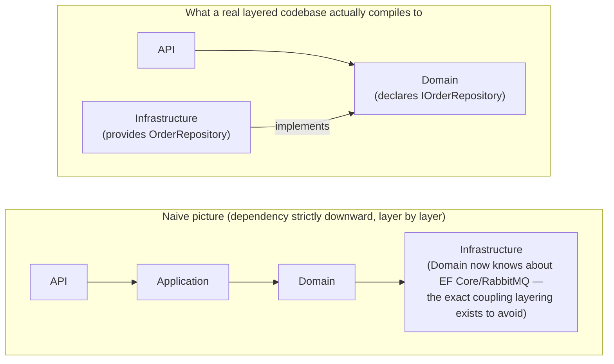

## 1. The Engineering Problem: strict downward dependencies eventually can't hold

The textbook N-tier picture is simple: Presentation depends on Application, Application
depends on Domain, Domain depends on Infrastructure. Each layer only talks to the one
directly below it. It's easy to draw, easy to explain, and easy to enforce with plain
project references.

It's also wrong the moment you take it literally. The whole *point* of a Domain layer
is that it's pure business logic, ignorant of databases, message buses, and other
infrastructure concerns — but an `Order` aggregate still needs to be persisted, and an
`OrderShipped` fact still needs to reach a message bus eventually. If Domain "depends
on" Infrastructure to get that done, you've just given your core business logic a
compile-time reference to Entity Framework or RabbitMQ — exactly the coupling layering
was supposed to prevent in the first place.

## 2. The Technical Solution: invert the dependency at exactly the seam that needs it

The fix isn't "layers are wrong," it's that the *compiled* dependency direction and the
*conceptual* layer order aren't required to match at every seam. Domain defines an
interface for the capability it needs (`IOrderRepository`); Infrastructure implements
it. The runtime call still flows Domain → persistence, but the compile-time reference
now points Infrastructure → Domain — the correct direction, because Domain owns the
contract, not the implementation.



Three truths to hold:

1. "Layered" describes a conceptual ordering, not "every layer's compiled dependency
   points to the layer physically below it" — those are only the same thing until the
   core needs a capability only the edge can provide.
2. A healthy Domain project should have close to zero project references to anything
   else in the solution — it's pure logic and pure contracts, which is exactly what
   makes it testable and reusable in isolation.
3. The interface lives with the *consumer* of the capability (Domain), not the
   *provider* (Infrastructure) — that placement is what makes the compiled reference
   arrow point inward even though the runtime call flows outward.

## 3. The clean example (concept in isolation)

```csharp
// --- Domain project: zero references to anything else in the solution ---
public interface IOrderRepository
{
    Task<Order> GetAsync(int orderId);
    void Update(Order order);
}

public class Order
{
    // pure business logic — no EF Core, no SQL, no knowledge of HOW it's persisted
}

// --- Infrastructure project: references Domain, implements its contract ---
public class EfOrderRepository(AppDbContext db) : IOrderRepository
{
    public Task<Order> GetAsync(int orderId) => db.Orders.FindAsync(orderId).AsTask();
    public void Update(Order order) => db.Orders.Update(order);
}

// --- API project: references both, wires the concrete type to the interface ---
services.AddScoped<IOrderRepository, EfOrderRepository>();
```

## 4. Production reality (from dotnet/eShop's Ordering service)

Where these three projects actually sit in the repo, before looking at what's inside each:

```
src/
├── Ordering.Domain/                              (zero references to anything else)
│   └── AggregatesModel/OrderAggregate/
│       └── IOrderRepository.cs                   ← the contract is declared HERE
├── Ordering.Infrastructure/                       (references ONLY Ordering.Domain)
│   └── Repositories/
│       └── OrderRepository.cs                     ← the implementation lives HERE instead
└── Ordering.API/                                  (references Domain AND Infrastructure)
```

These are the real, current `.csproj` files from `dotnet/eShop` — the actual compiled
dependency graph, not a diagram of one. Trimmed to the `ProjectReference` entries that
matter here:

```xml
<!-- Ordering.Domain.csproj — no ProjectReference to anything in the solution -->
<Project Sdk="Microsoft.NET.Sdk">
  <ItemGroup>
    <PackageReference Include="MediatR" />
    <PackageReference Include="System.Reflection.TypeExtensions" />
  </ItemGroup>
</Project>
```

```xml
<!-- Ordering.Infrastructure.csproj — depends INWARD on Domain -->
<Project Sdk="Microsoft.NET.Sdk">
  <ItemGroup>
    <ProjectReference Include="..\IntegrationEventLogEF\IntegrationEventLogEF.csproj" />
    <ProjectReference Include="..\Ordering.Domain\Ordering.Domain.csproj" />
  </ItemGroup>
</Project>
```

```xml
<!-- Ordering.API.csproj — the outermost layer, wiring Domain + Infrastructure together -->
<Project Sdk="Microsoft.NET.Sdk.Web">
  <ItemGroup>
    <ProjectReference Include="..\EventBusRabbitMQ\EventBusRabbitMQ.csproj" />
    <ProjectReference Include="..\Ordering.Domain\Ordering.Domain.csproj" />
    <ProjectReference Include="..\Ordering.Infrastructure\Ordering.Infrastructure.csproj" />
  </ItemGroup>
</Project>
```

And the actual seam — the repository contract, defined in Domain, with a comment that
says exactly why:

```csharp
namespace eShop.Ordering.Domain.AggregatesModel.OrderAggregate;

//This is just the RepositoryContracts or Interface defined at the Domain Layer
//as requisite for the Order Aggregate

public interface IOrderRepository : IRepository<Order>
{
    Order Add(Order order);
    void Update(Order order);
    Task<Order> GetAsync(int orderId);
}
```

The concrete `OrderRepository` implementing it lives in
`src/Ordering.Infrastructure/Repositories/OrderRepository.cs` — a different project,
referencing Domain, never the other way around.

What this teaches that a boxes-and-arrows layer diagram can't:

- **`Ordering.Domain.csproj` has no `ProjectReference` at all.** That's not an
  accident of this one file — it's the actual, compiler-enforced proof that the domain
  logic can't reach out to persistence or messaging even if a future contributor tried.
- **`Ordering.Infrastructure.csproj` references `Ordering.Domain`, not the reverse.**
  The dependency arrow in the *build* points opposite to the conceptual "Domain is more
  central than Infrastructure" ordering — and that inversion is precisely what makes
  the layering hold under real requirements instead of just on a whiteboard.
- **The comment on `IOrderRepository` isn't decorative.** It's the team explicitly
  documenting, in the code itself, which layer owns this contract and why — a detail
  that only shows up when you look at where an interface is *declared*, not where it's
  *implemented*.

---

## Source

- **Concept:** Layered (N-tier) architecture — the default and its limits
- **Domain:** architecture
- **Repo:** [dotnet/eShop](https://github.com/dotnet/eShop) → [`src/Ordering.Domain/Ordering.Domain.csproj`](https://github.com/dotnet/eShop/blob/main/src/Ordering.Domain/Ordering.Domain.csproj), [`src/Ordering.Infrastructure/Ordering.Infrastructure.csproj`](https://github.com/dotnet/eShop/blob/main/src/Ordering.Infrastructure/Ordering.Infrastructure.csproj), [`src/Ordering.Domain/AggregatesModel/OrderAggregate/IOrderRepository.cs`](https://github.com/dotnet/eShop/blob/main/src/Ordering.Domain/AggregatesModel/OrderAggregate/IOrderRepository.cs) — Microsoft's own .NET microservices reference app
