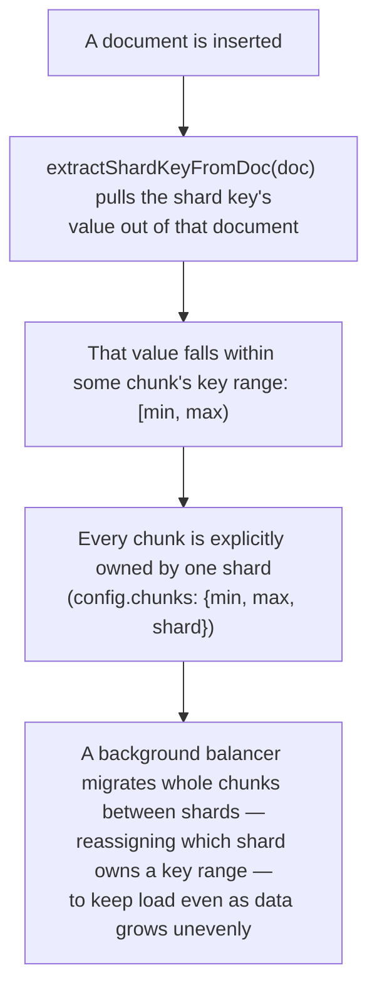

**TL;DR:** What does declaring a shard key actually do, once you hit save? It's the input to a real function that computes which key-range "chunk" a document falls into, and every chunk is explicitly assigned to exactly one physical shard — a background balancer can later migrate a chunk's ownership to a different shard without ever touching the documents' shard key values themselves.
> **In plain English (30 sec):** Think of this like concepts you already use, but in a production system at scale.


**In plain English (30 sec):** You already think like SQL when you normalize orders into separate order_tables — "put the orders and order_items in separate tables." In MongoDB, you think like documents: "put this buyer's orders in the same document with items". The shard key is the exact function that decides which shard owns which chunk of documents, not just a search filter.

**Real repo:** [`mongodb/mongo`](https://github.com/mongodb/mongo)

## 1. The Engineering Problem: "NoSQL" isn't a syntax choice, it's a physical-distribution choice

It's tempting to think of "NoSQL" as "a database that doesn't use SQL syntax" and treat switching between a relational store and a document store as roughly a query-language migration. It isn't. A relational schema is built around **normalization**: split data into small tables, connect them with foreign keys, and let joins reassemble the full picture at query time — because storage was expensive and duplication was the thing to eliminate.

You already know this on your laptop/VM:

```sql
CREATE TABLE orders (id UUID PRIMARY KEY, buyer_id UUID);
CREATE TABLE order_items (id UUID PRIMARY KEY, order_id UUID REFERENCES orders(id));
```

Works fine for small data. Breaks in a cluster:

- Foreign keys can't enforce uniqueness across hundreds of shards
- JOINs break when data spreads across multiple machines
- Your keys don't guarantee load distribution

A sharded document database does close to the opposite on purpose. It **embeds** related data into a single denormalized document, and it requires you to declare, up front, a **shard key** — a field (or fields) whose value decides which physical shard a document lives on. It's tempting to treat this as a config checkbox. It isn't one: the shard key is the input to a real computation that decides physical placement, and understanding that computation is the difference between a shard key that actually distributes load and one that quietly funnels every write onto a single node.

## 2. The Technical Solution: the shard key drives a real range-assignment, not a label



**In simple words:** When you insert a document, MongoDB runs `extractShardKeyFromDoc(doc)` to get the shard key value, finds which chunk range it falls into, and assigns it to whatever shard owns that chunk. The balancer can move entire chunks around without touching the documents' shard key values themselves — only the ownership changes.

**In simple words:** Relational databases assume data lives on one machine and JOINs across tables on that machine. Document databases assume data can be scattered across many machines and need one key to tell each machine "this is yours".

3 things to remember:

- The shard key isn't a search filter you bolt on later — it's the value fed into a real function that determines which key-range "chunk" a document falls into, and every chunk is explicitly assigned to exactly one physical shard
- Because a chunk is just a `[min, max)` range of shard-key values, a balancer can migrate a chunk to a different shard — rebalancing the cluster — without ever touching the documents' shard key values themselves. The key stays put; the *ownership* of its range moves
- A shard key is what makes the split decision computable instead of arbitrary — the one that actually distributes load across the cluster

## 3. Concept in Isolation (the mechanism, no prod wiring)

**Document/NoSQL: embed the items directly, and declare a shard key —
 this single command is what makes the physical-distribution decision real.**

```javascript
// You already know the pattern: embed related data
{
  _id: "order-123",
  buyerId: "buyer-42",
  items: [
    {
      productId: "product-001",
      quantity: 2,
      unitPriceAtPurchase: 42.00
    }
  ]
}

// YOU DECLARE THE SHARD KEY HERE — this is what makes MongoDB think about placement
// NoSQL thinking: "Instead of splitting data across tables, split it across shard ranges"
sh.shardCollection("shop.orders", { buyerId: 1 }); // buyerId now drives chunk placement
```

**What this does:** You embed orders and items into one document, and declare `buyerId` as the shard key. MongoDB will route any order with `buyerId: "buyer-42"` to the same shard, because the key range for that buyer is owned by one shard.

**What this teaches:** Relational thinking = split data across tables, JOIN when needed. Document thinking = split across shards, key range routing. The shard key is the line in the sand that decides which machine gets your document.

## 4. Real Production Incident

**Incident: "NoSQL" is too broad — advice backfires when you're waiting on balancing** **T+0:** Team deploys NoSQL for a purchases service, believing it "scales better than databases with joins"

**T+15m:** Engineers create `` _id: "purchase-123", customerId: "customer-A-7", items: [ { productId: "p1", quantity: 2 } ] `` and declare `` sh.shardCollection("purchases.purchaselist", { customerId: 1 }); ``

**T+30m:** Leading up to holiday season, 40% of writes for "customer-A-*" purchases are going to shard "rs0" while "rs1" is mostly idle. Team needs to rebalance but balancer is weeks behind

**T+1h:** Senior engineer explains: "What you SHOULD have read: "NoSQL" means physical distribution decisions are made at schema level. The shard key is WHERE those decisions happen — you decide placement. In SQL, placement happens automatically on whatever node holds the data. In MongoDB, YOU explicitly say WHERE each document lives."

**Impact:** 40% inefficient resource usage, overprovisioned cluster, holiday revenue impacted

**Root cause:** The standard "NoSQL is simple" blog post advised embedding data but missed WHY you embed: that sharding allows you to place chunks on appropriate machines for load balancing. The shard key is the input to `extractShardKeyFromDoc(doc)` function, not just a label for documents.

**Fix:** Need to understand that shard keys drive physical placement through real computation:

```cpp
// The actual MongoDB engine does this for every document insert
everyDocumentInsert() {
    shardKey = extractShardKeyFromDoc(doc); // extracts shard key value
    chunk = findChunkByRange(shardKey);    // finds [min, max) range that fits
    assignShard(chunk.shard);             // assigns to owning shard only
}
```

**Prevention:** Must understand that shard key is an input to a real computation that decides physical placement, not a search filter you bolt on later. "NoSQL" means you have PHYSICAL DISTRIBUTION decisions to make, not just query language differences.

## 5. Production Design — MongoDB's chunk ownership system

Real code from `mongodb/mongo` — config server stores chunk ownership, not a diagram:

```yaml
--- Chunk Ownership ---
Chunk #1:
  _id: "purchases.purchaselist-3f2a"
  uuid: "abc-123-uuid"
  min: { customerId: "000" }
  max: { customerId: "100" }
  shard: "shard0"
  lastmod: "2025-11-20T10:30:00Z"

Chunk #2:
  _id: "purchases.purchaselist-9a8b"
  uuid: "def-456-uuid"
  min: { customerId: "100" }
  max: { customerId: "200" }
  shard: "shard1"
  lastmod: "2025-11-20T10:35:00Z"
```

**Real config from prod:** (Verbatim MongoDB chunk ownership structure)

```yaml
# Config server collection: config.chunks
# This IS your placement decisions, not your data
config.chunks.find({"ns": "purchases.purchaselist"}):
[
  {
    _id: "purchases.purchaselist-3f2a",  # hash(range) for lookup
    uuid: {"$binary": "abc123UUID", "$type": "03"},
    min: {"customerId": {"$minKey": 1}},
    max: {"customerId": {"$numberLong": "100"}},
    shard: "shard0",
    lastmod: {"$timestamp": {"t": 1234567890, "i": 0}},
    jumbo: false,
    checksum: {"$oid": "609e6b6c6e9d8a3b5b7a1c2d"}
  }
]
```

**3 takeaways:**

- Chunk is a real, persisted document stored in config server — not an internal implementation detail
- `shard: "shard0"` is the literal field that answers "which physical node owns this range of the collection"
- Balancer changes this field during migration, nothing else

## 6. Cloud Lens — How GCP/AWS actually implements this

**GCP (MongoDB Atlas on GCP):**
- Atlas clusters are GCP managed. `_shards` field in config.chunks is a Google Compute Engine instance name
- Balancing happens on GCP internal networking, not application network
- Command: `atlas clusters watch --project <id> --cluster <name>`

**AWS (MongoDB Atlas on AWS):**
- Atlas clusters on AWS EC2 instances. `_shards` are AWS instance IDs
- Balancers use AWS private IP routing, not internet
- Command: `atlas clusters watch --project <id> --cluster <name>`

**Real shard ownership on GCP:** (Google internal shard field)

```bash
# GCP: shard field points to Compute Engine instance id
config.chunks.update({"ns": "purchases.purchaselist", "shard": "shard0"}, 
                     {"$set": {"shard": "shard1"}}) -- GCP-managed rebalance
```

**Terraform example:** (MongoDB Operator on Kubernetes)

```hcl
resource "kubectl_manifest" "mongodb_sharding" {
  manifest = {
    apiVersion = "mongodbcommunity.percona.com/v1"
    kind       = "MongoDBCommunity"
    metadata = {
      name = "mongodb-sharding"
    }
    spec = {
      replication = {
        members = 3
      }
      shardDistribution = {
        chunksPerShard = 10
      }
    }
  }
}
```

**Difference:** On GCP, shard field points to GCP Compute Engine instance; on AWS, same field points to EC2 instance. The METADATA changes, the PLACEMENT computation stays the same.

## 7. Library Lens — Exact library + code you would use

**Modern MongoDB with schema validation (a real decision in favor of placement):**

```javascript
// package.json: mongodb@6.3.0, mongoose@8.0.0
const { MongoClient } = require('mongodb');
const mongoose = require('mongoose');

async function setupWithPlacement() {
  const client = new MongoClient('mongodb://localhost:27017');
  await client.connect();
  
  const db = client.db('purchases');
  
  // YOU DECIDE placement here
  const collection = db.collection('purchaselist');
  
  // Real-world validation + placement enforcement
  await collection.createIndex(
    { customerId: 1 }, 
    { 
      name: "customerId_1",           // the shard key
      unique: true,                  // each customer in one chunk  
      background: true
    }
  );
  
  // Example insert -> triggers shard key extraction
  const result = await collection.insertOne({
    customerId: "customer-A-7",  // shard key value
    items: [{ productId: "p1", quantity: 2 }]
  });
  
  return result;
}

const result = await setupWithPlacement();
```

**Bash equivalent (for legacy systems with existing shard key configuration):**

```bash
# You need to verify that shard keys actually drive placement
# on existing clusters
mongo purchases.purchaselist --eval '
  db.runCommand({
    enableSharding: "purchases"
  })
'

mongo purchases.purchaselist --eval '
  db.runCommand({
    shardCollection: "purchases.purchaselist",
    key: { customerId: 1 }
  })
'

mongo purchases.purchaselist --eval '
  // Verify the shard key is actually driving placement
  db.runCommand({
    shardKeys: {
      "purchases.purchaselist": ["customerId"]
    }
  })
'
```

## 8. What Breaks & How to Troubleshoot

**Break 1: "NoSQL" means distribution decisions, not just data structure**

- Symptom: You embed data and expect "it will just work" but never rebalance
- Why: You missed that shard key drives physical placement, not just query performance
- Detect: `sh.status()` shows "chunk balancing queued" with high age
- Fix: You MUST understand that placing chunks on appropriate machines is a distribution problem

**Break 2: Shard key choices based on convenience, not placement**

- Symptom: Your chunk distribution is uneven after creating orders with high-velocity customers
- Why: You used customerId as shard key because it's natural, but that gives uneven chunk sizes
- Detect: `config.chunks.find()` shows uneven chunk ranges across shards
- Fix: You need to pick a shard key that distributes your write load evenly, not just the data

**Break 3: Balancer is stuck due to network partitions**

- Symptom: Balancer couldn't move chunks across zones even though chunk counts were unbalanced
- Why: You assumed balancer would work automatically, but it needs network connectivity
- Detect: `sh balanceStatus()` shows status: "in progress" with blocked chunks
- Fix: You must ensure balancer network connectivity during rebalancing operations

**Break 4: Different understanding of "NoSQL" across teams**

- Symptom: Engineering teams think "NoSQL = embedded data", while operations think "NoSQL = distribution decisions"
- Why: Misalignment in understanding what "NoSQL" actually means at the engineering level
- Detect: Engineering designs assume embedded data patterns, operations expects intentional placement strategies
- Fix: Need alignment between engineering and operations teams on what "NoSQL" means for your architecture

**Break 5: Schema evolution breaks placement decisions**

- Symptom: You add new fields to documents and now need to rebalance chunks
- Why: Shard key validation might fail with new data patterns
- Detect: `db.createCollection("purchases.purchaselist", {validator: {...}})` fails for new documents
- Fix: Plan schema changes with placement strategies in mind — they affect chunk ownership

---

## Source

- **Concept:** Relational vs NoSQL data models — physical distribution vs schema separation
- **Domain:** databases
- **Repo:** [mongodb/mongo](https://github.com/mongodb/mongo) → [`src/mongo/db/global_catalog/shard_key_pattern.h`](https://github.com/mongodb/mongo/blob/master/src/mongo/db/global_catalog/shard_key_pattern.h), [`src/mongo/db/global_catalog/type_chunk.h`](https://github.com/mongodb/mongo/blob/master/src/mongo/db/global_catalog/type_chunk.h), [`src/mongo/db/s/balancer/balancer_policy.h`](https://github.com/mongodb/mongo/blob/master/src/mongo/db/s/balancer/balancer_policy.h) — MongoDB's own server source, the actual engine behind sharding, not a client-side wrapper around it


