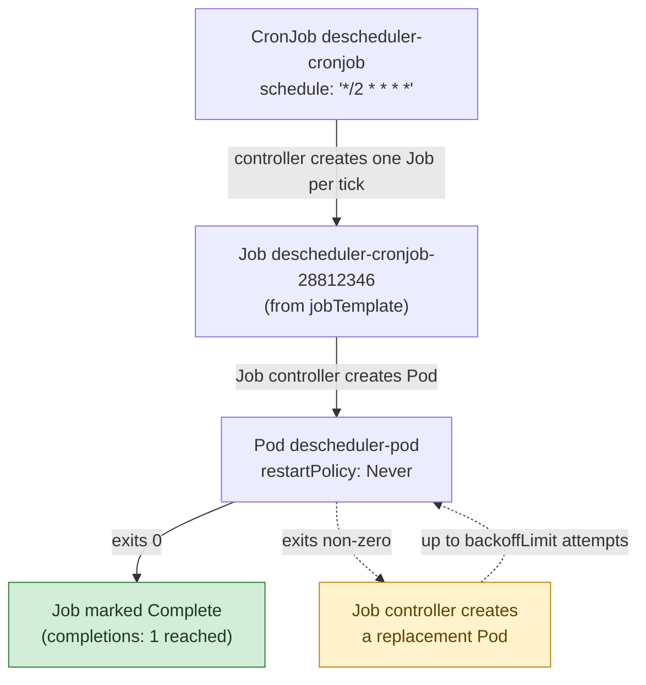
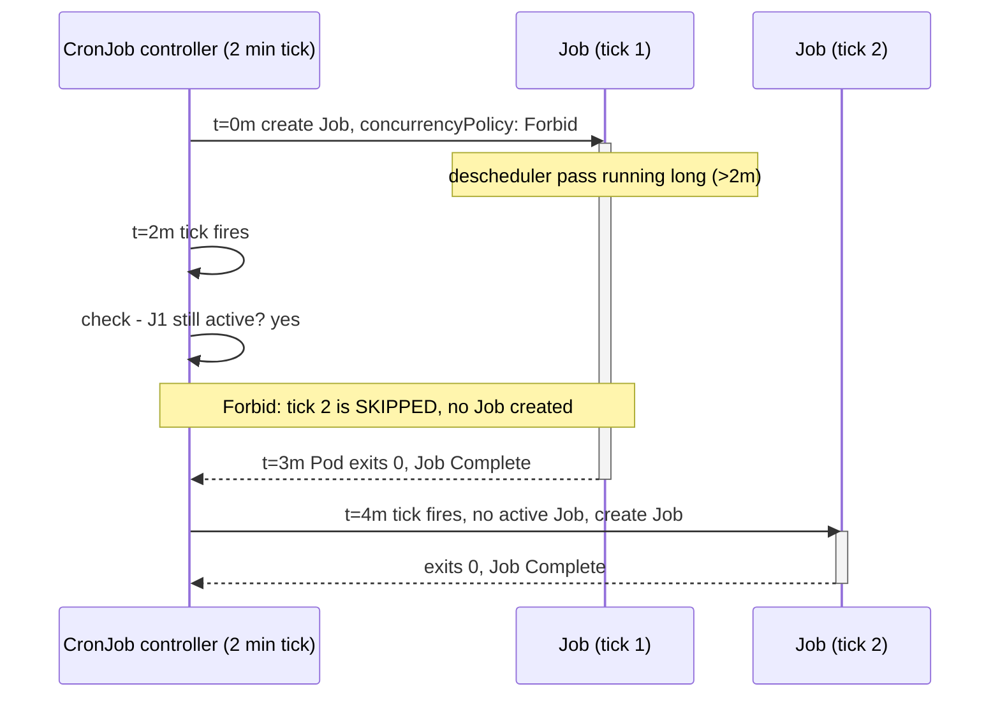

**TL;DR:** How do you run a workload to completion instead of keeping it alive forever? A Job tracks Pod *completions* instead of liveness (`restartPolicy: Never`/`OnFailure`, retries up to `backoffLimit`), and a CronJob is just a scheduler that creates a new Job from its `jobTemplate` on every cron tick — everything a Job does still applies underneath it.
> **In plain English (30 sec):** Think of this like concepts you already use, but in a production system at scale.


**Real repo:** [`kubernetes-sigs/descheduler`](https://github.com/kubernetes-sigs/descheduler)

## 1. The Engineering Problem: not every workload wants to stay running

A Deployment's controller has one job: if the Pod count drops below `replicas`, create more. That's exactly right for a web server — it should never exit. It's exactly wrong for a database migration, a nightly report export, or a one-off backfill script: those are *supposed* to run, finish, and exit 0. Point a Deployment at one of those and the controller sees "Pod exited" and restarts it — forever, in a crash-loop of a program that already succeeded.

You also can't just run it as a bare Pod and call `kubectl apply` by hand on a schedule. A bare Pod that finishes isn't retried if it fails transiently (no controller is watching it), there's no record of how many attempts happened, and "on a schedule" means either a human or an external cron daemon babysitting the cluster from outside — with no idea whether the previous run is still in flight before starting a new one.

You need a controller whose definition of success is "N Pods ran to completion," not "N Pods are up right now" — and, separately, a way to trigger that on a clock without an external scheduler.

---

## 2. The Technical Solution: Job wraps completion tracking, CronJob wraps a clock around a Job

A **Job** creates one or more Pods and tracks *completions*, not liveness. `restartPolicy` must be `Never` or `OnFailure` — never `Always` — because "keep it running" is not the contract. If a Pod fails, the Job controller creates a replacement, up to `backoffLimit` attempts, with exponential backoff between retries. Once `completions` Pods have exited 0, the Job is done and the controller stops touching it.

A **CronJob** doesn't run anything itself — it's a thin scheduler that, at every tick of a cron `schedule`, creates a new **Job** from its `jobTemplate`. Everything a Job does (retries, backoff, completion tracking) then applies to that generated Job exactly as if you'd created it by hand.



Two behaviors that only show up once a CronJob has been running for a while:

- **`concurrencyPolicy` decides what happens when a tick fires while the previous Job is still running.** `Allow` (default) runs them side by side, `Forbid` skips the new tick entirely, `Replace` kills the running one and starts fresh. For anything that mutates shared state — a descheduler pass, a report export — `Allow` is usually the wrong default.
- **A controller outage doesn't lose ticks silently — it can also *flood* them.** If the CronJob controller (part of `kube-controller-manager`) is down across several scheduled ticks, it doesn't replay every missed one on restart by default; `startingDeadlineSeconds`, if set, bounds how late a missed tick is still allowed to start at all.



Two core truths to hold: **a Job's `restartPolicy` is never `Always`** (that's the tell you're looking at a run-to-completion workload, not a long-lived one), and **a CronJob is not the thing that runs your container — it only ever creates Jobs**, so every Job-level behavior (retries, backoff, `activeDeadlineSeconds` as a timeout) applies underneath it unchanged.

---

## 3. The clean example (concept in isolation)

```yaml
# job.yaml - runs once, to completion
apiVersion: batch/v1
kind: Job
metadata:
  name: db-backfill
spec:
  completions: 1        # how many successful Pod exits count as "done"
  backoffLimit: 3        # retry a failing Pod up to 3 times, then give up
  activeDeadlineSeconds: 600  # kill the whole Job if it runs longer than 10m
  template:
    spec:
      restartPolicy: Never   # required: Job Pods never restart in place
      containers:
        - name: backfill
          image: myapp/backfill:1.4
          command: ["python", "backfill.py"]
---
# cronjob.yaml - runs the same shape of work on a schedule
apiVersion: batch/v1
kind: CronJob
metadata:
  name: nightly-report
spec:
  schedule: "0 2 * * *"        # 2 AM daily, standard cron syntax
  concurrencyPolicy: Forbid     # never run two report exports at once
  startingDeadlineSeconds: 300  # if the controller missed the tick by >5m, skip it
  jobTemplate:
    spec:
      backoffLimit: 2
      template:
        spec:
          restartPolicy: OnFailure
          containers:
            - name: report
              image: myapp/report-export:2.1
```

---

## 4. Production reality (from `kubernetes-sigs/descheduler`)

The descheduler — a real Kubernetes SIG project that periodically evicts poorly-placed Pods so the scheduler gets a chance to re-place them — ships **both** a Job and a CronJob manifest for the exact same container, which makes it a clean side-by-side of "run this once" vs. "run this every N minutes":

```
kubernetes/
├── base/
│   └── configmap.yaml     # DeschedulerPolicy shared by both run modes
├── job/
│   └── job.yaml            # one-shot run
└── cronjob/
    └── cronjob.yaml         # repeating run, wraps job.yaml's spec
```

```yaml
# kubernetes/cronjob/cronjob.yaml
apiVersion: batch/v1
kind: CronJob
metadata:
  name: descheduler-cronjob
  namespace: kube-system
spec:
  schedule: "*/2 * * * *"      # every 2 minutes
  concurrencyPolicy: "Forbid"   # a slow pass must finish before the next tick starts
  jobTemplate:
    spec:
      template:
        spec:
          priorityClassName: system-cluster-critical
          containers:
          - name: descheduler
            image: registry.k8s.io/descheduler/descheduler:v0.36.0
            volumeMounts:
            - mountPath: /policy-dir
              name: policy-volume
            args:
              - "--policy-config-file"
              - "/policy-dir/policy.yaml"
            livenessProbe:
              httpGet: {path: /healthz, port: 10258, scheme: HTTPS}
              periodSeconds: 10
            securityContext:
              allowPrivilegeEscalation: false
              capabilities: {drop: ["ALL"]}
              readOnlyRootFilesystem: true
              runAsNonRoot: true
          restartPolicy: "Never"
          serviceAccountName: descheduler-sa
          volumes:
          - name: policy-volume
            configMap: {name: descheduler-policy-configmap}
```

```yaml
# kubernetes/job/job.yaml - same container, run once instead of on a schedule
apiVersion: batch/v1
kind: Job
metadata:
  name: descheduler-job
  namespace: kube-system
spec:
  parallelism: 1
  completions: 1
  template:
    spec:
      priorityClassName: system-cluster-critical
      containers:
        - name: descheduler
          image: registry.k8s.io/descheduler/descheduler:v0.36.0
          # ...same volumeMounts/args/livenessProbe/securityContext as the CronJob above
      restartPolicy: "Never"
      serviceAccountName: descheduler-sa
      volumes:
      - name: policy-volume
        configMap: {name: descheduler-policy-configmap}
```

What this teaches that a hello-world can't:

- **The CronJob's `jobTemplate.spec` is structurally identical to the standalone Job's `spec`.** Line them up and it's the same `priorityClassName`, `restartPolicy: Never`, `livenessProbe`, and `securityContext` block — the CronJob adds exactly one new thing, `schedule` plus `concurrencyPolicy`, and delegates the rest. This is the real proof that a CronJob is "a Job, plus a clock," not a separate execution model.
- **`priorityClassName: system-cluster-critical`** matters specifically because this workload evicts other Pods to fix scheduling — if the descheduler's own Pod got preempted under node pressure, the thing meant to relieve pressure would be the first casualty. A hello-world Job never needs to think about its own eviction priority.
- **`concurrencyPolicy: "Forbid"` is a correctness decision, not a performance one.** Two descheduler passes running concurrently could both decide to evict the same over-utilized node's Pods at once, compounding the disruption instead of smoothing it. The manifest is quietly telling you this workload is not safe to overlap with itself.
- **Neither manifest sets `ttlSecondsAfterFinished`.** Completed Job objects (and CronJob's history of them) stick around in etcd until manually cleaned up or garbage-collected by `spec.successfulJobsHistoryLimit`/`failedJobsHistoryLimit` on the CronJob (defaults: 3 and 1). A high-frequency CronJob like this one — every 2 minutes — will accumulate finished Job objects fast; production clusters running this pattern need to actually watch that history limit, not assume "it finished" means "it's gone."

---

## Source

- **Concept:** Job / CronJob
- **Domain:** kubernetes
- **Repo:** [kubernetes-sigs/descheduler](https://github.com/kubernetes-sigs/descheduler) → [`kubernetes/cronjob/cronjob.yaml`](https://github.com/kubernetes-sigs/descheduler/blob/master/kubernetes/cronjob/cronjob.yaml), [`kubernetes/job/job.yaml`](https://github.com/kubernetes-sigs/descheduler/blob/master/kubernetes/job/job.yaml) — a real Kubernetes SIG controller that evicts poorly-placed Pods, shipped as both a one-shot Job and a repeating CronJob.


