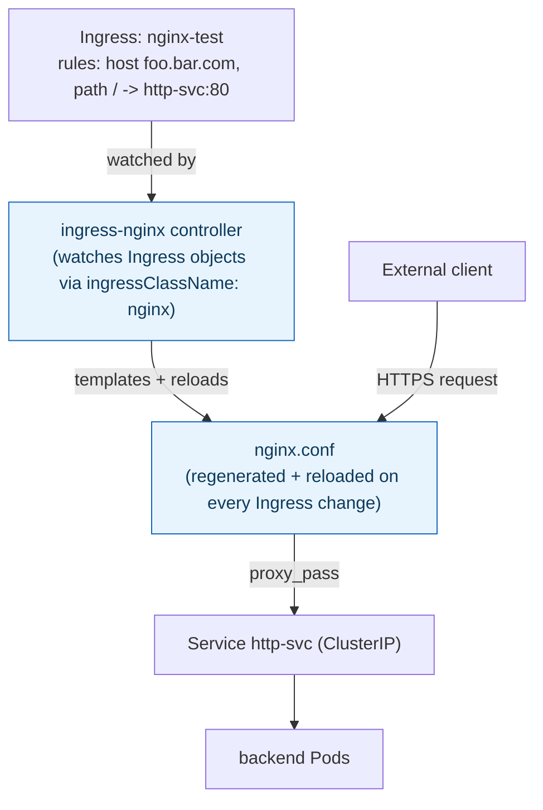
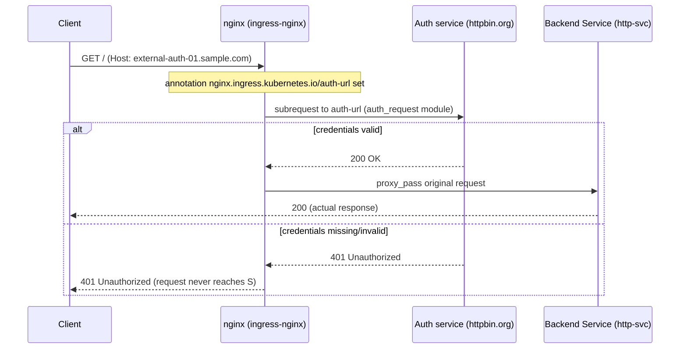

**TL;DR:** How do you route HTTP traffic to 20 Services without 20 cloud load balancers? An Ingress object declares host/path routing rules, and an Ingress Controller (like ingress-nginx) watches those rules and turns them into real proxy behavior — templating and reloading `nginx.conf` — behind one shared external entry point with TLS terminated centrally.

**Real repo:** [`kubernetes/ingress-nginx`](https://github.com/kubernetes/ingress-nginx)

## 1. The Engineering Problem: `type: LoadBalancer` doesn't scale per-service

A `Service` of `type: LoadBalancer` provisions one real cloud load balancer per Service — a real, billed, externally-routable IP. Fine for one Service. For twenty HTTP services behind twenty different paths or subdomains, it's twenty cloud load balancers, twenty IPs, twenty TLS certificates to manage, and zero shared routing logic between them (path rewriting, host-based routing, centralized auth) because each LB knows about exactly one backend.

What you actually want is HTTP-layer routing — "requests for `api.example.com/v1` go here, `api.example.com/v2` goes there, everything gets TLS terminated at one place" — decided by rules living in the cluster, fronted by a single external entry point.

---

## 2. The Technical Solution: Ingress (rules) + Ingress Controller (the thing that enforces them)

An **Ingress** object is inert on its own — it's a set of routing rules with no reconciler built into the API server. It only does anything once an **Ingress Controller** (a Pod watching Ingress objects, matched by `ingressClassName`) is running in the cluster to turn those rules into real proxy behavior. `ingress-nginx`, the reference implementation, does this by templating an actual `nginx.conf` from every Ingress object it sees and reloading NGINX — the Ingress resource is a declarative spec; NGINX config is the enforcement mechanism underneath it.



Three core truths:

- **The Ingress object doesn't route anything by itself** — no controller watching it means the rules just sit in etcd, matched by nothing. This is the single most common "why isn't my Ingress working" bug: no controller Pod running, or `ingressClassName` not matching any installed controller.
- **TLS is terminated at the controller, not the backend Service.** The `tls:` block on an Ingress names a `Secret` holding the cert/key; NGINX decrypts there and usually proxies plaintext HTTP to the backend Pod over the cluster network.
- **Annotations extend behavior the base `Ingress` spec has no field for.** Rate limiting, auth subrequests, rewrite rules — all of these are `nginx.ingress.kubernetes.io/*` annotations, not portable across controllers, because the base Kubernetes `Ingress` API only standardizes host/path routing and TLS.

Annotation-driven behavior is worth a closer look because it's easy to read as "just metadata" when it actually changes the request path:



---

## 3. The clean example (concept in isolation)

```yaml
apiVersion: networking.k8s.io/v1
kind: Ingress
metadata:
  name: api-routes
spec:
  ingressClassName: nginx   # matches the controller that should watch this object
  tls:
    - hosts: ["api.example.com"]
      secretName: api-tls   # TLS terminates here, at the controller
  rules:
    - host: api.example.com
      http:
        paths:
          - path: /v1
            pathType: Prefix
            backend:
              service: {name: api-v1, port: {number: 80}}
          - path: /v2
            pathType: Prefix
            backend:
              service: {name: api-v2, port: {number: 80}}
```

---

## 4. Production reality (from `kubernetes/ingress-nginx`)

The reference controller's own docs ship two real, runnable Ingress objects that between them cover TLS termination and annotation-driven auth:

```
docs/examples/
├── tls-termination/
│   └── ingress.yaml       # TLS terminated at the controller
└── auth/
    └── external-auth/
        └── ingress.yaml    # auth subrequest via annotation
```

```yaml
# docs/examples/tls-termination/ingress.yaml
apiVersion: networking.k8s.io/v1
kind: Ingress
metadata:
  name: nginx-test
spec:
  ingressClassName: nginx
  tls:
    - hosts:
      - foo.bar.com
      # assumes tls-secret exists, cert CN covers foo.bar.com
      secretName: tls-secret
  rules:
    - host: foo.bar.com
      http:
        paths:
        - path: /
          pathType: Prefix
          backend:
            service: {name: http-svc, port: {number: 80}}
```

```yaml
# docs/examples/auth/external-auth/ingress.yaml
apiVersion: networking.k8s.io/v1
kind: Ingress
metadata:
  annotations:
    nginx.ingress.kubernetes.io/auth-url: "https://httpbin.org/basic-auth/user/passwd"
  name: external-auth
spec:
  ingressClassName: nginx
  rules:
  - host: external-auth-01.sample.com
    http:
      paths:
      - path: /
        pathType: Prefix
        backend:
          service: {name: http-svc, port: {number: 80}}
```

What this teaches that a hello-world can't:

- **`pathType: Prefix` is not optional decoration** — pre-`networking.k8s.io/v1`, path matching semantics were controller-specific and inconsistent. `v1` made `pathType` (`Exact`, `Prefix`, or `ImplementationSpecific`) a required field precisely so an Ingress means the same thing across controllers.
- **`nginx.ingress.kubernetes.io/auth-url` has zero equivalent field in the base `Ingress` spec.** It only works because `ingress-nginx` specifically reads that annotation and wires NGINX's `auth_request` directive — swapping to a different controller (Traefik, HAProxy, a cloud-native GCE Ingress) silently drops this behavior unless that controller has its own equivalent annotation. Annotations are the extension point, and they're controller-specific by design.
- **The comment `# assumes tls-secret exists`** is a real production gotcha, not filler: the Ingress controller doesn't create the TLS Secret, issue the cert, or validate the CN matches the host — that's cert-manager's job (or a human's) upstream of this object. An Ingress referencing a `secretName` that doesn't exist yet fails silently from the client's perspective (falls back to a default self-signed cert) rather than rejecting the Ingress.

Known-stale fact: `extensions/v1beta1` and `networking.k8s.io/v1beta1` Ingress are gone, not deprecated — removed in Kubernetes 1.22. The `kubernetes.io/ingress.class` annotation that used to select a controller is also deprecated in favor of the `ingressClassName` field plus a real `IngressClass` object; a manifest still using the old annotation on a current cluster with multiple controllers installed has undefined behavior for which one claims it.

---

## Source

- **Concept:** Ingress / Ingress Controller
- **Domain:** kubernetes
- **Repo:** [kubernetes/ingress-nginx](https://github.com/kubernetes/ingress-nginx) → [`docs/examples/tls-termination/ingress.yaml`](https://github.com/kubernetes/ingress-nginx/blob/main/docs/examples/tls-termination/ingress.yaml), [`docs/examples/auth/external-auth/ingress.yaml`](https://github.com/kubernetes/ingress-nginx/blob/main/docs/examples/auth/external-auth/ingress.yaml) — the reference Ingress controller implementation.
