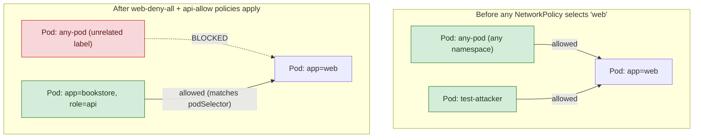

**TL;DR:** Why can every Pod in your cluster talk to every other Pod by default? Kubernetes networking starts fully open with no NAT between Pods, and a NetworkPolicy only locks that down once a CNI plugin that implements the NetworkPolicy API (like Calico or Cilium) enforces the `podSelector`-based rules you define — an empty `ingress: []` on a selected Pod means deny all inbound.

> **In plain English (30 sec):** Think of a Pod like a small VM holding containers sharing same IP — like containers on localhost.

**Real repo:** [`ahmetb/kubernetes-network-policy-recipes`](https://github.com/ahmetb/kubernetes-network-policy-recipes)

## 1. The Engineering Problem: Kubernetes networking starts fully open

Kubernetes' networking model gives every Pod a routable IP and guarantees any Pod can reach any other Pod's IP on any port, cluster-wide, with no NAT in between. That's a deliberate simplicity choice — but it means a low-privilege Pod running arbitrary third-party code (a webhook handler, a build job, a compromised dependency) can, by default, open a TCP connection straight to your database Pod's port. Namespaces don't change this: a namespace is an API/RBAC boundary, not a network one. A Pod in `dev` can reach a Pod in `prod` unless something explicitly stops it.

You need a way to say "this Pod only accepts traffic from these specific other Pods" — an allow-list, enforced at the network layer, not just at the application's own auth logic.

---

## 2. The Technical Solution: NetworkPolicy, enforced by the CNI plugin — not the API server

A **NetworkPolicy** selects Pods (via `podSelector`) and lists the traffic allowed to/from them. Two mechanism facts matter more than the YAML fields:

- **An empty `ingress: []` on a policy that selects a Pod means deny all incoming traffic to it** — Kubernetes NetworkPolicy is default-deny-once-selected: the moment *any* policy selects a Pod for a direction (ingress or egress), that direction switches from "allow everything" to "allow only what's explicitly listed." A Pod matched by zero policies stays fully open.
- **The NetworkPolicy object itself enforces nothing.** Like an Ingress without a controller, it's inert without a CNI plugin that actually implements the NetworkPolicy API — Calico's Felix agent programming iptables/eBPF rules per node, or Cilium's eBPF programs attached to each Pod's veth. `kube-proxy` does not enforce NetworkPolicy; it only handles Service load-balancing. A cluster running a CNI that doesn't implement NetworkPolicy (some minimal/default configs) will accept these objects via the API and silently do nothing.



Core truths: **`ingress` and `egress` are controlled independently** (a policy can lock down inbound while leaving outbound untouched, or vice versa); **policies are additive, never override each other** — if two policies both select the same Pod, the Pod's allowed traffic is the *union* of what each policy permits, so you can't "un-allow" something a broader policy already opened; and **`namespaceSelector` and `podSelector` compose** — a rule can require both "from this namespace" AND "matching this Pod label" at once, or just one.

---

## 3. The clean example (concept in isolation)

```yaml
# Step 1: deny everything to Pods labeled app=web
kind: NetworkPolicy
apiVersion: networking.k8s.io/v1
metadata:
  name: web-deny-all
spec:
  podSelector:
    matchLabels:
      app: web
  ingress: []   # empty list + Pod selected = deny all inbound
---
# Step 2: re-open only from Pods labeled app=api
kind: NetworkPolicy
apiVersion: networking.k8s.io/v1
metadata:
  name: web-allow-from-api
spec:
  podSelector:
    matchLabels:
      app: web
  ingress:
    - from:
        - podSelector:
            matchLabels:
              app: api
```

---

## 4. Production reality (from `ahmetb/kubernetes-network-policy-recipes`)

This repo — maintained by a former Google Cloud engineer and one of the most widely cited references for real-world NetworkPolicy patterns — ships runnable recipes covering exactly the gaps above:

```yaml
# 01-deny-all-traffic-to-an-application.md
kind: NetworkPolicy
apiVersion: networking.k8s.io/v1
metadata:
  name: web-deny-all
spec:
  podSelector:
    matchLabels:
      app: web
  ingress: []
```

```yaml
# 02-limit-traffic-to-an-application.md
# apiserver: labels app=bookstore, role=api
kind: NetworkPolicy
apiVersion: networking.k8s.io/v1
metadata:
  name: api-allow
spec:
  podSelector:
    matchLabels:
      app: bookstore
      role: api
  ingress:
  - from:
      - podSelector:
          matchLabels:
            app: bookstore   # any Pod labeled app=bookstore, any role
```

```yaml
# 06-allow-traffic-from-a-namespace.md
# prod namespace is labeled purpose=production
kind: NetworkPolicy
apiVersion: networking.k8s.io/v1
metadata:
  name: web-allow-prod
spec:
  podSelector:
    matchLabels:
      app: web
  ingress:
  - from:
    - namespaceSelector:
        matchLabels:
          purpose: production
```

What this teaches that a hello-world can't:

- **`02`'s `podSelector` inside `from` matches on `app: bookstore` alone, not `role: api`** — deliberately looser than the target Pod's own labels. It allows any microservice in the `bookstore` app family to reach the API tier, not just other API replicas talking to themselves; the asymmetry between the target's selector and the source's selector is the actual design decision, easy to miss reading quickly.
- **`06` uses `namespaceSelector` with zero `podSelector`** — every Pod in a namespace labeled `purpose: production` is allowed, regardless of its own labels. This is the pattern for "let a whole environment through" (e.g. a monitoring namespace scraping every Service in the cluster) versus `02`'s "let one specific microservice family through."
- **None of these three policies touch `egress` at all.** A Pod locked down by `web-deny-all` still has unrestricted outbound access — this is a common real gap: teams lock down what can reach their database Pod but never restrict what that Pod itself can connect *out* to, leaving data-exfiltration egress wide open even after "the NetworkPolicy is in place."

Known-stale fact: a common misconception is that Kubernetes namespaces provide network isolation on their own — they don't, and never have. GKE specifically requires either the legacy Calico add-on or Dataplane V2 (Cilium-based, the current default for new Autopilot clusters) to be explicitly enabled before NetworkPolicy objects do anything at all; applying one to a cluster without a compliant CNI is accepted by the API and silently unenforced, the exact same failure mode as an Ingress with no controller watching it.

---

## Source

- **Concept:** NetworkPolicy
- **Domain:** kubernetes
- **Repo:** [ahmetb/kubernetes-network-policy-recipes](https://github.com/ahmetb/kubernetes-network-policy-recipes) → [`01-deny-all-traffic-to-an-application.md`](https://github.com/ahmetb/kubernetes-network-policy-recipes/blob/master/01-deny-all-traffic-to-an-application.md), [`02-limit-traffic-to-an-application.md`](https://github.com/ahmetb/kubernetes-network-policy-recipes/blob/master/02-limit-traffic-to-an-application.md), [`06-allow-traffic-from-a-namespace.md`](https://github.com/ahmetb/kubernetes-network-policy-recipes/blob/master/06-allow-traffic-from-a-namespace.md) — the community-canonical NetworkPolicy recipe collection.


