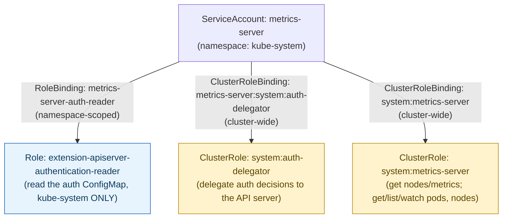
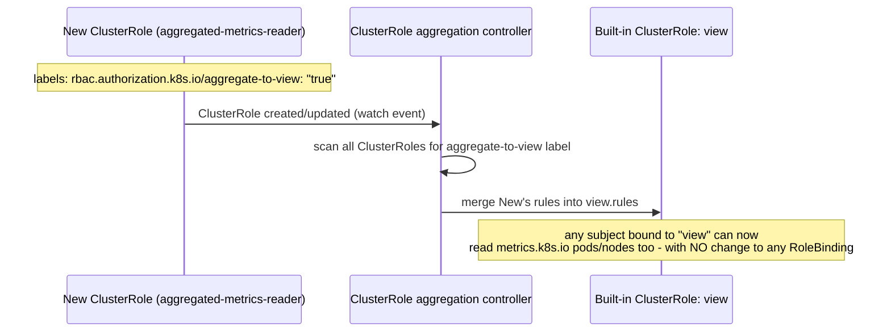

**TL;DR:** How does Kubernetes decide which ServiceAccount can do what? Through two independent axes — a `Role` or `ClusterRole` defines what's allowed, and a `RoleBinding` or `ClusterRoleBinding` grants that to a specific subject, with built-in roles like `view`/`edit`/`admin` continuously extended by a ClusterRole aggregation controller that merges in any ClusterRole carrying the right label.

**Real repo:** [`kubernetes-sigs/metrics-server`](https://github.com/kubernetes-sigs/metrics-server)

## 1. The Engineering Problem: every ServiceAccount starts with almost nothing, and "just grant everything" is how clusters get compromised

Every Pod runs as a `ServiceAccount`, and every request to the API server passes through an authorization check. The default `ServiceAccount` in a namespace has essentially no permissions — which is correct, but leaves you needing a precise way to grant exactly what a workload needs: "this metrics collector can read Pod and Node stats, cluster-wide, and nothing else." Grant too little and the workload breaks; reach for `cluster-admin` because it's faster and you've handed a bug or a supply-chain compromise in that one container the keys to the whole cluster.

You need permissions that are additive, auditable, and scoped as tightly as the workload actually requires — and a way to express "cluster-wide" vs. "one namespace only" without two entirely different permission languages.

---

## 2. The Technical Solution: Role/ClusterRole (what's allowed) + RoleBinding/ClusterRoleBinding (who gets it)

RBAC splits into two independent axes. **What's allowed** is a `Role` (namespaced) or `ClusterRole` (cluster-wide) — a list of `apiGroups`/`resources`/`verbs`. **Who gets it** is a `RoleBinding` (grants within one namespace) or `ClusterRoleBinding` (grants cluster-wide) — pointing a subject (ServiceAccount, User, Group) at a Role or ClusterRole. Critically, **a `RoleBinding` can reference a `ClusterRole`** — that's how you reuse one broadly-defined permission set but apply it narrowly, in just one namespace.



Two core truths that only show up once you're debugging a real "why can't this Pod do X" ticket:

- **RBAC has no `deny` rule.** Every grant is purely additive — you cannot write a rule that subtracts a permission another binding already granted. The only way to restrict access is to never grant it in the first place, which is why least-privilege has to be the *default* posture, not a cleanup pass afterward.
- **A `ClusterRole` used in a `RoleBinding` is scoped down to that one namespace at bind time** — the ClusterRole's `rules` don't change, but the *binding* limits where they apply. `system:metrics-server` above is bound cluster-wide (`ClusterRoleBinding`) because metrics-server genuinely needs every namespace's Pod metrics; a different workload could reuse the exact same ClusterRole via a `RoleBinding` to get read access in just one namespace.

Built-in roles (`view`, `edit`, `admin`) aren't hand-maintained lists — they're **aggregated** continuously by a controller that watches for any ClusterRole carrying a specific label and merges its rules in automatically:



---

## 3. The clean example (concept in isolation)

```yaml
# Role: read-only access to Pods, one namespace only
apiVersion: rbac.authorization.k8s.io/v1
kind: Role
metadata:
  name: pod-reader
  namespace: payments
rules:
  - apiGroups: [""]
    resources: ["pods"]
    verbs: ["get", "list", "watch"]
---
apiVersion: rbac.authorization.k8s.io/v1
kind: RoleBinding
metadata:
  name: read-pods
  namespace: payments
subjects:
  - kind: ServiceAccount
    name: payments-dashboard
    namespace: payments
roleRef:
  apiGroup: rbac.authorization.k8s.io
  kind: Role
  name: pod-reader
```

---

## 4. Production reality (from `kubernetes-sigs/metrics-server`)

`manifests/base/rbac.yaml` grants metrics-server exactly the three things it needs — nothing more — split across a Role, two ClusterRoles, and their bindings:

```yaml
# manifests/base/rbac.yaml
apiVersion: rbac.authorization.k8s.io/v1
kind: ClusterRole
metadata:
  name: system:aggregated-metrics-reader
  labels:
    rbac.authorization.k8s.io/aggregate-to-view: "true"
    rbac.authorization.k8s.io/aggregate-to-edit: "true"
    rbac.authorization.k8s.io/aggregate-to-admin: "true"
rules:
- apiGroups: ["metrics.k8s.io"]
  resources: ["pods", "nodes"]
  verbs: ["get", "list", "watch"]
---
apiVersion: rbac.authorization.k8s.io/v1
kind: RoleBinding          # namespace-scoped: kube-system only
metadata:
  name: metrics-server-auth-reader
  namespace: kube-system
roleRef:
  kind: Role
  name: extension-apiserver-authentication-reader
subjects:
  - kind: ServiceAccount
    name: metrics-server
    namespace: kube-system
---
apiVersion: rbac.authorization.k8s.io/v1
kind: ClusterRoleBinding    # cluster-wide: delegates auth decisions
metadata:
  name: metrics-server:system:auth-delegator
roleRef:
  kind: ClusterRole
  name: system:auth-delegator
subjects:
  - kind: ServiceAccount
    name: metrics-server
    namespace: kube-system
---
apiVersion: rbac.authorization.k8s.io/v1
kind: ClusterRole
metadata:
  name: system:metrics-server
rules:
  - apiGroups: [""]
    resources: ["nodes/metrics"]
    verbs: ["get"]
  - apiGroups: [""]
    resources: ["pods", "nodes"]
    verbs: ["get", "list", "watch"]
```

What this teaches that a hello-world can't:

- **`system:aggregated-metrics-reader` doesn't grant metrics-server anything at all** — it exists purely to *extend the built-in `view`/`edit`/`admin` roles* via its three `aggregate-to-*` labels, so any human already holding `view` automatically gains read access to `metrics.k8s.io` data the moment this ClusterRole is installed, with zero changes to their own RoleBinding. This is a permission grant aimed at *other* subjects, not at metrics-server's own ServiceAccount.
- **Two different binding scopes exist for a reason tied to where the resource actually lives.** `extension-apiserver-authentication-reader` is bound via a namespaced `RoleBinding` because the ConfigMap it reads (`extension-apiserver-authentication`) only exists in `kube-system` — a `ClusterRoleBinding` here would be strictly broader than the workload needs. `system:auth-delegator` and `system:metrics-server`, by contrast, must be cluster-wide: metrics-server serves Pod/Node metrics for *every* namespace, and API aggregation's auth-delegation check isn't namespace-scoped at all.
- **`system:auth-delegator` is what makes metrics-server a real API aggregation extension, not just a workload with a Service.** It lets metrics-server ask the main API server "is this incoming request's token actually valid, and what can it do?" instead of implementing its own auth — the same trust delegation every aggregated API server (custom metrics adapters, other `apiservice.yaml`-registered extensions) needs.

Known-stale fact: RBAC (`rbac.authorization.k8s.io/v1`) has been the only in-tree authorization mode most managed clusters ship by default for years now — but ABAC and the legacy `Node,RBAC` authorizer chains still exist in self-managed clusters, and a policy debugging session that assumes "RBAC is the only thing deciding this" can waste hours if an older ABAC policy file is also present. Always confirm `--authorization-mode` on the API server before assuming RBAC is the entire story.

---

## Source

- **Concept:** RBAC (Role, ClusterRole, RoleBinding, ClusterRoleBinding, aggregation)
- **Domain:** kubernetes
- **Repo:** [kubernetes-sigs/metrics-server](https://github.com/kubernetes-sigs/metrics-server) → [`manifests/base/rbac.yaml`](https://github.com/kubernetes-sigs/metrics-server/blob/master/manifests/base/rbac.yaml) — production add-on and real API aggregation extension.
