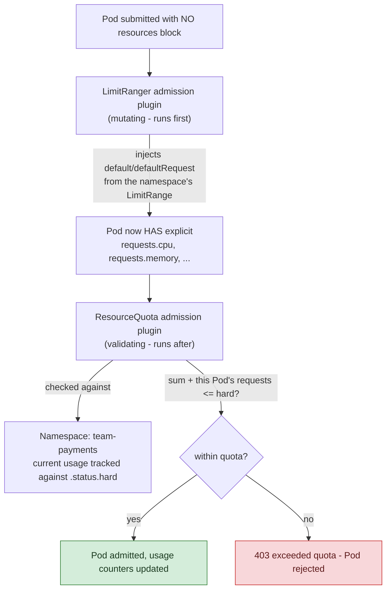
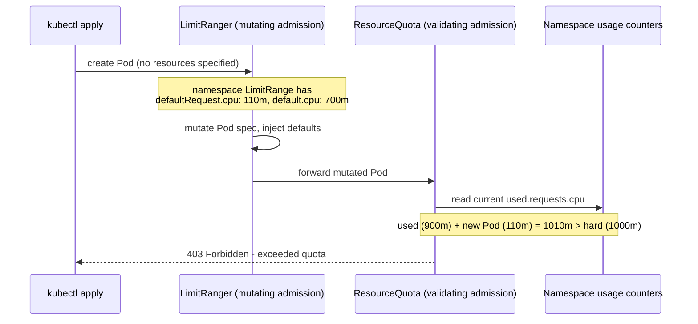

## 1. The Engineering Problem: per-Pod limits don't protect the cluster from the namespace as a whole

`resources.limits` on a container caps *that one container*. Nothing about it stops a namespace from running 500 Pods each requesting 2 CPU on a cluster with 200 CPU total capacity — the scheduler will happily keep placing Pods until the cluster is out of allocatable capacity, at which point every other team's Pods start going `Pending`, with no quota violation ever surfaced to explain why. Worse: a Pod with **no** `resources` block at all has no ceiling whatsoever — it can consume memory until the node hits pressure and starts evicting *other* Pods, including ones that behaved correctly.

On a shared multi-tenant cluster, you need two different guarantees: a **hard ceiling on a namespace's total consumption** (so one team can't starve another), and a **default floor/ceiling per individual Pod** (so "I forgot to set `resources`" doesn't mean "unbounded").

---

## 2. The Technical Solution: LimitRange fills gaps per-Pod, ResourceQuota caps the namespace total — and they run in a specific order

A **LimitRange** applies at admission time to individual Pods/Containers within a namespace: `min`/`max` bounds, and — critically — `default`/`defaultRequest` values that get **injected into any Pod that didn't specify them**. A **ResourceQuota** tracks the *sum* of requests/limits (and object counts — PVCs, Services of type LoadBalancer, etc.) across the whole namespace against a `hard` ceiling, rejecting any new object that would push the total over it.

These aren't independent — they're wired together by a real ordering constraint in the admission chain: **if a namespace has a ResourceQuota covering compute resources, every Pod created there must specify `requests`/`limits` for those resources, or admission rejects it outright.** LimitRange's `default`/`defaultRequest` is what makes that survivable — it mutates the Pod to fill in the missing values *before* ResourceQuota ever evaluates it.





Two core truths: **LimitRange and ResourceQuota only ever act at admission time** — changing either one never retroactively touches Pods already running; and **a ResourceQuota's object-count limits (`persistentvolumeclaims: "1"`, `services.loadbalancers: "2"`) are a completely separate axis from compute limits** — a namespace can be well under its CPU/memory quota and still get every new PVC rejected because it hit an object-count ceiling.

---

## 3. The clean example (concept in isolation)

```yaml
apiVersion: v1
kind: LimitRange
metadata:
  name: container-defaults
  namespace: team-payments
spec:
  limits:
    - type: Container
      defaultRequest: {cpu: "100m", memory: "128Mi"}  # applied if a Pod omits requests
      default: {cpu: "500m", memory: "512Mi"}          # applied if a Pod omits limits
      max: {cpu: "2", memory: "2Gi"}                    # hard per-container ceiling
---
apiVersion: v1
kind: ResourceQuota
metadata:
  name: namespace-budget
  namespace: team-payments
spec:
  hard:
    requests.cpu: "10"
    requests.memory: 10Gi
    limits.cpu: "20"
    limits.memory: 20Gi
    pods: "50"          # object-count limit, independent of compute
```

---

## 4. Production reality (from `kubernetes/website`'s tested reference examples)

These manifests live in the official Kubernetes documentation's example set — validated in the project's own CI against real clusters, and the literal source the docs pages are generated from, which makes them as close to "canonical" as this platform-admin config gets:

```
content/en/examples/admin/resource/
├── quota-mem-cpu.yaml              # ResourceQuota - compute ceiling
├── quota-objects.yaml               # ResourceQuota - object-count ceiling
└── limit-mem-cpu-container.yaml    # LimitRange - per-container defaults/bounds
```

```yaml
# quota-mem-cpu.yaml
apiVersion: v1
kind: ResourceQuota
metadata:
  name: mem-cpu-demo
spec:
  hard:
    requests.cpu: "1"
    requests.memory: 1Gi
    limits.cpu: "2"
    limits.memory: 2Gi
```

```yaml
# quota-objects.yaml
apiVersion: v1
kind: ResourceQuota
metadata:
  name: object-quota-demo
spec:
  hard:
    persistentvolumeclaims: "1"
    services.loadbalancers: "2"
    services.nodeports: "0"       # blocks NodePort Services entirely in this namespace
```

```yaml
# limit-mem-cpu-container.yaml
apiVersion: v1
kind: LimitRange
metadata:
  name: limit-mem-cpu-per-container
spec:
  limits:
  - type: Container
    min: {cpu: "100m", memory: "99Mi"}
    max: {cpu: "800m", memory: "1Gi"}
    default: {cpu: "700m", memory: "900Mi"}
    defaultRequest: {cpu: "110m", memory: "111Mi"}
```

What this teaches that a hello-world can't:

- **`services.nodeports: "0"` is a real governance lever, not a resource cap at all.** It's the object-count axis being used to enforce a *policy* — "this namespace may never expose a NodePort Service" — showing ResourceQuota isn't just about compute, it's a general per-namespace admission gate.
- **`default` (700m/900Mi) and `defaultRequest` (110m/111Mi) are deliberately far apart**, not the same value. A Pod that omits `resources` entirely gets a *small* request (110m) — so it schedules easily and doesn't inflate the namespace's quota usage — but a *larger* limit (700m) as headroom for bursts. Setting both to the same value would remove burst headroom for exactly the Pods least likely to have been tuned by their author.
- **`min`/`max` here bound *individual* containers (100m-800m CPU)**, while `quota-mem-cpu.yaml`'s `hard` bounds the *namespace total* (1-2 CPU) — a Pod can be perfectly valid against the LimitRange and still get rejected by the ResourceQuota if the namespace is already near its aggregate ceiling. These are two independent checks, not tiers of the same check.

Known-stale fact: a `ResourceQuota` with `scopeSelector` (matching by `PriorityClass`, or the `BestEffort`/`NotBestEffort`/`Terminating`/`NotTerminating` built-in scopes) lets you apply a *different* quota to, say, only high-priority Pods — this is frequently missed by teams who assume a namespace can only ever have one flat ResourceQuota; in fact multiple scoped ResourceQuota objects can coexist in the same namespace, each enforcing its own `hard` limits against a different subset of Pods.

---

## Source

- **Concept:** ResourceQuota / LimitRange
- **Domain:** kubernetes
- **Repo:** [kubernetes/website](https://github.com/kubernetes/website) → [`content/en/examples/admin/resource/quota-mem-cpu.yaml`](https://github.com/kubernetes/website/blob/main/content/en/examples/admin/resource/quota-mem-cpu.yaml), [`quota-objects.yaml`](https://github.com/kubernetes/website/blob/main/content/en/examples/admin/resource/quota-objects.yaml), [`limit-mem-cpu-container.yaml`](https://github.com/kubernetes/website/blob/main/content/en/examples/admin/resource/limit-mem-cpu-container.yaml) — the Kubernetes project's own CI-tested reference examples.
