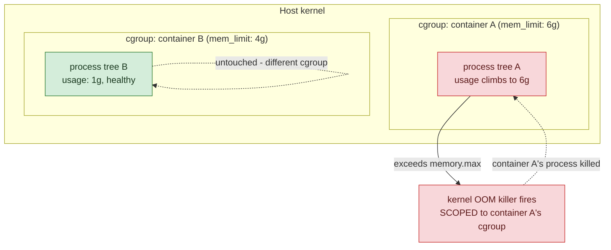
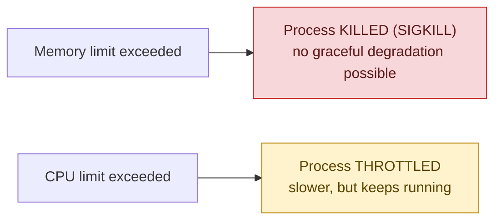

## 1. The Engineering Problem: a container is just a process, sharing the host's RAM and CPU

Without an explicit limit, a container's memory usage has no ceiling. A memory leak in one service climbs until the *host kernel* runs out of RAM — and the Linux OOM killer that fires at that point doesn't know or care about container boundaries. It scores every process on the machine by "badness" (memory footprint, mostly) and kills whichever one loses, which can just as easily be your database's process as the leaking service that actually caused the problem. One misbehaving container takes down unrelated ones by starving the whole host.

You need per-container ceilings enforced by the kernel itself — not application-level self-restraint, not "we'll notice in monitoring" — so a runaway process gets contained to its own blast radius.

---

## 2. The Technical Solution: Docker limits are cgroups, not a Docker-invented mechanism

`mem_limit`/`--memory` and `cpus`/`--cpus` aren't Docker features implemented in `dockerd` — they're a thin interface onto **Linux cgroups (control groups)**, the same kernel mechanism `runc` writes into when it creates the container's process tree. Each container gets its own cgroup; `mem_limit: 6g` becomes that cgroup's `memory.max` file (cgroup v2), and `cpus: "1.5"` becomes `cpu.max`'s quota/period pair.



The mechanism-level point that matters most: **memory and CPU limits are enforced completely differently, and that difference is a design decision, not an implementation detail.**

- **Exceed a memory limit and the kernel kills a process.** Memory can't be throttled — a process either fits in its allotted pages or it doesn't — so the cgroup's OOM killer terminates something inside that cgroup specifically (not host-wide, unlike the no-limit case above).
- **Exceed a CPU limit and the kernel throttles, it doesn't kill.** `cpu.max`'s quota/period pair means the container's processes simply get scheduled less often once they've used their quota for that period — requests get slower, nothing terminates.



One more common trap worth naming explicitly: **the `deploy.resources` block in a Compose file is a Swarm-only field** — `docker stack deploy` reads it, but plain `docker compose up` silently ignores it entirely. The top-level `mem_limit`/`cpus` keys (not nested under `deploy:`) are what plain Compose actually enforces — a Compose file with limits only under `deploy:` has no resource limits at all outside Swarm mode, and nothing warns you.

---

## 3. The clean example (concept in isolation)

```yaml
services:
  worker:
    image: myapp/worker:1.0
    mem_limit: 2g       # cgroup memory.max - exceeding this gets the process killed
    cpus: "1.5"          # cgroup cpu.max - exceeding this throttles, doesn't kill
```

---

## 4. Production reality (from `openfoodfacts/robotoff`)

Robotoff — Open Food Facts' real product-classification service — tunes memory limits per service role, using YAML anchors to avoid repeating the shared config across six services:

```yaml
# docker-compose.yml (anchors, then per-service overrides)
x-robotoff-base:
  &robotoff-base
  restart: $RESTART_POLICY
  image: ghcr.io/openfoodfacts/robotoff:${TAG}
  volumes: *robotoff-base-volumes
  networks: [default, common_net]

x-robotoff-worker-base:
  &robotoff-worker
  <<: *robotoff-base
  depends_on: [postgres, redis]
  mem_limit: 8g          # background job workers: heaviest default budget

services:
  api:
    <<: *robotoff-base
    mem_limit: 6g          # request-serving tier
    depends_on: [postgres, redis, elasticsearch]

  update-listener:
    <<: *robotoff-base
    mem_limit: 1g          # lightweight event listener, much smaller budget
    depends_on: [redis]
    command: python -m robotoff run-update-listener

  postgres:
    mem_limit: 20g         # needs headroom for shared_buffers/work_mem
    shm_size: 1g

  elasticsearch:
    ulimits:
      memlock: {soft: -1, hard: -1}   # different mechanism - see below
      nofile: {soft: 262144, hard: 262144}
    mem_limit: 15g
```

What this teaches that a hello-world can't:

- **Memory budgets are sized per workload shape, not uniformly.** `update-listener` (1g) just watches a Redis stream and reacts — it needs almost nothing. `postgres` (20g) and `elasticsearch` (15g) are stateful services with their own internal memory management (`shared_buffers`, JVM heap) that needs real headroom above the process's baseline. Copying one "safe default" across every service would either starve the database or waste RAM on the listener.
- **`ulimits.memlock: {soft: -1, hard: -1}` on Elasticsearch is a genuinely different enforcement layer from `mem_limit`, not a variant of it.** `ulimits` are POSIX per-process resource limits (`setrlimit`), a mechanism that predates containers and cgroups entirely — here it's unlocking *unlimited* memory-locking so the Elasticsearch JVM can `mlock` its heap into physical RAM and refuse to let the kernel swap it out. Swapped JVM heap pages would cause garbage-collection pauses so severe the service becomes unusable; this ulimit exists specifically to prevent that, and it works alongside `mem_limit`, not instead of it.
- **No service in this file sets `cpus` at all.** That's a real, deliberate choice visible in production code: an out-of-memory event is catastrophic (a killed process, possibly mid-write for Postgres), while CPU contention just makes requests slower — so this team spent its tuning effort entirely on memory ceilings and left CPU scheduling to the kernel's default fair-share behavior between containers.

Known-stale fact: cgroup v2 is the default on current Docker Engine and virtually every current Linux distribution's kernel — cgroup v1's `memory.limit_in_bytes` and separate `cpu`/`cpuacct` controllers are the legacy interface. Advice written against cgroup v1 (checking `/sys/fs/cgroup/memory/...` paths, for instance) targets a layout that doesn't exist under v2's unified hierarchy (`/sys/fs/cgroup/memory.max` instead) — worth confirming which version a host runs before troubleshooting a limit issue by reading `/sys/fs/cgroup` directly.

---

## Source

- **Concept:** Resource limits (cgroups)
- **Domain:** docker
- **Repo:** [openfoodfacts/robotoff](https://github.com/openfoodfacts/robotoff) → [`docker-compose.yml`](https://github.com/openfoodfacts/robotoff/blob/main/docker-compose.yml) — Open Food Facts' real product-classification service.
