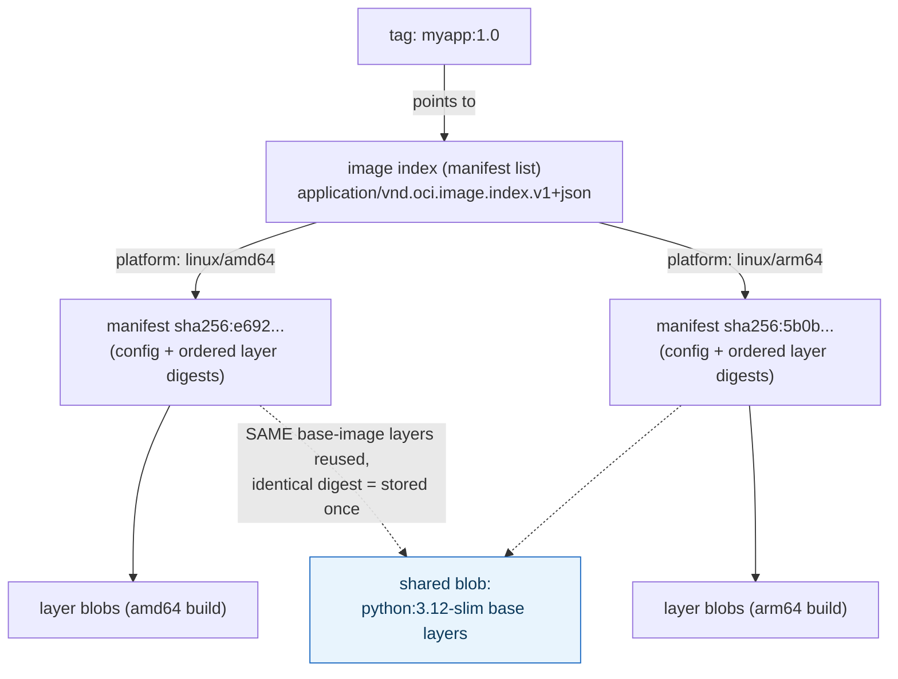
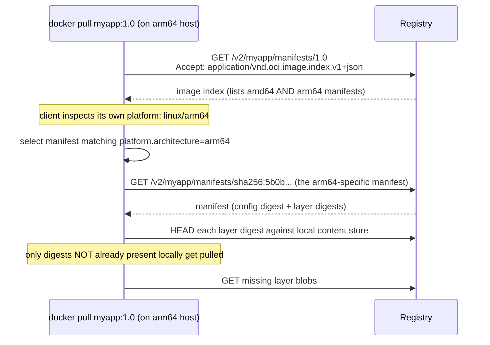

**TL;DR:** What actually happens when you run `docker push`? Every layer and image config is stored as a content-addressed blob keyed by its SHA-256 digest, and a manifest simply lists the digests making up one image, so pushing a rebuilt image only uploads blobs the registry doesn't already have — and a single tag can point to different manifests for different platforms via an image index.
> **In plain English (30 sec):** Think of this like concepts you already use, but in a production system at scale.


**Real repo:** [`distribution/distribution`](https://github.com/distribution/distribution), [`opencontainers/image-spec`](https://github.com/opencontainers/image-spec)

## 1. The Engineering Problem: "upload the image" is the wrong mental model

Treat an image as one opaque blob and two real problems show up fast. First, **redundant transfer**: if ten of your services all `FROM python:3.12-slim`, pushing each one shouldn't re-upload that base layer ten times — but a naive "upload the whole image" model doesn't know the layers are identical. Second, **one tag, many platforms**: `myapp:1.0` needs to resolve to a genuinely different binary on `linux/amd64` vs. `linux/arm64` — a single flat manifest can't represent "this tag means different bytes depending on who's asking."

A registry needs to store content by *what it is* (so identical bytes are never stored or transferred twice) and needs a tag to be able to point at *more than one* real artifact depending on the puller's platform.

---

## 2. The Technical Solution: content-addressable blobs + a manifest that names them by digest

Every layer and every image config in a registry is a **blob**, stored and addressed by the SHA-256 digest of its own contents — not by filename, not by which image it "belongs to." A **manifest** is a small JSON document that lists the digests making up one image (config blob + ordered layer blobs). A **tag** (`myapp:1.0`) is nothing more than a mutable pointer to one manifest's digest, held by the registry.



This is why the second `docker push` of a rebuilt image is so much faster than the first: **before uploading each blob, the client sends a `HEAD` request asking the registry "do you already have this digest?"** Any layer the registry already has (from any image, any repo it's tracked in) is skipped entirely — the push only transfers genuinely new blobs. `docker pull` does the mirror image of this on the client's own local content store.

Multi-platform resolution happens through the same layered structure, one level up:



Core truths: **a tag is just a label, never authoritative on its own** — the digest is the only thing that actually identifies content, which is why pinning a dependency to `image@sha256:...` instead of `image:latest` is the only way to guarantee you get the exact same bytes twice; and **`:latest` has zero special meaning to the registry protocol** — it's a Docker CLI default when no tag is given, not a "most recent build" guarantee enforced anywhere server-side.

---

## 3. The clean example (concept in isolation)

```json
{
  "schemaVersion": 2,
  "mediaType": "application/vnd.oci.image.manifest.v1+json",
  "config": {
    "mediaType": "application/vnd.oci.image.config.v1+json",
    "digest": "sha256:a1b2c3...",
    "size": 1512
  },
  "layers": [
    {"mediaType": "application/vnd.oci.image.layer.v1.tar+gzip", "digest": "sha256:base111...", "size": 29145000},
    {"mediaType": "application/vnd.oci.image.layer.v1.tar+gzip", "digest": "sha256:app222...", "size": 4096}
  ]
}
```

Two images built `FROM` the same base and differing only in their final `COPY` layer share `sha256:base111...` verbatim — the registry stores that blob once, no matter how many manifests reference it.

---

## 4. Production reality (from `distribution/distribution` and the OCI spec)

`distribution/distribution` is the actual open-source registry server implementation (formerly `docker/distribution`) that Docker Hub-compatible registries run:

```yaml
# cmd/registry/config-example.yml
version: 0.1
storage:
  cache:
    blobdescriptor: inmemory   # caches blob metadata lookups, not blob content itself
  filesystem:
    rootdirectory: /var/lib/registry
  tag:
    concurrencylimit: 8
http:
  addr: :5000
auth:
  htpasswd:
    realm: basic-realm
    path: /etc/registry
```

And the OCI Image Spec — the actual document defining the JSON format every registry and client (Docker, containerd, Podman) implements — publishes this as its canonical image-index example:

```json
{
  "schemaVersion": 2,
  "mediaType": "application/vnd.oci.image.index.v1+json",
  "manifests": [
    {
      "mediaType": "application/vnd.oci.image.manifest.v1+json",
      "size": 7143,
      "digest": "sha256:e692418e4cbaf90ca69d05a66403747baa33ee08806650b51fab815ad7fc331f",
      "platform": {"architecture": "ppc64le", "os": "linux"}
    },
    {
      "mediaType": "application/vnd.oci.image.manifest.v1+json",
      "size": 7682,
      "digest": "sha256:5b0bcabd1ed22e9fb1310cf6c2dec7cdef19f0ad69efa1f392e94a4333501270",
      "platform": {"architecture": "amd64", "os": "linux"}
    }
  ]
}
```

What this teaches that a hello-world can't:

- **`storage.cache.blobdescriptor: inmemory` caches metadata (digest, size, media type) about blobs, not the blobs themselves** — actual blob bytes live under `storage.filesystem.rootdirectory` (or S3/GCS/Azure in a real deployment). This split is why a registry restart doesn't lose data but does briefly slow down repeated existence checks until the cache warms.
- **The image index's `manifests` array has no `linux/arm/v7` entry in this example — and that's fine.** A puller on an unsupported platform simply finds no match and fails clearly at pull time; the index doesn't need to enumerate every possible platform, only the ones actually built.
- **Each manifest entry's `digest` is independent and immutable**, while the *tag* that eventually points at this whole index is the only mutable part of the chain. Rebuilding and re-pushing `myapp:1.0` swaps which index the tag points to — every previously-pulled digest reference to the old index remains valid and fetchable (registries don't garbage-collect a blob just because a tag stopped pointing at it, until an explicit GC run).

Known-stale fact: Docker Hub's anonymous and free-tier pull rate limits (introduced 2020, tightened since) mean a `FROM` line with no explicit registry (defaulting to Docker Hub) can start failing in CI under load in a way it wouldn't have a few years ago — a growing number of production pipelines now either authenticate their pulls or mirror base images through a private pull-through cache registry specifically to avoid this, which older Docker tutorials don't mention at all.

---

## Source

- **Concept:** Registries & image distribution
- **Domain:** docker
- **Repo:** [distribution/distribution](https://github.com/distribution/distribution) → [`cmd/registry/config-example.yml`](https://github.com/distribution/distribution/blob/main/cmd/registry/config-example.yml) — the reference open-source OCI registry server; [opencontainers/image-spec](https://github.com/opencontainers/image-spec) → [`image-index.md`](https://github.com/opencontainers/image-spec/blob/main/image-index.md) — the canonical OCI Image Index specification.


