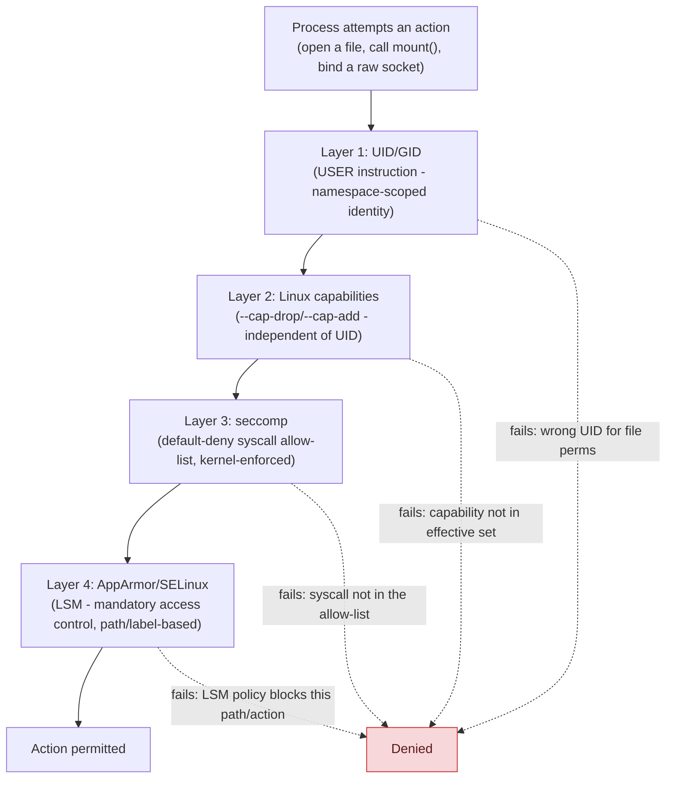

## 1. The Engineering Problem: container hardening is four independent layers, and fixing one doesn't fix the others

A team adds `USER 1000` to their Dockerfile, feels good about it, and stops. But **Linux capabilities are independent of UID at the kernel level** — that's the entire point of splitting root's power into separate capabilities in the first place. Docker's default container still grants its init process a fixed set of ~14 capabilities (`CAP_NET_RAW`, `CAP_NET_BIND_SERVICE`, `CAP_CHOWN`, and others), and several of those work regardless of which UID ends up running — `CAP_NET_RAW` for raw sockets and ARP-level tricks doesn't care if you're UID 0 or UID 1000. A non-root process with the default capability set is not the same thing as a non-root process with *no* capabilities.

Beyond capabilities, there's a third layer (which syscalls are even *callable*, independent of privilege — seccomp) and a fourth (mandatory access control on which files/resources a process may touch — AppArmor or SELinux). Harden only the UID and you've closed one door out of four.

---

## 2. The Technical Solution: four independent enforcement layers, stacked



Each layer is enforced by a genuinely different kernel subsystem, which is why they're additive, not redundant:

- **UID/GID** is the classic Unix permission model — but only governs what the *kernel's normal file-permission checks* allow, nothing about syscalls or capabilities.
- **Capabilities** split root's traditional all-or-nothing power into ~40 discrete privileges. Docker's default set is already a curated subset of the full root capability list — but it's not zero, and every capability in it works for whatever UID the process ends up running as, unless that UID's process has genuinely dropped it.
- **seccomp** filters at the syscall boundary itself, before capability checks even run. Docker's default seccomp profile is `SCMP_ACT_ERRNO` by default — **deny by default, then an explicit allow-list** — blocking dangerous syscalls like `mount`, `reboot`, `unshare`(for further namespace creation), and `keyctl` outright, regardless of what capabilities or UID the calling process has.
- **AppArmor/SELinux** add a completely separate mandatory-access-control layer on top, enforced by the kernel's LSM (Linux Security Module) hooks — path-based confinement (AppArmor) or label-based (SELinux), neither of which knows or cares about seccomp's syscall list or the capability set at all.

**Rootless mode is a fifth, orthogonal axis** — it's not about what the container's process can do, it's about what "root inside the container" actually *means* on the host. A rootless `dockerd` runs as an unprivileged host user and uses Linux user namespaces (`newuidmap`/`newgidmap`, setuid helper binaries that remap a UID range) so that UID 0 *inside* a container maps to a genuinely unprivileged UID *outside* it. Even a full container-to-host escape lands on a non-root host account — this stacks with, and doesn't replace, everything above.

---

## 3. The clean example (concept in isolation)

```dockerfile
FROM alpine:3.20
RUN adduser -S -u 10001 appuser
USER appuser
ENTRYPOINT ["/app/server"]
```

```bash
docker run \
  --cap-drop=ALL \
  --cap-add=NET_BIND_SERVICE \
  --security-opt no-new-privileges:true \
  --security-opt seccomp=default.json \
  myapp:1.0
```

---

## 4. Production reality (from `grafana/grafana` and `moby/moby`)

Grafana's Dockerfile handles non-root differently across its three base images, because each base has different tooling available:

```dockerfile
# Alpine variant - has adduser
RUN adduser -S -u $GF_UID -G "$GF_GID_NAME" grafana && \
  chown -R "grafana:$GF_GID_NAME" "$GF_PATHS_DATA" ... && \
  chmod -R 777 "$GF_PATHS_DATA" ...
...
USER "$GF_UID"

# Distroless variant - NO shell, NO useradd at all
RUN printf 'root:x:0:0:root:/root:/sbin/nologin\n\
nobody:x:65534:65534:nobody:/nonexistent:/sbin/nologin\n\
grafana:x:%s:%s::/usr/share/grafana:/sbin/nologin\n' "$GF_UID" "$GF_GID" > /tmp/distroless-passwd && \
  printf 'root:x:0:\nnobody:x:65534:\n' > /tmp/distroless-group
...
USER "$GF_UID"
```

```json
// moby/moby's own seccomp default-profile fixture (structurally identical
// to the real shipped default: deny-by-default, then an explicit allow-list)
{
  "defaultAction": "SCMP_ACT_ERRNO",
  "syscalls": [
    {"names": ["accept", "accept4", "access", "bind", "..."], "action": "SCMP_ACT_ALLOW"}
  ]
}
```

What this teaches that a hello-world can't:

- **The distroless variant can't run `useradd` because there's no shell, no package manager, nothing — so the Dockerfile writes `/etc/passwd` and `/etc/group` as raw text with `printf`.** This is what "distroless" actually costs you operationally: even the most basic user-provisioning step has to be hand-rolled, because the entire point of the base image is having none of that tooling present to reduce attack surface.
- **`GF_UID` defaults to `472`, but `GF_GID` defaults to `0` — root's group, deliberately.** This is the well-known OpenShift-compatibility pattern: OpenShift assigns containers an arbitrary, unpredictable UID at deploy time but keeps them in group `0`, so files need to be group-writable by GID 0 specifically to work under both "run as the UID the Dockerfile picked" and "run as whatever UID OpenShift assigns." `chmod -R 777` on the data directories exists for the same reason — an arbitrary future UID has to be able to write there, and you can't `chown` in advance for a UID you don't know yet.
- **The seccomp allow-list's first entries are unremarkable networking/file syscalls (`accept`, `bind`, `access`) — the interesting part is everything NOT in the list.** `mount`, `reboot`, `unshare`, `keyctl` never appear as allowed anywhere in the default profile; a process would need `--security-opt seccomp=unconfined` (disabling this layer entirely) to call them, which is exactly the kind of flag that shows up in an incident review after a container breakout.

Known-stale fact: rootless Docker is a real, shipped mode (`dockerd-rootless.sh`), not an experimental patch — it's been stable for several major Docker Engine releases now. It's also frequently confused with "running the container as non-root" (a Dockerfile's `USER` instruction), which is a completely different, unrelated setting; a cluster or CI runner can have a rootless daemon while every container on it still runs as UID 0 inside its own namespace, and vice versa.

---

## Source

- **Concept:** Security (rootless, non-root user, seccomp/AppArmor)
- **Domain:** docker
- **Repo:** [grafana/grafana](https://github.com/grafana/grafana) → [`Dockerfile`](https://github.com/grafana/grafana/blob/main/Dockerfile) — three real non-root user strategies across Alpine/distroless/Ubuntu bases; [moby/moby](https://github.com/moby/moby) → [`daemon/pkg/oci/fixtures/default.json`](https://github.com/moby/moby/blob/master/daemon/pkg/oci/fixtures/default.json) — Docker Engine's own seccomp default-profile test fixture.
