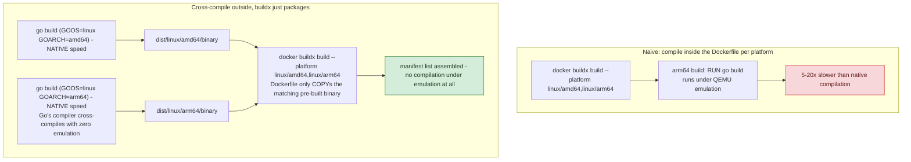

**TL;DR:** Why does your multi-arch Docker build take 10x longer than the single-arch one? Building each non-native platform inside the Dockerfile forces BuildKit to run compilation steps under slow QEMU emulation, but for languages with real cross-compilation support (like Go), cross-compiling the binaries natively outside the Dockerfile and having buildx just `COPY` and package them per platform avoids emulated compilation entirely.

**Real repo:** [`traefik/traefik`](https://github.com/traefik/traefik)

## 1. The Engineering Problem: `--platform linux/amd64,linux/arm64` is correct and also a trap

`docker buildx build --platform linux/amd64,linux/arm64 --push .` is the textbook multi-arch command, and it works — BuildKit builds your image once per platform and assembles the results into a single manifest list. But run this on a plain x86_64 GitHub Actions runner and the `arm64` build doesn't run on real ARM hardware — it runs under **QEMU user-mode emulation**, translating every ARM64 instruction in software on the x86_64 host. For a static file copy, that's invisible. For a `RUN go build` or `RUN npm run build` step compiling real source, emulated execution can be 5-20x slower than native — a build that takes 3 minutes on its native architecture can take 30+ minutes emulated, and teams routinely blame "Docker" or "buildx" for a slowdown that's actually QEMU doing exactly what it's designed to do, just expensively.

---

## 2. The Technical Solution: emulation is for *running* things, not the only way to *get* a multi-platform image

The manifest-list assembly step (one image index, multiple platform-specific manifests) is the same regardless of how each platform's contents got built. The real choice is **what actually executes under emulation** — and for any language with real cross-compilation support (Go chief among them — `GOOS`/`GOARCH` env vars are a built-in, no-emulation-needed compiler target switch), the answer can be "nothing."



The mechanism that makes this work: **buildx automatically injects `TARGETPLATFORM` (and the more granular `TARGETOS`/`TARGETARCH`/`TARGETVARIANT`) as build args for each platform in the matrix**, without you passing them explicitly. A Dockerfile that never runs a compiler at all — just `COPY`s the right pre-built binary based on `$TARGETPLATFORM` — never pays the emulation cost, because there's nothing left for QEMU to translate; `apk add`/`COPY`/metadata operations are cheap regardless of emulation.

Core truths: **the default `docker` builder driver can't produce multi-platform output at all** — `docker buildx create --use` (or Docker Desktop's bundled `docker-container` driver) is what actually enables cross-platform builds and `--push`-based manifest-list assembly; and **QEMU emulation is still genuinely necessary for languages without real cross-compilation support** (many C/C++ builds with native toolchain dependencies) — the cross-compile-then-COPY pattern isn't universal, it's specifically available when your language's own compiler supports targeting a different architecture natively.

---

## 3. The clean example (concept in isolation)

```dockerfile
# syntax=docker/dockerfile:1
FROM alpine:3.20
ARG TARGETPLATFORM
COPY dist/$TARGETPLATFORM/app /app   # pre-built OUTSIDE this Dockerfile, per platform
ENTRYPOINT ["/app"]
```

```bash
# Cross-compile natively for each platform - zero emulation
GOOS=linux GOARCH=amd64 go build -o dist/linux/amd64/app .
GOOS=linux GOARCH=arm64 go build -o dist/linux/arm64/app .

# buildx just assembles the manifest list from already-built binaries
docker buildx build --platform linux/amd64,linux/arm64 -t myapp:1.0 --push .
```

---

## 4. Production reality (from `traefik/traefik`)

Traefik's real Dockerfile never compiles anything — it copies a binary that was cross-compiled by Go *before* `docker buildx build` even runs:

```dockerfile
# syntax=docker/dockerfile:1.2
FROM alpine:3.24
RUN apk add --no-cache --no-progress ca-certificates tzdata

ARG TARGETPLATFORM
COPY ./dist/$TARGETPLATFORM/traefik /

EXPOSE 80
ENTRYPOINT ["/traefik"]
```

```makefile
# Makefile
DOCKER_BUILD_PLATFORMS ?= linux/amd64,linux/arm64

multi-arch-image-%: binary-linux-amd64 binary-linux-arm64
	docker buildx build $(DOCKER_BUILDX_ARGS) -t traefik/traefik:$* \
	  --platform=$(DOCKER_BUILD_PLATFORMS) -f Dockerfile .
```

```yaml
# .github/workflows/experimental.yaml
- name: Set up QEMU
  uses: docker/setup-qemu-action@8d2750c68a...   # installed anyway, for edge cases
- name: Set up Docker Buildx
  uses: docker/setup-buildx-action@8d2750c68a...
- name: Build docker experimental image
  env:
    DOCKER_BUILDX_ARGS: "--push"
  run: make multi-arch-image-experimental-${GITHUB_REF##*/}
```

What this teaches that a hello-world can't:

- **`multi-arch-image-%` depends on `binary-linux-amd64 binary-linux-arm64` — Make targets that run Go's native cross-compiler, not Docker at all** — before `docker buildx build` is ever invoked. By the time buildx runs, both platform's binaries already exist on disk at `dist/linux/amd64/traefik` and `dist/linux/arm64/traefik`; buildx's job is packaging and manifest-list assembly, full stop.
- **`ARG TARGETPLATFORM` combined with `COPY ./dist/$TARGETPLATFORM/traefik /`** is the entire mechanism connecting "which platform is buildx currently building for" to "which pre-built binary goes in this image." No conditional logic, no `if` branches in the Dockerfile — the variable substitution does all the work, because `TARGETPLATFORM` resolves to exactly `linux/amd64` or `linux/arm64` per build, matching the `dist/` directory structure the Makefile already produced.
- **`docker/setup-qemu-action` is still installed in the workflow even though this particular Dockerfile never needs it** — a defensive default for the general buildx setup pattern, not evidence that Traefik's own build relies on emulation. Seeing both actions present in a real workflow doesn't mean QEMU is doing meaningful work; you have to check whether anything in the Dockerfile actually executes platform-specific code to know.

Known-stale fact: `docker buildx` capabilities have been merging into the plain `docker build` CLI surface on current Docker Engine versions (BuildKit is the default builder for both), but **multi-platform output specifically still requires a builder instance using the `docker-container` (or a remote) driver** — the default `docker` driver, tied directly to the local daemon's single-platform image store, cannot produce a multi-platform manifest list no matter which command name invokes it.

---

## Source

- **Concept:** Multi-arch builds (buildx)
- **Domain:** docker
- **Repo:** [traefik/traefik](https://github.com/traefik/traefik) → [`Dockerfile`](https://github.com/traefik/traefik/blob/master/Dockerfile), [`Makefile`](https://github.com/traefik/traefik/blob/master/Makefile), [`.github/workflows/experimental.yaml`](https://github.com/traefik/traefik/blob/master/.github/workflows/experimental.yaml) — real cross-compile-then-package multi-arch pipeline.
