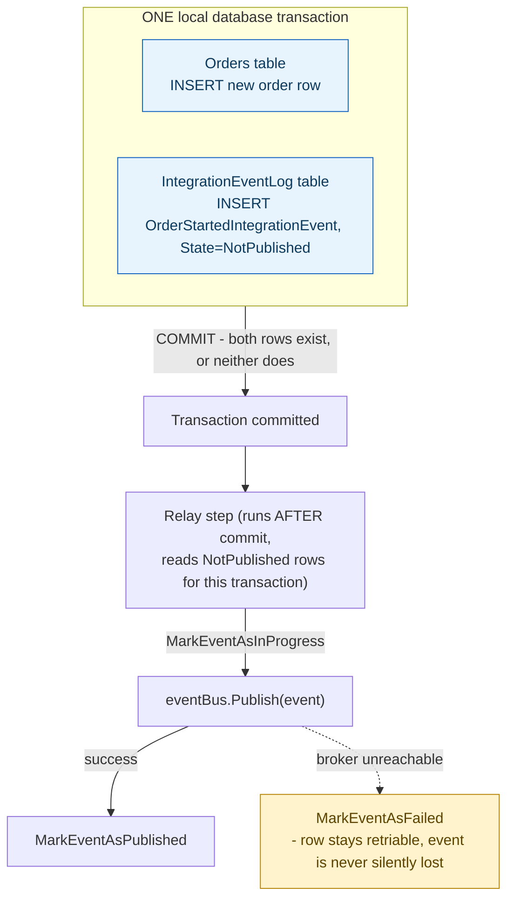
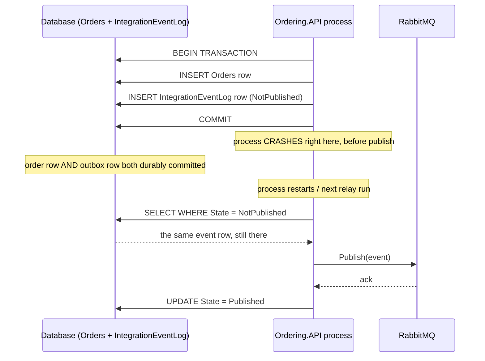

## 1. The Engineering Problem: a DB write and a message publish can't be made atomic the naive way

The obvious code is: save the order to the database, then call `eventBus.Publish(orderPlacedEvent)`. Two operations against two different systems, no shared transaction. If the process crashes right after the commit but before the publish call — or the broker is briefly unreachable — the order exists, permanently, and nothing else in the system ever finds out. Reorder it (publish first, save second) and you get the opposite failure: other services react to an order that was never actually persisted. This is the **dual-write problem**, and it's not a bug you can fix by adding a retry — the two systems genuinely have no shared notion of a transaction.

Real distributed transactions (two-phase commit / XA) across an arbitrary database and message broker are rarely supported end-to-end by modern infrastructure, and even where they exist they block on coordinator failure. You need a way to guarantee "the DB write and the notification either both eventually happen, or neither does" using only the transactional guarantees a single database already gives you for free.

---

## 2. The Technical Solution: write the event to an outbox table, in the SAME local transaction — then relay it separately

The **Transactional Outbox** pattern sidesteps the dual-write problem entirely: instead of publishing directly, the business transaction also writes a row to an `IntegrationEventLog` table, in the exact same database transaction as the business data change. That's one database, one ACID transaction — trivially atomic. A separate step, the **relay**, later reads unpublished rows and actually pushes them to the broker.



The property that actually matters: **the relay can crash between publishing and marking a row `Published`, and that's fine** — the row is still `NotPublished` or `InProgress`, so a future relay run republishes it. The pattern trades "might publish twice" for "will never silently lose an event" — which is the correct trade, because a duplicate is cheap to handle (idempotent consumers) while a lost event is a real, undetectable inconsistency.



This same mechanism is what makes a **choreography-style saga** reliable: a saga is just a sequence of local transactions, each service reacting to the previous step's event and publishing its own — no central coordinator, no distributed transaction spanning the whole sequence. The outbox pattern is what guarantees each individual link in that chain actually fires once its local transaction commits, which is the reliability property the whole saga depends on.

---

## 3. The clean example (concept in isolation)

```csharp
// Same DbContext, same transaction, two tables
using var tx = await db.Database.BeginTransactionAsync();
db.Orders.Add(new Order(orderId, total));
db.OutboxEvents.Add(new OutboxEvent(orderId, "OrderPlaced", payload, published: false));
await db.SaveChangesAsync();
await tx.CommitAsync();

// Separate relay - runs after commit, or as a standalone background poller
var pending = db.OutboxEvents.Where(e => !e.Published);
foreach (var evt in pending)
{
    await eventBus.PublishAsync(evt);
    evt.Published = true;
    await db.SaveChangesAsync();
}
```

---

## 4. Production reality (from `dotnet-architecture/eShopOnContainers`)

```
src/
├── BuildingBlocks/EventBus/IntegrationEventLogEF/
│   ├── Services/IntegrationEventLogService.cs   # outbox table read/write
│   └── Utilities/ResilientTransaction.cs         # shared-transaction helper
└── Services/Ordering/Ordering.API/Application/
    ├── Behaviors/TransactionBehaviour.cs          # wraps EVERY command
    └── IntegrationEvents/OrderingIntegrationEventService.cs
```

```csharp
// Behaviors/TransactionBehaviour.cs - wraps every MediatR command handler
public async Task<TResponse> Handle(TRequest request, RequestHandlerDelegate<TResponse> next, ...)
{
    var strategy = _dbContext.Database.CreateExecutionStrategy();
    await strategy.ExecuteAsync(async () =>
    {
        Guid transactionId;
        await using var transaction = await _dbContext.BeginTransactionAsync();

        response = await next();   // the actual command handler runs INSIDE this transaction

        await _dbContext.CommitTransactionAsync(transaction);
        transactionId = transaction.TransactionId;

        // relay only fires AFTER the business transaction has committed
        await _orderingIntegrationEventService.PublishEventsThroughEventBusAsync(transactionId);
    });
    return response;
}
```

```csharp
// IntegrationEvents/OrderingIntegrationEventService.cs
public async Task AddAndSaveEventAsync(IntegrationEvent evt)
{
    // writes the outbox row using the OrderingContext's CURRENT transaction -
    // same commit/rollback boundary as the order data itself
    await _eventLogService.SaveEventAsync(evt, _orderingContext.GetCurrentTransaction());
}

public async Task PublishEventsThroughEventBusAsync(Guid transactionId)
{
    var pendingLogEvents = await _eventLogService.RetrieveEventLogsPendingToPublishAsync(transactionId);
    foreach (var logEvt in pendingLogEvents)
    {
        try
        {
            await _eventLogService.MarkEventAsInProgressAsync(logEvt.EventId);
            _eventBus.Publish(logEvt.IntegrationEvent);
            await _eventLogService.MarkEventAsPublishedAsync(logEvt.EventId);
        }
        catch (Exception ex)
        {
            await _eventLogService.MarkEventAsFailedAsync(logEvt.EventId);
        }
    }
}
```

What this teaches that a hello-world can't:

- **`IntegrationEventLogService.SaveEventAsync` calls `_integrationEventLogContext.Database.UseTransaction(transaction.GetDbTransaction())`** — the outbox row is written through a *second, separate* `DbContext` instance (`IntegrationEventLogContext`, not `OrderingContext`), yet it's forced onto the exact same underlying ADO.NET transaction. This is the literal mechanism that makes "different logical table, same atomic commit" actually true — not two contexts hoping to agree, one shared transaction object handed between them explicitly.
- **`TransactionBehaviour` is a MediatR pipeline behavior, not code duplicated into every command handler.** Every command that touches `OrderingContext` automatically gets wrapped in begin-transaction → handle → commit → relay, without any individual handler (like `CreateOrderCommandHandler`) needing to know the outbox pattern exists at all — it just calls `AddAndSaveEventAsync` and trusts the pipeline to handle atomicity and the post-commit relay.
- **A three-state status field (`NotPublished`/`InProgress`/`Published`, plus `Failed`) rather than a boolean** is what makes the relay safe to retry without ambiguity — `InProgress` specifically marks "a previous relay attempt started publishing this and we don't know if it succeeded," a state a simple `published: bool` can't represent, and which matters exactly when diagnosing a crash mid-relay.

Known-stale fact: two-phase commit (XA transactions) spanning a relational database and a message broker is the "textbook correct" answer many people learn first — but production RabbitMQ/Kafka deployments essentially never support XA end-to-end, and even where a broker does, a blocked transaction coordinator can freeze the whole system. The outbox-plus-relay pattern isn't a workaround for missing 2PC support; it's the actual industry-standard replacement, because it needs no cross-system coordinator at all, at the cost of consumers needing to tolerate occasional duplicate delivery.

---

## Source

- **Concept:** Data consistency patterns (Saga/outbox)
- **Domain:** microservices
- **Repo:** [dotnet-architecture/eShopOnContainers](https://github.com/dotnet-architecture/eShopOnContainers) → [`TransactionBehaviour.cs`](https://github.com/dotnet-architecture/eShopOnContainers/blob/dev/src/Services/Ordering/Ordering.API/Application/Behaviors/TransactionBehaviour.cs), [`OrderingIntegrationEventService.cs`](https://github.com/dotnet-architecture/eShopOnContainers/blob/dev/src/Services/Ordering/Ordering.API/Application/IntegrationEvents/OrderingIntegrationEventService.cs), [`IntegrationEventLogService.cs`](https://github.com/dotnet-architecture/eShopOnContainers/blob/dev/src/BuildingBlocks/EventBus/IntegrationEventLogEF/Services/IntegrationEventLogService.cs) — the reference implementation's real outbox + relay.
