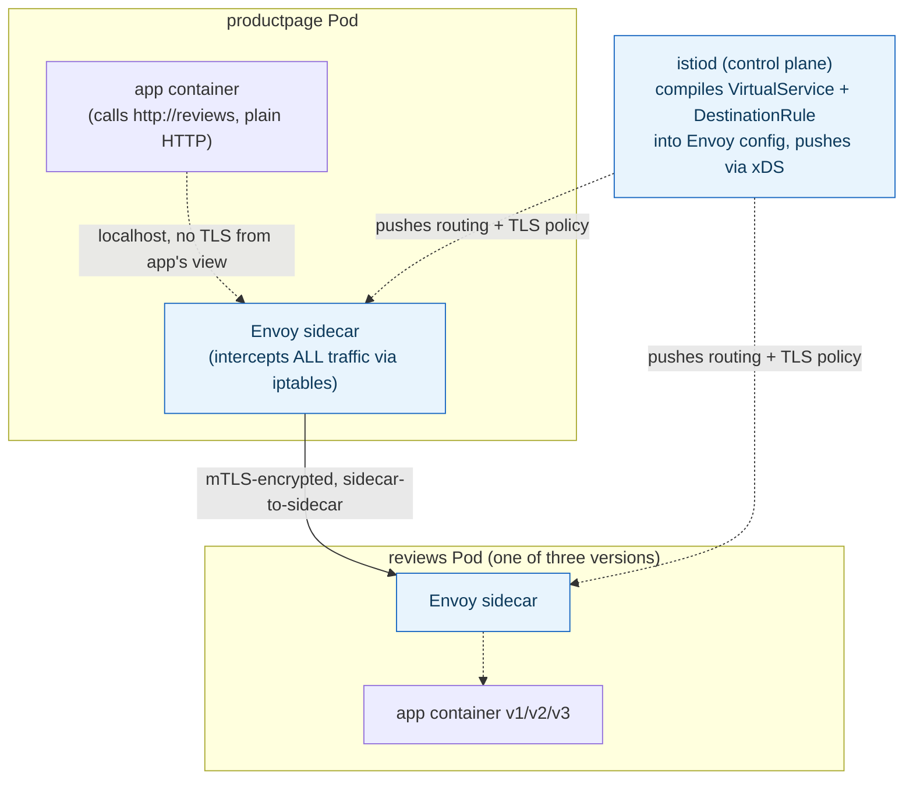
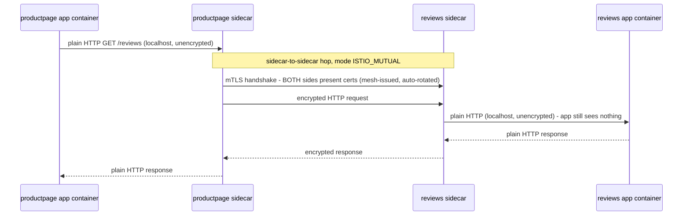

## 1. The Engineering Problem: cross-cutting network concerns don't belong in application code, but that's where they usually end up

Retries, timeouts, circuit breaking, mutual TLS, canary/weighted routing — none of these are business logic, yet the traditional answer is a resilience library (Hystrix-era Netflix OSS, Polly, resilience4j) imported into every service. That means every language your organization uses needs its own port of the same policies, a config change to a retry budget means redeploying every service that calls that library, and there's no way to *guarantee* every team actually wired it in correctly — a service that forgot to add the library has none of these protections, silently.

You need these concerns enforced **outside** application code entirely, uniformly, regardless of what language a given service happens to be written in.

---

## 2. The Technical Solution: a sidecar proxy intercepts all traffic, controlled by mesh-wide config, not application code

A **service mesh** injects a proxy (Istio uses Envoy) into every Pod as a sidecar container. Every inbound and outbound call for that Pod is transparently intercepted by its own sidecar via `iptables` rules set up at Pod startup — application code just calls `http://reviews` like it's talking directly to the destination; it never runs TLS negotiation, retry loops, or routing logic itself.



Two CRDs carry the actual policy: a **`DestinationRule`** defines named *subsets* of a Service (usually by pod label, like `version: v2`) plus connection policy (load-balancing algorithm, TLS mode); a **`VirtualService`** defines routing rules — which subset gets what percentage of traffic, fault injection, retries. Neither object touches a Deployment or a line of application code.

The mTLS mechanism specifically is worth tracing step by step, because "the app never sees TLS at all" is the part newcomers usually get wrong:



---

## 3. The clean example (concept in isolation)

```yaml
apiVersion: networking.istio.io/v1
kind: DestinationRule
metadata:
  name: reviews
spec:
  host: reviews
  subsets:
    - name: v1
      labels: {version: v1}
    - name: v2
      labels: {version: v2}
---
apiVersion: networking.istio.io/v1
kind: VirtualService
metadata:
  name: reviews
spec:
  hosts: [reviews]
  http:
    - route:
        - destination: {host: reviews, subset: v1}
          weight: 90
        - destination: {host: reviews, subset: v2}
          weight: 10
```

---

## 4. Production reality (from `istio/istio`'s `bookinfo` sample)

```yaml
# samples/bookinfo/networking/destination-rule-reviews.yaml
apiVersion: networking.istio.io/v1
kind: DestinationRule
metadata:
  name: reviews
spec:
  host: reviews
  trafficPolicy:
    loadBalancer:
      simple: RANDOM
  subsets:
  - {name: v1, labels: {version: v1}}
  - {name: v2, labels: {version: v2}}
  - {name: v3, labels: {version: v3}}
```

```yaml
# samples/bookinfo/networking/virtual-service-reviews-90-10.yaml
apiVersion: networking.istio.io/v1
kind: VirtualService
metadata:
  name: reviews
spec:
  hosts: [reviews]
  http:
  - route:
    - {destination: {host: reviews, subset: v1}, weight: 90}
    - {destination: {host: reviews, subset: v2}, weight: 10}
```

```yaml
# samples/bookinfo/networking/destination-rule-all-mtls.yaml (excerpt, 1 of 4 services)
apiVersion: networking.istio.io/v1
kind: DestinationRule
metadata:
  name: reviews
spec:
  host: reviews
  trafficPolicy:
    tls:
      mode: ISTIO_MUTUAL      # enforce mesh-managed mTLS for calls to reviews
  subsets: [{name: v1, labels: {version: v1}}, {name: v2, labels: {version: v2}}, {name: v3, labels: {version: v3}}]
```

```yaml
# samples/bookinfo/networking/fault-injection-details-v1.yaml
apiVersion: networking.istio.io/v1
kind: VirtualService
metadata:
  name: details
spec:
  hosts: [details]
  http:
  - fault:
      abort: {httpStatus: 555, percentage: {value: 100}}   # inject a failure, no code change to 'details'
    route: [{destination: {host: details, subset: v1}}]
```

What this teaches that a hello-world can't:

- **`destination-rule-all-mtls.yaml` applies `ISTIO_MUTUAL` to `productpage`, `reviews`, `ratings`, AND `details` — every service in the mesh, at once, from one file.** Rolling out mutual TLS this way needs zero changes to any of the four services' own Deployments or code; it's purely a client-side policy telling each caller's sidecar "encrypt calls to this host," matched by the mesh's own certificate infrastructure on the receiving side.
- **Fault injection returns HTTP 555 (a non-standard, mesh-specific status) at exactly `percentage: 100`** — this is Istio's own convention for signaling "this failure was injected by the mesh, not a real backend error," making it distinguishable in logs/traces from a genuine `details` outage. Testing "what happens when `details` is down" needs no code change and no actually breaking `details` — the sidecar fabricates the failure before the request ever reaches the app container.
- **`loadBalancer: {simple: RANDOM}` on the `reviews` DestinationRule is a mesh-layer load-balancing algorithm choice, separate from Kubernetes Service's own `kube-proxy` load balancing** — traffic to `reviews` is already being load-balanced once by the Service abstraction; the mesh adds a second, independently-configurable balancing decision on top, specifically among the subset(s) a `VirtualService` routed to.

Known-stale fact: Istio's original architecture (pre-1.5) split telemetry/policy enforcement into a separate out-of-process component called **Mixer**, called synchronously by every sidecar on every request — a real performance and complexity cost. Mixer was removed entirely in Istio 1.5+ in favor of in-proxy telemetry via Envoy's own WASM/native stats filters; tutorials or diagrams still showing a "Mixer" box in the Istio control plane are describing an architecture that no longer exists.

---

## Source

- **Concept:** Service mesh
- **Domain:** microservices
- **Repo:** [istio/istio](https://github.com/istio/istio) → [`samples/bookinfo/networking/`](https://github.com/istio/istio/tree/master/samples/bookinfo/networking) (`destination-rule-reviews.yaml`, `virtual-service-reviews-90-10.yaml`, `destination-rule-all-mtls.yaml`, `fault-injection-details-v1.yaml`) — Istio's own canonical demo application.
