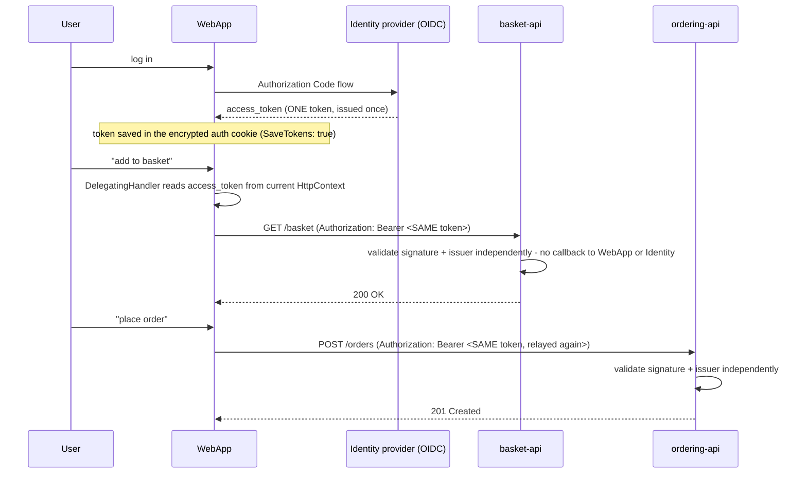

**TL;DR:** How does a downstream API trust a request without asking the user to log in again? Token relay forwards the same OAuth2/OIDC access token the frontend obtained at login as a Bearer header on every downstream call, and each service validates that token independently against the shared identity provider, with no re-authentication and no synchronous callback per request.

**Real repo:** [`dotnet/eShop`](https://github.com/dotnet/eShop)

## 1. The Engineering Problem: the user only logs in once, but three services need to know who they are

A web frontend authenticates the user once against an identity provider. Then it needs to call the basket API, the catalog API, and the ordering API on that user's behalf. Three bad options present themselves: let every downstream service trust the frontend blindly (no per-user authorization at all — the frontend becomes an all-powerful proxy that can act as *any* user); make the user log in again separately against each backend (breaks single sign-on, terrible UX, and means sharing credentials across services); or find a way to carry the *same* proof of identity from the one login all the way through to every downstream call.

---

## 2. The Technical Solution: relay the same access token, let every downstream service validate it independently

**Token relay** (also called token propagation): the frontend obtains one access token via the OAuth2/OIDC Authorization Code flow, and a shared piece of HTTP-client middleware attaches that *same* token as an `Authorization: Bearer` header on every outgoing call to a downstream API — no new token is minted per call. Each downstream service validates the token independently against the shared identity provider (checking its signature and issuer), without ever calling back to the frontend or the identity provider synchronously per request.



Core truths: **the token is relayed verbatim, not re-issued** — the frontend never generates or signs anything itself, it only forwards what the identity provider already gave it; and **every downstream service validates independently and statelessly**, checking the token's signature against the identity provider's public key and its issuer claim, which is exactly what makes JWTs work at scale — no shared session store, no synchronous "is this token still valid?" call back to a central authority on every request.

---

## 3. The clean example (concept in isolation)

```csharp
// Attach the current user's token to every outgoing call, automatically
public class BearerTokenRelayHandler : DelegatingHandler
{
    private readonly IHttpContextAccessor _httpContextAccessor;
    public BearerTokenRelayHandler(IHttpContextAccessor accessor) => _httpContextAccessor = accessor;

    protected override async Task<HttpResponseMessage> SendAsync(HttpRequestMessage request, CancellationToken ct)
    {
        var token = await _httpContextAccessor.HttpContext!.GetTokenAsync("access_token");
        if (token is not null)
            request.Headers.Authorization = new("Bearer", token);
        return await base.SendAsync(request, ct);
    }
}

// Downstream API - validates independently, no call back to the frontend
services.AddAuthentication().AddJwtBearer(o =>
{
    o.Authority = "https://identity.example.com";
    o.Audience = "basket";
});
```

---

## 4. Production reality (from `dotnet/eShop`)

```
src/
├── eShop.ServiceDefaults/
│   ├── HttpClientExtensions.cs         # the relay handler, shared by every client
│   └── AuthenticationExtensions.cs      # shared JWT validation, used by EVERY backend API
└── WebApp/
    └── Extensions/Extensions.cs         # wires the relay handler onto each HttpClient
```

```csharp
// eShop.ServiceDefaults/HttpClientExtensions.cs
private class HttpClientAuthorizationDelegatingHandler : DelegatingHandler
{
    private readonly IHttpContextAccessor _httpContextAccessor;

    protected override async Task<HttpResponseMessage> SendAsync(HttpRequestMessage request, CancellationToken cancellationToken)
    {
        if (_httpContextAccessor.HttpContext is HttpContext context)
        {
            var accessToken = await context.GetTokenAsync("access_token");
            if (accessToken is not null)
                request.Headers.Authorization = new AuthenticationHeaderValue("Bearer", accessToken);
        }
        return await base.SendAsync(request, cancellationToken);
    }
}
```

```csharp
// WebApp/Extensions/Extensions.cs - wired onto every backend client, uniformly
builder.Services.AddGrpcClient<Basket.BasketClient>(o => o.Address = new("http://basket-api"))
    .AddAuthToken();

builder.Services.AddHttpClient<CatalogService>(o => o.BaseAddress = new("https+http://catalog-api"))
    .AddAuthToken();

builder.Services.AddHttpClient<OrderingService>(o => o.BaseAddress = new("https+http://ordering-api"))
    .AddAuthToken();
```

```csharp
// eShop.ServiceDefaults/AuthenticationExtensions.cs - EVERY backend API uses this
var identitySection = configuration.GetSection("Identity");
services.AddAuthentication().AddJwtBearer(options =>
{
    options.Authority = identitySection.GetRequiredValue("Url");     // same Identity.API for all
    options.Audience = identitySection.GetRequiredValue("Audience"); // "basket", "ordering", etc. - DIFFERS per service
    options.TokenValidationParameters.ValidateAudience = false;       // see note below
});
```

What this teaches that a hello-world can't:

- **`.AddAuthToken()` is one shared extension method, applied identically to a gRPC client and two HTTP clients.** The relay logic lives in exactly one place (`eShop.ServiceDefaults`) and gets pulled into every outgoing client registration with a single call — no service reimplements "attach the bearer token" itself, which is the real-world version of the reliability problem token propagation solves: consistency across every call site, guaranteed by one shared building block instead of convention.
- **`AuthenticationExtensions.cs` reads `Audience` from configuration, meaning `basket-api`, `catalog-api`, and `ordering-api` each get a *different* required audience value even though they share the same `Authority`.** The `Audience` claim is what an OAuth2 access token uses to say "this token is intended for service X" — in principle this stops a token minted for `basket` from being replayed against `ordering` even though both trust the same issuer.
- **`ValidateAudience = false` is set explicitly, and it undercuts the audience-scoping point above — deliberately, for this reference app.** This is the code being honest about a real simplification: eShop trusts any token from its own Identity provider for any of its own APIs, rather than strictly enforcing per-service audiences. It's a reasonable choice for a single trusted internal network, and exactly the kind of setting that needs revisiting before the same pattern is trusted across service boundaries you don't fully control.

Known-stale fact: blindly relaying one raw user token to every downstream service (as eShop does here) is simple and works well inside a single trust boundary, but it isn't the only production pattern — **token exchange (RFC 8693)** lets a gateway or BFF trade the user's original token for a new, narrowly-scoped token per downstream call, so a token leaked from or logged by one service isn't automatically valid against every other service that trusts the same issuer. Whether relay or exchange is appropriate is a real architectural decision, not a settled best practice either way — eShop's choice (relay, audience validation disabled) is a legitimate one for its scope, not a mistake to be "fixed" without understanding the tradeoff.

---

## Source

- **Concept:** Cross-service auth (JWT/OAuth propagation)
- **Domain:** microservices
- **Repo:** [dotnet/eShop](https://github.com/dotnet/eShop) → [`src/eShop.ServiceDefaults/HttpClientExtensions.cs`](https://github.com/dotnet/eShop/blob/main/src/eShop.ServiceDefaults/HttpClientExtensions.cs), [`src/eShop.ServiceDefaults/AuthenticationExtensions.cs`](https://github.com/dotnet/eShop/blob/main/src/eShop.ServiceDefaults/AuthenticationExtensions.cs), [`src/WebApp/Extensions/Extensions.cs`](https://github.com/dotnet/eShop/blob/main/src/WebApp/Extensions/Extensions.cs) — .NET Aspire-orchestrated e-commerce reference architecture.
