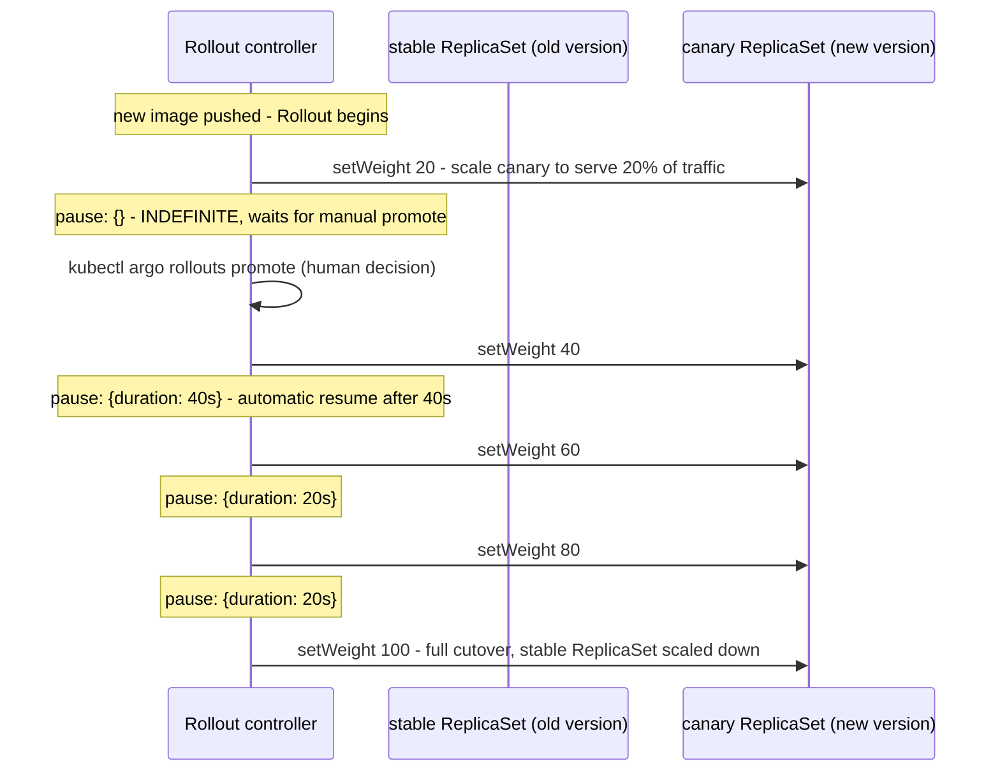
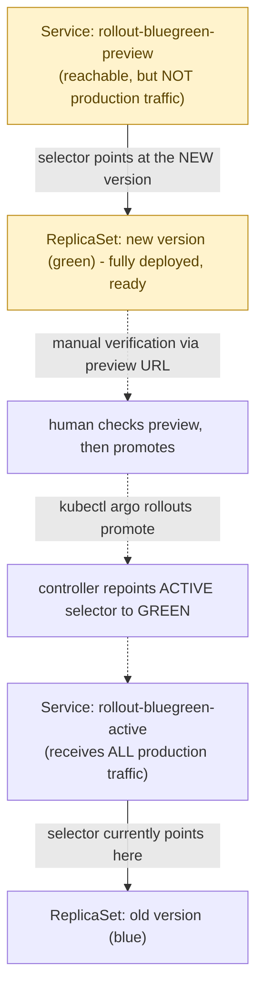

**TL;DR:** How do you roll out a new version without betting the whole fleet on it at once? Argo Rollouts replaces the plain Kubernetes Deployment with canary (ramping a percentage of traffic through explicit weighted steps with pause/promote gates) and blue-green (running two full environments and cutting over via a Service selector switch) strategies, both offering traffic control and explicit promotion gates that a rolling update lacks.

> **In plain English (30 sec):** Declare 'I want 3 copies' — K8s keeps 3 running.

**Real repo:** [`argoproj/argo-rollouts`](https://github.com/argoproj/argo-rollouts)

## 1. The Engineering Problem: a plain rolling update has no traffic control and no gate

Kubernetes' built-in `Deployment` rolling update (`maxSurge`/`maxUnavailable`) replaces Pods gradually — but strictly by **Pod count**, not by **percentage of real traffic**. Once it starts, a bad new version is already receiving user traffic proportional to however many of its Pods happen to exist, with no built-in pause, no automated "check the error rate before continuing" gate, and no clean way to instantly send 100% of traffic back to the old version mid-rollout without fighting the rollout's own in-progress state. There's also no way to say "fully deploy the new version and let me manually verify it, but keep it receiving zero production traffic until I explicitly say go" — that's a fundamentally different deployment shape than gradual Pod replacement.

---

## 2. The Technical Solution: two distinct progressive-delivery strategies, as a controller replacing Deployment

Argo Rollouts replaces `Deployment` with a `Rollout` custom resource implementing **canary** and **blue-green** as first-class, declarative strategies — both give you traffic control and explicit promotion gates that plain Kubernetes has no concept of.

**Canary** ramps a *percentage of traffic* through explicit `setWeight`/`pause` steps:



**Blue-green** keeps two full, independently-addressable Services pointed at two full ReplicaSets — the new version is completely up and reachable via a preview path before it ever sees real traffic:



Core truths: **canary controls the *percentage* of traffic reaching each version, not just how many Pods of each exist** — `setWeight: 20` genuinely means roughly 20% of requests, enforced by whichever traffic-shaping backend is configured (a service mesh, an ingress controller, or a simple replica-ratio approximation); and **blue-green's rollback is instantaneous because it's just a selector change** — the old ReplicaSet never scales down until promotion succeeds, so reverting means repointing `activeService`'s selector back, not redeploying anything.

---

## 3. The clean example (concept in isolation)

```yaml
apiVersion: argoproj.io/v1alpha1
kind: Rollout
metadata:
  name: api
spec:
  replicas: 5
  selector: {matchLabels: {app: api}}
  template:
    metadata: {labels: {app: api}}
    spec:
      containers: [{name: api, image: myapp/api:2.0}]
  strategy:
    canary:
      steps:
        - setWeight: 20
        - pause: {duration: 60s}   # auto-resume after 60s if nothing paused it
        - setWeight: 100
```

---

## 4. Production reality (from `argoproj/argo-rollouts`)

```yaml
# examples/rollout-canary.yaml
# Steps: 20% weight, pause indefinitely (manual promote), then automated ramp to 100%
apiVersion: argoproj.io/v1alpha1
kind: Rollout
metadata:
  name: rollout-canary
spec:
  replicas: 5
  strategy:
    canary:
      steps:
      - setWeight: 20
      # pauses INDEFINITELY until: kubectl argo rollouts promote ROLLOUT
      - pause: {}
      - setWeight: 40
      - pause: {duration: 40s}
      - setWeight: 60
      - pause: {duration: 20s}
      - setWeight: 80
      - pause: {duration: 20s}
```

```yaml
# examples/rollout-bluegreen.yaml
apiVersion: argoproj.io/v1alpha1
kind: Rollout
metadata:
  name: rollout-bluegreen
spec:
  replicas: 2
  strategy:
    blueGreen:
      activeService: rollout-bluegreen-active     # mandatory - production traffic
      previewService: rollout-bluegreen-preview    # optional - reachable, not production
      autoPromotionEnabled: false                   # requires explicit `promote`
---
kind: Service
metadata: {name: rollout-bluegreen-active}
spec: {selector: {app: rollout-bluegreen}, ports: [{port: 80, targetPort: 8080}]}
---
kind: Service
metadata: {name: rollout-bluegreen-preview}
spec: {selector: {app: rollout-bluegreen}, ports: [{port: 80, targetPort: 8080}]}
```

What this teaches that a hello-world can't:

- **The canary example's first `pause: {}` has no `duration` — it pauses forever, deliberately.** Combined with the later `pause: {duration: 40s}` steps that resume automatically, this shows a real hybrid pattern: the first, riskiest exposure (20% of traffic) requires an explicit human `promote` call before anything continues, while later, already-de-risked steps ramp automatically. Not every pause step needs the same trust level.
- **`autoPromotionEnabled: false` is the single field separating "blue-green with a safety gate" from "blue-green that cuts over the instant the new ReplicaSet is ready."** Left at its default (`true`, omitted), the same strategy would promote automatically as soon as Pods pass readiness — the explicit `false` here is a deliberate choice to require a human in the loop before real users see the new version.
- **`previewService` is genuinely optional in the spec, but its presence is what makes blue-green *verifiable* rather than just *safe*.** Without it, the new version is still fully deployed and isolated from production traffic before promotion — but nobody can actually reach it to check it's correct. Adding `previewService` is the difference between "isolated" and "isolated AND inspectable."

Known-stale fact: a common misconception is that careful tuning of a plain `Deployment`'s `maxSurge`/`maxUnavailable` gives you canary or blue-green deployments — it doesn't. Those fields only ever control the *pace of Pod replacement*, never the *percentage of traffic* reaching each version, and vanilla `Deployment` has no pause/promote/analysis gate at all. Canary and blue-green are genuinely different deployment shapes requiring a different controller (Argo Rollouts, Flagger, or a service mesh's own traffic-splitting features) — they are not something you configure your way into with a standard Deployment.

---

## Source

- **Concept:** Deployment strategies (blue-green/canary)
- **Domain:** microservices
- **Repo:** [argoproj/argo-rollouts](https://github.com/argoproj/argo-rollouts) → [`examples/rollout-canary.yaml`](https://github.com/argoproj/argo-rollouts/blob/master/examples/rollout-canary.yaml), [`examples/rollout-bluegreen.yaml`](https://github.com/argoproj/argo-rollouts/blob/master/examples/rollout-bluegreen.yaml) — the CNCF progressive-delivery controller for Kubernetes.


