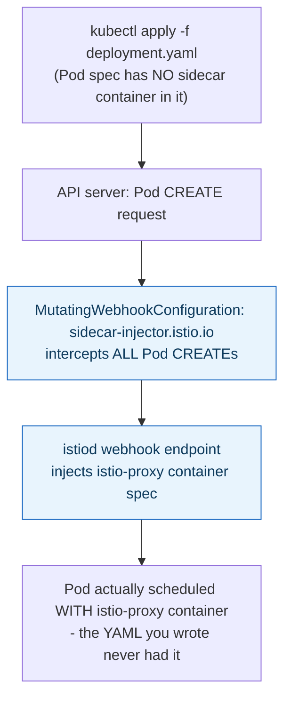
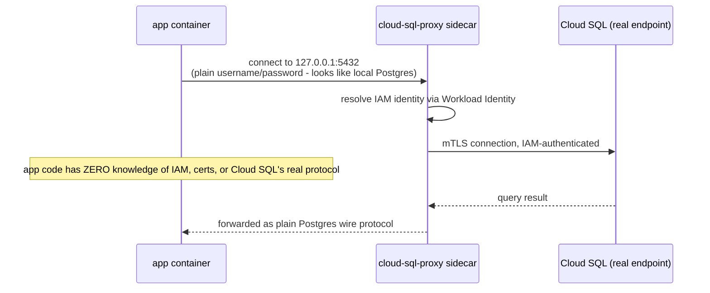

**TL;DR:** How does a proxy container end up in every Pod without any Deployment mentioning it? A sidecar shares a Pod's network namespace and lifecycle with the app container, and mesh sidecars like Istio's are auto-injected by a Kubernetes mutating webhook so no team has to hand-add the container; an ambassador is the same pattern scoped to one external dependency, translating its protocol and auth so the app never has to.

**Real repo:** [`istio/istio`](https://github.com/istio/istio), [`GoogleCloudPlatform/cloud-sql-proxy`](https://github.com/GoogleCloudPlatform/cloud-sql-proxy)

## 1. The Engineering Problem: cross-cutting connection logic doesn't belong hand-written into every app, but someone has to attach the helper

An application connecting to a cloud-managed database with IAM-based authentication, automatic mTLS, and certificate rotation would need all of that logic implemented in-process — duplicated across every service, in every language, re-implemented whenever the auth mechanism changes. The architectural answer is a co-located helper container that owns this complexity instead. But that raises a second, more mechanical problem: if every team has to remember to hand-add that helper container's YAML to their own Deployment, you're back to "did everyone actually wire it in correctly," the exact inconsistency problem cross-cutting concerns are supposed to solve.

---

## 2. The Technical Solution: Sidecar is the co-location mechanism; Ambassador is a sidecar scoped to one external dependency

A **sidecar** is a container sharing a Pod's network namespace and lifecycle with the main app container — `localhost` calls between them, started and stopped together. What makes sidecars usable at scale isn't the co-location itself, it's that **nothing needs to be hand-written into every Deployment for it to appear.** Istio's mesh sidecar is injected by a Kubernetes `MutatingWebhookConfiguration` that intercepts every Pod `CREATE` and calls out to a webhook (`istiod`), which adds the `istio-proxy` container to the Pod spec automatically — the Deployment author never writes that container block themselves.



**Ambassador** is the same co-location idea, narrowed: instead of a general mesh proxy handling all traffic, it's a sidecar dedicated to **one specific external dependency**, translating protocol/auth concerns the app itself never implements. The Google Cloud SQL Auth Proxy is the canonical real example: the app connects to `127.0.0.1:5432` like any local Postgres, with a plain username/password — the ambassador container in the same Pod handles IAM-based authentication, mTLS to the real Cloud SQL endpoint, and certificate rotation, entirely invisibly.



Core truths: **the mesh sidecar and the ambassador are the same structural pattern (co-located helper, shared Pod lifecycle) serving different scopes** — one handles *all* traffic for the Pod, the other handles traffic to *one specific dependency*; and **automatic injection is what makes the sidecar pattern operationally viable at scale** — a pattern that required every team to correctly hand-copy container YAML would fail the exact consistency goal it exists for.

---

## 3. The clean example (concept in isolation)

```yaml
# App container never mentions auth/TLS - it just talks to localhost
containers:
  - name: app
    env:
      - {name: DB_HOST, value: "127.0.0.1"}
      - {name: DB_PORT, value: "5432"}

  - name: db-ambassador           # co-located, shares network namespace with 'app'
    image: cloud-sql-proxy:2.14.1
    args: ["--port=5432", "--auto-iam-authn", "my-project:region:my-instance"]
```

---

## 4. Production reality (from `istio/istio` and `GoogleCloudPlatform/cloud-sql-proxy`)

**Sidecar injection mechanism** (Istio):

```yaml
# manifests/charts/istio-control/istio-discovery/templates/mutatingwebhook.yaml
apiVersion: admissionregistration.k8s.io/v1
kind: MutatingWebhookConfiguration
metadata:
  name: istio-sidecar-injector
webhooks:
- name: sidecar-injector.istio.io
  clientConfig:
    service: {name: istiod, namespace: istio-system, path: "/inject", port: 443}
  sideEffects: None
  rules:
  - operations: ["CREATE"]
    apiGroups: [""]
    apiVersions: ["v1"]
    resources: ["pods"]
  failurePolicy: Fail
  admissionReviewVersions: ["v1"]
```

**Ambassador** (Google Cloud SQL Auth Proxy — real production sidecar):

```yaml
# examples/k8s-sidecar/proxy_with_workload_identity.yaml
spec:
  serviceAccountName: <YOUR-KSA-NAME>
  containers:
    - name: <YOUR-APPLICATION-NAME>
      env:
        - {name: DB_USER, valueFrom: {secretKeyRef: {name: <YOUR-DB-SECRET>, key: username}}}
        - {name: DB_PASS, valueFrom: {secretKeyRef: {name: <YOUR-DB-SECRET>, key: password}}}
  initContainers:
    - name: cloud-sql-proxy
      restartPolicy: Always      # native sidecar - see note below
      image: gcr.io/cloud-sql-connectors/cloud-sql-proxy:2.14.1
      args:
        - "--auto-iam-authn"       # IAM auth handled HERE, not in app code
        - "--structured-logs"
        - "--port=<DB_PORT>"
        - "<INSTANCE_CONNECTION_NAME>"
      securityContext:
        runAsNonRoot: true
      resources:
        requests: {memory: "2Gi", cpu: "1"}
```

What this teaches that a hello-world can't:

- **`failurePolicy: Fail` on Istio's webhook means a Pod CREATE is REJECTED, not silently allowed without a sidecar, if the injection webhook itself is unreachable.** This is a real availability tradeoff visible in the config: the mesh operator decided "no sidecar" is worse than "no new Pods," rather than defaulting to `Ignore` and letting un-meshed Pods slip through unnoticed.
- **`cloud-sql-proxy` is declared as an `initContainer` with `restartPolicy: Always`, not a second regular container.** This is Kubernetes' native sidecar mechanism (containers within `initContainers` carrying `restartPolicy: Always` start before the main app container and keep running for the Pod's whole lifetime) — it guarantees the proxy is up and accepting connections *before* the app container starts, closing a real startup race that plain "just add a second container" setups used to hit (the app trying to connect before the ambassador was ready).
- **`--auto-iam-authn` is the entire reason this pattern exists.** Without it, the application would need its own Cloud SQL client library wired to IAM token refresh, certificate handling, and Cloud SQL's specific connection protocol — real, nontrivial code duplicated across every service. With the ambassador, the app's database connection code is indistinguishable from connecting to a local Postgres instance.

Known-stale fact: before Kubernetes' native sidecar support (the `restartPolicy: Always` on `initContainers`, promoted to stable in relatively recent Kubernetes releases), teams implementing this exact pattern had to declare the proxy as an ordinary second container with no guaranteed start-before-app ordering — leading to real connection-refused errors on Pod startup that application code had to retry around. Documentation or examples still showing the ambassador as a plain (non-native) sidecar container predate this fix.

---

## Source

- **Concept:** Sidecar & Ambassador patterns
- **Domain:** microservices
- **Repo:** [istio/istio](https://github.com/istio/istio) → [`manifests/charts/istio-control/istio-discovery/templates/mutatingwebhook.yaml`](https://github.com/istio/istio/blob/master/manifests/charts/istio-control/istio-discovery/templates/mutatingwebhook.yaml) — real sidecar auto-injection mechanism; [GoogleCloudPlatform/cloud-sql-proxy](https://github.com/GoogleCloudPlatform/cloud-sql-proxy) → [`examples/k8s-sidecar/proxy_with_workload_identity.yaml`](https://github.com/GoogleCloudPlatform/cloud-sql-proxy/blob/main/examples/k8s-sidecar/proxy_with_workload_identity.yaml) — the canonical production Ambassador pattern.
