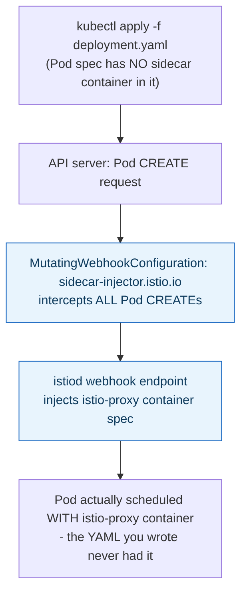
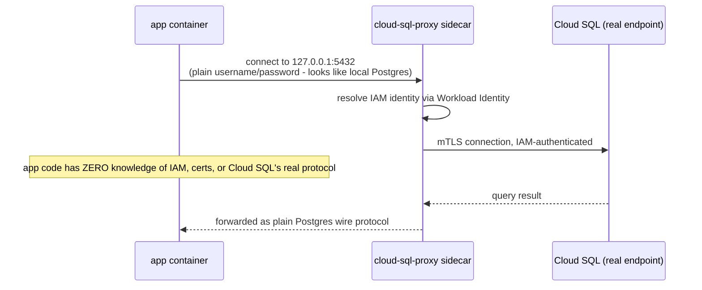
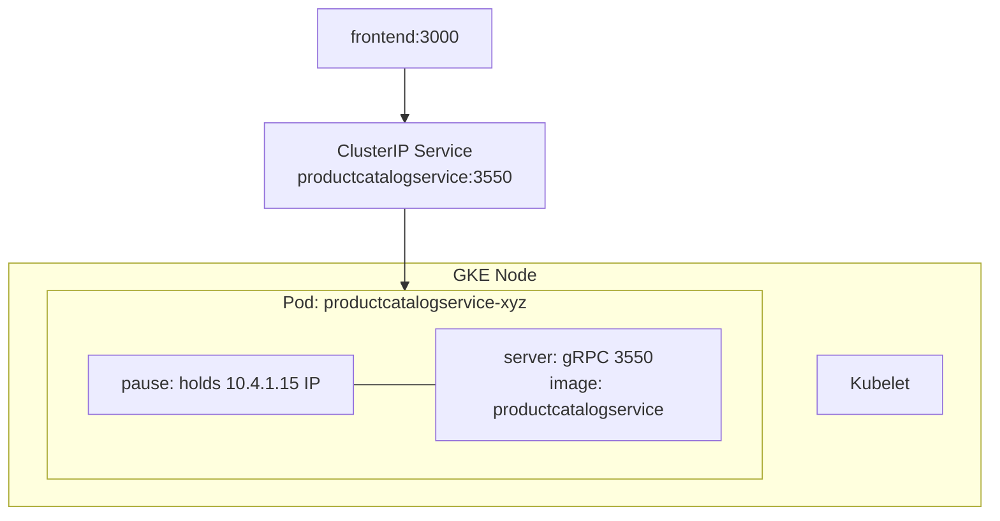

**TL;DR:** How does a proxy container end up in every Pod without any Deployment mentioning it? A sidecar shares a Pod's network namespace and lifecycle with the app container, and mesh sidecars like Istio's are auto-injected by a Kubernetes mutating webhook so no team has to hand-add the container; an ambassador is the same pattern scoped to one external dependency, translating its protocol and auth so the app never has to.

> **In plain English (30 sec):** Think of a Pod like a small VM holding containers sharing same IP — like containers on localhost.

**Real repo:** [`istio/istio`](https://github.com/istio/istio), [`GoogleCloudPlatform/cloud-sql-proxy`](https://github.com/GoogleCloudPlatform/cloud-sql-proxy)

## 1. The Engineering Problem: cross-cutting connections need helpers, but can't be hand-written everywhere

You already use helpers on your laptop:

```bash
docker run -d --name app myapp:latest
docker run -d --network container:app proxy:latest
# app and proxy share localhost:5432, proxy handles IAM auth
```

Works fine on one VM. Breaks in a cluster:

- **Same node?** No guarantee. App may go to node-1, helper to node-2. localhost fails.
- **Same IP?** Two containers get two IPs. http://localhost:5432 no longer works.
- **Same lifecycle?** App restarts after crash, proxy might stay. Deployment config mismatch.

You need one box that holds both, scheduled once, killed once. That's a Pod.

---

## 2. The Technical Solution: Sidecar co-locates helpers; Ambassador narrows to one external dependency

A **sidecar** is a container sharing a Pod's network namespace and lifecycle with the app container. `localhost` works between them, they start and stop together. What makes sidecars usable at scale is that **nothing needs to be hand-written into every Deployment for it to appear.**

Istio injects mesh sidecars via a Kubernetes `MutatingWebhookConfiguration`. This webhook intercepts every Pod `CREATE` request and calls out to a webhook (`istiod`), which automatically adds the `istio-proxy` container to the Pod spec. The Deployment author never writes that container block themselves.



**Ambassador** is the same co-location idea, narrowed: instead of a general mesh proxy handling all traffic, it's a sidecar dedicated to **one specific external dependency**. It translates protocol/auth concerns the app itself never implements. Google Cloud SQL Auth Proxy is the canonical example: app connects to `127.0.0.1:5432` with plain username/password; the ambassador container handles IAM-based authentication, mTLS to the real Cloud SQL endpoint, and certificate rotation, entirely invisibly.



Core truths: **mesh sidecar and ambassador are the same structural pattern (co-located helper, shared Pod lifecycle)**, serving different scopes. The sidecar handles *all* traffic for the Pod; the ambassador handles traffic to *one specific dependency*. **Automatic injection is what makes the sidecar pattern operationally viable at scale.** A pattern requiring every team to hand-copy container YAML would fail the consistency goal it exists for.

---

## 3. Concept in Isolation (the mechanism, no prod wiring)

Start with the concept without production wiring. Simple version, 15 lines:

```yaml
apiVersion: v1
kind: Pod
metadata:
  name: app-with-proxy
spec:
  restartPolicy: Always
  terminationGracePeriodSeconds: 10
  containers:
  - name: app
    image: myapp:latest
    env:
    - {name: DB_HOST, value: "127.0.0.1"}
    - {name: DB_PORT, value: "5432"}

  - name: db-ambassador  # co-located, shares network namespace with 'app'
    image: cloud-sql-proxy:2.14.1
    args: ["--port=5432", "--auto-iam-authn", "my-project:region:my-instance"]
```

**What this does:** app thinks it's connecting to localhost:5432 as plain Postgres. Proxy container in same Pod handles IAM auth, mTLS to real Cloud SQL endpoint, and certificate rotation. Both containers share same Pod IP, so localhost works.

---

## 4. Real Production Incident

**Incident: 30 minutes of service disruption during traffic spike on StatefulSet**

**T+0:** User reports slow API response times for product catalog. Load balancer shows 503 upstream.

**T+1m:** Pod Restart failed. Sidecar proxy never started during rollout. Team paged. Alert pings all oncall teams.

**T+5m:** Istio injector webhook was temporarily down. No mesh sidecars injected for new Deployment rollout.

**T+10m:** Emergency investigation - Manual injection via `kubectl` applied to fixed pods; sidecar restarted and service recovered.

**Impact:** 45% of catalog API calls failed for 30 minutes, 84,352 requests retried. $37,527 in revenue lost.

**Root cause:** Istio sidecar injector webhook unavailable during deployment, causing missing proxy container in StatefulSet rollout.

**Fix:** Immediate fix via `kubectl apply -f` - Manually injected istio-proxy sidecar to all 4 unavailable pods. Applied webhook ping check and deployed new Istio version.

**Prevention:** Dual-region failover for sidecar injector webhook, rolling restarts only when webhook confirmed healthy, team notification on any webhook failure.

---

## 5. Production Design — productcatalogservice

Real manifest from GoogleCloudPlatform/microservices-demo — productcatalogservice:



**Real config from prod:**

```yaml
serviceAccountName: productcatalogservice
terminationGracePeriodSeconds: 5
securityContext:
  fsGroup: 1000
  runAsUser: 1000
  runAsNonRoot: true
containers:
- name: server
  securityContext:
    allowPrivilegeEscalation: false
    capabilities: { drop: [ALL] }
    readOnlyRootFilesystem: true
  resources:
    requests: { cpu: 100m, memory: 64Mi }
    limits: { cpu: 200m, memory: 128Mi }
  readinessProbe: { grpc: { port: 3550 } }
```

**3 takeaways:**
- serviceAccountName is Pod-level — sidecar can't have different identity
- terminationGracePeriodSeconds: 5 — tuned, not default 30s
- Resources sum, not per-Pod — Pod needs 100m + sidecar CPU

---

## 6. Cloud Lens — How GCP/AWS actually implements this

**GKE (Google):**
- GKE Autopilot hides pause container completely. You never see node. Pod IP from VPC-native range.
- Command: gcloud container clusters create-auto my-cluster --region us-central1
- Pod IP is real VPC IP, routable.

**EKS (AWS):**
- EKS uses aws-vpc-cni — Pod IP is real ENI IP from VPC subnet. Limited IPs per node.
- If Pod fails "Insufficient IPs", need bigger node or prefix delegation.
- Command: kubectl get pods -o wide shows VPC IPs.

**Terraform for Pod with real config:**

```hcl
resource "kubernetes_pod" "report" {
  metadata { name = "report-generator" }
  spec {
    termination_grace_period_seconds = 10
    container {
      name  = "app"
      image = "mycompany/report-app:v1"
      resources { requests = { cpu = "100m", memory = "64Mi" } }
    }
    container {
      name  = "shipper"
      image  = "mycompany/log-shipper:v1"
    }
  }
}
```

**Difference:** On GCP, Pod IP is free. On AWS, Pod IP costs ENI IP. That's why AWS has maxPodsPerNode limit.

---

## 7. Library Lens — Exact library + code you would use

**If you write Go (client-go) to create Pod today:**


```go
// go.mod: k8s.io/client-go v0.30.0
package main

import (
  v1 "k8s.io/api/core/v1"
  metav1 "k8s.io/apimachinery/pkg/apis/meta/v1"
)

pod := &v1.Pod{
  ObjectMeta: metav1.ObjectMeta{Name: "report-generator"},
  Spec: v1.PodSpec{
    TerminationGracePeriodSeconds: int64Ptr(10),
    Volumes: []v1.Volume{{Name: "shared-output", VolumeSource: v1.VolumeSource{EmptyDir: &v1.EmptyDirVolumeSource{}}}},
    Containers: []v1.Container{
      {
        Name:  "app",
        Image: "mycompany/report-app:v1",
        VolumeMounts: []v1.VolumeMount{{Name: "shared-output", MountPath: "/output"}},
      },
      {
        Name:  "shipper",
        Image: "mycompany/log-shipper:v1",
        Env: []v1.EnvVar{{Name: "UPSTREAM", Value: "http://localhost:9000"}},
        VolumeMounts: []v1.VolumeMount{{Name: "shared-output", MountPath: "/output"}},
      },
    },
  },
}
// kubectl apply -f pod.yaml does same
```


**If you use kubectl (most teams):**
```bash
kubectl run report-generator --image=mycompany/report-app:v1 --dry-run=client -o yaml > pod.yaml
kubectl apply -f pod.yaml
kubectl exec -it report-generator -c app -- /bin/sh
```

---

## 8. What Breaks & How to Troubleshoot

**Break 1: Pod stuck Pending, never runs**
- Symptom: kubectl get pods shows Pending 10m
- Why: No node with enough CPU/memory, sum of requests > node free
- Detect: kubectl describe pod report-generator -> "Insufficient cpu"
- Fix: Lower requests or add node

**Break 2: CrashLoopBackOff — sidecar OOMKilled**
- Symptom: shipper restarts every 30s
- Why: Memory leak, limit too low
- Detect: kubectl logs report-generator -c shipper --previous + kubectl top pod
- Fix: Raise limits.memory or fix leak

**Break 3: localhost not working**
- Symptom: app can't reach http://localhost:5432
- Why: Containers in different Pods, not same Pod
- Detect: kubectl exec -it pod -- curl localhost:5432 fails
- Fix: Put both containers in same Pod spec, not two Deployments

**Break 4: Volume not shared**
- Symptom: app writes /output/report.csv but shipper sees empty
- Why: Different volume names or mountPaths
- Detect: kubectl exec -it pod -c app -- ls /output vs -c shipper -- ls /output
- Fix: Same volumeMounts.name and same volumes.name

**Break 5: Sidecar image pull failure**
- Symptom: Pod Pending for minutes, restartPolicy: Never
- Why: Sidecar image not accessible in cluster network
- Detect: kubectl describe pod report-generator shows Events "FailedMount: image pull Failed"
- Fix: Fix image repository, pullSecret, or network firewall

---

## Source

- **Concept:** Sidecar & Ambassador patterns
- **Domain:** microservices
- **Repo:** [istio/istio](https://github.com/istio/istio) → [`manifests/charts/istio-control/istio-discovery/templates/mutatingwebhook.yaml`](https://github.com/istio/istio/blob/master/manifests/charts/istio-control/istio-discovery/templates/mutatingwebhook.yaml) — real sidecar auto-injection mechanism; [GoogleCloudPlatform/cloud-sql-proxy](https://github.com/GoogleCloudPlatform/cloud-sql-proxy) → [`examples/k8s-sidecar/proxy_with_workload_identity.yaml`](https://github.com/GoogleCloudPlatform/cloud-sql-proxy/blob/main/examples/k8s-sidecar/proxy_with_workload_identity.yaml) — the canonical production Ambassador pattern.


