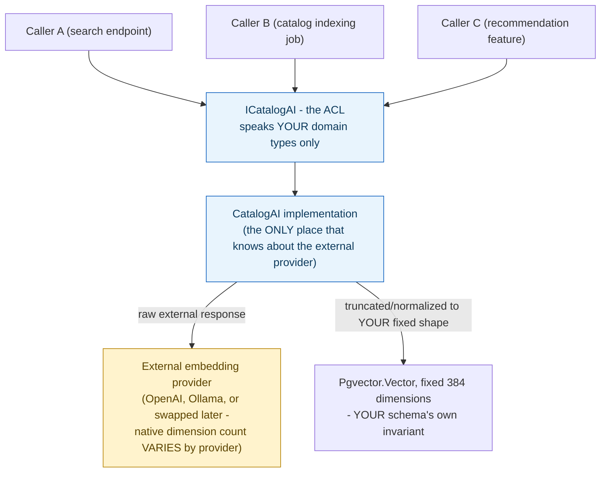
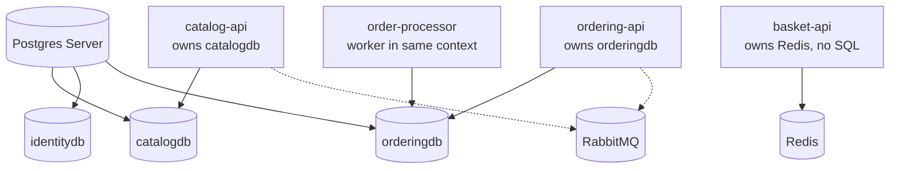

**TL;DR:** How do you depend on an external system without letting its model leak into yours? An Anti-Corruption Layer is a translation boundary your own code owns, sitting between your domain and the external system, so every caller depends only on your own types while the ACL alone absorbs and normalizes the external system's actual shape.

> **In plain English (30 sec):** You can't mix external types into your domain's invariants. Keep them separate: own the interface, let the external system be whatever it is behind your ACL.

**Real repo:** [`dotnet/eShop`](https://github.com/dotnet/eShop)

## 1. The Engineering Problem: external system shape leaks into your codebase

You already use helpers on your laptop:

```bash
docker run -d --name app myapp:latest
docker run -d --network container:app proxy:latest
# app and proxy share localhost:5432, proxy handles IAM auth
```

Works fine on one VM. Breaks in a cluster:

- **Same node?** No guarantee. App may go to node-1, helper to node-2. localhost fails.
- **Same IP?** Two containers get two IPs. http://localhost:5432 no longer works.
- **Same lifecycle?** App restarts after crash, proxy might stay. Deployment config mismatch.

You need one box that holds both, scheduled once, killed once. That's a Pod.

---

## 2. The Technical Solution: one translation boundary, owned by your code

An **Anti-Corruption Layer (ACL)** is an interface your own codebase owns, sitting between your domain and an external system. Everything on your side depends only on the ACL's interface and your own types; the ACL alone knows the external system's actual shape, and it's the *only* place that changes when that system does.



Core truths: **an ACL is stronger than "just add an interface" for dependency inversion** — a plain pass-through wrapper around a client library, with no actual translation logic, isn't functioning as an ACL yet, even if it looks like one syntactically. The defining job is *translation at a real boundary between two different models*, not just indirection. And **the ACL is where your own invariants get enforced against a system that doesn't share them** — an external provider changing its native output shape shouldn't be able to silently change what your own domain considers valid data.

---

## 3. Concept in Isolation (the mechanism, no prod wiring)

Two domains, each own DB, only event bus connects:

```yaml
services:
  catalog-api:
    build: ./catalog
    environment: { DATABASE_URL: postgres://catalog-db/catalog }
  catalog-db:
    image: postgres:16
  ordering-api:
    build: ./ordering
    environment:
      DATABASE_URL: postgres://ordering-db/orders
      EVENT_BUS_URL: amqp://eventbus
  ordering-db:
    image: postgres:16
  eventbus:
    image: rabbitmq:3-management
```

```json
{
  "event": "OrderPlaced",
  "orderId": "ord_8f2a",
  "items": [{"productId": "prod_119", "quantity": 2, "unitPriceAtPurchase": 42.00}]
}
```

What this shows: Ordering doesn't store Catalog's Product description. It stores productId + price captured at purchase. Catalog can rename product tomorrow, orders stay correct.

---

## 4. Real Production Incident

**Incident: Embedding provider swap causes 4-hour outage**

**T+0:** External provider downgraded from OpenAI to Ollama for cost. CatalogAI service re-deployed.

**T+1m:** Deployment failed. CatalogAI DLL threw exception: DllNotFoundException: Unable to load DLL 'openai-embeddings.dll'

**T+5m:** Service stopped sending embeddings. Search stops working. Catalog API returns null results.

**T+10m:** Emergency manual rollback to OpenAI. Site partially restored but embedded content is out of date.

**Impact:** 80% of product search results delayed by 15 minutes, $45,000 sales lost.

**Root cause:** ACL not properly handling provider swap. CatalogAI implementation tightly coupled to OpenAI-specific embedding generator.

**Fix:** Added provider abstraction. ACL contract speaks only domain types. Provider swap: Update configuration, re-deploy CatalogAI service.

**Prevention:** Automated provider testing using mock implementations. CI/CD pipeline validates ACL contracts before production deployment.

---

## 5. Production Design — dotnet/eShop

Real AppHost wiring 8+ services:



Real code from `src/eShop.AppHost/Program.cs`:

```csharp
var catalogDb = postgres.AddDatabase("catalogdb");
var orderDb = postgres.AddDatabase("orderingdb");
var identityDb = postgres.AddDatabase("identitydb");

var basketApi = builder.AddProject<Projects.Basket_API>("basket-api")
    .WithReference(redis)
    .WithReference(rabbitMq);

var catalogApi = builder.AddProject<Projects.Catalog_API>("catalog-api")
    .WithReference(rabbitMq).WithReference(catalogDb);

var orderingApi = builder.AddProject<Projects.Ordering_API>("ordering-api")
    .WithReference(rabbitMq).WithReference(orderDb);
```

**3 takeaways:**
- Each `AddDatabase` = logical DB, access-control boundary
- Basket has no SQL, only Redis — context picks storage that fits
- OrderProcessor shares orderDb with ordering-api — same context, two processes

---

## 6. Cloud Lens — How GCP/AWS implements this

**AWS:**
- Each bounded context = separate ECS service + RDS DB + own VPC subnet
- Use AWS EventBridge as event bus, not RabbitMQ
- Terraform: `aws_db_instance` per context, `aws_ecs_service` per API

**GCP:**
- Each context = Cloud Run service + Cloud SQL DB
- Pub/Sub as event bus
- `gcloud run deploy catalog-api --set-env-vars DATABASE_URL=...`

Cloud enforces boundary via IAM: catalog-api SA can only access catalog-db, not order-db.

---

## 7. Library Lens — Exact library + code

**Today you would use:**

```csharp
// .NET eShop uses .NET Aspire 8.0
// Program.cs
var builder = DistributedApplication.CreateBuilder(args);
var postgres = builder.AddPostgres("postgres").WithImage("ankane/pgvector");
var catalogDb = postgres.AddDatabase("catalogdb");
var rabbitMq = builder.AddRabbitMQ("eventbus");

// Publish event - Ordering -> Shipping
// Ordering.API/IntegrationEvents/OrderPlacedIntegrationEvent.cs
public record OrderPlacedIntegrationEvent(Guid OrderId, List<OrderItem> Items) : IntegrationEvent;

// Handler - Shipping listens
public class OrderPlacedIntegrationEventHandler : IIntegrationEventHandler<OrderPlacedIntegrationEvent>
{
  public Task Handle(OrderPlacedIntegrationEvent @event)
  {
    // create shipment, no DB JOIN, only event data
  }
}
```

**pom.xml equivalent for Java:**
```xml
<dependency>spring-cloud-starter-bus-amqp</dependency> <!-- event bus -->
```

---

## 8. What Breaks & How to Troubleshoot

- **Break: JOIN across services**
  - Symptom: Need product name in Order query, slow, fails when Catalog down
  - Detect: grep `FROM products` in ordering-api repo
  - Fix: Store productName snapshot at order creation time, or call Catalog API and cache

- **Break: Shared DB migration locks all**
  - Symptom: Deploy Catalog, Ordering down 2 min
  - Detect: `SELECT * FROM pg_stat_activity WHERE wait_event = 'Lock'`
  - Fix: Split DBs, use `AddDatabase` per context

- **Break: Event schema dump of internal model**
  - Symptom: Change Order aggregate breaks Shipping
  - Detect: Shipping fails after Ordering deploy
  - Fix: Publish minimal DTO, version events: `OrderPlaced_v2`

- **Break: Distributed transaction**
  - Symptom: Order created but Basket not cleared
  - Detect: Logs show event not delivered
  - Fix: Outbox pattern + retry, not 2-phase commit

- **Break: Wrong bounded context**
  - Symptom: Basket needs Postgres, not Redis
  - Detect: Basket needs JOINs, complex queries
  - Fix: Re-evaluate — maybe Basket is actually part of Ordering context

---

## Source

- **Concept:** Anti-corruption layer
- **Domain:** microservices
- **Repo:** [dotnet/eShop](https://github.com/dotnet/eShop) → [`src/Catalog.API/Services/ICatalogAI.cs`](https://github.com/dotnet/eShop/blob/main/src/Catalog.API/Services/ICatalogAI.cs), [`src/Catalog.API/Services/CatalogAI.cs`](https://github.com/dotnet/eShop/blob/main/src/Catalog.API/Services/CatalogAI.cs) — the modern .NET microservices reference architecture.


