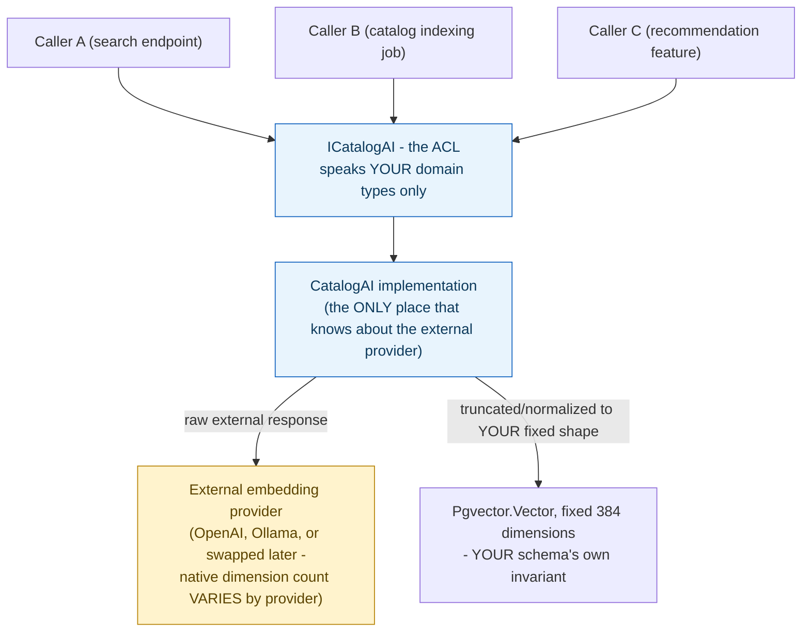

**TL;DR:** How do you depend on an external system without letting its model leak into yours? An Anti-Corruption Layer is a translation boundary your own code owns, sitting between your domain and the external system, so every caller depends only on your own types while the ACL alone absorbs and normalizes the external system's actual shape.

**Real repo:** [`dotnet/eShop`](https://github.com/dotnet/eShop)

## 1. The Engineering Problem: an external system's shape leaking into your codebase makes every future change everyone's problem

Call a third-party API, an AI provider, or a legacy system directly from throughout your codebase, and every caller couples itself to that external system's specific types, field names, and quirks. When the vendor changes their response shape, or you need to swap providers, the change ripples through every call site that ever touched it. Worse: the external system's model doesn't necessarily match what your own domain needs — a different embedding dimensionality, a different field naming convention, different assumptions about what's optional — and if that shape leaks in unfiltered, your own domain's data integrity starts depending on decisions a vendor made, not decisions your domain actually requires.

---

## 2. The Technical Solution: one translation boundary, owned by your code, that every caller depends on instead of the external system directly

An **Anti-Corruption Layer (ACL)** is an interface your own codebase owns, sitting between your domain and an external system. Everything on your side depends only on the ACL's interface and your own types; the ACL alone knows the external system's actual shape, and it's the *only* place that changes when that system does.



Core truths: **an ACL is stronger than "just add an interface" for dependency inversion** — a plain pass-through wrapper around a client library, with no actual translation logic, isn't functioning as an ACL yet, even if it looks like one syntactically. The defining job is *translation at a real boundary between two different models*, not just indirection. And **the ACL is where your own invariants get enforced against a system that doesn't share them** — an external provider changing its native output shape shouldn't be able to silently change what your own domain considers valid data.

---

## 3. The clean example (concept in isolation)

```csharp
// YOUR interface - the ACL contract, speaks only your own types
public interface IEmbeddingService
{
    ValueTask<float[]> GetEmbeddingAsync(string text);  // ALWAYS your fixed dimension
}

// The ONLY place that knows about the external provider's actual shape
public class OpenAiEmbeddingService : IEmbeddingService
{
    private const int OurDimension = 384;
    private readonly IExternalEmbeddingClient _external;   // vendor SDK type, isolated here

    public async ValueTask<float[]> GetEmbeddingAsync(string text)
    {
        var raw = await _external.EmbedAsync(text);   // vendor's native shape, e.g. 1536-dim
        return raw[0..OurDimension];                    // normalized to what OUR schema expects
    }
}
```

---

## 4. Production reality (from `dotnet/eShop`)

```csharp
// Services/ICatalogAI.cs - the ACL contract
public interface ICatalogAI
{
    bool IsEnabled { get; }
    ValueTask<Vector?> GetEmbeddingAsync(string text);
    ValueTask<Vector?> GetEmbeddingAsync(CatalogItem item);
    ValueTask<IReadOnlyList<Vector>?> GetEmbeddingsAsync(IEnumerable<CatalogItem> item);
}
```

```csharp
// Services/CatalogAI.cs - the ONLY class that knows the external provider's shape
public sealed class CatalogAI : ICatalogAI
{
    private const int EmbeddingDimensions = 384;
    private readonly IEmbeddingGenerator<string, Embedding<float>>? _embeddingGenerator;

    public bool IsEnabled => _embeddingGenerator is not null;

    public async ValueTask<Vector?> GetEmbeddingAsync(string text)
    {
        if (IsEnabled)
        {
            var embedding = await _embeddingGenerator!.GenerateVectorAsync(text);
            embedding = embedding[0..EmbeddingDimensions];   // normalize to OUR fixed dimension
            return new Vector(embedding);
        }
        return null;
    }

    private static string CatalogItemToString(CatalogItem item) => $"{item.Name} {item.Description}";
}
```

What this teaches that a hello-world can't:

- **`embedding[0..EmbeddingDimensions]` is the ACL's real translation work, not boilerplate.** `Microsoft.Extensions.AI`'s `IEmbeddingGenerator` abstracts over whichever provider is configured (OpenAI, Ollama, others), each of which natively produces a *different* embedding vector length. `CatalogAI` truncates every provider's output to a fixed 384 dimensions — the number `Catalog.API`'s own PostgreSQL `pgvector` column schema actually expects — so swapping the underlying provider never requires a schema migration or touching any calling code.
- **`IsEnabled` lets every caller skip a null/config check entirely** — `GetEmbeddingAsync` returns `null` cleanly when no embedding generator is configured, rather than every call site needing its own "is AI even turned on" branch. The ACL absorbs "is this feature available right now" as part of its own contract, not something callers negotiate individually.
- **No caller anywhere in `Catalog.API` references `IEmbeddingGenerator`, `Embedding<float>`, or any vendor-specific type directly** — every search/indexing code path depends on `ICatalogAI` and `Pgvector.Vector` only. That's the concrete, checkable signal an ACL is actually doing its job: grep the codebase for the external type, and it should appear in exactly one file.

Known-stale fact: an Anti-Corruption Layer is frequently conflated with generic dependency-inversion ("program against an interface, not a concrete class") — that's necessary but not sufficient. An interface that just forwards calls to a vendor SDK one-to-one, with the vendor's exact types and shapes passed straight through, provides swappability but not protection — your domain is still implicitly shaped by the vendor's model, just through one extra layer of indirection. The truncation/normalization step here (`embedding[0..EmbeddingDimensions]`) is what makes this a genuine ACL rather than a thin pass-through wrapper.

---

## Source

- **Concept:** Anti-corruption layer
- **Domain:** microservices
- **Repo:** [dotnet/eShop](https://github.com/dotnet/eShop) → [`src/Catalog.API/Services/ICatalogAI.cs`](https://github.com/dotnet/eShop/blob/main/src/Catalog.API/Services/ICatalogAI.cs), [`src/Catalog.API/Services/CatalogAI.cs`](https://github.com/dotnet/eShop/blob/main/src/Catalog.API/Services/CatalogAI.cs) — the modern .NET microservices reference architecture.


